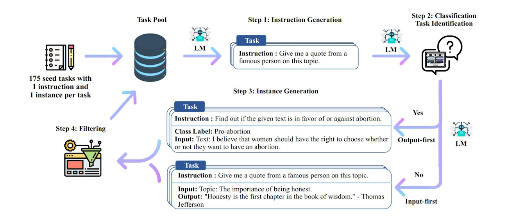

# Alpaca: Comprehensive Guide to Self-Instruct

## Introduction

Self-Instruct is a powerful framework designed to enhance the ability of language models to follow natural language instructions. It achieves this by leveraging the model's own generated data to create a vast collection of instructional examples. This approach minimizes the need for extensive manual annotation, making it a scalable and efficient method for improving language model performance.

The Self-Instruct process involves an iterative bootstrapping algorithm that begins with a small set of manually-crafted instructions. These initial instructions are used to prompt the language model to generate new instructions along with corresponding input-output examples. The generated data is then rigorously filtered to eliminate low-quality or redundant instances. The refined data is incorporated back into the task pool, and the cycle is repeated multiple times. This iterative process results in a substantial and diverse collection of instructional data, which can be used to fine-tune the language model, significantly enhancing its ability to understand and execute instructions.



### Overview of the Self-Instruct Process
The Self-Instruct process involves four major steps to generate and filter instructional data for fine-tuning language models. Here is a detailed explanation of each step:

- **Step 1: Instruction Generation**
In this step, the process begins with a pool of seed tasks that each contain an instruction and an instance of input-output data. These seed tasks are manually written and used to prompt the language model (LM) to generate new instructions. The language model uses these seed tasks as examples to create additional instructions that cover a wide range of topics and formats.

- **Step 2: Classification Task Identification**
Once new instructions are generated, the next step is to determine whether each instruction represents a classification task or not. This classification helps in organizing the tasks and understanding the type of output expected from the model. For example, some instructions might require a yes/no answer (classification), while others might require a more elaborate response.

- **Step 3: Instance Generation**
For each generated instruction, the language model then generates corresponding input-output instances. This involves creating example tasks based on the instructions to show what kind of input data the instruction expects and what the corresponding output should look like. For example, if the instruction is "Find out if the given text is in favor of or against abortion," the input would be a piece of text, and the output would be a classification label like "Pro-abortion."

- **Step 4: Filtering, Processing, and Reformatting**
After generating a large collection of instruction and instance pairs, the data undergoes a filtering process to remove low-quality or redundant instances. This step ensures that only high-quality and diverse examples are retained. The remaining data is then processed and reformatted into a clean format suitable for fine-tuning the language model. This formatted data is what will be used to improve the instruction-following capabilities of the language model.

- **Additional Details:**
  - **Iterative Bootstrapping:** The process is iterative, meaning that the newly generated and filtered data is added back to the task pool, and the steps are repeated multiple times to expand the dataset.
  - **Fine-tuning Data:** The final dataset contains a large number of instructions and corresponding instances that are used to fine-tune the language model, enhancing its ability to follow natural language instructions.
  - **Data Quality and Bias:** The generated data may contain errors or biases, and users are encouraged to use this data with caution. The paper reports that around 46% of the data points may have issues, highlighting the importance of further filtering and improvement methods.

### Scripts and Dependencies for Each Step

This table provides an overview of the four steps involved in generating Self-Instruct data from scratch using the provided scripts. Each step involves specific scripts and processes to generate, classify, and prepare data for GPT-3 finetuning.

| Step | Script                    | Description                                                                                                 | Dependencies           |
|------|---------------------------|-------------------------------------------------------------------------------------------------------------|------------------------|
| 1    | `generate_instructions.sh`| Generates instructions from the seed tasks. This step involves creating initial instructions to bootstrap the data generation process. | `bootstrap_instructions.py`, `gpt3_api.py` |
| 2    | `is_clf_or_not.sh`        | Identifies whether the generated instructions represent classification tasks. This step classifies the generated instructions. | `prepare_for_finetuning.py`, `gpt3_api.py` |
| 3    | `generate_instances.sh`   | Generates instances for each instruction. This step involves creating input-output pairs for the instructions generated in step 1. | `generate_instances.py`, `gpt3_api.py` |
| 4    | `prepare_for_finetuning.sh`| Filters, processes, and reformats the generated data to prepare it for GPT-3 finetuning. This step ensures that the data is clean and properly formatted. | `prepare_for_finetuning.py`, `gpt3_api.py` |


## Input and Output Files

### Overview

Here is a comprehensive overview of the four key steps in the Self-Instruct process, detailing the scripts used in each step, along with their respective input and output files. By outlining the flow of data through `generate_instructions.sh`, `is_clf_or_not.sh`, `generate_instances.sh`, and `prepare_for_finetuning.sh`, it offers a clear understanding of how initial seed tasks are transformed into a refined set of instructional data. This systematic approach ensures the efficient generation, classification, and preparation of data necessary for fine-tuning language models to better follow natural language instructions.

An overview of the input and output for each of the four steps in the process, detailing what each script receives as input and produces as output:
| Step | Script                         | Input                                                      | Output                                                      |
|------|--------------------------------|------------------------------------------------------------|-------------------------------------------------------------|
| 1    | `generate_instructions.sh`     | - seed_tasks.jsonl          | - machine_generated_instructions.jsonl |
| 2    | `is_clf_or_not.sh`             | - machine_generated_instructions.jsonl | - is_clf_or_not_davinci_template_1.jsonl |
| 3    | `generate_instances.sh`        | - machine_generated_instructions.jsonl <br> - is_clf_or_not_davinci_template_1.jsonl | - machine_generated_instances.jsonl |
| 4    | `prepare_for_finetuning.sh`    | - machine_generated_instructions.jsonl <br> - is_clf_or_not_davinci_template_1.jsonl <br> - machine_generated_instances.jsonl | - all_generated_instances.jsonl <br> - Optional: Additional files for sampled or seed tasks |

**Detailed Input and Output Description:**

1. **Step 1: Generate Instructions from Seed Tasks**
    - **Script**: `generate_instructions.sh`
    - **Input**:
      - Seed tasks file containing human-written tasks and instructions.
	  - Files: seed_tasks.jsonl
    - **Output**:
      - A file containing machine-generated instructions based on the seed tasks.
	  - Files: machine_generated_instructions.jsonl

2. **Step 2: Identify Whether the Instruction Represents a Classification Task or Not**
    - **Script**: `is_clf_or_not.sh`
    - **Input**:
      - Machine-generated instructions file from Step 1.
	  - Files: machine_generated_instructions.jsonl
    - **Output**:
      - A file indicating whether each instruction represents a classification task.
	  - Files: is_clf_or_not_(davinci)_(template_1).jsonl

3. **Step 3: Generate Instances for Each Instruction**
    - **Script**: `generate_instances.sh`
    - **Input**:
      - Machine-generated instructions file from Step 1.
      - Classification type file from Step 2.
	  - Files: machine_generated_instructions.jsonl, is_clf_or_not_davinci_template_1.jsonl
    - **Output**:
      - A file containing generated instances for each instruction.
	  - Files: machine_generated_instances.jsonl

4. **Step 4: Filtering, Processing, and Reformatting**
    - **Script**: `prepare_for_finetuning.sh`
    - **Input**:
      - Machine-generated instances file from Step 3.
      - Classification type file from Step 2.
      - Optional: Seed tasks file for including human-written instances.
	  - Files: machine_generated_instructions.jsonl, is_clf_or_not_davinci_template_1.jsonl, machine_generated_instances.jsonl
    - **Output**:
      - Cleaned and reformatted instances ready for GPT-3 finetuning.
      - Optional: Additional files for sampled or seed tasks for more detailed training data.
	  - Files: all_generated_instances.jsonl


### File `seed_tasks.jsonl`

**Note**: Each line is a JSON object. To make it easier to read, we have reformatted each JSON object.
```json
{
	"id": "seed_task_0",
	"name": "breakfast_suggestion",
	"instruction": "Is there anything I can eat for a breakfast that doesn't include eggs, yet includes protein, and has roughly 700-1000 calories?",
	"instances": [
		{
			"input": "",
			"output": "Yes, you can have 1 oatmeal banana protein shake and 4 strips of bacon. The oatmeal banana protein shake may contain 1/2 cup oatmeal, 60 grams whey protein powder, 1/2 medium banana, 1tbsp flaxseed oil and 1/2 cup watter, totalling about 550 calories. The 4 strips of bacon contains about 200 calories."
		}
	],
	"is_classification": false
}
{
	"id": "seed_task_1",
	"name": "antonym_relation",
	"instruction": "What is the relation between the given pairs?",
	"instances": [
		{
			"input": "Night : Day :: Right : Left",
			"output": "The relation between the given pairs is that they are opposites."
		}
	],
	"is_classification": false
}
```

Each Entry in the `seed_tasks.jsonl` File Consists of:
- **`id`**: A unique identifier for the seed task.
- **`name`**: A descriptive name for the seed task.
- **`instruction`**: The instruction text that specifies the task.
- **`instances`**: A list of instances related to the task, each containing:
  - **`input`**: The input text for the task instance, if any.
  - **`output`**: The output text for the task instance.
- **`is_classification`**: A boolean indicating whether the task is a classification task.


### File `machine_generated_instructions.jsonl`

**Note**: Each line is a JSON object. To make it easier to read, we have reformatted each JSON object.
```json
{
	"instruction": "Describe the main causes of climate change.",
	"most_similar": {
		"Explain the water cycle in detail.": 0.55,
		"Describe the process of photosynthesis.": 0.52
	},
	"avg_similarity_score": 0.53,
	"metadata": {
		"prompt": "Come up with a series of tasks:\n1. Explain the water cycle in detail.\n2. Describe the process of photosynthesis.\n3. What is the role of mitochondria in a cell?\n4. How does photosynthesis work?\n5. Explain the stages of mitosis.\n6. What is the process of cellular respiration?\n7. Describe the main causes of climate change.\n8. Explain the nitrogen cycle.\n9. ",
		"response": {
			"id": "cmpl-...",
			"object": "text_completion",
			"created": 1639676263,
			"model": "davinci",
			"choices": [
				{
					"text": "\n1. Describe the main causes of climate change.",
					"index": 0,
					"logprobs": null,
					"finish_reason": "stop"
				}
			]
		}
	},
	"request_idx": 0
}
```

Each entry in the `machine_generated_instructions.jsonl` file consists of:
- `instruction`: The instruction generated by GPT-3.
- `most_similar`: A dictionary of the most similar instructions along with their similarity scores.
- `avg_similarity_score`: The average similarity score for the instruction.
- `metadata`: Metadata about the prompt and response used to generate the instruction.
  - **`prompt`**: The prompt string sent to GPT-3 to generate the instruction. This usually contains a series of tasks or questions that guide the model to generate new   instructions.
  - **`response`**: A dictionary containing details about the GPT-3 response, which includes:
    - **`id`**: A unique identifier for the GPT-3 completion.
    - **`object`**: The type of object, typically "text_completion".
    - **`created`**: A timestamp indicating when the completion was created.
    - **`model`**: The model used for generating the completion, e.g., "davinci".
    - **`choices`**: A list of choices generated by GPT-3, where each choice contains:
      - **`text`**: The generated text for this choice.
      - **`index`**: The index of the choice in the list of generated choices.
      - **`logprobs`**: The log probabilities of the tokens (null if not requested).
      - **`finish_reason`**: The reason why the generation stopped (e.g., "stop", "length").
- `request_idx`: The index of the request batch in which this instruction was generated.

### File `is_clf_or_not_davinci_template_1.jsonl`

**Note**: Each line is a JSON object. To make it easier to read, we have reformatted each JSON object.
```json
{
	"instruction": "Describe the main causes of climate change.",
	"is_classification": "No"
}
{
	"instruction": "Explain the impact of deforestation on biodiversity.",
	"is_classification": "No"
}
{
	"instruction": "Classify the given plants into monocots and dicots.",
	"is_classification": "Yes"
}
```

Each entry in the `is_clf_or_not_davinci_template_1.jsonl` file consists of:
- `instruction`: The machine-generated instruction.
- `is_classification`: A string ("Yes" or "No") indicating whether the instruction represents a classification task.


### File `machine_generated_instances.jsonl`

**Note**: Each line is a JSON object. To make it easier to read, we have reformatted each JSON object.
```json
{
	"instruction": "Describe the main causes of climate change.",
	"raw_instances": "1. Human activities such as burning fossil fuels and deforestation.\n2. Industrial processes that release large amounts of carbon dioxide.\n3. Agricultural practices that increase methane emissions.\n4. Natural processes like volcanic eruptions that can contribute to greenhouse gases.\n",
	"instance_metadata": {
		"id": "cmpl-...",
		"object": "text_completion",
		"created": 1639676263,
		"model": "davinci",
		"choices": [
			{
				"text": "\n1. Human activities such as burning fossil fuels and deforestation.\n2. Industrial processes that release large amounts of carbon dioxide.\n3. Agricultural practices that increase methane emissions.\n4. Natural processes like volcanic eruptions that can contribute to greenhouse gases.\n",
				"index": 0,
				"logprobs": null,
				"finish_reason": "stop"
			}
		]
	},
	"instruction_metadata": {
		"source": "GPT-3 generation"
	},
	"most_similar": {
		"Explain the water cycle in detail.": 0.55,
		"Describe the process of photosynthesis.": 0.52
	},
	"avg_similarity_score": 0.53
}
```

Each entry in the `machine_generated_instances.jsonl` file consists of:
- `instruction`: The machine-generated instruction.
- `raw_instances`: The raw instances generated by GPT-3 based on the instruction.
- `instance_metadata`: Metadata about the GPT-3 request and response.
  - **`id`**: A unique identifier for the GPT-3 completion.
  - **`object`**: The type of object, typically "text_completion".
  - **`created`**: A timestamp indicating when the completion was created.
  - **`model`**: The model used for generating the completion, e.g., "davinci".
  - **`choices`**: A list of choices generated by GPT-3, where each choice contains:
    - **`text`**: The generated text for this choice.
    - **`index`**: The index of the choice in the list of generated choices.
    - **`logprobs`**: The log probabilities of the tokens (null if not requested).
    - **`finish_reason`**: The reason why the generation stopped (e.g., "stop", "length").
- `instruction_metadata`: Metadata about the source of the instruction.
- `most_similar`: A dictionary of the most similar instructions along with their similarity scores.
- `avg_similarity_score`: The average similarity score for the instruction.

### File `all_generated_instances.jsonl`

**Note**: Each line is a JSON object. To make it easier to read, we have reformatted each JSON object.
```json
{
	"instruction": "Describe the main causes of climate change.",
	"input": "",
	"output": "Human activities such as burning fossil fuels and deforestation, industrial processes that release large amounts of carbon dioxide, agricultural practices that increase methane emissions, and natural processes like volcanic eruptions that can contribute to greenhouse gases."
}
{
	"instruction": "Solve the following math problem.",
	"input": "What is 25 multiplied by 4?",
	"output": "25 multiplied by 4 is 100."
}
```

Each entry in the `all_generated_instances.jsonl` file consists of:
- `instruction`: The instruction text generated by GPT-3. (role: system)
- `input`: The input text for the instruction, if any. (role: user)
- `output`: The output text generated by GPT-3 based on the instruction.


## Make GPT-3 API Request

### Overview of make_requests()

The table provides an overview of the parameters for the make_requests function (in gpt3_api.py), which makes requests to the GPT-3 API. It details each parameter's name, type, and a brief description of its purpose, including options for customizing the request such as the engine type, prompts, sampling settings, penalties, and retry logic.

| Parameter          | Type             | Description                                                                 |
|--------------------|------------------|-----------------------------------------------------------------------------|
| `engine`           | `str`            | The GPT-3 engine to use (e.g., "davinci").                                  |
| `prompts`          | `str or list`    | The prompt(s) to send to the GPT-3 API.                                     |
| `max_tokens`       | `int`            | Maximum number of tokens to generate in the response.                       |
| `temperature`      | `float`          | Sampling temperature to use.                                                |
| `top_p`            | `float`          | Nucleus sampling probability.                                               |
| `frequency_penalty`| `float`          | Penalty for token frequency.                                                |
| `presence_penalty` | `float`          | Penalty for token presence.                                                 |
| `stop_sequences`   | `list`           | Sequences where the API response should stop.                               |
| `logprobs`         | `int`            | Number of log probabilities to include.                                     |
| `n`                | `int`            | Number of completions to generate for each prompt.                          |
| `best_of`          | `int`            | Number of completions the API will return and rank.                         |
| `retries`          | `int`            | Number of retries in case of API errors.                                    |
| `api_key`          | `str`            | The OpenAI API key.                                                         |
| `organization`     | `str`            | The organization ID.                                                        |

### Full Code Explanation

```python
def make_requests(engine, prompts, max_tokens, temperature, top_p, frequency_penalty, presence_penalty, stop_sequences, logprobs, n, best_of, retries=3, api_key=None, organization=None):
    """
    Makes requests to the GPT-3 API with the specified parameters. Implements retry logic with exponential backoff in case of API errors.

    Args:
        engine (str): The GPT-3 engine to use (e.g., "davinci").
        prompts (str or list): The prompt(s) to send to the GPT-3 API.
        max_tokens (int): Maximum number of tokens to generate in the response.
        temperature (float): Sampling temperature to use.
        top_p (float): Nucleus sampling probability.
        frequency_penalty (float): Penalty for token frequency.
        presence_penalty (float): Penalty for token presence.
        stop_sequences (list): Sequences where the API response should stop.
        logprobs (int): Number of log probabilities to include.
        n (int): Number of completions to generate for each prompt.
        best_of (int): Number of completions the API will return and rank.
        retries (int): Number of retries in case of API errors.
        api_key (str): The OpenAI API key.
        organization (str): The organization ID.

    Returns:
        list: A list of dictionaries containing the prompts and their corresponding API responses.
    """
    response = None
    target_length = max_tokens
    
    # Set API key and organization if provided
    if api_key is not None:
        openai.api_key = api_key
    if organization is not None:
        openai.organization = organization
    
    retry_cnt = 0
    backoff_time = 30  # Initial backoff time for retries
    
    # Retry loop for making API requests
    while retry_cnt <= retries:
        try:
            # Make API request to GPT-3
            response = openai.Completion.create(
                engine=engine,
                prompt=prompts,
                max_tokens=target_length,
                temperature=temperature,
                top_p=top_p,
                frequency_penalty=frequency_penalty,
                presence_penalty=presence_penalty,
                stop=stop_sequences,
                logprobs=logprobs,
                n=n,
                best_of=best_of,
            )
            break  # Exit loop if request is successful
        except openai.error.OpenAIError as e:
            print(f"OpenAIError: {e}.")
            if "Please reduce your prompt" in str(e):
                # Reduce target length if prompt is too long
                target_length = int(target_length * 0.8)
                print(f"Reducing target length to {target_length}, retrying...")
            else:
                # Wait and retry if other error occurs
                print(f"Retrying in {backoff_time} seconds...")
                time.sleep(backoff_time)
                backoff_time *= 1.5  # Increase backoff time
            retry_cnt += 1
    
    # Process response if multiple prompts were sent
    if isinstance(prompts, list):
        results = []
        for j, prompt in enumerate(prompts):
            data = {
                "prompt": prompt,
                "response": {"choices": response["choices"][j * n: (j + 1) * n]} if response else None,
                "created_at": str(datetime.now()),
            }
            results.append(data)
        return results
    else:
        # Process response for a single prompt
        data = {
            "prompt": prompts,
            "response": response,
            "created_at": str(datetime.now()),
        }
        return [data]

def parse_args():
    """
    Parses command-line arguments to configure the script.

    Returns:
        argparse.Namespace: The parsed arguments.
    """
    parser = argparse.ArgumentParser()
    parser.add_argument(
        "--input_file",
        type=str,
        help="The input file that contains the prompts to GPT3.",
    )
    parser.add_argument(
        "--output_file",
        type=str,
        help="The output file to save the responses from GPT3.",
    )
    parser.add_argument(
        "--engine",
        type=str,
        help="The openai GPT3 engine to use.",
    )
    parser.add_argument(
        "--max_tokens",
        default=500,
        type=int,
        help="The max_tokens parameter of GPT3.",
    )
    parser.add_argument(
        "--temperature",
        default=0.7,
        type=float,
        help="The temperature of GPT3.",
    )
    parser.add_argument(
        "--top_p",
        default=0.5,
        type=float,
        help="The `top_p` parameter of GPT3.",
    )
    parser.add_argument(
        "--frequency_penalty",
        default=0,
        type=float,
        help="The `frequency_penalty` parameter of GPT3.",
    )
    parser.add_argument(
        "--presence_penalty",
        default=0,
        type=float,
        help="The `presence_penalty` parameter of GPT3.",
    )
    parser.add_argument(
        "--stop_sequences",
        default=["\n\n"],
        nargs="+",
        help="The `stop_sequences` parameter of GPT3.",
    )
    parser.add_argument(
        "--logprobs",
        default=5,
        type=int,
        help="The `logprobs` parameter of GPT3"
    )
    parser.add_argument(
        "--n",
        type=int,
        help="The `n` parameter of GPT3. The number of responses to generate."
    )
    parser.add_argument(
        "--best_of",
        type=int,
        help="The `best_of` parameter of GPT3. The beam size on the GPT3 server."
    )
    parser.add_argument(
        "--use_existing_responses",
        action="store_true",
        help="Whether to use existing responses from the output file if it exists."
    )
    parser.add_argument(
        "--request_batch_size",
        default=20,
        type=int,
        help="The number of requests to send to GPT3 at a time."
    )
    return parser.parse_args()

if __name__ == "__main__":
    random.seed(123)
    args = parse_args()  # Parse command-line arguments
    
    # Create output directory if it does not exist
    os.makedirs(os.path.dirname(args.output_file), exist_ok=True)

    # Read existing responses if the output file exists and reuse flag is set
    existing_responses = {}
    if os.path.exists(args.output_file) and args.use_existing_responses:
        with open(args.output_file, "r") as fin:
            for line in fin:
                data = json.loads(line)
                existing_responses[data["prompt"]] = data

    # Read input prompts from the specified file
    with open(args.input_file, "r") as fin:
        if args.input_file.endswith(".jsonl"):
            all_prompts = [json.loads(line)["prompt"] for line in fin]
        else:
            all_prompts = [line.strip().replace("\\n", "\n") for line in fin]

    # Open output file for writing responses
    with open(args.output_file, "w") as fout:
        for i in tqdm.tqdm(range(0, len(all_prompts), args.request_batch_size)):
            batch_prompts = all_prompts[i: i + args.request_batch_size]
            if all(p in existing_responses for p in batch_prompts):
                # Use existing responses if available
                for p in batch_prompts:
                    fout.write(json.dumps(existing_responses[p]) + "\n")
            else:
                # Make new requests if existing responses are not available
                results = make_requests(
                    engine=args.engine,
                    prompts=batch_prompts,
                    max_tokens=args.max_tokens,
                    temperature=args.temperature,
                    top_p=args.top_p,
                    frequency_penalty=args.frequency_penalty,
                    presence_penalty=args.presence_penalty,
                    stop_sequences=args.stop_sequences,
                    logprobs=args.logprobs,
                    n=args.n,
                    best_of=args.best_of,
                )
                for data in results:
                    fout.write(json.dumps(data) + "\n")

```

### Example

This example demonstrates how to use the `make_requests` function to make API requests to the GPT-3 engine "davinci" with various customizable parameters. It includes prompts, token limits, sampling settings, penalties, and retry logic. The example sets up the parameters, calls the `make_requests` function with these parameters, and prints the responses returned by the API.

```python
import openai
from datetime import datetime
import time

def main():
    # Define the parameters for the request
    engine = "davinci"                         # GPT-3 engine to use
    prompts = ["Tell me a joke.", "What is the capital of France?"]  # Prompts to send to GPT-3 API
    max_tokens = 50                            # Maximum number of tokens to generate in the response
    temperature = 0.7                          # Sampling temperature to use
    top_p = 0.9                                # Nucleus sampling probability
    frequency_penalty = 0                      # Penalty for token frequency
    presence_penalty = 0                       # Penalty for token presence
    stop_sequences = ["\n"]                    # Sequences where the API response should stop
    logprobs = 5                               # Number of log probabilities to include
    n = 1                                      # Number of completions to generate for each prompt
    best_of = 1                                # Number of completions the API will return and rank
    retries = 3                                # Number of retries in case of API errors
    api_key = "your_openai_api_key"            # OpenAI API key
    organization = "your_organization_id"      # Organization ID

    # Call the make_requests function with the defined parameters
    responses = make_requests(
        engine=engine,
        prompts=prompts,
        max_tokens=max_tokens,
        temperature=temperature,
        top_p=top_p,
        frequency_penalty=frequency_penalty,
        presence_penalty=presence_penalty,
        stop_sequences=stop_sequences,
        logprobs=logprobs,
        n=n,
        best_of=best_of,
        retries=retries,
        api_key=api_key,
        organization=organization
    )

    # Print the responses from the API
    for response in responses:
        print(response)

if __name__ == "__main__":
    main()
```


## Step 1: Instruction Generation

### Overview

The `bootstrap_instructions.py` script is designed to generate new instructions using GPT-3, starting from a set of seed tasks. This script processes data from `seed_tasks.jsonl` and produces `machine_generated_instructions.jsonl`. Here's a detailed explanation of the procedure:

1. **Load Seed Tasks**: The script begins by loading the seed tasks from `seed_tasks.jsonl`. It can optionally filter these tasks to include only classification tasks.
2. **Create or Verify Batch Directory**: It checks for the existence of the batch directory where the generated instructions will be saved. If it doesn’t exist, the script creates it.
3. **Load Existing Instructions**: If there are previously generated instructions, the script loads them to avoid generating duplicate instructions.
4. **Generate New Instructions**: The core of the script involves generating new instructions. It mixes existing machine-generated instructions with seed instructions and sends them as prompts to GPT-3.
5. **Process GPT-3 Responses**: The script processes the responses from GPT-3, extracting valid instructions from the generated text.
6. **Filter Similar Instructions**: To ensure diversity, the script filters out instructions that are too similar to existing ones using ROUGE scores.
7. **Save Instructions**: Finally, the new instructions and their metadata are saved to `machine_generated_instructions.jsonl`.

This step is crucial for building a robust dataset of instructions that can be used for further training and improving the model's performance.


### Step-by-Step Explanation

1. **Import Required Libraries**:
    - The script imports necessary libraries for handling JSON, making HTTP requests, working with data, and interacting with GPT-3.

2. **Define Helper Functions**:
    - `encode_prompt(prompt_instructions, classification=False)`: Encodes a list of prompt instructions into a single string suitable for GPT-3 input.
    - `sample_machine_instructions(machine_instructions, similarities, n)`: Samples `n` machine-generated instructions from the provided list.
    - `find_word_in_string(w, s)`: Checks if a word exists in a string using regex for word boundaries.
    - `post_process_gpt3_response(response)`: Processes the raw response from GPT-3 to extract valid instructions.

3. **Parse Command-Line Arguments**:
    - `parse_args()`: Parses command-line arguments, which include parameters for batch directory, seed tasks path, number of instructions to generate, GPT-3 engine settings, etc.

4. **Main Execution Block**:
    - **Load Seed Tasks**:
        - Reads the seed tasks from `seed_tasks.jsonl`.
        - Optionally filters to only use classification tasks if `--use_clf_seed_tasks_only` is specified.
        - Extracts the instruction text from each seed task.

    - **Create Batch Directory**:
        - Ensures that the specified batch directory exists.

    - **Load Existing Machine-Generated Instructions**:
        - If `machine_generated_instructions.jsonl` already exists in the batch directory, it loads these instructions to avoid regenerating them.
        - Updates the request index to keep track of the number of requests made.

    - **Initialize ROUGE Scorer**:
        - Initializes a ROUGE scorer to measure the similarity between new and existing instructions.

    - **Initialize Progress Bar**:
        - Sets up a progress bar to track the number of instructions generated.

    - **Generate New Instructions**:
        - Continues generating instructions until the desired number is reached (`args.num_instructions_to_generate`).
        - For each batch of instructions:
            - Samples a mix of machine-generated and seed instructions.
            - Encodes the prompt for GPT-3.
            - Sends the prompt to GPT-3 and processes the response to extract new instructions.
            - Filters out instructions that are too similar to existing ones based on ROUGE scores.
            - Saves the new instructions along with metadata (e.g., most similar existing instructions and average similarity score) to `machine_generated_instructions.jsonl`.

### Detailed Processing Flow

1. **Reading Seed Tasks**:
    ```python
    # Load seed tasks from the provided path
    seed_tasks = [json.loads(l) for l in open(args.seed_tasks_path, "r")]
    # Filter seed tasks to include only classification tasks if specified
    if args.use_clf_seed_tasks_only:
        seed_tasks = [t for t in seed_tasks if t["is_classification"]]
    # Extract instructions from seed tasks
    seed_instructions = [t["instruction"] for t in seed_tasks]
    ```

2. **Loading Existing Machine-Generated Instructions**:
    ```python
    # Check if there are existing machine-generated instructions
    if os.path.exists(os.path.join(args.batch_dir, "machine_generated_instructions.jsonl")):
        with open(os.path.join(args.batch_dir, "machine_generated_instructions.jsonl"), "r") as fin:
            # Read each line in the file and load the JSON data
            for line in fin:
                instruction_info = json.loads(line)
                # Append the instruction to the list of machine instructions
                machine_instructions.append(instruction_info["instruction"])
                # Update the request index for tracking
                request_idx = instruction_info["request_idx"] + 1
    ```

3. **Generating New Instructions**:
    ```python
    # Open the file to append new machine-generated instructions
    with open(os.path.join(args.batch_dir, "machine_generated_instructions.jsonl"), "a") as fout:
        # Continue generating instructions until the desired number is reached
        while len(machine_instructions) < args.num_instructions_to_generate:
            batch_inputs = []
            # Prepare batch inputs for GPT-3
            for _ in range(args.request_batch_size):
                # Sample existing machine-generated instructions
                prompt_instructions = sample_machine_instructions(machine_instructions, similarities=None, n=2)
                # Sample human-written seed instructions
                prompt_instructions += random.sample(seed_instructions, args.num_prompt_instructions - len(prompt_instructions))
                # Shuffle the prompt instructions to ensure randomness
                random.shuffle(prompt_instructions)
                # Encode the prompt instructions into a single string suitable for GPT-3 input
                prompt = encode_prompt(prompt_instructions, classification=args.use_clf_seed_tasks_only)
                batch_inputs.append(prompt)

            # Make GPT-3 requests to generate new instructions
            results = make_gpt3_requests(
                engine=args.engine,
                prompts=batch_inputs,
                max_tokens=1024,
                temperature=0.7,
                top_p=0.5,
                frequency_penalty=0,
                presence_penalty=2,
                stop_sequences=["\n\n", "\n16", "16.", "16 ."],
                logprobs=1,
                n=1,
                best_of=1,
                api_key=args.api_key,
                organization=args.organization,
            )

            instructions = []
            all_metadata = []
            # Process the GPT-3 responses to extract new instructions
            for result in results:
                new_instructions = post_process_gpt3_response(result["response"])
                instructions += new_instructions
                all_metadata += [result] * len(new_instructions)

            # Filter and save the valid instructions
            for inst, metadata in zip(instructions, all_metadata):
                # Calculate ROUGE scores to measure similarity with existing instructions
                with Pool(4) as p:
                    rouge_scores = p.map(partial(scorer.score, inst), seed_instructions + machine_instructions)
                rouge_scores = [score["rougeL"].fmeasure for score in rouge_scores]
                # Skip instructions that are too similar to existing ones
                if max(rouge_scores) > 0.7:
                    continue
                # Collect the most similar instructions for metadata
                all_instructions = seed_instructions + machine_instructions
                most_similar_instructions = {all_instructions[i]: rouge_scores[i] for i in np.argsort(rouge_scores)[-10:][::-1]}
                # Append the new instruction to the list
                machine_instructions.append(inst)
                # Write the new instruction and its metadata to the output file
                fout.write(json.dumps({
                    "instruction": inst,
                    "most_similar": most_similar_instructions,
                    "avg_similarity_score": float(np.mean(rouge_scores)),
                    "metadata": metadata,
                    "request_idx": request_idx
                }) + "\n")
                # Update the progress bar
                progress_bar.update(1)
            # Increment the request index
            request_idx += 1
    ```

### Full Code Explanation
```python

def encode_prompt(prompt_instructions, classification=False):
    """
    Encodes multiple prompt instructions into a single string suitable for GPT-3 input.

    Args:
        prompt_instructions (list): A list of instructions to encode.
        classification (bool): Flag indicating if the instructions are classification tasks.

    Returns:
        str: The encoded prompt string.
    """
    if classification:
        prompt = "Come up with a series of classification tasks. Try to specify the possible output labels when possible.\n"
    else:
        prompt = "Come up with a series of tasks:\n"
    for idx, instruction in enumerate(prompt_instructions):
        instruction = re.sub(r"\s+", " ", instruction).strip().rstrip(":")
        prompt += f"{idx+1}. {instruction}\n"
    prompt += f"{len(prompt_instructions) + 1}."
    return prompt

def sample_machine_instructions(machine_instructions, similarities, n):
    """
    Samples n machine instructions from a list of machine instructions.

    Args:
        machine_instructions (list): The list of machine-generated instructions.
        similarities (list): Not used in the current implementation.
        n (int): The number of instructions to sample.

    Returns:
        list: A random sample of machine-generated instructions.
    """
    return random.sample(machine_instructions, min(n, len(machine_instructions)))

def find_word_in_string(w, s):
    """
    Checks if a word exists in a string using regex for word boundaries.

    Args:
        w (str): The word to find.
        s (str): The string to search in.

    Returns:
        Match object or None: The result of the regex search.
    """
    return re.compile(r'\b({0})\b'.format(w), flags=re.IGNORECASE).search(s)

def post_process_gpt3_response(response):
    """
    Processes the raw response from GPT-3 to extract valid instructions.

    Args:
        response (dict): The raw response from GPT-3.

    Returns:
        list: A list of processed instructions.
    """
    if response is None or response["choices"][0]["finish_reason"] == "length":
        return []
    raw_instructions = re.split(r"\n\d+\s?\. ", response["choices"][0]["text"])
    instructions = []
    for inst in raw_instructions:
        inst = re.sub(r"\s+", " ", inst).strip()
        inst = inst.strip().capitalize()
        if inst == "":
            continue
        if len(inst.split()) <= 3 or len(inst.split()) > 150:
            continue
        if any(find_word_in_string(word, inst) for word in ["image", "images", "graph", "graphs", "picture", "pictures", "file", "files", "map", "maps", "draw", "plot", "go to"]):
            continue
        if inst.startswith("Write a program"):
            continue
        if inst[0] in string.punctuation:
            continue
        if not inst[0].isascii():
            continue
        instructions.append(inst)
    return instructions

def parse_args():
    """
    Parses command-line arguments for the script.

    Returns:
        argparse.Namespace: The parsed command-line arguments.
    """
    parser = argparse.ArgumentParser()
    parser.add_argument(
        "--batch_dir",
        type=str,
        required=True,
        default="data/gpt3_generations/",
        help="The directory where the batch is stored.",
    )
    parser.add_argument(
        "--seed_tasks_path",
        type=str,
        required=True,
        default="data/seed_tasks.jsonl",
        help="The path to the human written data.",
    )
    parser.add_argument(
        "--num_instructions_to_generate",
        type=int,
        default=100,
        help="The number of instructions to generate.",
    )
    parser.add_argument(
        "--use_clf_seed_tasks_only",
        action="store_true",
        help="If specified, only use the classification seed tasks to prompt new instructions.",
    )
    parser.add_argument(
        "--engine",
        type=str,
        default="davinci",
        help="The GPT-3 engine to use."
    )
    parser.add_argument(
        "--num_prompt_instructions",
        type=int,
        default=8,
        help="The number of instructions to use in the prompt."
    )
    parser.add_argument(
        "--request_batch_size",
        type=int,
        default=5,
        help="The number of requests to send to GPT-3 at a time."
    )
    parser.add_argument(
        "--api_key",
        type=str,
        help="The API key to use. If not specified, the key will be read from the environment variable OPENAI_API_KEY."
    )
    parser.add_argument(
        "--organization",
        type=str,
        help="The organization to use. If not specified, the default organization id will be used."
    )
    return parser.parse_args()

if __name__ == "__main__":
    args = parse_args()
    
    # Load seed tasks from the provided path
    seed_tasks = [json.loads(l) for l in open(args.seed_tasks_path, "r")]
    if args.use_clf_seed_tasks_only:
        seed_tasks = [t for t in seed_tasks if t["is_classification"]]
    seed_instructions = [t["instruction"] for t in seed_tasks]
    print(f"Loaded {len(seed_instructions)} human-written seed instructions")
    
    # Create batch directory if it does not exist
    os.makedirs(args.batch_dir, exist_ok=True)
    request_idx = 0
    machine_instructions = []

    # Load existing machine-generated instructions if available
    if os.path.exists(os.path.join(args.batch_dir, "machine_generated_instructions.jsonl")):
        with open(os.path.join(args.batch_dir, "machine_generated_instructions.jsonl"), "r") as fin:
            for line in fin:
                instruction_info = json.loads(line)
                machine_instructions.append(instruction_info["instruction"])
                request_idx = instruction_info["request_idx"] + 1
        print(f"Loaded {len(machine_instructions)} machine-generated instructions")

    # Initialize ROUGE scorer
    scorer = rouge_scorer.RougeScorer(["rougeL"], use_stemmer=False)
    
    # Initialize progress bar
    progress_bar = tqdm.tqdm(total=args.num_instructions_to_generate)
    if machine_instructions:
        progress_bar.update(len(machine_instructions))

    with open(os.path.join(args.batch_dir, "machine_generated_instructions.jsonl"), "a") as fout:
        while len(machine_instructions) < args.num_instructions_to_generate:
            batch_inputs = []
            for _ in range(args.request_batch_size):
                # Sample machine instructions from the pool
                prompt_instructions = sample_machine_instructions(
                    machine_instructions, 
                    similarities=None,
                    n=2)
                # Sample human instructions from the pool
                prompt_instructions += random.sample(seed_instructions, args.num_prompt_instructions - len(prompt_instructions))
                random.shuffle(prompt_instructions)
                prompt = encode_prompt(prompt_instructions, classification=args.use_clf_seed_tasks_only)
                batch_inputs.append(prompt)
            
            # Make GPT-3 requests
            results = make_gpt3_requests(
                engine=args.engine,
                prompts=batch_inputs,
                max_tokens=1024,
                temperature=0.7,
                top_p=0.5,
                frequency_penalty=0,
                presence_penalty=2,
                stop_sequences=["\n\n", "\n16", "16.", "16 ."],
                logprobs=1,
                n=1,
                best_of=1,
                api_key=args.api_key,
                organization=args.organization,
            )
            
            instructions = []
            all_metadata = []
            for result in results:
                new_instructions = post_process_gpt3_response(result["response"])
                instructions += new_instructions
                all_metadata += [result] * len(new_instructions)

            for inst, metadata in zip(instructions, all_metadata):
                with Pool(4) as p:
                    rouge_scores = p.map(partial(scorer.score, inst), seed_instructions + machine_instructions)
                rouge_scores = [score["rougeL"].fmeasure for score in rouge_scores]
                if max(rouge_scores) > 0.7:
                    continue
                all_instructions = seed_instructions + machine_instructions
                most_similar_instructions = {
                        all_instructions[i] : rouge_scores[i] for i in np.argsort(rouge_scores)[-10:][::-1]
                    }
                machine_instructions.append(inst)
                fout.write(json.dumps({
                    "instruction": inst,
                    "most_similar": most_similar_instructions,
                    "avg_similarity_score": float(np.mean(rouge_scores)),
                    "metadata": metadata,
                    "request_idx": request_idx
                }) + "\n")
                progress_bar.update(1)
            request_idx += 1
```


## Step 2: Classification Task Identification

### Overview

The `identify_clf_or_not.py` script is designed to determine whether each instruction in a set of machine-generated instructions is a classification task. This process involves analyzing data from `machine_generated_instructions.jsonl` and producing `is_clf_or_not_davinci_template_1.jsonl`. Here's how the script works:

1. **Load Machine-Generated Instructions**: The script starts by loading the instructions from `machine_generated_instructions.jsonl`.
2. **Prepare Output Path**: It sets up the output path for the classification results file.
3. **Load Existing Classification Results**: To avoid redundant API calls, the script loads any existing classification results.
4. **Batch Processing**: The instructions are processed in batches. GPT-3 is used to determine if each instruction is a classification task.
5. **Save Results**: The results are saved to `is_clf_or_not_davinci_template_1.jsonl` in JSONL format.


### Step-by-Step Explanation

1. **Import Required Libraries**:
    - The script imports necessary libraries for handling JSON, making HTTP requests, working with data, and interacting with GPT-3.

2. **Define Helper Functions**:
    - `parse_args()`: Parses command-line arguments, which include parameters for batch directory, number of instructions, template, GPT-3 engine settings, etc.

3. **Main Execution Block**:
    - **Parse Command-Line Arguments**:
        - The script starts by parsing command-line arguments using `argparse`.

    - **Load Machine-Generated Instructions**:
        - Reads the machine-generated instructions from `machine_generated_instructions.jsonl`.
        - If the `--num_instructions` argument is specified, only the specified number of instructions is loaded.

    - **Prepare Output Path and Load Existing Requests**:
        - Sets up the output path for the classification results file (`is_clf_or_not_davinci_template_1.jsonl`).
        - If this file already exists, it loads the existing requests to avoid redundant API calls.

    - **Initialize Progress Bar**:
        - A progress bar is initialized to track the processing status of the instructions.

    - **Process Instructions in Batches**:
        - The script processes instructions in batches, as specified by `--request_batch_size`.
        - For each batch:
            - If all instructions in the batch already exist in the loaded existing requests, they are reused.
            - Otherwise, new responses are generated using GPT-3.

    - **Generate New Responses**:
        - A template is chosen based on the `--template` argument.
        - For each instruction in the batch, a prompt is created by appending the instruction to the template and asking if it is a classification task.
        - The script calls the `make_gpt3_requests` function to send the prompts to GPT-3 and retrieve responses.

    - **Process and Save the Results**:
        - For each response, the script extracts whether the instruction is a classification task.
        - The results are written to the output file in JSONL format.
        - The progress bar is updated accordingly.
### Detailed Processing Flow

1. **Reading Machine-Generated Instructions**:
    ```python
    # Open the file containing machine-generated instructions
    with open(os.path.join(args.batch_dir, "machine_generated_instructions.jsonl")) as fin:
        # Read all lines from the file
        lines = fin.readlines()
        # If a limit on the number of instructions is specified, slice the list
        if args.num_instructions is not None:
            lines = lines[:args.num_instructions]
    ```

2. **Loading Existing Requests**:
    ```python
    # Define the output path for the classification results
    output_path = os.path.join(args.batch_dir, f"is_clf_or_not_{args.engine}_{args.template}.jsonl")
    existing_requests = {}
    # Check if the output file already exists
    if os.path.exists(output_path):
        # If it exists, load existing classification results
        with open(output_path) as fin:
            for line in tqdm.tqdm(fin):
                try:
                    data = json.loads(line)
                    # Store existing requests in a dictionary for quick lookup
                    existing_requests[data["instruction"]] = data
                except:
                    pass
    ```

3. **Processing Instructions in Batches**:
    ```python
    # Open the output file for writing classification results
    with open(output_path, "w") as fout:
        # Process instructions in batches
        for batch_idx in range(0, len(lines), args.request_batch_size):
            # Load a batch of instructions
            batch = [json.loads(line) for line in lines[batch_idx: batch_idx + args.request_batch_size]]
            
            if all(d["instruction"] in existing_requests for d in batch):
                # If all instructions in the batch already have existing classification results
                for d in batch:
                    data = existing_requests[d["instruction"]]
                    # Order the dictionary keys to maintain consistency
                    data = OrderedDict((k, data[k]) for k in ["instruction", "is_classification"])
                    # Write the existing data to the output file
                    fout.write(json.dumps(data, ensure_ascii=False) + "\n")
            else:
                # If there are new instructions that need to be classified
                prefix = templates[args.template]
                # Create prompts for GPT-3 using the specified template
                prompts = [prefix + " " + d["instruction"].strip() + "\n" + "Is it classification?" for d in batch]
                
				# Make requests to GPT-3 to classify the instructions
				results = make_gpt3_requests(
					engine=args.engine,                # The GPT-3 engine to use (e.g., "davinci")
					prompts=prompts,                   # The list of prompts to send to GPT-3
					max_tokens=3,                      # Maximum number of tokens to generate in the response
					temperature=0,                     # Sampling temperature to use (0 for deterministic output)
					top_p=0,                           # Nucleus sampling probability (0 to use top-k sampling)
					frequency_penalty=0,               # Penalty for token frequency (0 for no penalty)
					presence_penalty=0,                # Penalty for token presence (0 for no penalty)
					stop_sequences=["\n", "Task"],     # Sequences where the API response should stop
					logprobs=1,                        # Number of log probabilities to include
					n=1,                               # Number of completions to generate for each prompt
					best_of=1,                         # Number of completions the API will return and rank
					api_key=args.api_key,              # The OpenAI API key
					organization=args.organization     # The organization ID
				)
				
                for i in range(len(batch)):
                    data = batch[i]
                    # Extract the classification result from the GPT-3 response
                    if results[i]["response"] is not None:
                        data["is_classification"] = results[i]["response"]["choices"][0]["text"]
                    else:
                        data["is_classification"] = ""
                    # Create a dictionary with ordered keys for consistency
                    data = {
                        "instruction": data["instruction"],
                        "is_classification": data["is_classification"]
                    }
                    data = OrderedDict((k, data[k]) for k in ["instruction", "is_classification"])
                    # Write the new classification data to the output file
                    fout.write(json.dumps(data, ensure_ascii=False) + "\n")
            # Update the progress bar
            progress_bar.update(len(batch))
    ```

### Full Code Explanation
```python

# Dictionary to hold templates
templates = {
    "template_1": template_1
}

def parse_args():
    """
    Parses command-line arguments for the script.

    Returns:
        argparse.Namespace: The parsed command-line arguments.
    """
    parser = argparse.ArgumentParser()
    parser.add_argument("--batch_dir", type=str, required=True, help="The directory where the batch is stored.")
    parser.add_argument("--num_instructions", type=int, help="If specified, only generate instance input for this many instructions.")
    parser.add_argument("--template", type=str, default="template_1", help="Which template to use. Currently only `template_1` is supported.")
    parser.add_argument("--engine", type=str, default="davinci", help="The GPT-3 engine to use.")
    parser.add_argument("--request_batch_size", type=int, default=5, help="The number of requests to send in a batch.")
    parser.add_argument("--api_key", type=str, help="The API key to use. If not specified, the key will be read from the environment variable `OPENAI_API_KEY`.")
    parser.add_argument("--organization", type=str, help="The organization to use. If not specified, the default organization id will be used.")
    return parser.parse_args()

if __name__ == '__main__':
    # Parse command-line arguments
    args = parse_args()

    # Load machine-generated instructions
    with open(os.path.join(args.batch_dir, "machine_generated_instructions.jsonl")) as fin:
        lines = fin.readlines()
        if args.num_instructions is not None:
            lines = lines[:args.num_instructions]

    # Prepare output path and load existing requests if any
    output_path = os.path.join(args.batch_dir, f"is_clf_or_not_{args.engine}_{args.template}.jsonl")
    existing_requests = {}
    if os.path.exists(output_path):
        with open(output_path) as fin:
            for line in tqdm.tqdm(fin):
                try:
                    data = json.loads(line)
                    existing_requests[data["instruction"]] = data
                except:
                    pass
        print(f"Loaded {len(existing_requests)} existing requests")

    # Initialize progress bar
    progress_bar = tqdm.tqdm(total=len(lines))
    
    # Open output file for writing results
    with open(output_path, "w") as fout:
        for batch_idx in range(0, len(lines), args.request_batch_size):
            batch = [json.loads(line) for line in lines[batch_idx: batch_idx + args.request_batch_size]]
            
            if all(d["instruction"] in existing_requests for d in batch):
                # Use existing responses if available
                for d in batch:
                    data = existing_requests[d["instruction"]]
                    data = OrderedDict((k, data[k]) for k in ["instruction", "is_classification"])
                    fout.write(json.dumps(data, ensure_ascii=False) + "\n")
            else:
                # Generate new responses
                prefix = templates[args.template]
                prompts = [prefix + " " + d["instruction"].strip() + "\n" + "Is it classification?" for d in batch]
                results = make_gpt3_requests(
                    engine=args.engine,
                    prompts=prompts,
                    max_tokens=3,
                    temperature=0,
                    top_p=0,
                    frequency_penalty=0,
                    presence_penalty=0,
                    stop_sequences=["\n", "Task"],
                    logprobs=1,
                    n=1,
                    best_of=1,
                    api_key=args.api_key,
                    organization=args.organization
                )
                
                # Process and save the results
                for i in range(len(batch)):
                    data = batch[i]
                    if results[i]["response"] is not None:
                        data["is_classification"] = results[i]["response"]["choices"][0]["text"]
                    else:
                        data["is_classification"] = ""
                    data = {
                        "instruction": data["instruction"],
                        "is_classification": data["is_classification"]
                    }
                    data = OrderedDict((k, data[k]) for k in ["instruction", "is_classification"])
                    fout.write(json.dumps(data, ensure_ascii=False) + "\n")
            progress_bar.update(len(batch))
```


## Step 3: Instance Generation

### Overview

The `generate_instances.py` script generates example instances for each instruction in a set of machine-generated instructions using GPT-3. This script takes `machine_generated_instructions.jsonl` and `is_clf_or_not_davinci_template_1.jsonl` as inputs and produces `machine_generated_instances.jsonl` as output. Here's how the script processes the data:

1. **Load Machine-Generated Instructions**: The script starts by loading instructions from `machine_generated_instructions.jsonl`.
2. **Load Classification Types**: It loads classification information from `is_clf_or_not_davinci_template_1.jsonl` to determine the type of each task.
3. **Filter Tasks**: Depending on the specified flags (`--generation_tasks_only`, `--classification_tasks_only`), the script filters the tasks.
4. **Prepare Output Path**: It sets up the output path for the generated instances file.
5. **Load Existing Requests**: To avoid redundant API calls, the script loads any existing requests.
6. **Batch Processing**: Instructions are processed in batches. GPT-3 is used to generate example instances for each instruction.
7. **Save Results**: The results are saved to `machine_generated_instances.jsonl` in JSONL format.


### Step-by-Step Explanation

1. **Import Required Libraries**:
    - The script imports necessary libraries for handling JSON, making HTTP requests, working with data, and interacting with GPT-3.

2. **Define Helper Functions**:
    - `parse_args()`: Parses command-line arguments, which include parameters for batch directory, input and output files, number of instructions, max instances, GPT-3 engine settings, etc.

3. **Main Execution Block**:
    - **Parse Command-Line Arguments**:
        - The script starts by parsing command-line arguments using `argparse`.

    - **Load Machine-Generated Instructions**:
        - Reads the machine-generated instructions from `machine_generated_instructions.jsonl`.
        - If the `--num_instructions` argument is specified, only the specified number of instructions is loaded.

    - **Load Classification Types**:
        - Reads the classification type information from `is_clf_or_not_davinci_template_1.jsonl` to determine whether each instruction is a classification task.

    - **Filter Tasks Based on Flags**:
        - Filters tasks based on the `--generation_tasks_only` and `--classification_tasks_only` flags.

    - **Prepare Output Path and Load Existing Requests**:
        - Sets up the output path for the generated instances file (`machine_generated_instances.jsonl`).
        - If this file already exists, it loads the existing requests to avoid redundant API calls.

    - **Initialize Progress Bar**:
        - A progress bar is initialized to track the processing status of the instructions.

    - **Process Instructions in Batches**:
        - The script processes instructions in batches, as specified by `--request_batch_size`.
        - For each batch:
            - If all instructions in the batch already exist in the loaded existing requests, they are reused.
            - Otherwise, new responses are generated using GPT-3.

    - **Generate New Responses**:
        - For each instruction in the batch, a prompt is created using either the classification or generation template, based on the classification type.
        - The script calls the `make_gpt3_requests` function to send the prompts to GPT-3 and retrieve responses.

    - **Process and Save the Results**:
        - For each response, the script processes the raw instances generated by GPT-3.
        - The results are written to the output file in JSONL format.
        - The progress bar is updated accordingly.
### Detailed Processing Flow

1. **Reading Machine-Generated Instructions**:
    ```python
    # Open the input file and read all lines
    with open(os.path.join(args.batch_dir, args.input_file)) as fin:
        lines = fin.readlines()
        # If num_instructions is specified, truncate the list
        if args.num_instructions is not None:
            lines = lines[:args.num_instructions]
        tasks = []
        # Parse each line as JSON and collect the instructions
        for line in lines:
            data = json.loads(line)
            if "metadata" in data:
                data["instruction_metadata"] = data["metadata"]
                del data["metadata"]
            tasks.append(data)
    ```

2. **Loading Classification Types**:
    ```python
    # Load the classification types from the specified file
    task_clf_types = {}
    with open(os.path.join(args.batch_dir, "is_clf_or_not_davinci_template_1.jsonl")) as fin:
        for line in fin:
            data = json.loads(line)
            task_clf_types[data["instruction"]] = data["is_classification"].strip() in ["Yes", "yes", "YES"]
    ```

3. **Filtering Tasks Based on Flags**:
    ```python
    # Filter tasks if only classification or generation tasks should be processed
    if args.classification_tasks_only:
        tasks = [task for task in tasks if task_clf_types[task["instruction"]]]
    
    if args.generation_tasks_only:
        tasks = [task for task in tasks if not task_clf_types[task["instruction"]]]
    ```

4. **Preparing Output Path and Loading Existing Requests**:
    ```python
    # Prepare the output path and load existing requests if any
    output_path = os.path.join(args.batch_dir, args.output_file)
    existing_requests = {}
    if os.path.exists(output_path):
        with open(output_path) as fin:
            for line in tqdm.tqdm(fin):
                try:
                    data = json.loads(line)
                    existing_requests[data["instruction"]] = data
                except:
                    pass
        print(f"Loaded {len(existing_requests)} existing requests")
    ```

5. **Processing Instructions in Batches**:
    ```python
    # Open the output file for writing results
    with open(output_path, "w") as fout:
        for batch_idx in range(0, len(tasks), args.request_batch_size):
            batch = tasks[batch_idx: batch_idx + args.request_batch_size]
            if all(d["instruction"] in existing_requests for d in batch):
                # Use existing responses if available
                for d in batch:
                    data = existing_requests[d["instruction"]]
                    data = OrderedDict(
                        (k, data[k]) for k in \
                            ["instruction", "raw_instances", "instance_metadata", "instruction_metadata", 
                            "most_similar", "avg_similarity_score"]
                    )
                    fout.write(json.dumps(data, ensure_ascii=False) + "\n")
            else:
                # Generate new responses
                prompts = []
                for task in batch:
                    if task_clf_types[task["instruction"]]:
                        prompt = output_first_template_for_clf + " " + task["instruction"].strip() + "\n"
                        prompts.append(prompt)
                    else:
                        prompt = input_first_template_for_gen + " " + task["instruction"].strip() + "\n"
                        prompts.append(prompt)
                results = make_gpt3_requests(
                    engine=args.engine,
                    prompts=prompts,     # Prompts to send to GPT-3
                    # Because the clf template is longer, we need to decrease the max_tokens
                    max_tokens=300 if any(task_clf_types[task["instruction"]] for task in batch) else 350,
                    temperature=0,     # Sampling temperature
                    top_p=0,           # Nucleus sampling probability
                    frequency_penalty=0,  # Penalty for token frequency
                    presence_penalty=1.5, # Penalty for token presence
                    stop_sequences=[f"Example {args.max_instances_to_generate + 1}", "Task:"], # Sequences where the API response should stop
                    logprobs=1,        # Number of log probabilities to include
                    n=1,               # Number of completions to generate for each prompt
                    best_of=1,         # Number of completions the API will return and rank
                    api_key=args.api_key, # The OpenAI API key
                    organization=args.organization # The organization ID
                )
                
                # Process and save the results
                for i in range(len(batch)):
                    data = batch[i]
                    data["instance_metadata"] = results[i]
                    if results[i]["response"] is not None:
                        data["raw_instances"] = results[i]["response"]["choices"][0]["text"]
                    else:
                        data["raw_instances"] = ""
                    data = OrderedDict(
                        (k, data[k]) for k in \
                            ["instruction", "raw_instances", "instance_metadata", "instruction_metadata", 
                            "most_similar", "avg_similarity_score"]
                    )
                    fout.write(json.dumps(data, ensure_ascii=False) + "\n")
            progress_bar.update(len(batch))
    ```

### Full Code Explanation
```python

def parse_args():
    """
    Parses command-line arguments for the script.

    Returns:
        argparse.Namespace: The parsed command-line arguments.
    """
    parser = argparse.ArgumentParser()
    parser.add_argument(
        "--batch_dir",
        type=str,
        required=True,
        help="The directory where the batch is stored.",
    )
    parser.add_argument(
        "--input_file",
        type=str,
        default="machine_generated_instructions.jsonl",
        help="The input file containing machine-generated instructions.",
    )
    parser.add_argument(
        "--output_file",
        type=str,
        default="machine_generated_instances.jsonl",
        help="The output file to save the generated instances.",
    )
    parser.add_argument(
        "--num_instructions",
        type=int,
        help="If specified, only generate instance input for this many instructions.",
    )
    parser.add_argument(
        "--max_instances_to_generate",
        type=int,
        default=5,
        help="The maximum number of instances to generate for each instruction.",
    )
    parser.add_argument(
        "--generation_tasks_only",
        action="store_true",
        help="If specified, only process generation tasks.",
    )
    parser.add_argument(
        "--classification_tasks_only",
        action="store_true",
        help="If specified, only process classification tasks.",
    )
    parser.add_argument(
        "--engine",
        type=str,
        default="davinci",
        help="The GPT-3 engine to use.",
    )
    parser.add_argument(
        "--request_batch_size",
        type=int,
        default=5,
        help="The number of requests to send in a batch.",
    )
    parser.add_argument(
        "--api_key",
        type=str,
        help="The API key to use. If not specified, the key will be read from the environment variable OPENAI_API_KEY.",
    )
    parser.add_argument(
        "--organization",
        type=str,
        help="The organization to use. If not specified, the default organization ID will be used.",
    )
    return parser.parse_args()

if __name__ == '__main__':
    args = parse_args()

    # Load instructions from the specified input file
    with open(os.path.join(args.batch_dir, args.input_file)) as fin:
        lines = fin.readlines()
        if args.num_instructions is not None:
            lines = lines[:args.num_instructions]
        tasks = []
        for line in lines:
            data = json.loads(line)
            if "metadata" in data:
                data["instruction_metadata"] = data["metadata"]
                del data["metadata"]
            tasks.append(data)

    # Load classification types from a separate file
    task_clf_types = {}
    with open(os.path.join(args.batch_dir, "is_clf_or_not_davinci_template_1.jsonl")) as fin:
        for line in fin:
            data = json.loads(line)
            task_clf_types[data["instruction"]] = data["is_classification"].strip() in ["Yes", "yes", "YES"]

    # Filter tasks based on classification or generation flag
    if args.classification_tasks_only:
        tasks = [task for task in tasks if task_clf_types[task["instruction"]]]
    
    if args.generation_tasks_only:
        tasks = [task for task in tasks if not task_clf_types[task["instruction"]]]

    # Prepare output path and load existing requests if any
    output_path = os.path.join(args.batch_dir, args.output_file)
    existing_requests = {}
    if os.path.exists(output_path):
        with open(output_path) as fin:
            for line in tqdm.tqdm(fin):
                try:
                    data = json.loads(line)
                    existing_requests[data["instruction"]] = data
                except:
                    pass
        print(f"Loaded {len(existing_requests)} existing requests")

    # Initialize progress bar
    progress_bar = tqdm.tqdm(total=len(tasks))
    
    # Open output file for writing results
    with open(output_path, "w") as fout:
        for batch_idx in range(0, len(tasks), args.request_batch_size):
            batch = tasks[batch_idx: batch_idx + args.request_batch_size]
            if all(d["instruction"] in existing_requests for d in batch):
                # Use existing responses if available
                for d in batch:
                    data = existing_requests[d["instruction"]]
                    data = OrderedDict(
                        (k, data[k]) for k in \
                            ["instruction", "raw_instances", "instance_metadata", "instruction_metadata", 
                            "most_similar", "avg_similarity_score"]
                    )
                    fout.write(json.dumps(data, ensure_ascii=False) + "\n")
            else:
                # Generate new responses
                prompts = []
                for task in batch:
                    if task_clf_types[task["instruction"]]:
                        prompt = output_first_template_for_clf + " " + task["instruction"].strip() + "\n"
                        prompts.append(prompt)
                    else:
                        prompt = input_first_template_for_gen + " " + task["instruction"].strip() + "\n"
                        prompts.append(prompt)
                results = make_gpt3_requests(
                    engine=args.engine,
                    prompts=prompts,
                    # Because the clf template is longer, we need to decrease the max_tokens
                    max_tokens=300 if any(task_clf_types[task["instruction"]] for task in batch) else 350,
                    temperature=0,
                    top_p=0,
                    frequency_penalty=0,
                    presence_penalty=1.5,
                    stop_sequences=[f"Example {args.max_instances_to_generate + 1}", "Task:"],
                    logprobs=1,
                    n=1,
                    best_of=1,
                    api_key=args.api_key,
                    organization=args.organization
                )
                
                # Process and save the results
                for i in range(len(batch)):
                    data = batch[i]
                    data["instance_metadata"] = results[i]
                    if results[i]["response"] is not None:
                        data["raw_instances"] = results[i]["response"]["choices"][0]["text"]
                    else:
                        data["raw_instances"] = ""
                    data = OrderedDict(
                        (k, data[k]) for k in \
                            ["instruction", "raw_instances", "instance_metadata", "instruction_metadata", 
                            "most_similar", "avg_similarity_score"]
                    )
                    fout.write(json.dumps(data, ensure_ascii=False) + "\n")
            progress_bar.update(len(batch))
```


## Step 4: Filtering, Processing, and Reformatting

### Overview

The `prepare_for_finetuning.py` script processes machine-generated instances and prepares them for GPT-3 finetuning. It takes `machine_generated_instances.jsonl`, `is_clf_or_not_davinci_template_1.jsonl`, and `seed_tasks.jsonl` as inputs and produces `all_generated_instances.jsonl` as output. Here’s how the script works:

1. **Load Machine-Generated Instances**: The script loads instances from `machine_generated_instances.jsonl`.
2. **Load Classification Types**: It loads classification information from `is_clf_or_not_davinci_template_1.jsonl` to determine task types.
3. **Process Tasks**: Each task is processed to parse and filter valid instances.
4. **Save Processed Instances**: The cleaned and formatted instances are saved to `all_generated_instances.jsonl`.
5. **Optional Sampling**: If specified, the script samples a specific number of instructions and saves them to a separate file.
6. **Include Seed Tasks**: Optionally, the script includes seed tasks in the finetuning data.
7. **Prepare for Finetuning**: The data is prepared for GPT-3 finetuning by encoding each instance and removing duplicates. The final data is saved to `gpt3_finetuning_data.jsonl`.

This step-by-step process ensures that the data is clean, formatted, and ready for finetuning GPT-3, enhancing its ability to follow instructions accurately.

### Step-by-Step Explanation

1. **Import Required Libraries**:
    - The script imports necessary libraries for handling JSON, making HTTP requests, working with data, and interacting with GPT-3.

2. **Define Helper Functions**:
    - `parse_args()`: Parses command-line arguments, which include parameters for instance files, classification type files, output directory, number of instructions, inclusion of seed tasks, etc.
    - `encode_instance()`: Encodes an instruction, input, and output into a specific format suitable for GPT-3 finetuning.
    - `parse_input_output()`: Parses input and output from the raw response text.
    - `filter_duplicate_instances()`: Filters out duplicate instances.
    - `filter_invalid_instances()`: Filters out invalid instances.
    - `parse_instances_for_generation_task()`: Parses instances for generation tasks from the raw text.
    - `parse_instances_for_classification_task()`: Parses instances for classification tasks from the raw text.

3. **Main Execution Block**:
    - **Parse Command-Line Arguments**:
        - The script starts by parsing command-line arguments using `argparse`.

    - **Load Generated Tasks**:
        - Reads the machine-generated instances from `machine_generated_instances.jsonl`.

    - **Load Classification Types**:
        - Reads the classification type information from `is_clf_or_not_davinci_template_1.jsonl` to determine whether each instruction is a classification task.

    - **Process Each Generated Task**:
        - For each task, the script determines if it is a classification task based on the loaded classification types.
        - It then parses instances for each task using either the `parse_instances_for_classification_task` or `parse_instances_for_generation_task` function based on the task type.
        - It limits the number of instances per task to a maximum of 5.
        - It appends the valid instances to a list of training instances.

    - **Save Processed Instances**:
        - The script saves the processed instances to `all_generated_instances.jsonl`.

    - **Sample a Specific Number of Instructions (Optional)**:
        - If the `--num_instructions` argument is specified, the script samples the specified number of instructions and saves them to a separate file.

    - **Include Seed Tasks (Optional)**:
        - If the `--include_seed_tasks` argument is specified, the script includes the seed human-written instances in the finetuning data.

    - **Prepare Data for GPT-3 Finetuning**:
        - The script prepares data for GPT-3 finetuning by encoding each instance and removing duplicates.
        - It shuffles the final data and saves it to `gpt3_finetuning_data.jsonl`.
### Detailed Processing Flow

1. **Reading Machine-Generated Instances**:
    ```python
    # Read generated tasks from the specified instance files
    with open(instance_file) as fin:
        for line in fin:
            generated_tasks.append(json.loads(line))
    print(f"Loaded {len(generated_tasks)} raw generated tasks")
    ```

2. **Loading Classification Types**:
    ```python
    # Load classification type information from the specified files
    task_clf_types = {}
    for file in args.classification_type_files:
        with open(file) as fin:
            for line in fin:
                data = json.loads(line)
                # Store classification type information in a dictionary
                task_clf_types[data["instruction"]] = data["is_classification"].strip() in ["Yes", "yes", "YES"]
    ```

3. **Processing Each Generated Task**:
    ```python
    for task in tqdm.tqdm(generated_tasks):
        # Get the instruction from the task
        instruction = task["instruction"]
        task["is_classification"] = task_clf_types[instruction]

        # Parse instances based on the classification type
        if task["is_classification"]:
            task_instances = parse_instances_for_classification_task(task["raw_instances"], instruction, task["instance_metadata"])
        else:
            task_instances = parse_instances_for_generation_task(task["raw_instances"], instruction, task["instance_metadata"])

        # Limit the number of instances per task to 5
        task_instances = random.sample(task_instances, min(len(task_instances), 5))
        
        if not task_instances:
            continue

        # Add the parsed instances to the training set
        training_instances += task_instances
    ```

4. **Saving Processed Instances**:
    ```python
    # Create output directory if it doesn't exist
    os.makedirs(args.output_dir, exist_ok=True)
    with open(os.path.join(args.output_dir, "all_generated_instances.jsonl"), "w") as fout:
        # Save each instance to the output file
        for instance in training_instances:
            fout.write(json.dumps({
                "instruction": instance[0],
                "input": instance[1],
                "output": instance[2],
            }) + "\n")
    print(f"Saved {len(training_instances)} instances")
    ```

5. **Sampling Specific Number of Instructions (Optional)**:
    ```python
    if args.num_instructions is not None:
        print(f"Sampling {args.num_instructions} instructions")
        # Sample a specific number of unique instructions
        sampled_instructions = random.sample(unique_instructions, args.num_instructions)
        training_instances = [it for it in training_instances if it[0] in sampled_instructions]
        print(f"Only using {len(training_instances)} instances for these sampled instructions.")
        with open(os.path.join(args.output_dir, f"sampled_generated_instances_{args.num_instructions}.jsonl"), "w") as fout:
            # Save the sampled instances to a separate output file
            for instance in training_instances:
                fout.write(json.dumps({
                    "instruction": instance[0],
                    "input": instance[1],
                    "output": instance[2],
                }) + "\n")
    ```

6. **Including Seed Tasks (Optional)**:
    ```python
    if args.include_seed_tasks:
        # Read seed tasks from the specified path
        seed_tasks = [json.loads(l) for l in open(args.seed_tasks_path, "r")]
        for task in seed_tasks:
            # Add each seed task instance to the training set
            for instance in task["instances"]:
                training_instances.append((task["instruction"], instance["input"], instance["output"]))
        print(f"Included {len(seed_tasks)} seed tasks")
    ```

7. **Preparing Data for GPT-3 Finetuning**:
    ```python
    gpt3_instances = []
    for instance in training_instances:
        inst_input = instance[1]
        # Preprocess the input: remove field name before the colon and replace two consecutive new lines with one new line
        if random.random() < 0.5:
            colon_words = re.findall(r"(\w+):", inst_input)
            if len(set(colon_words)) == 1:
                inst_input = inst_input.split(":", 1)[1].strip()
            else:
                inst_input = inst_input.strip()
            inst_input = inst_input.replace("\n\n", "\n")
        
        # Encode the instance for GPT-3 finetuning
        gpt3_instances.append(encode_instance(instance[0], inst_input, instance[2]))

    # Remove duplicate instances
    filtered_instances = []
    prompt_completion_set = set()
    for instance in gpt3_instances:
        instance_pair = (instance["prompt"], instance["completion"])
        if instance_pair not in prompt_completion_set:
            prompt_completion_set.add((instance["prompt"], instance["completion"]))
            filtered_instances.append(instance)
    gpt3_instances = filtered_instances

    # Shuffle and save the final data for GPT-3 finetuning
    random.shuffle(gpt3_instances)
    with open(os.path.join(args.output_dir, f"gpt3_finetuning_data_{len(gpt3_instances)}.jsonl"), "w") as fout:
        for instance in gpt3_instances:
            fout.write(json.dumps({
                "prompt": instance["prompt"],
                "completion": instance["completion"],
            }) + "\n")
    ```

### Full Code Explanation
```python
random.seed(123)

def parse_args():
    """
    Parses command-line arguments for the script.

    Returns:
        argparse.Namespace: The parsed command-line arguments.
    """
    parser = argparse.ArgumentParser()
    parser.add_argument(
        "--instance_files",
        nargs="+",
        default=["data/batch_221203/machine_generated_instances.jsonl"],
        type=str,
        help="The input files that contain the machine generated instances."
    )
    parser.add_argument(
        "--classification_type_files",
        nargs="+",
        default=["data/batch_221203/is_clf_or_not_davinci_template_1.jsonl"],
        type=str,
        help="Files that contain the classification type information."
    )
    parser.add_argument(
        "--output_dir",
        default="data/gpt3_generations/batch_221203/finetuning/",
        type=str,
        help="The output directory to save the cleaned version of the generated instances, so that it can be used for GPT-3 finetuning."
    )
    parser.add_argument(
        "--num_instructions",
        type=int,
        help="The number of instructions to load."
    )
    parser.add_argument(
        "--include_seed_tasks",
        action="store_true",
        help="Whether to include the seed human-written instances in the finetuning data."
    )
    parser.add_argument(
        "--seed_tasks_path",
        type=str,
        required=True,
        default="data/seed_tasks.jsonl",
        help="The path to the seed data."
    )
    return parser.parse_args()

def encode_instance(instruction, input, output, random_template=True):
    """
    Encodes an instruction, input, and output into a specific format suitable for GPT-3 finetuning.

    Args:
        instruction (str): The instruction text.
        input (str): The input text.
        output (str): The output text.
        random_template (bool): Flag to use a random template for encoding.

    Returns:
        dict: A dictionary with encoded prompt and completion.
    """
    # Templates for encoding instructions with and without input
    encoding_templates_w_input = [
        ("{instruction}\nInput: {input}\nOutput:", " {output}"),
        ("{instruction}\n\nInput: {input}\n\nOutput:", " {output}"),
        ("Task: {instruction}\nInput: {input}\nOutput:", " {output}"),
        ("{instruction}\n\n{input}\n\nOutput:", " {output}"),
        ("{instruction}\n\n{input}\n\n", "{output}"),
        ("{instruction}\n{input}\n\n", "{output}"),
        ("Task: {instruction}\n\n{input}\n\n", "{output}"),
    ]
    encoding_templates_wo_input = [
        ("{instruction} Output:", " {output}"),
        ("{instruction}\nOutput:", " {output}"),
        ("{instruction}\n\nOutput:", " {output}"),
        ("{instruction}\n", "{output}"),
        ("{instruction}\n\n", "{output}"),
        ("Task: {instruction}\n\n", "{output}"),
    ]
    # Choose a random template based on the presence of input
    if random_template:
        if input.strip() != "":
            prompt_template, completion_template = random.choice(encoding_templates_w_input)
            prompt = prompt_template.format(instruction=instruction.strip(), input=input.strip())
            completion = completion_template.format(output=output.strip())
        else:
            prompt_template, completion_template = random.choice(encoding_templates_wo_input)
            prompt = prompt_template.format(instruction=instruction.strip())
            completion = completion_template.format(output=output.strip())
    else:
        prompt = instruction.strip() + "\n\n" + input.strip() + "\n\n"
        completion = output.strip() + ""

    # Return encoded instance
    data = {
        "prompt": prompt,
        "completion": completion,
        "instruction": instruction.strip(),
        "input": input.strip(),
        "output": output.strip(),
    }
    return data

def parse_input_output(response_text):
    """
    Parses input and output from the raw response text.

    Args:
        response_text (str): The raw response text.

    Returns:
        tuple: Parsed input and output strings.
    """
    # Split the response text into input and output based on "Output" keyword
    if re.findall(r"Output\s*\d*\s*:", response_text):
        inst_input = re.split(r"Output\s*\d*\s*:", response_text)[0].strip()
        inst_output = re.split(r"Output\s*\d*\s*:", response_text)[1].strip()
    else:
        inst_input = ""
        inst_output = response_text.strip()
    # Further split the output if it contains "Input" keyword
    if re.findall(r"Input\s*\d*\s*:", inst_output):
        inst_output = re.split(r"Input\s*\d*\s*:", inst_output)[0].strip()
    # Remove the "Input" keyword from the input string
    inst_input = re.sub(r"^Input\s*\d*\s*:", "", inst_input).strip()
    return inst_input, inst_output

def filter_duplicate_instances(instances):
    """
    Filters out duplicate instances.

    Args:
        instances (list): List of instances.

    Returns:
        list: Filtered list of instances without duplicates.
    """
    # Check for instances with the same input but different output
    same_input_diff_output = False
    for i in range(1, len(instances)):
        for j in range(0, i):
            if instances[i][1] == "":
                continue
            if instances[i][1] == instances[j][1] and instances[i][2] != instances[j][2]:
                same_input_diff_output = True
                break
    if same_input_diff_output:
        return []
    # Remove duplicate instances
    instances = list(set(instances))
    return instances

def filter_invalid_instances(instances):
    """
    Filters out invalid instances.

    Args:
        instances (list): List of instances.

    Returns:
        list: Filtered list of valid instances.
    """
    filtered_instances = []
    for instance in instances:
        if instance[1] == instance[2]:
            continue
        if instance[2] == "":
            continue
        if instance[1].strip().endswith(":") or instance[2].strip().endswith(":"):
            continue
        filtered_instances.append(instance)
    return filtered_instances

def parse_instances_for_generation_task(raw_text, instruction, response_metadata):
    """
    Parses instances for generation tasks from the raw text.

    Args:
        raw_text (str): The raw response text.
        instruction (str): The instruction text.
        response_metadata (dict): Metadata of the response.

    Returns:
        list: Parsed instances.
    """
    instances = []
    raw_text = raw_text.strip()
    # Split the raw text into examples based on "Example" keyword
    if re.findall("Example\s?\d*\.?", raw_text):
        instance_texts = re.split(r"Example\s?\d*\.?", raw_text)
        instance_texts = [it.strip() for it in instance_texts if it.strip() != ""]
        for instance_text in instance_texts:
            inst_input, inst_output = parse_input_output(instance_text)
            instances.append((instruction.strip(), inst_input.strip(), inst_output.strip()))
    elif re.findall(r"Output\s*\d*\s*:", raw_text):
        # If there's no "Example" keyword, use "Output" keyword for splitting
        inst_input, inst_output = parse_input_output(raw_text)
        instances.append((instruction.strip(), inst_input.strip(), inst_output.strip()))
    else:
        return []
    # Remove the last instance if the generation stops because of length
    if response_metadata["response"]["choices"][0]["finish_reason"] == "length":
        instances = instances[:-1]
    # Filter invalid and duplicate instances
    instances = filter_invalid_instances(instances)
    instances = filter_duplicate_instances(instances)
    return instances

def parse_instances_for_classification_task(raw_text, instruction, response_metadata):
    """
    Parses instances for classification tasks from the raw text.

    Args:
        raw_text (str): The raw response text.
        instruction (str): The instruction text.
        response_metadata (dict): Metadata of the response.

    Returns:
        list: Parsed instances.
    """
    instances = []
    if not "Class label:" in raw_text:
        return []
    # Split the raw text into examples based on "Class label" keyword
    instance_texts = raw_text.split("Class label:")[1:]
    for instance_text in instance_texts:
        instance_text = instance_text.strip()
        fields = instance_text.split("\n", 1)
        if len(fields) == 2:
            # The first field split by \n is the class label
            class_label = fields[0].strip()
            # The rest is the input
            input_text = fields[1].strip()
        elif len(fields) == 1:
            # The first field split by \n is the input
            class_label = fields[0].strip()
            input_text = ""
        else:
            raise ValueError("Invalid instance text: {}".format(instance_text))
        instances.append((instruction.strip(), input_text.strip(), class_label.strip()))
    # Remove the last instance if the generation stops because of length
    if response_metadata["response"]["choices"][0]["finish_reason"] == "length":
        instances = instances[:-1]
    # Filter invalid and duplicate instances
    instances = filter_invalid_instances(instances)
    instances = filter_duplicate_instances(instances)
    return instances

if __name__ == "__main__":
    args = parse_args()

    training_instances = []
    
    # Load generated tasks from the specified input files
    generated_tasks = []
    for instance_file in args.instance_files:
        with open(instance_file) as fin:
            for line in fin:
                generated_tasks.append(json.loads(line))
    print(f"Loaded {len(generated_tasks)} raw generated tasks")

    # Load classification types from the specified files
    task_clf_types = {}
    for file in args.classification_type_files:
        with open(file) as fin:
            for line in fin:
                data = json.loads(line)
                task_clf_types[data["instruction"]] = data["is_classification"].strip() in ["Yes", "yes", "YES"]

    # Process each generated task
    for task in tqdm.tqdm(generated_tasks):
        # Get instruction
        instruction = task["instruction"]
        task["is_classification"] = task_clf_types[instruction]

        # Get the instances based on the classification type
        if task["is_classification"]:
            task_instances = parse_instances_for_classification_task(task["raw_instances"], instruction, task["instance_metadata"])
        else:
            task_instances = parse_instances_for_generation_task(task["raw_instances"], instruction, task["instance_metadata"])

        # Limit the number of instances per task to 5
        task_instances = random.sample(task_instances, min(len(task_instances), 5))
        
        if not task_instances:
            continue

        training_instances += task_instances

    # Save the processed instances to the output directory
    os.makedirs(args.output_dir, exist_ok=True)
    with open(os.path.join(args.output_dir, "all_generated_instances.jsonl"), "w") as fout:
        for instance in training_instances:
            fout.write(json.dumps({
                "instruction": instance[0],
                "input": instance[1],
                "output": instance[2],
            }) + "\n")
    print(f"Saved {len(training_instances)} instances")
    unique_instructions = set([it[0] for it in training_instances])
    print(f"Unique instructions: {len(unique_instructions)}")
    clf_instructions = [instruction for instruction in unique_instructions if task_clf_types[instruction]]
    print(f"Classification instructions: {len(clf_instructions)}")
    non_clf_instructions = [instruction for instruction in unique_instructions if not task_clf_types[instruction]]
    print(f"Non-classification instructions: {len(non_clf_instructions)}")

    # Sample a specific number of instructions if specified
    if args.num_instructions is not None:
        print(f"Sampling {args.num_instructions} instructions")
        sampled_instructions = random.sample(unique_instructions, args.num_instructions)
        training_instances = [it for it in training_instances if it[0] in sampled_instructions]
        print(f"Only using {len(training_instances)} instances for these sampled instructions.")
        with open(os.path.join(args.output_dir, f"sampled_generated_instances_{args.num_instructions}.jsonl"), "w") as fout:
            for instance in training_instances:
                fout.write(json.dumps({
                    "instruction": instance[0],
                    "input": instance[1],
                    "output": instance[2],
                }) + "\n")

    # Include seed tasks in the training data if specified
    if args.include_seed_tasks:
        seed_tasks = [json.loads(l) for l in open(args.seed_tasks_path, "r")]
        for task in seed_tasks:
            for instance in task["instances"]:
                training_instances.append((task["instruction"], instance["input"], instance["output"]))
        print(f"Included {len(seed_tasks)} seed tasks")

    # Prepare data for GPT-3 finetuning
    gpt3_instances = []
    for instance in training_instances:
        inst_input = instance[1]
        # Preprocess input: remove field name before the colon and replace two consecutive new lines with one new line
        if random.random() < 0.5:
            colon_words = re.findall(r"(\w+):", inst_input)
            if len(set(colon_words)) == 1:
                inst_input = inst_input.split(":", 1)[1].strip()
            else:
                inst_input = inst_input.strip()
            inst_input = inst_input.replace("\n\n", "\n")
        
        gpt3_instances.append(encode_instance(instance[0], inst_input, instance[2]))

    # Remove duplicate instances
    filtered_instances = []
    prompt_completion_set = set()
    for instance in gpt3_instances:
        instance_pair = (instance["prompt"], instance["completion"])
        if instance_pair not in prompt_completion_set:
            prompt_completion_set.add((instance["prompt"], instance["completion"]))
            filtered_instances.append(instance)
    gpt3_instances = filtered_instances

    # Shuffle and save the final data for GPT-3 finetuning
    random.shuffle(gpt3_instances)
    with open(os.path.join(args.output_dir, f"gpt3_finetuning_data_{len(gpt3_instances)}.jsonl"), "w") as fout:
        for instance in gpt3_instances:
            fout.write(json.dumps({
                "prompt": instance["prompt"],
                "completion": instance["completion"],
            }) + "\n")
```


## Conclusion
The Self-Instruct process, exemplified by the Alpaca model, showcases a powerful methodology for enhancing language models' ability to follow instructions. By iteratively bootstrapping from a small set of manually-written tasks, the system leverages the strengths of GPT-3 to generate a vast collection of instructional data. This iterative process includes several crucial steps: generating new instructions, identifying classification tasks, generating instances for each instruction, and finally filtering and formatting the data for finetuning. The result is a robust dataset that significantly improves the model's performance on instruction-following tasks. This guide has detailed each step of the process, providing insights and scripts to replicate the methodology, thus offering a comprehensive resource for those looking to implement or understand the Self-Instruct framework.


## References
1. [Alpaca: A Strong Instruction-Following Language Model](https://crfm.stanford.edu/2023/03/13/alpaca.html) - CRFM Stanford.
2. [Stanford Alpaca GitHub Repository](https://github.com/tatsu-lab/stanford_alpaca) - Official codebase for Alpaca.
3. [Self-Instruct GitHub Repository](https://github.com/yizhongw/self-instruct) - Code and resources for the Self-Instruct method.
4. [Self-Instruct: Bootstrapping Instruction-Following Data with GPT-3](https://arxiv.org/abs/2212.10560) - Research paper detailing the Self-Instruct method.

