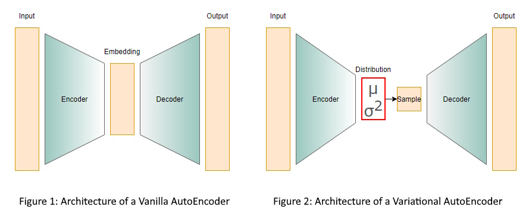
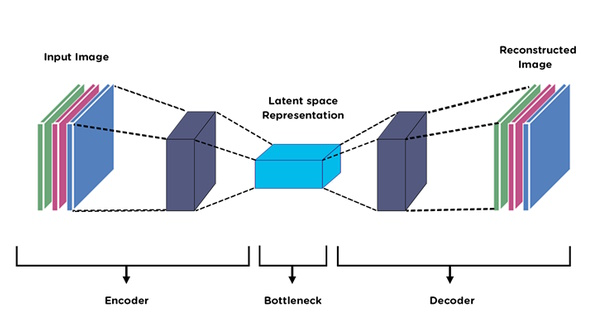
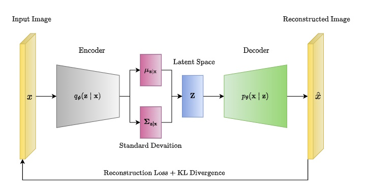

# AutoEncoders Explained: Understanding Vanilla and Variational Architectures

## Introduction

### Overview of AutoEncoders
Autoencoders are a type of artificial neural network used for unsupervised learning of efficient codings. The aim of an autoencoder is to learn a representation (encoding) for a set of data, typically for the purpose of dimensionality reduction. They consist of two main parts: an encoder and a decoder.



### Definition and Basic Concept
An autoencoder is composed of two parts:
- **Encoder**: This part of the network compresses the input into a latent-space representation. It maps the input data to a lower-dimensional space.
- **Decoder**: This part of the network reconstructs the input data from the latent representation. It maps the latent-space representation back to the original input space.

The overall goal is to train the network to minimize the difference between the input and the reconstructed output, effectively learning to capture the most important features of the input data.

### Key Points of Latent Representation


The latent representation, also known as the latent space or bottleneck layer, is a critical component of an autoencoder. Here are the key points:
- **Dimensionality Reduction**: The latent space typically has fewer dimensions than the input data, capturing essential features while discarding noise.
- **Feature Extraction**: It represents the most important characteristics of the input data in a compact form.
- **Intermediate Layer**: Positioned between the encoder and decoder, the latent space serves as the compressed knowledge of the input data.
- **Bottleneck**: The bottleneck layer forces the autoencoder to learn a compressed version of the input, ensuring efficient representation.
- **Reconstruction**: The decoder uses the latent representation to reconstruct the input data, aiming for minimal loss of information.

### Importance and Applications of AutoEncoders
Autoencoders have several important applications in various fields:
- **Data Compression**: By reducing the dimensionality of the data, autoencoders can compress information efficiently.
- **Denoising**: Autoencoders can be trained to remove noise from data, making them useful in image and signal processing.
- **Anomaly Detection**: By learning the normal patterns in data, autoencoders can identify anomalies or outliers.
- **Feature Learning**: The latent representations learned by autoencoders can be used as features for other machine learning tasks such as classification and clustering.
- **Image Generation**: Variational autoencoders (VAEs), an extension of traditional autoencoders, can generate new data samples similar to the training data, useful in creative applications like generating art or synthetic data.

## Differences Between Vanilla AE and VAE

### Comparison of Vanilla AE and VAE
Autoencoders (AEs) and Variational Autoencoders (VAEs) are both powerful neural network architectures used for unsupervised learning, but they have distinct differences:

| Feature                   | Vanilla AutoEncoder (VanillaAE)                          | Variational AutoEncoder (VariationalAE)                             |
|---------------------------|----------------------------------------------------------|---------------------------------------------------------------------|
| **Purpose**               | Encode and decode data to reduce dimensionality and reconstruct input. | Encode data to a latent space with probabilistic interpretation for generating new data. |
| **Latent Space**          | Deterministic latent space.                              | Probabilistic latent space with mean and log variance.              |
| **Encoder Output**        | Directly outputs latent representation.                  | Outputs mean and log variance of latent distribution.               |
| **Decoder Input**         | Takes direct latent representation as input.             | Takes reparameterized latent variable (z) as input.                 |
| **Reparameterization Trick** | Not used.                                                 | Used to sample from latent distribution while maintaining gradient flow. |
| **Loss Function**         | Reconstruction loss (e.g., binary cross-entropy).        | Combination of reconstruction loss and KL divergence.               |
| **KL Divergence**         | Not included.                                             | Included to measure divergence between approximate and true posterior. |
| **Generative Capability** | Limited generative capability, primarily for reconstruction. | Strong generative capability, can generate new data samples.        |
| **Complexity**            | Simpler implementation and training.                     | More complex due to probabilistic interpretation and additional loss term. |
| **Applications**          | Data compression, denoising, feature extraction.          | Generative modeling, anomaly detection, semi-supervised learning.   |
| **Training Stability**    | Generally stable and straightforward.                     | Can be less stable due to KL divergence term and reparameterization trick. |

**Key Points:**
- **Vanilla AutoEncoder (VanillaAE)**: 
  - Used primarily for dimensionality reduction, data reconstruction, and feature extraction.
  - Simpler in structure as it directly encodes input data to a latent space and decodes it back to the original space.
  - Loss function focuses on minimizing reconstruction error.
- **Variational AutoEncoder (VariationalAE)**: 
  - Incorporates a probabilistic approach to model the latent space, allowing it to generate new data samples.
  - Utilizes the reparameterization trick to maintain gradient flow during backpropagation.
  - Loss function is a combination of reconstruction error and KL divergence, ensuring the latent space follows a normal distribution.

**Visual Illustration of Autoencoder:**
- **Vanilla Autoencoder (Vanilla AE)**:
  - **Input**: Image of a handwritten '5'.
  - **Latent Representation**: [0.5, -0.1, 0.3, ...].
  - **Reconstruction**: Image of a handwritten '5' (similar to the input).
- **Variational Autoencoder (VAE)**:
  - **Input**: Image of a handwritten '5'.
  - **Latent Distribution**:
    - **Mean**: [0.5, -0.1, 0.3, ...].
    - **Variance**: [0.2, 0.1, 0.05, ...].
  - **Sampling**: [0.55, -0.15, 0.32, ...] (sampled from the latent distribution).
  - **Reconstruction**: Image of a handwritten '5' (but with slight variations).
  - **New Sample**: [0.48, -0.05, 0.28, ...] (another sample from the latent distribution).
  - **Generated Output**: Image of a handwritten '5' (with different variations).


### Advantages of VAEs
Variational Autoencoders offer several advantages over Vanilla Autoencoders:
1. **Generative Modeling**:
   - VAEs can generate new data points by sampling from the learned latent distribution, making them powerful generative models. This capability is useful in applications such as image generation, data augmentation, and creating synthetic data.
2. **Probabilistic Interpretation**:
   - The latent space in VAEs is modeled as a probability distribution (typically Gaussian). This allows for better representation of the uncertainty and variability in the data, leading to more robust models.
3. **Smooth Latent Space**:
   - The use of KL divergence in the loss function ensures that the latent space is regularized to follow a standard normal distribution. This smooth and continuous latent space helps in generating coherent and realistic samples.
4. **Flexibility in Data Generation**:
   - By sampling different points from the latent distribution, VAEs can generate diverse outputs. This flexibility is particularly useful in creative applications, such as generating variations of images, music, or text.
5. **Anomaly Detection**:
   - VAEs can be used for anomaly detection by learning the normal patterns in the data and identifying data points that deviate significantly from these patterns. The probabilistic nature of VAEs makes them well-suited for this task.
6. **Semi-Supervised Learning**:
   - VAEs can be used in semi-supervised learning scenarios, where only a small portion of the data is labeled. By leveraging the generative capabilities of VAEs, models can learn from both labeled and unlabeled data, improving overall performance.


## Implementation of AutoEncoders
The table below provides a concise overview of the key classes and functions used in the implementation of Vanilla and Variational Autoencoders. Each entry includes a brief description of the purpose and functionality of the class or function, highlighting their roles in encoding, decoding, loss computation, and model training.

| Class/Function             | Description                                                                                  |
|----------------------------|----------------------------------------------------------------------------------------------|
| **class `Encoder`**        | Encodes input data into a lower-dimensional latent representation for both Vanilla and Variational Autoencoders. |
| **class `VariationalEncoder`** | Specifically for Variational Autoencoders; encodes input data into mean and log variance of a latent distribution. |
| **class `Decoder`**        | Decodes the latent representation back to the original input data for both Vanilla and Variational Autoencoders. |
| **class `VanillaAE`**      | Combines an `Encoder` and a `Decoder` to form a traditional autoencoder.                      |
| **class `VariationalAE`**  | Combines a `VariationalEncoder` and a `Decoder` to form a variational autoencoder; includes the reparameterization trick. |
| **`vanilla_loss_function()`** | Computes the reconstruction loss for the Vanilla Autoencoder using binary cross-entropy.   |
| **`variational_loss_function()`** | Computes the total loss for the Variational Autoencoder, combining reconstruction loss and KL divergence. |
| **`training loop`**        | Trains the given model (VanillaAE or VariationalAE) for a specified number of epochs with optional periodic validation. |

The code snippet initializes the necessary settings and loads the MNIST dataset for training and testing autoencoder models. 
```python
# Set device to GPU if available, else CPU
cuda = True                     # Whether to use GPU
DEVICE = torch.device("cuda" if cuda else "cpu")  

batch_size = 100                # Number of samples per batch
x_dim = 784                     # Input dimension (28x28 images flattened)
hidden_dim = 400                # Hidden layer dimension
latent_dim = 200                # Latent space dimension
lr = 1e-3                       # Learning rate
epochs = 30                     # Number of epochs for training

# Data loading
mnist_transform = transforms.Compose([
    transforms.ToTensor(),      # Transform images to tensor
])

# DataLoader parameters for efficient loading
kwargs = {'num_workers': 1, 'pin_memory': True}  

# Load MNIST dataset
dataset_path  = '~/datasets'     # Path to dataset
train_dataset = MNIST(dataset_path, transform=mnist_transform, train=True, download=True)
test_dataset  = MNIST(dataset_path, transform=mnist_transform, train=False, download=True)
train_loader  = DataLoader(dataset=train_dataset, batch_size=batch_size, shuffle=True, **kwargs)
test_loader   = DataLoader(dataset=test_dataset, batch_size=batch_size, shuffle=False, **kwargs)
```

### class Encoder
The `Encoder` class is used for both Vanilla Autoencoders and Variational Autoencoders. It compresses the input data into a lower-dimensional latent representation.
```python
class Encoder(nn.Module):
    """
    Encoder for both VanillaAE and VariationalAE.

    Args:
        input_dim (int): Dimension of input data.
        hidden_dim (int): Dimension of hidden layers.
        latent_dim (int): Dimension of latent space.
    """
    def __init__(self, input_dim, hidden_dim, latent_dim):
        super(Encoder, self).__init__()
        self.FC_input  = nn.Linear(input_dim, hidden_dim)   # Input to hidden layer
        self.FC_input2 = nn.Linear(hidden_dim, hidden_dim)  # Second hidden layer
        self.FC_latent = nn.Linear(hidden_dim, latent_dim)  # Hidden to latent space
        self.LeakyReLU = nn.LeakyReLU(0.2)                  # Activation function

    def forward(self, x):
        """
        Encodes the input data into latent representation.

        Args:
            x (Tensor): Input data.

        Returns:
            Tensor: Latent representation.
        """
        h = self.LeakyReLU(self.FC_input(x))    # Apply activation after first hidden layer
        h = self.LeakyReLU(self.FC_input2(h))   # Apply activation after second hidden layer
        latent = self.FC_latent(h)              # Compute latent representation
        return latent
```

### class VariationalEncoder
The VariationalEncoder class is used specifically for Variational Autoencoders. It outputs the mean and log variance of the latent distribution.
```python
class VariationalEncoder(nn.Module):
    """
    Variational Encoder for VariationalAE.

    Args:
        input_dim (int): Dimension of input data.
        hidden_dim (int): Dimension of hidden layers.
        latent_dim (int): Dimension of latent space.
    """
    def __init__(self, input_dim, hidden_dim, latent_dim):
        super(VariationalEncoder, self).__init__()
        self.FC_input  = nn.Linear(input_dim, hidden_dim)   # Input to hidden layer
        self.FC_input2 = nn.Linear(hidden_dim, hidden_dim)  # Second hidden layer
        self.FC_mean   = nn.Linear(hidden_dim, latent_dim)  # Hidden to mean of latent space
        self.FC_var    = nn.Linear(hidden_dim, latent_dim)  # Hidden to log variance of latent space
        self.LeakyReLU = nn.LeakyReLU(0.2)                  # Activation function

    def forward(self, x):
        """
        Encodes the input data into mean and log variance of latent distribution.

        Args:
            x (Tensor): Input data.

        Returns:
            Tensor: Mean of latent space.
            Tensor: Log variance of latent space.
        """
        h = self.LeakyReLU(self.FC_input(x))    # Apply activation after first hidden layer
        h = self.LeakyReLU(self.FC_input2(h))   # Apply activation after second hidden layer
        mean = self.FC_mean(h)                  # Compute mean of latent space
        log_var = self.FC_var(h)                # Compute log variance of latent space
        return mean, log_var                    # Return mean and log variance
```

### class Decoder
The Decoder class reconstructs the input data from the latent representation.
```python
class Decoder(nn.Module):
    """
    Decoder for both VanillaAE and VariationalAE.

    Args:
        latent_dim (int): Dimension of latent space.
        hidden_dim (int): Dimension of hidden layers.
        output_dim (int): Dimension of output data.
    """
    def __init__(self, latent_dim, hidden_dim, output_dim):
        super(Decoder, self).__init__()
        self.FC_hidden = nn.Linear(latent_dim, hidden_dim)  # Latent space to hidden layer
        self.FC_hidden2 = nn.Linear(hidden_dim, hidden_dim) # Second hidden layer
        self.FC_output = nn.Linear(hidden_dim, output_dim)  # Hidden to output layer
        self.LeakyReLU = nn.LeakyReLU(0.2)                  # Activation function

    def forward(self, x):
        """
        Decodes the latent representation to reconstruct input data.

        Args:
            x (Tensor): Latent representation.

        Returns:
            Tensor: Reconstructed input data.
        """
        h = self.LeakyReLU(self.FC_hidden(x))       # Apply activation after first hidden layer
        h = self.LeakyReLU(self.FC_hidden2(h))      # Apply activation after second hidden layer
        x_hat = torch.sigmoid(self.FC_output(h))    # Apply sigmoid activation to output layer
        return x_hat                                # Return reconstructed image
```

### class VanillaAE
The VanillaAE class combines an encoder and a decoder to form a traditional autoencoder.
```python
class VanillaAE(nn.Module):
    """
    Vanilla Autoencoder consisting of an encoder and a decoder.

    Args:
        encoder (nn.Module): Encoder instance.
        decoder (nn.Module): Decoder instance.
    """
    def __init__(self, encoder, decoder):
        super(VanillaAE, self).__init__()
        self.encoder = encoder  # Encoder instance
        self.decoder = decoder  # Decoder instance

    def forward(self, x):
        """
        Encodes and decodes the input data.

        Args:
            x (Tensor): Input data.

        Returns:
            Tensor: Reconstructed input data.
        """
        latent = self.encoder(x)        # Encode input to latent space
        x_hat = self.decoder(latent)    # Decode latent space to reconstruct input
        return x_hat
```

### class VariationalAE
The VariationalAE class combines a variational encoder and a decoder to form a variational autoencoder.



```python
class VariationalAE(nn.Module):
    """
    Variational Autoencoder consisting of a variational encoder and a decoder.

    Args:
        encoder (nn.Module): Variational Encoder instance.
        decoder (nn.Module): Decoder instance.
    """
    def __init__(self, encoder, decoder):
        super(VariationalAE, self).__init__()
        self.encoder = encoder  # Encoder instance
        self.decoder = decoder  # Decoder instance

    def reparameterize(self, mean, log_var):
        """
        Samples from the latent distribution using the reparameterization trick.

        Args:
            mean (Tensor): Mean of latent distribution.
            log_var (Tensor): Log variance of latent distribution.

        Returns:
            Tensor: Sampled latent variable.
        """
        std = torch.exp(0.5 * log_var)              # Compute standard deviation from log variance
        epsilon = torch.randn_like(std).to(DEVICE)  # Sample epsilon from standard normal distribution
        z = mean + std * epsilon                    # Reparameterize to get latent variable z
        return z

    def forward(self, x):
        """
        Encodes and decodes the input data, and returns mean and log variance.

        Args:
            x (Tensor): Input data.

        Returns:
            Tensor: Reconstructed input data.
            Tensor: Mean of latent distribution.
            Tensor: Log variance of latent distribution.
        """
        mean, log_var = self.encoder(x)         # Encode input to get mean and log variance
        z = self.reparameterize(mean, log_var)  # Reparameterize to get latent variable
        x_hat = self.decoder(z)                 # Decode latent variable to reconstruct input
        return x_hat, mean, log_var             # Return reconstructed input, mean, and log variance
```

### vanilla_loss_function() function
The vanilla_loss_function calculates the reconstruction loss for the Vanilla Autoencoder.
```python
def vanilla_loss_function(x, x_hat):
    """
    Computes the reconstruction loss for VanillaAE.

    Args:
        x (Tensor): Original input data.
        x_hat (Tensor): Reconstructed input data.

    Returns:
        Tensor: Reconstruction loss.
    """
    return nn.functional.binary_cross_entropy(x_hat, x, reduction='sum')  # Reconstruction loss
```

### variational_loss_function() function
The variational_loss_function calculates the total loss for the Variational Autoencoder, including reconstruction loss and KL divergence.
```python
def variational_loss_function(x, x_hat, mean, log_var):
    """
    Computes the total loss for VariationalAE, including reconstruction loss and KL divergence.

    Args:
        x (Tensor): Original input data.
        x_hat (Tensor): Reconstructed input data.
        mean (Tensor): Mean of latent distribution.
        log_var (Tensor): Log variance of latent distribution.

    Returns:
        Tensor: Total loss (reconstruction loss + KL divergence).
    """
    reproduction_loss = nn.functional.binary_cross_entropy(x_hat, x, reduction='sum')   # Reconstruction loss
    kl_divergence = -0.5 * torch.sum(1 + log_var - mean.pow(2) - log_var.exp())         # KL divergence
    return reproduction_loss + kl_divergence  # Total loss
```

### The Training Loop
The train function trains the given model for a specified number of epochs with periodic validation.
```python
def train(model, optimizer, loss_function, is_variational=False, validate_every=5):
    """
    Trains the given model for a specified number of epochs with periodic validation.

    Args:
        model (nn.Module): The model to be trained (VanillaAE or VariationalAE).
        optimizer (torch.optim.Optimizer): Optimizer for updating model parameters.
        loss_function (function): Loss function for computing the training loss.
        is_variational (bool): Flag to indicate if the model is VariationalAE.
        validate_every (int): Frequency of validation (in epochs).

    Returns:
        None
    """
    for epoch in range(epochs):
        model.train()  # Set model to training mode
        train_loss = 0
        with tqdm(total=len(train_loader), desc=f'Epoch {epoch + 1}/{epochs}', unit='batch') as pbar:
            for batch_idx, (data, _) in enumerate(train_loader):
                data = data.view(-1, x_dim).to(DEVICE)  # Flatten and move data to device
                optimizer.zero_grad()                   # Zero the gradients
                if is_variational:
                    x_hat, mean, log_var = model(data)                  # Forward pass for VariationalAE
                    loss = loss_function(data, x_hat, mean, log_var)    # Compute loss
                else:
                    x_hat = model(data)                 # Forward pass for VanillaAE
                    loss = loss_function(data, x_hat)   # Compute loss
                loss.backward()                         # Backward pass
                train_loss += loss.item()               # Accumulate training loss
                optimizer.step()                        # Update model parameters

                pbar.set_postfix(loss=loss.item())      # Update progress bar with current loss
                pbar.update(1)                          # Increment progress bar

        avg_train_loss = train_loss / len(train_loader.dataset)                 # Compute average loss for the epoch
        print(f'Epoch {epoch + 1}, Avg Training Loss: {avg_train_loss:.4f}')    # Print average loss for the epoch
        
        if (epoch + 1) % validate_every == 0:
            model.eval()            # Set model to evaluation mode
            val_loss = 0
            with torch.no_grad():   # Disable gradient computation
                for data, _ in test_loader:
                    data = data.view(-1, x_dim).to(DEVICE)                  # Flatten and move data to device
                    if is_variational:
                        x_hat, mean, log_var = model(data)                  # Forward pass for VariationalAE
                        loss = loss_function(data, x_hat, mean, log_var)    # Compute loss
                    else:
                        x_hat = model(data)                 # Forward pass for VanillaAE
                        loss = loss_function(data, x_hat)   # Compute loss
                    val_loss += loss.item()                 # Accumulate validation loss
            
            avg_val_loss = val_loss / len(test_loader.dataset)                      # Compute average validation loss
            print(f'Epoch {epoch + 1}, Avg Validation Loss: {avg_val_loss:.4f}')    # Print average validation loss


def main():
    """
    Main function to train both VanillaAE and VariationalAE models.
    """
    # Initialize the models
    encoder_vanilla     = Encoder(input_dim=x_dim, hidden_dim=hidden_dim, latent_dim=latent_dim)
    encoder_variational = VariationalEncoder(input_dim=x_dim, hidden_dim=hidden_dim, latent_dim=latent_dim)
    decoder             = Decoder(latent_dim=latent_dim, hidden_dim=hidden_dim, output_dim=x_dim)

    vanilla_ae     = VanillaAE(encoder=encoder_vanilla, decoder=decoder).to(DEVICE)
    variational_ae = VariationalAE(encoder=encoder_variational, decoder=decoder).to(DEVICE)

    # Define optimizers
    optimizer_vanilla     = torch.optim.Adam(vanilla_ae.parameters(), lr=lr)        # Optimizer for VanillaAE
    optimizer_variational = torch.optim.Adam(variational_ae.parameters(), lr=lr)    # Optimizer for VariationalAE

    # Train VanillaAE
    print("Training VanillaAE...")
    train(vanilla_ae, optimizer_vanilla, vanilla_loss_function, False, 5)

    # Train VariationalAE
    print("Training VariationalAE...")
    train(variational_ae, optimizer_variational, variational_loss_function, True, 5)

# Call the main function
if __name__ == "__main__":
    main()
```

## Conclusion
The Variational Autoencoder (VAE) demonstrates significantly stronger generative capabilities compared to the Vanilla Autoencoder (VanillaAE) due to its probabilistic framework. This distinction allows VAEs to generate new, diverse data samples that adhere to the learned distribution of the input data. 

**Key Takeaways:**
1. **Probabilistic Latent Space**:
   - **VAE**: Encodes input data into a distribution with mean and variance, capturing the underlying distribution of the data.
   - **Vanilla AE**: Encodes input data into a deterministic latent space, resulting in a single point representation for each input.
2. **Sampling**:
   - **VAE**: Samples from the learned latent distribution during decoding, introducing variability and enabling the generation of new data points.
   - **Vanilla AE**: Directly maps the latent representation back to the output space, limiting its ability to generate new data points.
3. **Regularization with KL Divergence**:
   - **VAE**: Utilizes the KL divergence term in the loss function to ensure the latent space approximates a standard normal distribution. This results in a smooth, continuous latent space that generates coherent and realistic samples.
   - **Vanilla AE**: Lacks a similar regularization mechanism, resulting in a latent space that may not be as smooth or continuous, thus limiting its generative capabilities.

These attributes make VAEs particularly powerful for tasks that require generating new data samples, such as image synthesis, data augmentation, and anomaly detection. By contrast, Vanilla Autoencoders are more suited for tasks like data compression, denoising, and feature extraction, where generative capabilities are less critical.

## References
For further reading and a deeper understanding of Autoencoders and Variational Autoencoders, you can refer to the following resources. These references include tutorials, detailed explanations, and practical implementations that can enhance your knowledge and help you apply these concepts in practice.

- [Autoencoders Explained Easily](https://www.youtube.com/watch?v=xwrzh4e8DLs)
- [Understanding Variational Autoencoder | VAE Explained](https://www.youtube.com/watch?v=1RPdu_5FCfk)
- [Variational Autoencoder from scratch](https://www.youtube.com/watch?v=d0W_Ab-aZGo)
- [PyTorch-VAE](https://github.com/AntixK/PyTorch-VAE)
- [Autoencoders & Variational Autoencoders](https://www.andrew.cmu.edu/user/xihuang/blog/ae_vae/ae_vae.html)


