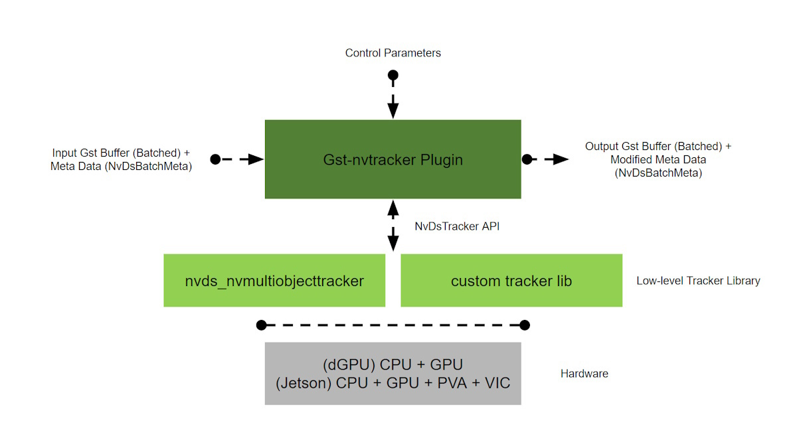
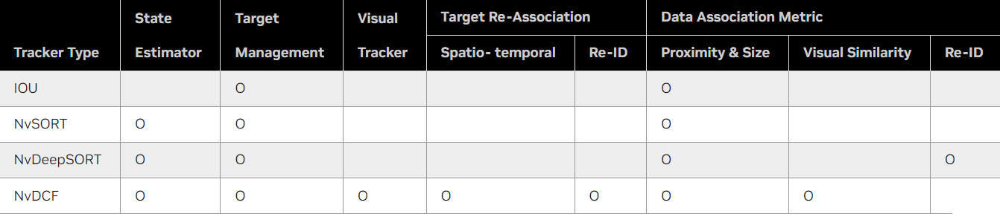
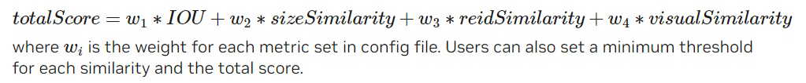
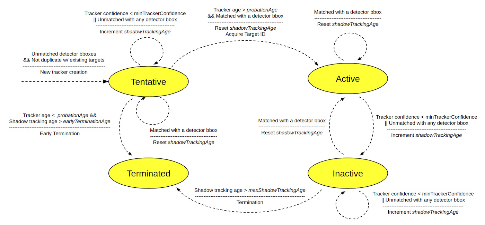

# Part 1: Introduction and Core Concepts of NvMultiObjectTracker

## 1. Introduction

### 1.1 Overview of Multi-Object Tracking
Multi-object tracking (MOT) is a crucial aspect of computer vision that involves detecting and tracking multiple objects over time within a video stream. This technique is widely used in various applications such as video surveillance, autonomous driving, robotics, and human-computer interaction. The goal of MOT is to maintain consistent identities for each detected object across frames, ensuring accurate tracking despite challenges such as occlusions, abrupt movements, and changes in the object's appearance.

### 1.2 Importance of Tracking in Computer Vision Applications
Tracking plays an essential role in enhancing the understanding of dynamic scenes by providing temporal consistency to object detection. It enables applications to go beyond detecting objects in a single frame, allowing for the analysis of movement patterns, behaviors, and interactions over time. For instance:
- **Video Surveillance:** Tracking enables security systems to monitor and analyze the movement of people and vehicles across different areas, helping in identifying suspicious activities and improving safety measures.
- **Autonomous Driving:** In autonomous vehicles, tracking ensures that the system can reliably follow and predict the paths of other vehicles, pedestrians, and obstacles, contributing to safe navigation.
- **Sports Analytics:** Tracking players and the ball in sports videos allows for detailed performance analysis and can provide insights that are valuable for coaching and broadcasting.

### 1.3 Introduction to NvMultiObjectTracker
NvMultiObjectTracker is a powerful, flexible, and scalable tracker library developed by NVIDIA, designed to address the challenges of multi-object tracking in real-time applications. It is a part of the DeepStream SDK, which is a comprehensive suite for building AI-powered applications, particularly in video analytics. 

NvMultiObjectTracker leverages NVIDIA’s GPU acceleration capabilities to provide robust tracking performance across multiple video streams. It supports various tracking algorithms, including IOU, NvSORT, NvDeepSORT, and NvDCF, allowing users to select the most suitable algorithm for their specific use case. Additionally, the tracker is highly configurable, enabling users to tailor its behavior to the particular demands of their application.

### 1.4 Objectives of This Article
This article aims to provide a comprehensive understanding of the NvMultiObjectTracker library, from its core concepts and architecture to its advanced features and real-world applications. By the end of this series, readers will gain a deep understanding of how to effectively integrate, configure, and optimize NvMultiObjectTracker within their own projects.

### 1.5 Structure of the Article
The content is divided into two main parts:
- **Part 1: Introduction and Core Concepts of NvMultiObjectTracker:** This section covers the fundamental concepts, including the architecture, core modules, workflow, data association, target management, and state estimation.
- **Part 2: Advanced Features and Applications of NvMultiObjectTracker:** The second part delves into advanced features such as object re-identification, target re-association, bounding-box unclipping, and single-view 3D tracking, along with practical examples and configurations.

## 2. Unified Tracker Architecture for Composable Multi-Object Tracker

### 2.1 Explanation of Composable Tracker Architecture
The NvMultiObjectTracker library is built on a unified and modular architecture designed to provide flexibility and scalability for various multi-object tracking scenarios. This architecture allows different tracking algorithms to share common modules while maintaining the flexibility to customize and extend specific functionalities based on the tracking needs.

The key idea behind the composable tracker architecture is to break down the tracking process into fundamental components or modules that can be individually configured, replaced, or extended. This modular approach enables the seamless integration of different tracking strategies and algorithms within a single framework, making it adaptable to a wide range of applications and performance requirements.

For instance, the architecture allows for the combination of multiple data association strategies, state estimators, and error handling mechanisms. As a result, users can tailor the tracker to their specific use case by selecting and configuring the appropriate components without needing to rewrite the entire tracking logic.

In practice, this means that the NvMultiObjectTracker can be composed of various tracking modules, such as data association, target management, state estimation, and others. Each module operates independently but communicates with other modules through well-defined interfaces, ensuring that the overall tracking process remains cohesive and efficient.

### 2.2 Core Modules and Their Roles
The unified tracker architecture in NvMultiObjectTracker consists of several core modules, each responsible for a specific aspect of the tracking process. Understanding these modules and their roles is crucial for effectively configuring and optimizing the tracker for different applications.

#### **2.2.1 Data Association**
The Data Association module is responsible for matching detected objects across consecutive frames. It plays a crucial role in maintaining consistent object identities over time. The module uses various similarity metrics, such as Intersection over Union (IOU), bounding box size, and Re-ID features, to associate detected objects with existing targets. By using different matching algorithms, such as greedy matching or cascaded data association, this module ensures that the most accurate associations are made, even in challenging scenarios with occlusions or overlapping objects.

#### **2.2.2 Target Management**
Target Management handles the lifecycle of tracked objects, including their creation, updating, and termination. It manages the states of objects as they transition through different phases, such as Tentative, Active, Inactive, and Terminated. This module also implements strategies like Late Activation and Shadow Tracking to manage uncertain detections and handle tracking errors, ensuring that the tracker remains robust even in noisy environments.

#### **2.2.3 State Estimation**
The State Estimation module predicts the future positions of tracked objects based on their past and current states. It uses Kalman Filters (KFs) to estimate the motion and size of the bounding boxes over time, helping to smooth out the tracking and provide more accurate predictions. Different types of KFs, such as Simple-bbox KF, Regular-bbox KF, and Simple-location KF, are used depending on the specific requirements of the tracking task.

#### **2.2.4 Object Re-Identification (Re-ID)**
The Re-ID module enhances the ability of the tracker to maintain object identities across significant spatial-temporal gaps. It uses deep learning-based features to recognize objects based on their appearance, allowing for re-association of objects that have temporarily left the scene or become occluded. This module is particularly important for applications where objects frequently reappear in different locations within the video stream.

#### **2.2.5 Target Re-Association**
Target Re-Association works closely with the Re-ID module to handle cases where objects are lost and then reappear later in the scene. It combines motion and appearance features to reassociate targets that have been lost due to occlusion or other interruptions. This module is key to ensuring long-term tracking stability and reducing ID switches, which can degrade the quality of tracking data.

#### **2.2.6 Bounding-Box Unclipping**
Bounding-Box Unclipping addresses the problem of objects partially exiting the field of view (FOV) of the camera. When an object begins to move out of the FOV, the bounding box may only capture part of the object. This module estimates the full bounding box based on the object's size and position before it started moving out of the FOV, ensuring that tracking continues smoothly even when the object is partially visible.

#### **2.2.7 Single-View 3D Tracking (SV3DT)**
Single-View 3D Tracking is an advanced feature that allows tracking to be performed in a 3D world coordinate system rather than the 2D image plane. By using a 3x4 projection matrix and 3D model information, this module can improve tracking accuracy by compensating for partial occlusions and other challenges that affect 2D tracking. It is particularly useful in scenarios where the camera perspective and object dimensions are critical to maintaining accurate tracking.

## 3. Workflow and Core Modules in NvMultiObjectTracker

### 3.1 Overview of Workflow
The workflow in NvMultiObjectTracker is a structured process that integrates multiple stages of object tracking, ensuring that detected objects are consistently identified and tracked across video frames. The workflow consists of several key steps, each corresponding to specific modules within the tracker. Understanding this workflow is crucial for optimizing the performance and accuracy of the tracking system.

1. **Frame Input and Preprocessing:**
   - The workflow begins with receiving video frames from multiple streams. Each frame undergoes preprocessing, which may include resizing, normalization, and format conversion to ensure compatibility with downstream processes.

2. **Object Detection:**
   - The preprocessed frames are then fed into a Primary GIE (GPU Inference Engine) module, where objects are detected. The detected objects are represented by bounding boxes and associated metadata, such as confidence scores and object class labels.

3. **Data Association:**
   - The detected objects are passed to the Data Association module, where they are matched with existing tracked objects (targets). This step is crucial for maintaining the identity of objects across frames. The matching process uses various similarity metrics, such as Intersection over Union (IOU), bounding box size, and Re-ID features.

4. **State Estimation and Update:**
   - After data association, the State Estimation module updates the positions, sizes, and velocities of the tracked objects. Kalman Filters (KFs) are typically used for this purpose, providing predictions for the next frame and smoothing the tracking trajectory.

5. **Target Management:**
   - The Target Management module manages the lifecycle of tracked objects. It determines whether new objects should be added to the list of tracked targets, whether existing objects should continue to be tracked, and when objects should be marked as inactive or terminated. This module employs strategies like Late Activation and Shadow Tracking to handle uncertain detections and re-acquire lost targets.

6. **Object Re-Identification (Re-ID):**
   - For objects that leave the field of view and then reappear, the Re-ID module uses deep learning-based features to re-identify them, ensuring that the same object ID is maintained even after it reappears.

7. **Target Re-Association:**
   - This module further enhances the robustness of tracking by re-associating targets that have been lost due to occlusion or other interruptions. It uses a combination of motion and appearance features to match reappearing targets with their previous identities.

8. **Output and Post-Processing:**
   - Finally, the tracked objects, along with their updated metadata, are passed to the output stage. Here, additional post-processing steps, such as bounding-box unclipping or 3D tracking, may be applied before the results are displayed or stored.

### 3.2 Key Concepts in NvMultiObjectTracker

The `NvMultiObjectTracker` library, part of NVIDIA's DeepStream SDK, plays a critical role in multi-object tracking within video streams. It enables the tracking of detected objects across multiple frames, ensuring consistent identification and monitoring over time. Below, we explore the essential concepts, processes, and functionalities that underpin this library's operation.

### **Key Concepts**

1. **Detector Object vs. Target**:
   - **Detector Object**: This refers to an object identified by the Primary GPU Inference Engine (PGIE) during object detection. The PGIE is responsible for recognizing objects within each frame of the video stream.
   - **Target**: Once a detector object is selected for tracking, it becomes a "target." The tracker continuously monitors this target across subsequent frames, maintaining its identity throughout the video.

2. **Inferenced Frame**:
   - **Definition**: An inferenced frame is a video frame where the PGIE has executed object detection. 
   - **Inference Interval**: This setting in the PGIE module dictates how frequently inference is performed on the video frames. If the interval is set to greater than zero, the inference engine will skip some frames, resulting in detection being performed at specified intervals, rather than on every single frame.

### **Core Functionalities in Multi-Object Tracking**

To effectively track multiple objects across video frames, the `NvMultiObjectTracker` library undertakes several critical operations. These processes are often executed in parallel using multithreading to enhance CPU efficiency:

1. **Data Association**:
   - **Purpose**: Data association is the process of linking detected objects in the current frame with existing targets from previous frames. This matching ensures that each detected object is correctly associated with the corresponding target, allowing the system to maintain object identity over time.

2. **Target Management**:
   - **Purpose**: After data association, the target management module updates the states of all tracked targets, including their positions and velocities. This module is also responsible for creating new targets for any newly detected objects that do not match existing targets and terminating those targets that are no longer detected in the video stream.

## 4. Data Association Process

Data association involves matching detector objects to existing targets based on various similarity metrics:

1. **Location Similarity (Proximity)**:
   - **Definition**: Measures how close the bounding boxes of the detector objects and targets are to each other. Intersection Over Union (IOU) is a common metric used here.

2. **Bounding Box Size Similarity**:
   - **Definition**: Compares the sizes of bounding boxes. The similarity is typically calculated as the ratio of the smaller bounding box to the larger one.

3. **Re-ID Feature Similarity (Specific to NvDeepSORT)**:
   - **Definition**: Involves comparing deep learning-based appearance features (e.g., embeddings) to associate objects based on how visually similar they are.

4. **Visual Appearance Similarity (Specific to NvDCF)**:
   - **Definition**: Compares the visual features of objects, such as color, texture, or shape, to maintain object identity across frames.

### 4.1 Scoring and Matching

- **Total Association Score**: The final score for associating a detector object with a target is a weighted sum of all the above metrics. The weights for each metric can be configured in the tracker’s configuration file, and minimum thresholds can be set to control how strictly objects need to match.

- **Class Matching**:
  - **Default Behavior**: By default, the tracker associates objects of the same class (e.g., cars with cars).
  - **Optional Behavior**: You can disable this by setting `checkClassMatch: 0`, allowing objects to be associated regardless of their class. This can be useful if the object detector (like YOLO) might misclassify objects of the same type over time.

- **Matching Algorithm**:
  - **Greedy Algorithm (associationMatcherType=0)**: A fast and efficient algorithm for bipartite matching that finds the best matches between detector objects and targets based on the similarity metrics.
  - **Cascaded Data Association (associationMatcherType=1)**: A more advanced method that improves accuracy by performing multi-stage matching:
    1. **First Stage**: Matches confirmed detections with validated targets using all available similarity metrics.
    2. **Second Stage**: Matches tentative detections with remaining active targets, focusing on IOU similarity.
    3. **Third Stage**: Matches remaining confirmed detections with tentative targets, again focusing on IOU.

- **Output of Data Association**:
  - **Matched Pairs**: These are the detector objects that were successfully matched with existing targets.
  - **Unmatched Detector Objects**: These are newly detected objects that don’t match any existing targets. They may be considered new targets unless they are duplicates of existing targets.
  - **Unmatched Targets**: These are existing targets that don’t have a corresponding detector object in the current frame. These might be terminated if not detected over several frames.

The image you provided explains how the `totalScore` for associating a detected object with a target is calculated using various similarity metrics in the tracking process. Let's break down the formula and explain it with an example:

### 4.2 Total Association Score

The formula to calculate the total association score is as follows:

Where:
- **IOU (Intersection Over Union)**: A metric that measures the overlap between the bounding boxes of the detected object and the target. A higher IOU indicates that the boxes are closely aligned.
- **sizeSimilarity**: A measure of how similar the sizes of the bounding boxes are. It is typically calculated as the ratio of the size of the smaller box to the larger one.
- **reidSimilarity**: A similarity score based on Re-Identification (Re-ID) features, which are deep learning-based appearance features. This is specific to trackers like NvDeepSORT.
- **visualSimilarity**: A measure of how visually similar the detected object is to the target based on appearance features, such as color or texture. This is used by trackers like NvDCF.
- **w_1, w_2, w_3, w_4**: These are the weights assigned to each metric, which are configurable in the tracker's settings. They determine the importance of each similarity metric in the final score.

#### Example Scenario

Imagine you are tracking cars in a parking lot. A car is detected in a new frame, and you need to determine whether it matches a car that was detected and tracked in previous frames (the target).

1. **Detected Object (New Detection)**:
   - **Bounding Box**: [50, 50, 200, 200] (x, y, width, height)
   - **Re-ID Features**: A feature vector representing the car’s appearance.
   - **Visual Appearance**: The car is blue with a distinct shape.

2. **Target (Existing Tracked Object)**:
   - **Bounding Box**: [55, 55, 210, 210]
   - **Re-ID Features**: A similar feature vector from when the car was first detected.
   - **Visual Appearance**: The car is also blue with the same distinct shape.

3. **Calculating the Metrics**:

   - **IOU**: Calculate the Intersection Over Union between the bounding boxes of the detected object and the target. The IOU might be, say, 0.85, indicating a high overlap.
   
   - **sizeSimilarity**: Calculate the similarity of the bounding box sizes. This might be 0.95, indicating that the sizes are very similar.
   
   - **reidSimilarity**: Use a neural network to compare the Re-ID features of the detected object and the target. Suppose the similarity is 0.90, indicating a strong match in appearance features.
   
   - **visualSimilarity**: Compare the visual features like color and texture. This might be 0.92, reflecting the fact that the cars look very similar.

4. **Assigning Weights**:
   - Suppose the weights are configured as follows: `w_1 = 0.4`, `w_2 = 0.2`, `w_3 = 0.2`, and `w_4 = 0.2`. This configuration gives the most importance to the IOU, with lesser but equal importance to the other metrics.

5. **Calculating the Total Score**:
   - totalScore = 0.4×0.85 + 0.2×0.95 + 0.2×0.90 + 0.2×0.92
   - totalScore = 0.34 + 0.19 + 0.18 + 0.184 = 0.894

   The `totalScore` is 0.894, which is quite high, indicating that the detected object is very likely the same car as the tracked target.

#### Decision Making

Based on the `totalScore`:
- If this score exceeds a certain threshold (which is configurable), the tracker will associate the detected object with the existing target, meaning the tracker will update the target's position and state to reflect the new detection.
- If the score is below the threshold, the tracker might decide that this is a new object and create a new target for it.

## 5. Target Management and Error Handling

The provided diagram and text describe the state transitions and error handling strategies employed by the `NvMultiObjectTracker` library in NVIDIA DeepStream for managing tracked objects (targets). Here's a detailed explanation:

### 5.1 Key Concepts

1. **Tentative Mode**: 
   - When a new object is detected, a new tracker is created, but the object is not immediately confirmed as a valid target. It is placed in a "tentative" state, where it undergoes a probationary period (`probationAge`) to determine whether it is a valid detection or a false positive.
   - During this period, the tracker’s output is not reported downstream, but the tracking data is stored internally.

2. **Active Mode**:
   - If the object continues to be detected and associated with a bounding box (bbox) during the probationary period, it is promoted to "active" mode.
   - In active mode, the tracker is confirmed, and the object’s tracking data starts being reported downstream. If past-frame data is enabled, data from the tentative period is also reported once the target becomes active.

3. **Inactive Mode**:
   - If an object in active mode is no longer detected or the tracker confidence drops below a certain threshold (`minTrackerConfidence`), it enters inactive mode.
   - In inactive mode, the object is still tracked in the background (shadow tracking), but it is not reported. The `shadowTrackingAge` is incremented during this period.

4. **Terminated Mode**:
   - An object is fully terminated if it remains inactive for too long, exceeding the `maxShadowTrackingAge` or if it fails to become active during the tentative phase and exceeds `earlyTerminationAge`.
   - Termination means the tracker stops tracking this object, and it is removed from memory.

### 5.2 State Transitions

- **Tentative to Active**:
  - **Condition**: If the object is continuously detected and its `trackerAge` exceeds `probationAge`, it is promoted to active mode.
  - **Action**: The object’s `shadowTrackingAge` is reset, and a unique target ID is assigned. The tracking data starts being reported.

- **Tentative to Terminated** (Early Termination):
  - **Condition**: If the object fails to be consistently detected during the tentative phase and its `shadowTrackingAge` exceeds `earlyTerminationAge`, it is terminated.
  - **Action**: The tracker for this object is deleted.

- **Active to Inactive**:
  - **Condition**: If the object is not detected in subsequent frames or the tracker confidence drops below `minTrackerConfidence`, the object becomes inactive.
  - **Action**: The tracker continues in the background, and `shadowTrackingAge` is incremented.

- **Inactive to Terminated**:
  - **Condition**: If the object remains inactive for too long, exceeding `maxShadowTrackingAge`, it is terminated.
  - **Action**: The object is removed from memory, and tracking stops.

- **Inactive to Active**:
  - **Condition**: If the object is detected again during the inactive phase, the `shadowTrackingAge` is reset, and the object returns to active mode.

### 5.3 Error Handling Strategies

1. **Late Activation**:
   - This is the strategy of not immediately confirming new detections as valid targets. By placing new objects in tentative mode, the system reduces the chances of false positives being reported as valid detections.

2. **Shadow Tracking**:
   - When an object is not detected in a frame (due to occlusion or other reasons), shadow tracking keeps the tracker alive for a certain period, hoping that the object will reappear. This avoids prematurely terminating valid objects that are temporarily undetected.

3. **Early Termination**:
   - If a newly detected object fails to meet the criteria for activation (e.g., it is not detected consistently during the tentative phase), it is terminated early to conserve resources and avoid reporting noise.

### 5.4 Unique ID Management

- **useUniqueID**: If enabled, the system assigns a unique 32-bit ID to each video stream, with target IDs starting from a random position in the ID space. This ensures that target IDs are unique across different runs or streams.
- **preserveStreamUpdateOrder**: Controls whether target IDs are assigned sequentially across streams (single-threaded) or in parallel (multi-threaded). This affects whether the order of IDs is consistent across multiple runs.

### 5.5 Memory Management

- **Pre-allocation**: The system pre-allocates GPU memory based on the maximum number of targets (`maxTargetsPerStream`) and the number of video streams. This ensures stable memory usage during long runs, avoiding memory growth even as the number of tracked objects increases.

## 6. State Estimation

The text explains the different state estimation methods used in the `NvMultiObjectTracker` library, particularly focusing on how Kalman Filters (KF) are used to predict and update the state of tracked objects. State estimation is crucial for maintaining the accuracy of object tracking over time, especially in scenarios where objects might temporarily disappear (e.g., due to occlusion) or move unpredictably.

### 6.1 Kalman Filters (KF) in Object Tracking

Kalman Filters are mathematical models used to predict the future state of a system based on its previous state and current observations. In the context of object tracking, the "state" typically refers to the position, size, and velocity of an object's bounding box (bbox) in the video frame.

#### Types of Kalman Filters in NvMultiObjectTracker

1. **Simple-bbox KF**:
   - **States**: {x, y, w, h, dx, dy}
   - **Explanation**: This filter tracks six parameters for each object: 
     - `x` and `y` are the coordinates of the top-left corner of the bounding box.
     - `w` and `h` are the width and height of the bounding box.
     - `dx` and `dy` are the velocities (rate of change) of the `x` and `y` coordinates.
   - **Use Case**: Useful when you want to track the position and size of an object over time, with velocity information to predict future positions.

2. **Regular-bbox KF**:
   - **States**: {x, y, w, h, dx, dy, dw, dh}
   - **Explanation**: This filter extends the Simple-bbox KF by also tracking the rate of change in the bounding box’s size:
     - `dw` and `dh` are the velocities of the width and height, respectively.
   - **Use Case**: Provides more accurate predictions in cases where the size of the object is changing, such as when an object is moving toward or away from the camera.

3. **Simple-location KF**:
   - **States**: {x, y, dx, dy}
   - **Explanation**: This filter tracks only the position (`x`, `y`) and velocity (`dx`, `dy`) of the object, without considering its size.
   - **Use Case**: Ideal for scenarios where only the location of an object needs to be tracked, such as tracking points on a map or in scenarios where size changes are not relevant.

### 6.2 Measurement and Process Noise

- **Measurement Vector**:
  - For Simple-bbox and Regular-bbox KF: `{x, y, w, h}`
  - For Simple-location KF: `{x, y}`
  - **Explanation**: The measurement vector is what the Kalman Filter uses to update its predictions based on actual observations (e.g., the output of a detection model).

- **Process Noise**:
  - **Explanation**: This represents the uncertainty in the prediction model. Higher process noise suggests that the object's movement is more unpredictable, leading to a more cautious prediction.
  - **Configurable Parameters**:
    - `processNoiseVar4Loc`: For location (`x`, `y`)
    - `processNoiseVar4Size`: For size (`w`, `h`)
    - `processNoiseVar4Vel`: For velocity (`dx`, `dy`, `dw`, `dh`)

- **Measurement Noise**:
  - **Explanation**: This represents the uncertainty in the observations (e.g., noise from the detector). This can be different for measurements from the detector and the visual tracker.
  - **Configurable Parameters**:
    - `measurementNoiseVar4Detector`: For noise in the detector’s measurements.
    - `measurementNoiseVar4Tracker`: For noise in the tracker’s measurements.

### 6.3 Special Case: NvDeepSORT Tracker

- **Aspect Ratio (a)**:
  - **Explanation**: Instead of using width (`w`), the NvDeepSORT tracker can use the aspect ratio (`a`) and height (`h`) to estimate the bounding box size. This can be more robust in certain scenarios, such as when the width of objects changes less predictably than their height.

- **Noise Proportional to Bounding Box Height**:
  - **Explanation**: In NvDeepSORT, the process and measurement noise can be scaled according to the height of the bounding box. This makes the model more adaptable to objects that change size significantly.

- **Configurable Parameters**:
  - `useAspectRatio`: Enables the use of aspect ratio (`a`) instead of width (`w`).
  - `noiseWeightVar4Loc` and `noiseWeightVar4Vel`: These coefficients allow the noise to be proportional to the bounding box height, making the model more dynamic.

### 6.4 Example Scenario

Let’s consider an example where a surveillance camera is tracking a person walking through a parking lot. The person is represented by a bounding box, and the tracker must maintain an accurate prediction of the person’s position and size as they move.

1. **Simple-bbox KF**:
   - The tracker uses `{x, y, w, h, dx, dy}` to estimate the person’s position and size.
   - As the person walks, the tracker predicts where the person will be in the next frame using `dx` and `dy` (velocity). If the person’s size changes (e.g., they walk toward the camera), the tracker adjusts `w` and `h` accordingly.

2. **Regular-bbox KF**:
   - If the person suddenly changes speed or direction, the additional `dw` and `dh` states allow the tracker to more accurately predict changes in the bounding box size.
   - For instance, if the person starts running toward the camera, the tracker can predict the increase in bounding box size more effectively.

3. **Simple-location KF**:
   - If only the person’s location is of interest (e.g., where they are on the map), this filter tracks `{x, y, dx, dy}`. The bounding box size is irrelevant in this case.

4. **NvDeepSORT with Aspect Ratio**:
   - The tracker uses the height and aspect ratio instead of width and height. If the person is partially occluded, the aspect ratio might remain more stable than width, leading to better tracking.
   - The measurement and process noise are scaled based on the bounding box height, making the predictions more accurate in this dynamic scenario.

