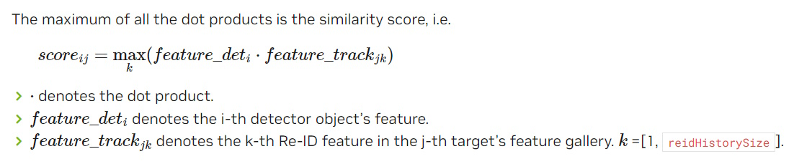
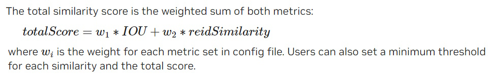
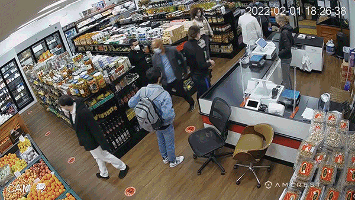
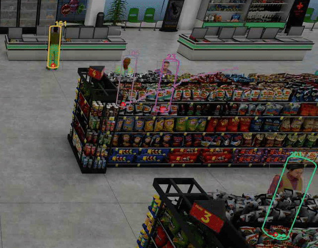
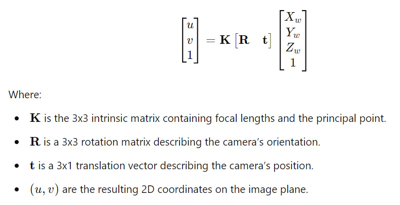

# Part 2: Advanced Features and Applications of NvMultiObjectTracker

## 7. Object Re-Identification

Object Re-Identification (Re-ID) is a crucial feature in multi-object tracking that enables the consistent tracking of objects across multiple frames, even when they temporarily leave the camera's field of view or are occluded. In the context of NVIDIA's DeepStream SDK, using the `NvMultiObjectTracker` library, Re-ID helps maintain object identity, ensuring that the same object is tracked with the same ID throughout the video. This section delves into the mechanics of Re-ID, how it works, and provides an example to illustrate its practical application.

### 7.1 Key Concepts of Object Re-Identification

1. **Re-ID Feature Extraction**:
   - **Re-ID Features**: Unique feature vectors are extracted from detected objects using a deep neural network (such as ResNet-50). These vectors are designed to be robust against spatial and temporal variations, as well as occlusions, ensuring that the identity of the object is maintained even as its appearance changes.
   - **Process**:
     - The detected objects are cropped from the video frame and resized according to the input size required by the Re-ID network.
     - The network processes these cropped images and generates a fixed-dimensional vector (feature vector) representing each object.

2. **Re-ID Feature Gallery**:
   - Each tracked object, or target, maintains a gallery of its most recent Re-ID features. This gallery serves as a memory bank, holding the object's past appearances to facilitate future re-identification.
   - **`reidHistorySize`**: This parameter determines the number of Re-ID features stored in the gallery for each target, helping to strike a balance between memory usage and re-identification accuracy.

3. **Cosine Similarity for Matching**:
   - When a new object is detected, the Re-ID system uses cosine similarity to measure the similarity between the object's current feature vector and those stored in the target's gallery.
   - The cosine similarity score is computed by taking the dot product of the new object's feature vector with each feature vector in the target's gallery. The highest dot product value, representing the closest match, is used as the similarity score.

4. **Matching Process**:
   - The Re-ID similarity score is calculated for each existing target whenever a new object is detected. If the score exceeds a predefined threshold, the object is associated with the matching target, maintaining its identity across frames.

5. **Spatial-Temporal Constraint**:
   - If a tracked object disappears from the frame for an extended period (beyond the `maxShadowTrackingAge`), the tracker might assign a new ID to the object even if its Re-ID features match those in the gallery. This helps prevent errors when objects re-enter the frame after a significant time lapse.

### 7.2 Formula of Similarity Score

This formula explains how the similarity score between a detected object and a tracked object is calculated using Re-Identification (Re-ID) features. Here's a brief breakdown:
- **Dot Product**: The formula calculates the dot product between the feature vector of the detected object (`feature_det_i`) and each feature vector in the target's Re-ID feature gallery (`feature_track_jk`).
- **Maximum Similarity**: The maximum value among these dot products is chosen as the similarity score (`score_ij`), indicating how closely the detected object matches the tracked target based on appearance.
- **Re-ID Feature Gallery**: The gallery holds multiple Re-ID features for a target, allowing the tracker to compare the detected object against recent appearances of the target.

### 7.3 Example Scenario

To better understand the Re-ID process, consider the following example:

#### Scenario: Tracking a Shopper in a Mall

- **Initial Detection**: 
  - A shopper, Person A, is detected entering a shopping mall. A feature vector (`feature_det1`) is extracted from the detected bounding box of Person A using the Re-ID network.

- **Building the Re-ID Feature Gallery**:
  - The tracker creates a new target for Person A and stores `feature_det1` in the Re-ID feature gallery associated with this target.

- **Tracking Over Multiple Frames**:
  - As Person A moves through the mall, they are detected in multiple subsequent frames. Each time, a new feature vector is extracted and added to the gallery.
  - If `reidHistorySize` is set to 3, the gallery might look like this after a few frames: `{feature_track1, feature_track2, feature_track3}`.

- **Temporary Loss of Visual Contact**:
  - Person A enters a store, temporarily leaving the camera’s view. During this period, the tracker cannot detect the person and relies on shadow tracking.

- **Reappearance and Re-Identification**:
  - Person A leaves the store and re-enters the camera's field of view. A new feature vector (`feature_det4`) is extracted and compared with the existing gallery.
  - The cosine similarity between `feature_det4` and the vectors in the gallery is calculated, with scores as follows:
    - score1 = feature_det4 ⋅ feature_track1 = 0.92
    - score2 = feature_det4 ⋅ feature_track2 = 0.88
    - score3 = feature_det4 ⋅ feature_track3 = 0.94

  - The highest score (0.94) is chosen, confirming a strong match between the new detection and the existing target. Person A is correctly re-identified and continues to be tracked with the same ID.

- **Handling Extended Absence**:
  - If Person A had stayed in the store too long, exceeding the `maxShadowTrackingAge`, the tracker might have assigned a new ID upon reappearance, even if the Re-ID features matched those in the gallery.

## 8. Target Re-Association

Target Re-Association is a vital process in multi-object tracking that significantly enhances the robustness of tracking systems, especially in scenarios where objects are temporarily lost due to occlusions or other challenges. This feature ensures that objects maintain their identity over time, even if they disappear from view and later reappear in the scene. This section explains the key concepts and workings of target re-association, illustrated with a practical example.

### 8.1 Key Concepts of Target Re-Association

1. **Tracklet Prediction**:
   - **Definition**: Tracklet prediction involves forecasting the movement of a target when it is temporarily not detected (e.g., due to occlusion). This predicted path, known as a "tracklet," is stored in an internal database for future reference.
   - **Significance**: Tracklet prediction is crucial because if the object reappears later, the system can use this predicted path to re-associate the object with its previous identity, ensuring continuous tracking.

2. **Re-ID Feature Extraction**:
   - **Definition**: Before an object is lost, the system extracts a unique feature vector (Re-ID feature) from the object using a deep neural network. This vector is stored in a gallery, enabling the system to recognize and re-identify the object when it reappears.
   - **Significance**: Re-ID features are critical for maintaining object identity across frames, even if the object’s appearance changes due to factors like different angles or lighting conditions.

3. **Target ID Acquisition**:
   - **Definition**: When a new object is detected, the system checks if it matches any of the stored tracklets. If a match is found, the new detection is associated with the existing target, preserving its original ID.
   - **Significance**: This process prevents the system from assigning a new ID to an object that was temporarily lost, thereby avoiding ID switches and maintaining consistent tracking.

4. **Tracklet Matching**:
   - **Definition**: Tracklet matching involves comparing the newly detected object with the stored tracklets based on motion similarity (using Intersection Over Union, IOU) and Re-ID similarity (using cosine similarity).
   - **Significance**: By combining both motion and appearance information, the system can accurately re-associate objects, even in complex scenarios where objects may change appearance or move unpredictably.

5. **Tracklet Fusion**:
   - **Definition**: Once a new detection is successfully matched with a predicted tracklet, the two are merged into a single, continuous trajectory.
   - **Significance**: Tracklet fusion ensures that the object’s tracking history remains smooth and uninterrupted, even after periods of occlusion.

### 8.2 Total Similarity Score

The equation provided explains how the total similarity score between a detected object and an existing target is calculated in a multi-object tracking system, specifically in NVIDIA's DeepStream SDK using the `NvMultiObjectTracker` library.

### Explanation:

- **Total Similarity Score**: This score is a key metric used to decide whether a newly detected object matches an existing target (i.e., whether they are the same object). The total score is calculated as a weighted sum of two different metrics: Intersection Over Union (IOU) and Re-ID similarity.

- **IOU (Intersection Over Union)**: 
  - IOU measures how much the bounding box of the detected object overlaps with the bounding box of the existing target. A higher IOU indicates a better spatial match between the detected object and the target.
  
- **Re-ID Similarity**: 
  - This metric measures the similarity between the Re-ID (re-identification) features of the detected object and the target. Re-ID features are unique descriptors that capture the appearance of an object, allowing the system to recognize the same object even if it has moved or changed its orientation.

- **Weights (\(w_1\) and \(w_2\))**:
  - The weights \(w_1\) and \(w_2\) allow the system to give different importance to the IOU and Re-ID similarity metrics when calculating the total similarity score. These weights can be configured in the system's settings (config file) based on the specific tracking requirements.
  
- **Thresholds**:
  - The system may also use thresholds for each similarity metric and for the total score. If the total similarity score exceeds a certain threshold, the system considers the detected object and the target to be a match (i.e., they are the same object).

### 8.3 Example Scenario

To illustrate how target re-association works in practice, consider the following example:

#### Scenario: Tracking a Person in a Crowded Area

1. **Initial Detection and Tracking**:
   - A person, referred to as Person A, is detected and tracked as they move through a crowded area. The system continuously updates Person A’s position and Re-ID features.

2. **Partial Occlusion**:
   - Person A moves behind a group of people, temporarily disappearing from the system’s view. The system creates a predicted tracklet based on Person A’s last known trajectory and stores the Re-ID features in a gallery.

3. **Tracklet Prediction**:
   - While Person A is occluded, the system predicts their movement using the stored tracklet. This predicted path remains in the database, awaiting Person A’s reappearance.

4. **Person A Reappears**:
   - After a short while, Person A re-emerges from behind the group. The system detects a new object that closely resembles Person A but must confirm whether it is indeed the same individual.
   - The system compares the new detection’s motion (IOU) and Re-ID features with the stored tracklet and feature gallery.

5. **Tracklet Matching**:
   - The system finds a high IOU score between the new detection and the predicted tracklet, along with a high cosine similarity score between the Re-ID features. This strong match indicates that the new detection is likely Person A.
   - The system re-associates the new detection with Person A's original ID, ensuring that the tracking continues seamlessly.

6. **Tracklet Fusion**:
   - The predicted tracklet and the new detection are merged into a single, continuous trajectory. The system resumes tracking Person A with the same ID, smoothly integrating the period of occlusion.

## 9. Bounding-Box Unclipping

Bounding-box unclipping is an advanced feature in object tracking that helps to maintain the accuracy and consistency of a tracked object's bounding box as it approaches and partially exits the camera's field of view (FOV).

### 9.1 The Challenge:

- **Partial Visibility Issue**: As an object moves towards the edge of the camera's FOV, the bounding box that encompasses it might only capture a portion of the object, leading to tracking inaccuracies. This situation typically arises when the object starts to leave the frame, causing the system to lose sight of parts of the object.

### 9.2 The Solution - Bounding-Box Unclipping:

- **What is Unclipping?**: Bounding-box unclipping allows the tracking system to maintain the full size of the bounding box around an object, even when parts of the object are no longer visible within the frame. This is possible because the system uses the last known full size of the object to predict and extend the bounding box beyond the frame’s boundaries as the object begins to exit the view.
- **How to Enable**: This feature is activated by setting `enableBboxUnClipping: 1` in the TargetManagement module of the low-level configuration file. When enabled, the tracker uses the last visible full bounding box dimensions to estimate the position and size of the object as it moves out of the FOV.

### 9.3 Example Scenario: Tracking a Car Leaving the Frame

Let’s consider a practical example to illustrate how bounding-box unclipping works.

1. **Initial Full Visibility**:
   - Suppose you are tracking a car driving towards the right edge of the camera's view. Initially, the car is fully visible, and the bounding box accurately encompasses the entire vehicle.

2. **Partial Visibility**:
   - As the car continues to move towards the right, it begins to exit the frame. At this point, only a portion of the car, such as the front half, remains visible within the camera’s FOV. If unclipping is not used, the bounding box might incorrectly shrink to fit the visible part of the car, potentially leading to tracking errors.

3. **Bounding-Box Unclipping**:
   - With bounding-box unclipping enabled, the system detects that the car is partially out of the frame. Since it has prior knowledge of the car’s full size from when it was fully visible, the tracker continues to estimate and maintain the full bounding box size, even though part of the car is no longer visible. The bounding box effectively extends beyond the edge of the frame.

4. **Continued Accurate Tracking**:
   - As the car fully exits the frame, the tracker maintains the estimated full bounding box size, ensuring that the car’s position and size are accurately tracked until it is completely out of view. This prevents the tracker from prematurely shrinking or misaligning the bounding box.

## 10. Single-View 3D Tracking (SV3DT)

**Single-View 3D Tracking (SV3DT)** is an advanced feature designed to significantly enhance the accuracy and reliability of object tracking, especially in scenarios involving partial occlusions. Partial occlusions occur when an object is partially blocked by another object, making it challenging for traditional 2D trackers to maintain accurate bounding boxes and correctly identify the object over time.

### 10.1 The Challenge of Partial Occlusions

When an object becomes partially occluded:
- **Bounding Box Inaccuracy**: The detected bounding box might only capture the visible portion of the object, leading to inaccuracies in the tracking process.
- **Attribute Changes**: Attributes of the bounding box, such as its location, size, and aspect ratio, can change abruptly due to the occlusion, which can disrupt the tracking process.
- **Visual Appearance Changes**: The appearance within the bounding box may be significantly altered, causing difficulties for trackers that rely on appearance-based features like Re-ID embeddings.

These challenges often lead to **tracking failures**, where the system might lose track of the object or incorrectly assign a new ID, leading to frequent ID switches.

### 10.2 The Solution: Single-View 3D Tracking (SV3DT)

**SV3DT** addresses these challenges by tracking objects in a 3D world coordinate system rather than just in the traditional 2D image plane. This method requires two key pieces of information for each video stream:
1. **3x4 Projection Matrix**: This matrix transforms 3D coordinates from the real world into 2D coordinates on the camera’s image plane.
2. **3D Model Information**: For tracking humans, a cylindrical model representing the human body is used, with parameters like height and radius provided.

#### How SV3DT Works:

1. **Fitting the 3D Model**:
   - SV3DT fits a cylindrical 3D model of a human to each detected bounding box.
   - Even if the person is partially occluded, SV3DT uses the top edge of the bounding box as an anchor to align the 3D model accurately.

2. **Recovering the Full Bounding Box**:
   - Once the 3D model is fitted, SV3DT estimates the full-body bounding box, as if the person were not occluded at all.
   - This recovered bounding box is then used for tracking, ensuring that the bounding box attributes remain consistent even during periods of partial occlusion.

3. **Tracking in 3D**:
   - The system tracks the "foot location" of the person within the 3D world ground plane. This foot location, which is the center of the base of the cylindrical model, provides a more stable reference point for tracking.
   - By focusing on the foot location, SV3DT maintains accurate tracking even when parts of the object are partially or fully occluded.

4. **Additional Output Data**:
   - SV3DT can output additional data such as:
     - **Visibility**: The ratio between the visible part of the object and the full-body estimate.
     - **Foot Location**: The position of the foot both in the 3D world and the 2D image.
     - **Convex Hull**: The projected 3D model on the 2D image plane, which can be used for further analysis or visualization.

### 10.3 Example Scenario: Tracking a Person in a Crowded Area

Imagine you are tracking a person walking through a crowded area. As they move, other people occasionally block parts of their body, leading to partial occlusions.

1. **Without SV3DT**:
   - The tracker might lose track of the person or shrink the bounding box to fit only the visible portion, which can result in ID switches or tracking failures.

2. **With SV3DT**:
   - As the person becomes partially occluded, SV3DT uses the 3D model to estimate the full-body bounding box, maintaining the correct bounding box size and location.
   - The tracker can continue to accurately track the person’s movement even when parts of their body are temporarily hidden from view.
   - The foot location in the 3D world coordinate system provides a stable reference for continuous tracking.

#### Implementation Details:

To enable SV3DT, the following configurations are necessary:

- **Camera Information File**: This file (e.g., `camInfo-01.yml`) includes the 3x4 projection matrix and the 3D model info, such as the height and radius of the cylindrical model.
- **State Estimator Configuration**: Set the state estimator to type `3` (Simple Location Kalman Filter), which is ideal for 3D tracking scenarios.
- **Object Model Projection Section**: In the tracker configuration file, specify the camera model filepath and enable outputs like visibility and foot location.

### 10.4 Benefits of SV3DT:

SV3DT enhances tracking accuracy and robustness, especially in environments with frequent partial occlusions. By tracking objects in a 3D world coordinate system and using a 3D model, SV3DT reduces tracking failures and ID switches, making it particularly useful for applications such as surveillance, crowd monitoring, and other scenarios where reliable tracking is crucial.

### 10.5 Understanding the 3x4 Camera Projection Matrix

The **3x4 Camera Projection Matrix** is essential in computer vision for converting 3D world points into 2D image points. This matrix is crucial in applications where a 3D scene needs to be interpreted and projected onto a 2D camera image plane, as seen in the **pinhole camera model**.

#### The Pinhole Camera Model:

- **3D to 2D Conversion**: 
  - **P = (X_w, Y_w, Z_w)** represents a point in the 3D world coordinates.
  - **(u, v)** represents the corresponding 2D point on the camera image plane.
  - The camera uses a 3x4 matrix to project the 3D point onto the 2D plane, creating the image we see.

#### The 3x4 Camera Projection Matrix:

- The **3x4 camera matrix** transforms a 3D world point into a 2D image point by considering both intrinsic properties (like focal length) and extrinsic properties (like the camera’s position and orientation).
  
- The transformation is mathematically expressed as:

&nbsp;&nbsp;&nbsp;&nbsp;&nbsp;&nbsp;&nbsp;&nbsp;&nbsp;&nbsp;

#### Principal Point and Optical Center:

- **Principal Point (C_x, C_y)**: The point where the optical axis intersects the image plane, typically considered the center of the image.
  
- **Translation Considerations**:
  - In some contexts, the principal point is considered to be at the top-left corner of the image (pixel coordinates with the origin at the top-left).
  - If the projection matrix already includes this translation, **`projectionMatrix_3x4_w2p`** is used.
  - If not, **`projectionMatrix_3x4`** is used, and the system internally adds the image center offset (img_width/2,img_height/2).

#### Example Scenario: Calibration and Use in Object Tracking

1. **Calibration**:
   - During camera setup, you calibrate the camera using a known 3D calibration object (like a checkerboard). This process provides the intrinsic matrix 𝐾 and extrinsic parameters 𝑅 and 𝑡, which form the 3x4 camera projection matrix.

2. **Using the Matrix for Object Tracking**:
   - As a person moves through the scene, the camera captures their movement, and the system uses the 3x4 matrix to project the person’s 3D position onto the 2D camera image.
   - If the camera matrix doesn’t account for the translation of the principal point, the system adjusts internally to ensure accurate representation of the person’s 3D position on the 2D image.

3. **Application in 3D Tracking**:
   - When implementing **Single-View 3D Tracking (SV3DT)**, this projection matrix is critical. It ensures that even when parts of a person are occluded, their position can still be accurately tracked based on the 3D-to-2D transformation.

## 11. Conclusion

### Summary of Key Takeaways

The exploration of **NvMultiObjectTracker** throughout these two parts has highlighted its significant role in advancing the field of multi-object tracking within computer vision applications. Here's a brief recap of the essential concepts and features covered:

1. **NvMultiObjectTracker Overview**: We began by understanding the basics of multi-object tracking, recognizing its importance in various computer vision tasks such as surveillance, autonomous driving, and video analytics. The **NvMultiObjectTracker** was introduced as a powerful tool integrated within NVIDIA's DeepStream SDK, offering a robust and flexible framework for tracking multiple objects across video frames.

2. **Unified Tracker Architecture**: The core architecture of NvMultiObjectTracker is designed with modularity and flexibility in mind. This composable architecture allows for easy integration of various tracking algorithms and components, enabling developers to customize and optimize their tracking pipelines according to specific needs.

3. **Core Modules and Workflow**: We delved into the workflow and core modules that drive the NvMultiObjectTracker. Key processes like data association, target management, and state estimation were discussed in detail, highlighting their roles in maintaining accurate and consistent tracking across multiple frames.

4. **Advanced Features**: The advanced capabilities of NvMultiObjectTracker were explored, including Object Re-Identification (Re-ID), Target Re-Association, Bounding-Box Unclipping, and Single-View 3D Tracking (SV3DT). These features address complex challenges in tracking, such as handling occlusions, maintaining object identity over time, and improving tracking accuracy in dynamic environments.

5. **Practical Applications**: Throughout the discussion, various practical applications and use cases were presented, illustrating how NvMultiObjectTracker can be employed in real-world scenarios. From surveillance systems that need to track people across multiple cameras to autonomous vehicles navigating through crowded streets, the versatility and reliability of NvMultiObjectTracker make it a critical component in many cutting-edge technologies.

### Integration with Emerging Technologies and Applications

As the landscape of computer vision and artificial intelligence continues to evolve, the role of multi-object tracking becomes increasingly crucial. **NvMultiObjectTracker** is well-positioned to integrate seamlessly with emerging technologies, offering several exciting possibilities:

1. **Integration with AI and Machine Learning**: The deep learning models that power Object Re-Identification and other advanced features are continuously improving. As these models become more sophisticated, NvMultiObjectTracker will benefit from enhanced accuracy and efficiency, making it even more effective in demanding environments.

2. **Real-time Analytics and Edge Computing**: With the rise of edge computing and real-time analytics, the ability to perform efficient and accurate multi-object tracking on the edge is becoming a necessity. NvMultiObjectTracker's integration with NVIDIA’s hardware accelerators, such as GPUs and Jetson devices, makes it a perfect fit for edge deployments where low latency and high performance are required.

3. **Smart Cities and IoT**: In the context of smart cities, multi-object tracking is essential for monitoring traffic, ensuring public safety, and managing resources efficiently. NvMultiObjectTracker, combined with IoT devices and smart sensors, can provide the backbone for real-time monitoring systems that enhance urban living.

4. **Extended Reality (XR) and 3D Applications**: As technologies like augmented reality (AR), virtual reality (VR), and mixed reality (MR) continue to grow, the need for accurate tracking in 3D space becomes more prominent. The Single-View 3D Tracking (SV3DT) feature of NvMultiObjectTracker offers a promising solution for these applications, enabling seamless interaction with virtual environments.

### Final Thoughts

The **NvMultiObjectTracker** is a powerful and versatile tool that addresses many of the challenges inherent in multi-object tracking. Its integration within the DeepStream SDK and its ability to leverage NVIDIA’s hardware acceleration make it an invaluable resource for developers working in computer vision, AI, and related fields.

As technology advances and the demands for real-time, accurate, and robust tracking continue to grow, NvMultiObjectTracker is poised to play a central role in a wide array of applications. Whether it's in autonomous systems, smart cities, or next-generation entertainment experiences, the features and capabilities discussed in these chapters will ensure that NvMultiObjectTracker remains at the forefront of innovation in multi-object tracking.

By understanding and leveraging the full potential of NvMultiObjectTracker, developers can create more intelligent, responsive, and reliable systems, paving the way for new advancements in how we interact with and understand the world around us.
