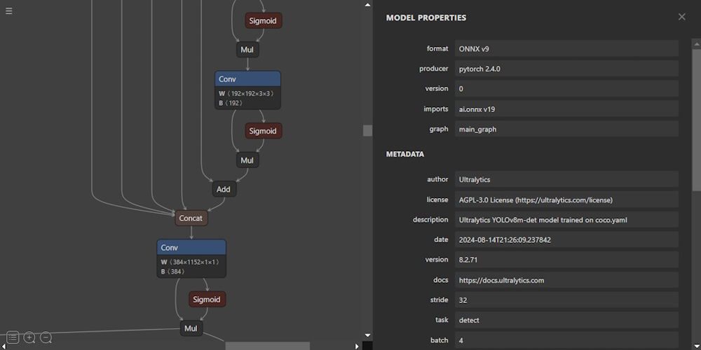

# ONNX: Dynamic Batch and Shape Handling in PyTorch Model Export

## Introduction to ONNX

The **Open Neural Network Exchange (ONNX)** is an open-source format designed to provide interoperability between different deep learning frameworks. Developed by Microsoft and Facebook, ONNX has quickly become a standard in the AI and machine learning community due to its ability to represent machine learning models in a format that can be easily transferred and used across various platforms and devices.



Key features of ONNX include:

1. **Computation Graph Model**: ONNX uses a Directed Acyclic Graph (DAG) structure to represent the model's computation flow. Each node in the graph represents an operation (operator), and the edges represent the data (tensors) flowing between these operations.

2. **Operators**: ONNX defines a comprehensive set of built-in operators that cover a wide range of functionalities, from basic mathematical operations to complex neural network layers.

3. **Data Types**: ONNX supports various data types, such as `float`, `int`, and `string`, ensuring compatibility across different frameworks.

4. **Model Metadata**: Each ONNX model includes metadata describing the model's structure, including input and output tensor shapes, data types, and other necessary information for correct interpretation.

5. **Serialization Format**: ONNX models are serialized using Protocol Buffers (protobuf), providing a compact and efficient way to store and share models across different platforms.

6. **Versioning and Compatibility**: ONNX includes a versioning system to ensure backward compatibility, allowing models created with older versions to be used with newer versions of the format.

7. **Execution Providers**: ONNX Runtime supports multiple execution providers, optimizing model inference on various hardware platforms, such as CPUs, GPUs, and specialized accelerators.

8. **Extensibility**: ONNX is designed to be extensible, allowing developers to define custom operators and data types as needed.

## Dynamic Batch and Shape Feature in ONNX

One of the powerful features of ONNX is its support for dynamic batching and dynamic input shapes. In many real-world applications, the input data may vary in size, such as images with different resolutions or variable batch sizes. ONNX allows you to define certain dimensions of the input and output tensors as dynamic, meaning they can change at runtime.

**Dynamic Axes**: The `dynamic_axes` parameter in the `torch.onnx.export()` function allows you to specify which dimensions of the input and output tensors should be treated as dynamic. This is particularly useful for creating models that can handle inputs of varying sizes without requiring a fixed input shape.

## Exporting ONNX Models in PyTorch: Step-by-Step Examples

Let's dive into three examples of how to export PyTorch models to ONNX format, focusing on different scenarios where dynamic axes are used.

### Example 1: Simple CNN Model with Dynamic Batch Size

In this example, we'll export a simple CNN model where the batch size is dynamic, meaning the model can process varying numbers of images in a batch.

```python
import torch

# Assume the model is already defined and trained
# model = YourModel()

# Set the model to evaluation mode
model.eval()

# Define the example input tensor
dummy_input = torch.randn(1, 3, 640, 640)

# Export the model
torch.onnx.export(
    model,                     # The model to be exported
    dummy_input,               # Example input tensor
    "simple_cnn.onnx",         # File name to save the ONNX model
    export_params=True,        # Store the trained parameters in the model file
    opset_version=11,          # The ONNX version to export the model to (11 is commonly used)
    do_constant_folding=True,  # Whether to execute constant folding for optimization
    input_names=['input'],     # Names of the model's input tensors
    output_names=['output'],   # Names of the model's output tensors
    dynamic_axes={'input': {0: 'batch_size'},  # Support dynamic batching
                  'output': {0: 'batch_size'}}
)
```

**Explanation**:
- **Input Shape**: The input tensor has a fixed shape of `(1, 3, 640, 640)`, representing a batch size of 1, 3 channels (RGB), and an image resolution of 640x640.
- **Dynamic Batch Size**: The `dynamic_axes` parameter specifies that the batch size dimension (0) of both the input and output tensors is dynamic. This means the model can handle any batch size at runtime, making it more flexible for different deployment scenarios.

### Example 2: Model with Multiple Outputs and Dynamic Batch Size

In this example, we export a model that has multiple outputs: `bbox`, `objectness`, and `object-category`. The batch size is dynamic, allowing the model to process varying numbers of images in a batch.

```python
import torch

# Assume the model is already defined and trained
# model = YourModel()

# Set the model to evaluation mode
model.eval()

# Define the example input tensor
dummy_input = torch.randn(1, 3, 640, 640)

# Export the model to ONNX
torch.onnx.export(
    model,                                    # The trained model to be exported
    dummy_input,                              # Example input tensor
    "model_with_three_outputs.onnx",          # The name of the output ONNX file
    export_params=True,                       # Store the trained parameters in the model file
    opset_version=11,                         # The ONNX version to export the model to
    do_constant_folding=True,                 # Whether to execute constant folding for optimization
    input_names=['input'],                    # The name of the input tensor
    output_names=[
        'bbox', 'objectness', 'object-category'
    ],                                        # The names of the output tensors
    dynamic_axes={
        'input': {0: 'batch_size'},           # Dynamic batch size for input
        'bbox': {0: 'batch_size'},            # Dynamic batch size for bbox output
        'objectness': {0: 'batch_size'},      # Dynamic batch size for objectness output
        'object-category': {0: 'batch_size'}  # Dynamic batch size for object-category output
    }
)
```

**Explanation**:
- **Multiple Outputs**: This model has three outputs: bounding boxes (`bbox`), objectness scores (`objectness`), and object categories (`object-category`).
- **Dynamic Batch Size**: The `dynamic_axes` parameter ensures that the batch size is dynamic for both the input and all three outputs. This flexibility is crucial for models that need to handle varying amounts of data, such as in real-time object detection tasks.

### Example 3: Model with Dynamic Batch Size, Height, and Width

In this final example, we export a model where not only the batch size but also the height (H) and width (W) of the input images are dynamic. This is useful for models that need to process images of varying resolutions.

```python
import torch

# Assume the model is already defined and trained
# model = YourModel()

# Set the model to evaluation mode
model.eval()

# Define the example input tensor (use arbitrary values, actual values don't matter for dynamic axes)
dummy_input = torch.randn(1, 3, 640, 640)  # Example input, N=1, C=3, H=640, W=640

# Export the model to ONNX with dynamic N, H, and W dimensions
torch.onnx.export(
    model,                          # The trained model to be exported
    dummy_input,                    # Example input tensor
    "model_with_dynamic_nhw.onnx",  # The name of the output ONNX file
    export_params=True,             # Store the trained parameters in the model file
    opset_version=11,               # The ONNX version to export the model to
    do_constant_folding=True,       # Whether to execute constant folding for optimization
    input_names=['input'],          # The name of the input tensor
    output_names=['bbox', 'objectness', 'object-category'],   # The names of the output tensors
    dynamic_axes={
        'input': {0: 'batch_size', 2: 'height', 3: 'width'},  # Dynamic N, H, W
        'bbox': {0: 'batch_size'},                            # Dynamic batch size for bbox output
        'objectness': {0: 'batch_size'},                      # Dynamic batch size for objectness output
        'object-category': {0: 'batch_size'}                  # Dynamic batch size for object-category output
    }
)
```

**Explanation**:
- **Dynamic N, H, W**: In this example, not only is the batch size (N) dynamic, but the height (H) and width (W) of the input images are also dynamic. This allows the model to handle inputs of different resolutions and varying batch sizes, making it extremely versatile for various real-world applications.
- **Dynamic Outputs**: The outputs are also configured with dynamic batch sizes to match the input's batch size. If the model architecture allows, you could similarly mark the height and width dimensions of the outputs as dynamic.

## Conclusion

ONNX provides a powerful and flexible format for exporting machine learning models, ensuring interoperability across different frameworks and platforms. By utilizing features like dynamic batching and dynamic input shapes, developers can create models that are more adaptable and robust in real-world scenarios. The examples provided demonstrate how to leverage these features in PyTorch, making it easy to deploy models that can handle a variety of input conditions without sacrificing performance or accuracy.

