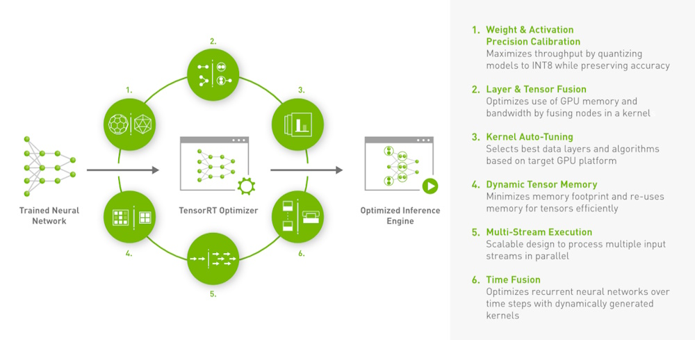

# Introduction to TensorRT Capabilities

## TensorRT Capabilities

TensorRT is NVIDIA's high-performance deep learning inference library, designed to optimize and accelerate the deployment of neural network models on NVIDIA GPUs. It is widely used across industries, from autonomous vehicles to healthcare, to deliver low-latency, high-throughput inference. Below are the key capabilities of TensorRT, explained with examples in C++ where applicable.



### 1. Tensors and Data Formats

In TensorRT, tensors are represented as multidimensional C-style arrays. Each layer in a neural network has a specific interpretation of these tensors. For instance, a 2D convolution layer expects its input tensor in the `CHW` format, where `C` stands for the number of channels, `H` for height, and `W` for width. TensorRT internally optimizes data formats to leverage the fastest CUDA kernels, but at the I/O boundaries (input/output of the network), the format is exposed to minimize unnecessary format transformations.

**Example:**

When defining a network in TensorRT, you would typically deal with tensors in the CHW format for convolutional layers:

```cpp
// Assuming network is already created

nvinfer1::ITensor* inputTensor = network->addInput("input", nvinfer1::DataType::kFLOAT, nvinfer1::Dims3{3, 224, 224});
auto convLayer = network->addConvolutionNd(*inputTensor, 64, nvinfer1::DimsHW{7, 7}, kernelWeights, biasWeights);
convLayer->setStrideNd(nvinfer1::DimsHW{2, 2});
convLayer->setPaddingNd(nvinfer1::DimsHW{3, 3});
```

In this example, `inputTensor` is defined with dimensions 3x224x224, corresponding to the `CHW` format.

### 2. Dynamic Shapes

TensorRT allows for dynamic input shapes, meaning the model can be optimized for a range of input dimensions rather than a fixed size. This is particularly useful when deploying models that need to handle inputs of varying sizes. 

**Example:**

To support dynamic shapes, you define an `OptimizationProfile`:

```cpp
nvinfer1::IBuilder* builder = nvinfer1::createInferBuilder(gLogger);
nvinfer1::INetworkDefinition* network = builder->createNetworkV2(0);
nvinfer1::IBuilderConfig* config = builder->createBuilderConfig();

nvinfer1::IOptimizationProfile* profile = builder->createOptimizationProfile();
profile->setDimensions("input", nvinfer1::OptProfileSelector::kMIN, nvinfer1::Dims4{1, 3, 224, 224});
profile->setDimensions("input", nvinfer1::OptProfileSelector::kOPT, nvinfer1::Dims4{8, 3, 512, 512});
profile->setDimensions("input", nvinfer1::OptProfileSelector::kMAX, nvinfer1::Dims4{16, 3, 1024, 1024});
config->addOptimizationProfile(profile);
```

Here, the optimization profile specifies that the input tensor's dimensions can vary, with the optimizer selecting CUDA kernels that work best for the provided range.

### 3. Deep Learning Accelerator (DLA)

TensorRT supports NVIDIA's Deep Learning Accelerator (DLA), a dedicated hardware block for inference in embedded systems. DLA can be used to offload certain layers, allowing the GPU to focus on more complex tasks.

**Example:**

To direct a particular layer to run on the DLA:

```cpp
auto convLayer = network->addConvolutionNd(*inputTensor, 64, nvinfer1::DimsHW{3, 3}, kernelWeights, biasWeights);
convLayer->setDLA(true); // This will run the layer on DLA if supported
```

### 4. Updating Weights

TensorRT allows for dynamic updating of model weights after the engine is built. This is useful in scenarios like reinforcement learning, where model weights are frequently updated.

**Example:**

Using the `Refitter` interface, you can update the weights of a pre-built engine:

```cpp
nvinfer1::IRuntime* runtime = nvinfer1::createInferRuntime(gLogger);
nvinfer1::ICudaEngine* engine = runtime->deserializeCudaEngine(serializedEngine, size, nullptr);
nvinfer1::IRefitter* refitter = nvinfer1::createRefitter(*engine, gLogger);

// Update weights
refitter->setWeights("conv1", nvinfer1::Weights{nvinfer1::DataType::kFLOAT, newWeights, newWeightsSize});

// Refit the engine
refitter->refitCudaEngine();
```

### 5. Streaming Weights

TensorRT can stream model weights from host memory to device memory during execution, which is beneficial for models with weights larger than the available GPU memory. This feature is opt-in and can introduce latency, so it's best used when memory constraints are a critical concern.

**Example:**

Enable weight streaming during engine building:

```cpp
config->setFlag(nvinfer1::BuilderFlag::kWEIGHT_STREAMING);
```

And during runtime:

```cpp
engine->setWeightStreamingBudgetV2(weightStreamingBudget);
```

### 6. trtexec Tool

TensorRT provides the `trtexec` command-line tool to benchmark networks, generate serialized engines, and create timing caches. This tool is invaluable for quickly testing models without writing code.

**Example:**

Running inference with `trtexec`:

```bash
trtexec --onnx=model.onnx --explicitBatch --optShapes=input:1x3x224x224 --saveEngine=model.engine
```

### 7. Polygraphy Toolkit

Polygraphy is a versatile toolkit for debugging and comparing models across frameworks like TensorRT and ONNX Runtime. It supports model conversion, inference, and result comparison, making it a powerful tool for developers working with deep learning models.

**Example:**

Comparing model outputs across TensorRT and ONNX Runtime:

```bash
polygraphy run model.onnx --trt --onnxrt --compare-output
```


## Using the TensorRT Refitter

The TensorRT Refitter is a powerful tool that allows you to update the weights of a pre-built and optimized TensorRT engine without needing to rebuild the entire engine from scratch. This feature is particularly useful in scenarios where you have a fixed network structure but need to update the model's weights frequently, such as in reinforcement learning or during fine-tuning of a model.

### How the Refitter Works

When you create an engine in TensorRT, it is optimized for a specific set of weights and inputs. If the weights change, the engine may need to be re-optimized. The Refitter provides a way to update these weights in the already-built engine and re-optimize the necessary parts without having to rebuild the entire engine, saving time and resources.

#### Steps to Use the Refitter

Here is a step-by-step guide on how to use the TensorRT Refitter in C++:

1. **Create and Serialize the Engine**: First, you create an engine using the TensorRT builder and serialize it to disk. This is done just like you would normally do when using TensorRT.

2. **Deserialize the Engine**: When you need to update the weights, you start by deserializing the engine from disk.

3. **Create the Refitter**: You create a refitter object, passing it the deserialized engine.

4. **Update Weights**: Use the refitter to update the weights of the layers. You need to specify the layer name and provide the new weights.

5. **Refit the Engine**: After updating the weights, you invoke the refitter to apply these changes and optimize the engine accordingly.

6. **Use the Updated Engine**: The engine is now ready to be used for inference with the new weights.

#### Example Code

Below is an example in C++ that demonstrates the usage of the TensorRT Refitter.

```cpp
#include "NvInfer.h"
#include "NvInferRuntime.h"
#include "NvOnnxParser.h"
#include "NvInferRefitter.h"
#include <iostream>
#include <fstream>

class Logger : public nvinfer1::ILogger
{
    void log(Severity severity, const char* msg) noexcept override
    {
        // suppress info-level messages
        if (severity != Severity::kINFO)
            std::cout << msg << std::endl;
    }
} gLogger;

int main()
{
    // Step 1: Deserialize the existing engine
    std::ifstream engineFile("model.engine", std::ios::binary);
    if (!engineFile.good()) {
        std::cerr << "Error reading engine file." << std::endl;
        return -1;
    }
    engineFile.seekg(0, std::ios::end);
    size_t size = engineFile.tellg();
    engineFile.seekg(0, std::ios::beg);
    std::vector<char> engineData(size);
    engineFile.read(engineData.data(), size);
    engineFile.close();

    nvinfer1::IRuntime* runtime = nvinfer1::createInferRuntime(gLogger);
    nvinfer1::ICudaEngine* engine = runtime->deserializeCudaEngine(engineData.data(), size, nullptr);

    // Step 2: Create a refitter object
    nvinfer1::IRefitter* refitter = nvinfer1::createRefitter(*engine, gLogger);

    // Step 3: Update the weights
    nvinfer1::Weights newWeights{nvinfer1::DataType::kFLOAT, newWeightValues, newWeightSize};
    if (!refitter->setWeights("conv1", nvinfer1::WeightsRole::kKERNEL, newWeights)) {
        std::cerr << "Failed to set new weights for conv1 layer." << std::endl;
        return -1;
    }

    // Step 4: Refit the engine
    if (!refitter->refitCudaEngine()) {
        std::cerr << "Failed to refit the engine with new weights." << std::endl;
        return -1;
    }

    // Step 5: Use the refitted engine for inference
    nvinfer1::IExecutionContext* context = engine->createExecutionContext();
    // Set up input/output buffers and perform inference...
    
    // Clean up
    context->destroy();
    refitter->destroy();
    engine->destroy();
    runtime->destroy();

    return 0;
}
```

#### Explanation of Key Steps

1. **Deserializing the Engine**: This step loads the previously built and serialized engine from a file. This engine represents the model with its original weights.

2. **Creating the Refitter**: The refitter is associated with the engine. This object will handle the weight updates and re-optimization.

3. **Updating Weights**: You use the `setWeights` method of the refitter to update the weights for specific layers. You need to provide the layer name and the new weight data. The weight data must be in the same format and have the same dimensions as the original weights.

4. **Refitting the Engine**: After setting the new weights, the `refitCudaEngine` method applies these changes and re-optimizes the engine.

5. **Using the Updated Engine**: Once refitting is complete, the engine can be used for inference just like before, but with the new weights.

### When to Use the Refitter

- **Frequent Weight Updates**: When your application frequently updates model weights but keeps the network structure unchanged, using the refitter can significantly reduce the time required to apply these updates.
  
- **Retraining and Fine-Tuning**: If you fine-tune your models regularly, the refitter allows you to apply these fine-tuned weights without needing to rebuild the entire engine.

- **Reinforcement Learning**: In reinforcement learning scenarios where the model is updated frequently, the refitter helps in applying these updates efficiently.


## Using Dynamic Shapes in TensorRT

Dynamic shapes in TensorRT allow models to handle varying input sizes during inference, which is particularly useful in applications like image processing where input dimensions can change depending on the context. By default, TensorRT optimizes the model for fixed input shapes, but with dynamic shapes, the engine can be optimized to handle a range of input sizes. This feature is crucial for deploying flexible and robust models in real-world scenarios.

### How Dynamic Shapes Work

Dynamic shapes are managed through **Optimization Profiles** in TensorRT. An optimization profile defines the range of input shapes that the engine should support. For each profile, TensorRT optimizes the model to perform efficiently across the specified range. Steps to use Dynamic Shapes:

#### 1. Create the Network and Define Dynamic Shapes

When creating the network, you define the input tensor with dynamic dimensions. This is done by specifying one or more dimensions as `-1`, indicating that these dimensions can vary.

```cpp
nvinfer1::IBuilder* builder = nvinfer1::createInferBuilder(gLogger);
const auto explicitBatch = 1U << static_cast<uint32_t>(nvinfer1::NetworkDefinitionCreationFlag::kEXPLICIT_BATCH);
nvinfer1::INetworkDefinition* network = builder->createNetworkV2(explicitBatch);

// Define an input tensor with dynamic shape
nvinfer1::ITensor* inputTensor = network->addInput("input", nvinfer1::DataType::kFLOAT, nvinfer1::Dims4{-1, 3, -1, -1});

// Build the rest of the network
// ...
```

In this example, the input tensor has a dynamic batch size and dynamic spatial dimensions (height and width).

#### 2. Create an Optimization Profile

An optimization profile is necessary to define the range of input shapes that the engine should support. For each dimension that is dynamic, you specify a minimum, an optimal, and a maximum size.

```cpp
nvinfer1::IBuilderConfig* config = builder->createBuilderConfig();

nvinfer1::IOptimizationProfile* profile = builder->createOptimizationProfile();

// Define the range for the dynamic shapes
profile->setDimensions("input", nvinfer1::OptProfileSelector::kMIN, nvinfer1::Dims4{1, 3, 224, 224});
profile->setDimensions("input", nvinfer1::OptProfileSelector::kOPT, nvinfer1::Dims4{4, 3, 512, 512});
profile->setDimensions("input", nvinfer1::OptProfileSelector::kMAX, nvinfer1::Dims4{8, 3, 1024, 1024});

// Add the profile to the builder config
config->addOptimizationProfile(profile);
```

Here, the optimization profile specifies:
- **Minimum Shape:** 1x3x224x224 (Batch size 1, 224x224 resolution)
- **Optimal Shape:** 4x3x512x512 (Batch size 4, 512x512 resolution)
- **Maximum Shape:** 8x3x1024x1024 (Batch size 8, 1024x1024 resolution)

TensorRT will create an optimized engine that works efficiently across this range of shapes.

#### 3. Build the Engine

With the network and the optimization profile configured, you can now build the engine.

```cpp
nvinfer1::ICudaEngine* engine = builder->buildEngineWithConfig(*network, *config);
```

This engine can handle the specified range of dynamic input shapes during inference.

#### 4. Using the Engine for Inference with Dynamic Shapes

When running inference, you must set the appropriate input dimensions based on the actual input shape. This is done through the `IExecutionContext` created from the engine.

```cpp
nvinfer1::IExecutionContext* context = engine->createExecutionContext();

// Suppose the actual input has dimensions 2x3x480x480
int batchSize = 2;
context->setBindingDimensions(0, nvinfer1::Dims4{batchSize, 3, 480, 480});

// Allocate buffers and perform inference
void* buffers[2]; // Input and output buffers
// ... (buffer allocation and memory management)
context->enqueueV2(buffers, stream, nullptr);
```

In this example, the actual input tensor has dimensions 2x3x480x480, which falls within the range defined by the optimization profile.

#### 5. Handling Multiple Profiles (Optional)

If your application needs to handle significantly different input shapes (e.g., one profile for small images and another for large ones), you can create and add multiple optimization profiles to the engine.

```cpp
// Create another optimization profile for very large images
nvinfer1::IOptimizationProfile* largeProfile = builder->createOptimizationProfile();
largeProfile->setDimensions("input", nvinfer1::OptProfileSelector::kMIN, nvinfer1::Dims4{1, 3, 1024, 1024});
largeProfile->setDimensions("input", nvinfer1::OptProfileSelector::kOPT, nvinfer1::Dims4{4, 3, 2048, 2048});
largeProfile->setDimensions("input", nvinfer1::OptProfileSelector::kMAX, nvinfer1::Dims4{8, 3, 4096, 4096});
config->addOptimizationProfile(largeProfile);

// Now the engine supports both small and very large input images
```

When running inference, you can select the appropriate profile based on the input shape.

```cpp
context->setOptimizationProfile(0); // Select the first profile
```


## Quantization in TensorRT

Quantization is a technique used to reduce the precision of the numbers representing a model's weights and activations, thereby reducing the model's memory footprint and increasing its inference speed, particularly on hardware like GPUs. In TensorRT, quantization typically involves converting floating-point (FP32) models to lower-precision formats such as INT8 or FP16. This process allows you to deploy models that run faster and consume less power, often with minimal loss in accuracy.

### Types of Quantization in TensorRT

1. **FP16 (Half Precision) Quantization**:
   - FP16 reduces the precision of floating-point numbers from 32 bits to 16 bits.
   - It’s a good middle ground between full precision and integer quantization, offering a balance of speed and accuracy.

2. **INT8 Quantization**:
   - INT8 quantization converts floating-point numbers to 8-bit integers.
   - It offers the highest performance gains, but it requires calibration to ensure the model remains accurate.

### How Quantization Works in TensorRT

Quantization in TensorRT can be applied during the model's build phase. If you choose INT8 quantization, the process typically involves two steps: calibration and inference.

#### 1. FP16 Quantization Example

FP16 quantization is relatively straightforward. You simply enable it in the builder configuration.

```cpp
nvinfer1::IBuilder* builder = nvinfer1::createInferBuilder(gLogger);
nvinfer1::INetworkDefinition* network = builder->createNetworkV2(0);

// Build the network as usual
// ...

nvinfer1::IBuilderConfig* config = builder->createBuilderConfig();
config->setFlag(nvinfer1::BuilderFlag::kFP16);  // Enable FP16 precision

nvinfer1::ICudaEngine* engine = builder->buildEngineWithConfig(*network, *config);
```

In this example, by setting the `kFP16` flag, you instruct TensorRT to use FP16 precision where applicable. TensorRT automatically determines which layers can benefit from FP16.

#### 2. INT8 Quantization Example

INT8 quantization requires more steps because it involves calibrating the model to ensure accuracy. Calibration is the process of finding the optimal scale factors for converting the floating-point numbers to integers.

##### Step 1: Define a Calibrator

First, you need to define a calibrator that will be used to calibrate the model. TensorRT provides a couple of built-in calibrators, such as the `IInt8EntropyCalibrator2`, but you can also implement a custom calibrator.

```cpp
class MyCalibrator : public nvinfer1::IInt8EntropyCalibrator2
{
public:
    MyCalibrator(const std::vector<std::string>& imageList, int batchSize, const std::string& cacheFile)
        : mImageList(imageList), mBatchSize(batchSize), mCacheFile(cacheFile)
    {
        // Load images and preprocess as needed
        // ...
    }

    int getBatchSize() const noexcept override { return mBatchSize; }

    bool getBatch(void* bindings[], const char* names[], int nbBindings) noexcept override
    {
        // Provide a batch of input data for calibration
        // ...

        return true;
    }

    const void* readCalibrationCache(size_t& length) noexcept override
    {
        std::ifstream input(mCacheFile, std::ios::binary);
        if (input.good()) {
            input.seekg(0, input.end);
            length = input.tellg();
            input.seekg(0, input.beg);
            mCalibrationCache.resize(length);
            input.read(mCalibrationCache.data(), length);
            input.close();
            return mCalibrationCache.data();
        }
        length = 0;
        return nullptr;
    }

    void writeCalibrationCache(const void* cache, size_t length) noexcept override
    {
        std::ofstream output(mCacheFile, std::ios::binary);
        output.write(reinterpret_cast<const char*>(cache), length);
        output.close();
    }

private:
    std::vector<std::string> mImageList;
    int mBatchSize;
    std::string mCacheFile;
    std::vector<char> mCalibrationCache;
};
```

In this example, the `MyCalibrator` class defines how to feed data to the model during calibration.

##### Step 2: Enable INT8 Mode and Calibrate the Model

With the calibrator defined, you can now enable INT8 mode and build the engine.

```cpp
nvinfer1::IBuilder* builder = nvinfer1::createInferBuilder(gLogger);
nvinfer1::INetworkDefinition* network = builder->createNetworkV2(0);

// Build the network as usual
// ...

nvinfer1::IBuilderConfig* config = builder->createBuilderConfig();
config->setFlag(nvinfer1::BuilderFlag::kINT8);  // Enable INT8 precision

MyCalibrator calibrator(imageList, batchSize, "calibration.cache");
config->setInt8Calibrator(&calibrator);

nvinfer1::ICudaEngine* engine = builder->buildEngineWithConfig(*network, *config);
```

Here, `kINT8` enables INT8 mode, and the calibrator is set using `setInt8Calibrator`. The calibrator feeds representative input data to TensorRT, which it uses to determine the scale factors for converting floating-point numbers to INT8.

##### Step 3: Perform Inference

Once the engine is built, inference is performed as usual, with the added benefit of INT8 optimizations:

```cpp
nvinfer1::IExecutionContext* context = engine->createExecutionContext();

// Allocate buffers and perform inference
// ...

context->destroy();
engine->destroy();
```

### When to Use Quantization

- **Resource-Constrained Environments**: In scenarios where memory or computational resources are limited (e.g., embedded systems), quantization can significantly reduce the model's size and improve inference speed.

- **Real-Time Applications**: In applications requiring real-time performance (e.g., video processing), the speedup from INT8 or FP16 quantization can be crucial.

- **High-Batch Processing**: For high-throughput systems processing large batches of data, quantization reduces the computational load, allowing for faster inference.

### Considerations and Best Practices

- **Accuracy vs. Performance Trade-off**: While INT8 quantization offers the highest performance gains, it may introduce some accuracy degradation. Careful calibration and testing are required to ensure the model meets accuracy requirements.

- **Calibration Data**: The choice of calibration data is critical. It should be representative of the actual data the model will see in production to ensure optimal performance and accuracy.

- **FP16 as a Middle Ground**: If the accuracy loss from INT8 is unacceptable, consider using FP16, which offers a good balance between performance and precision.


## Conclusion

TensorRT is a powerful tool designed to optimize and accelerate deep learning inference on NVIDIA GPUs, providing significant performance improvements across a range of applications. By understanding and leveraging TensorRT's key capabilities—such as efficient tensor management, support for dynamic input shapes, integration with NVIDIA's Deep Learning Accelerator (DLA), and advanced features like weight streaming and refitting—you can deploy highly efficient and flexible models.

The ability to dynamically update model weights, handle varying input sizes with optimization profiles, and apply quantization for reduced precision are crucial for building scalable and resource-efficient AI solutions. Tools like `trtexec` and Polygraphy further extend TensorRT’s utility by simplifying model benchmarking, debugging, and comparison across different frameworks.

Ultimately, TensorRT enables developers to achieve high-throughput, low-latency inference while maintaining flexibility and control over memory usage, precision, and performance. Whether you are working on embedded systems with strict resource constraints or high-performance applications requiring real-time processing, TensorRT offers the tools and features necessary to meet these demands effectively.

## References

For more detailed information and official documentation on TensorRT, please refer to the following resources:

1. **NVIDIA TensorRT Developer Page**  
   - Visit the NVIDIA TensorRT Developer Page for the latest updates, downloads, and resources related to TensorRT, including sample code and tutorials.  
   - [NVIDIA TensorRT Developer Page](https://developer.nvidia.com/tensorrt)

2. **NVIDIA TensorRT Documentation**  
   - The official TensorRT documentation provides comprehensive guides on installation, API references, user guides, and best practices for deploying deep learning models with TensorRT.  
   - [NVIDIA TensorRT Documentation](https://docs.nvidia.com/deeplearning/tensorrt/index.html)

These resources will help you gain a deeper understanding of TensorRT and how to effectively use it in your deep learning inference applications.

