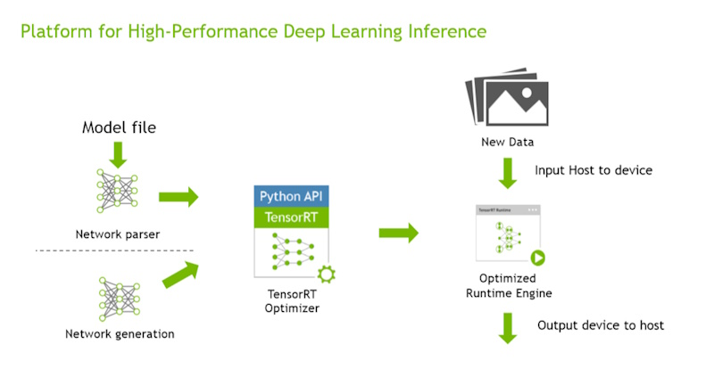

# Understanding the Inner Workings of TensorRT

## How TensorRT Works

TensorRT is a high-performance deep learning inference library developed by NVIDIA. It optimizes trained neural network models to maximize throughput and minimize latency on NVIDIA GPUs. Understanding how TensorRT works involves knowing about its object lifetimes, error handling, memory management, threading, determinism, and runtime options. Below, I'll explain these concepts with C++ examples where appropriate.



### 1. Object Lifetimes

TensorRT’s API is class-based, meaning that certain objects are created by factory classes and have specific lifetimes. For instance, `INetworkDefinition` and `IBuilderConfig` are created using the `IBuilder` class. These objects should be destroyed before the builder object is destroyed. However, once an engine is created, the builder, network, parser, and build config can be safely destroyed.

**Example:**

```cpp
nvinfer1::IBuilder* builder = nvinfer1::createInferBuilder(gLogger);
nvinfer1::INetworkDefinition* network = builder->createNetworkV2(0);
nvinfer1::IBuilderConfig* config = builder->createBuilderConfig();

// Build and serialize the engine
nvinfer1::ICudaEngine* engine = builder->buildEngineWithConfig(*network, *config);
nvinfer1::IHostMemory* serializedEngine = engine->serialize();

// The builder, network, and config can be destroyed
network->destroy();
config->destroy();
builder->destroy();

// The engine can still be used after destroying the above objects
nvinfer1::IRuntime* runtime = nvinfer1::createInferRuntime(gLogger);
nvinfer1::ICudaEngine* deserializedEngine = runtime->deserializeCudaEngine(serializedEngine->data(), serializedEngine->size(), nullptr);
```

### 2. Error Handling and Logging

TensorRT requires a logger to handle diagnostic and informational messages. This logger is passed when creating top-level interfaces like the builder, runtime, or refitter. The logger must be thread-safe since TensorRT might use worker threads internally. Error handling is managed using the `IErrorRecorder` interface, which can be attached to specific objects to receive errors.

**Example:**

```cpp
class Logger : public nvinfer1::ILogger {
    void log(Severity severity, const char* msg) noexcept override {
        if (severity != Severity::kINFO) {
            std::cout << msg << std::endl;
        }
    }
} gLogger;

nvinfer1::IBuilder* builder = nvinfer1::createInferBuilder(gLogger);
// Example of attaching an error recorder to an engine
class MyErrorRecorder : public nvinfer1::IErrorRecorder {
    // Implementation of error recording...
};

MyErrorRecorder errorRecorder;
nvinfer1::ICudaEngine* engine = builder->buildEngineWithConfig(*network, *config);
engine->setErrorRecorder(&errorRecorder);
```

### 3. Memory Management

TensorRT uses significant amounts of device memory (GPU memory) during both the build and runtime phases. During the build phase, TensorRT allocates temporary memory for timing layer implementations, while at runtime, it uses memory to store model weights and intermediate activation tensors.

**Build Phase Example:**

```cpp
nvinfer1::IBuilder* builder = nvinfer1::createInferBuilder(gLogger);
nvinfer1::INetworkDefinition* network = builder->createNetworkV2(0);
nvinfer1::IBuilderConfig* config = builder->createBuilderConfig();

// Set a memory limit for the builder's workspace
config->setMemoryPoolLimit(nvinfer1::MemoryPoolType::kWORKSPACE, 1 << 20); // 1 MB

nvinfer1::ICudaEngine* engine = builder->buildEngineWithConfig(*network, *config);
```

**Runtime Phase Example:**

```cpp
// Deserialize engine and create an execution context
nvinfer1::ICudaEngine* engine = runtime->deserializeCudaEngine(engineData, engineSize, nullptr);
nvinfer1::IExecutionContext* context = engine->createExecutionContext();

// Allocate memory for input/output and perform inference
void* buffers[2];
// ...

context->enqueueV2(buffers, stream, nullptr);
```

### 4. Threading

TensorRT objects are generally not thread-safe, and access to an object must be serialized if multiple threads are involved. However, operations on different execution contexts are thread-safe, allowing different threads to run different contexts concurrently.

**Example:**

```cpp
std::thread t1([&]() {
    nvinfer1::IExecutionContext* context1 = engine->createExecutionContext();
    // Perform inference with context1...
});

std::thread t2([&]() {
    nvinfer1::IExecutionContext* context2 = engine->createExecutionContext();
    // Perform inference with context2...
});

t1.join();
t2.join();
```

### 5. Determinism

TensorRT uses timing to select the fastest kernel implementations during the build phase. Due to timing noise, the selected implementation might vary between builds, leading to minor differences in floating-point computations. However, TensorRT guarantees that once an engine is built, it is deterministic—providing the same input will always produce the same output.

**Example:**

```cpp
// Ensure deterministic behavior during inference
nvinfer1::ICudaEngine* engine = builder->buildEngineWithConfig(*network, *config);
// Use the engine for deterministic inference
```

### 6. Runtime Options

TensorRT provides different runtime libraries to cater to various use cases. The default runtime is the most feature-rich, while the lean runtime is more compact but with limitations like the inability to serialize or refit engines.

**Example:**

```cpp
// Linking against the default runtime (libnvinfer.so/.dll)
// The code would be the same as shown earlier
```

For Python applications, you would import the corresponding package like `tensorrt`, `tensorrt_lean`, or `tensorrt_dispatch`.


## Detailed Explanation of TensorRT's Device Memory Usage

TensorRT, a high-performance deep learning inference library, relies heavily on device memory (GPU memory) for its operations. Understanding how TensorRT allocates and manages this memory during different phases is crucial for optimizing performance and ensuring efficient resource utilization.

**Two Phases**:

- **Build Phase**: Allocates memory for timing layer implementations, temporary buffers, and workspace. Manages multiple copies of weights in host memory.
- **Runtime Phase**: Allocates memory for model weights, persistent memory, activation memory, and scratch memory. Optimizes memory usage through sharing and reuse.

Understanding these memory allocation strategies helps in optimizing TensorRT's performance and managing GPU resources effectively.

### 1. Build Phase

During the build phase, TensorRT performs several tasks to optimize the model for inference. This phase involves significant memory allocation for various purposes:

- **Timing Layer Implementations**: TensorRT evaluates different implementations (kernels) for each layer to determine the fastest one. This process, known as kernel auto-tuning, requires temporary memory to run and time these implementations.
- **Temporary Buffers**: Temporary buffers are used to store intermediate data and results during the optimization process. These buffers are necessary for operations like combining weights (e.g., convolution with batch normalization).

**Example**:
```cpp
IBuilderConfig* config = builder->createBuilderConfig();
config->setMemoryPoolLimit(MemoryPoolType::kWORKSPACE, 1U << 20); // Set workspace size

IHostMemory* serializedModel = builder->buildSerializedNetwork(*network, *config);
```

- **Workspace Size**: The workspace size is a critical parameter that limits the maximum amount of temporary memory available for layer implementations. By default, it is set to the total global memory size of the GPU, but it can be restricted to manage memory usage better.

**Memory Usage During Build Phase**:
- **Original Weights**: The original weights from the model are stored in host memory.
- **Engine Weights**: As the engine is built, a copy of the weights is included in the engine.
- **Temporary Weight Tensors**: Additional temporary weight tensors may be created when combining weights.

### 2. Runtime Phase

Once the model is optimized and the engine is built, TensorRT enters the runtime phase, where it performs inference. During this phase, TensorRT allocates memory for the following purposes:

- **Model Weights**: Upon deserialization, the engine allocates device memory to store the model weights. The size of the serialized engine approximates the amount of device memory required for the weights.

**Example**:
```cpp
ICudaEngine* engine = runtime->deserializeCudaEngine(modelData, modelSize);
```

- **Execution Context Memory**: An `IExecutionContext` object is created from the engine to manage the state during inference. This context uses two types of device memory:
  - **Persistent Memory**: Some layer implementations require persistent memory that cannot be shared between contexts. For example, certain convolution implementations use edge masks that depend on the input shape.
  - **Enqueue Memory**: This memory is used for intermediate activations (activation memory) and temporary storage required by layer implementations (scratch memory).

**Example**:
```cpp
IExecutionContext* context = engine->createExecutionContext();
context->setTensorAddress(INPUT_NAME, inputBuffer);
context->setTensorAddress(OUTPUT_NAME, outputBuffer);
context->enqueueV3(stream);
```

- **Memory Optimization**: TensorRT optimizes memory usage by:
  - **Sharing Activation Memory**: Reusing blocks of device memory for activation tensors with disjoint lifetimes.
  - **Using Scratch Memory**: Allowing transient tensors to occupy unused activation memory.

**Memory Usage During Runtime Phase**:
- **Persistent Memory**: Allocated during the creation of the execution context and lasts for its lifetime.
- **Activation Memory**: Used for intermediate results while processing the network.
- **Scratch Memory**: Temporary storage required by layer implementations, controlled by `IBuilderConfig::setMemoryPoolLimit()`.

**Example of Memory Management**:
```cpp
// Create an execution context without enqueue memory
IExecutionContext* context = engine->createExecutionContextWithoutDeviceMemory();

// Provide memory for the duration of network execution
void* deviceMemory;
cudaMalloc(&deviceMemory, engine->getDeviceMemorySizeV2());
context->setDeviceMemory(deviceMemory);

// Perform inference
context->enqueueV3(stream);

// Free the provided memory
cudaFree(deviceMemory);
```


## Detailed Explanation of Determinism

TensorRT's builder uses timing measurements to select the fastest kernel for each layer during the optimization process. This approach can introduce non-deterministic behavior due to factors like GPU load, clock speed fluctuations, and other system activities. Ensuring deterministic behavior is crucial for applications that require reproducible results, such as scientific computing or certain production environments.

**Major Features**:

- **Non-Deterministic Behavior**: TensorRT's kernel selection based on timing can lead to non-deterministic behavior.
- **Ensuring Determinism**: Implement the `IAlgorithmSelector` interface to control kernel selection and ensure consistent results.
- **Use Cases**: Scientific computing, production environments, and debugging/testing scenarios benefit from deterministic behavior.

By using the `IAlgorithmSelector` interface, you can achieve deterministic behavior in TensorRT, ensuring that your application produces consistent and reproducible results across different runs and environments.

To achieve deterministic behavior, TensorRT provides the `IAlgorithmSelector` interface, which allows you to control the selection of algorithms (kernels) for each layer. By implementing this interface, you can ensure that the same kernels are selected across different runs, leading to consistent and reproducible results.

### Example: Using AlgorithmSelector

Here's an example of how to implement and use the `IAlgorithmSelector` interface to ensure deterministic behavior in TensorRT:

```cpp
#include "NvInfer.h"
#include <iostream>
#include <vector>

using namespace nvinfer1;

class Logger : public ILogger {
    void log(Severity severity, const char* msg) noexcept override {
        if (severity <= Severity::kWARNING)
            std::cout << msg << std::endl;
    }
} logger;

class MyAlgorithmSelector : public IAlgorithmSelector {
public:
    int32_t selectAlgorithms(const IAlgorithmContext& context, const IAlgorithm* const* choices, int32_t nbChoices, int32_t* selection) noexcept override {
        // Select the first algorithm for simplicity
        selection[0] = 0;
        return 1;
    }

    void reportAlgorithms(const IAlgorithmContext* contexts, const IAlgorithm* const* algorithms, int32_t nbAlgorithms) noexcept override {
        // Optionally, report the selected algorithms
        for (int32_t i = 0; i < nbAlgorithms; ++i) {
            std::cout << "Selected algorithm: " << algorithms[i]->getAlgorithmVariant().implementation << std::endl;
        }
    }
};

int main() {
    // Create builder and network definition
    IBuilder* builder = createInferBuilder(logger);
    INetworkDefinition* network = builder->createNetworkV2(0U);

    // Create builder configuration and set the algorithm selector
    IBuilderConfig* config = builder->createBuilderConfig();
    MyAlgorithmSelector algorithmSelector;
    config->setAlgorithmSelector(&algorithmSelector);

    // Build the engine
    IHostMemory* serializedModel = builder->buildSerializedNetwork(*network, *config);

    // Clean up
    delete network;
    delete config;
    delete builder;
    delete serializedModel;

    return 0;
}
```

### Use Cases for Determinism

1. **Scientific Computing**:
   - **Requirement**: Reproducible results are essential for scientific experiments and simulations.
   - **Solution**: Use `IAlgorithmSelector` to ensure the same kernels are selected across different runs, providing consistent results.

2. **Production Environments**:
   - **Requirement**: Consistent behavior across different deployments and updates.
   - **Solution**: Implement `IAlgorithmSelector` to maintain the same kernel selection, ensuring that updates do not introduce variability in model performance.

3. **Debugging and Testing**:
   - **Requirement**: Identical behavior during debugging and testing phases to isolate issues.
   - **Solution**: Use `IAlgorithmSelector` to ensure deterministic behavior, making it easier to reproduce and fix bugs.


## Detailed Explanation of TensorRT Runtime Options

TensorRT offers multiple runtime libraries to cater to different use cases and requirements. These runtime libraries vary in terms of functionality, size, and compatibility. Understanding the differences between these runtimes can help you choose the most appropriate one for your application.

**Major Features**:

- **Default Runtime**: Full feature set, larger size, suitable for most applications.
- **Lean Runtime**: Smaller size, limited features, ideal for deployment.
- **Dispatch Runtime**: Compatibility with older versions, dynamic loading, flexible.

Choosing the appropriate runtime depends on your application's requirements, such as the need for full TensorRT functionality, binary size constraints, and compatibility considerations.

### 1. Default Runtime

- **Library**: `libnvinfer.so` (Linux) / `nvinfer.dll` (Windows)
- **Python Package**: `tensorrt`
- **Description**: The default runtime is the most comprehensive and feature-rich option. It includes all the necessary components to run TensorRT engines, including support for refitting and serializing engines.
- **Use Case**: Suitable for most applications that require full TensorRT functionality, including dynamic shape support, refitting, and engine serialization.

**Example**:
```cpp
#include "NvInfer.h"
using namespace nvinfer1;

IRuntime* runtime = createInferRuntime(logger);
ICudaEngine* engine = runtime->deserializeCudaEngine(modelData, modelSize);
```

### 2. Lean Runtime

- **Library**: `libnvinfer_lean.so` (Linux) / `nvinfer_lean.dll` (Windows)
- **Python Package**: `tensorrt_lean`
- **Description**: The lean runtime is a smaller, more lightweight version of the default runtime. It contains only the code necessary to run a version-compatible engine and excludes features like refitting and engine serialization.
- **Use Case**: Ideal for deployment scenarios where minimizing the binary size is crucial, and the application does not require refitting or serializing engines.

**Example**:
```cpp
#include "NvInferLean.h"
using namespace nvinfer1;

IRuntime* runtime = createInferRuntime(logger);
ICudaEngine* engine = runtime->deserializeCudaEngine(modelData, modelSize);
```

### 3. Dispatch Runtime

- **Library**: `libnvinfer_dispatch.so` (Linux) / `nvinfer_dispatch.dll` (Windows)
- **Python Package**: `tensorrt_dispatch`
- **Description**: The dispatch runtime is a small shim library that can load a lean runtime and redirect calls to it. It can load older versions of the lean runtime and provide compatibility between a newer version of TensorRT and an older plan file.
- **Use Case**: Useful for applications that need to maintain compatibility with older TensorRT versions or require dynamic loading of the lean runtime.

**Example**:
```cpp
#include "NvInferDispatch.h"
using namespace nvinfer1;

IRuntime* runtime = createInferRuntime(logger);
ICudaEngine* engine = runtime->deserializeCudaEngine(modelData, modelSize);
```

### Choosing the Right Runtime

- **Default Runtime**: Choose this if you need the full feature set of TensorRT, including refitting, engine serialization, and dynamic shape support. It is the most versatile and widely used runtime.
- **Lean Runtime**: Opt for this if you need a smaller binary size and do not require refitting or engine serialization. It is ideal for deployment scenarios where minimizing the footprint is essential.
- **Dispatch Runtime**: Use this if you need to maintain compatibility with older TensorRT versions or require dynamic loading of the lean runtime. It provides flexibility in managing different runtime versions.

### Python Usage

TensorRT also provides corresponding Python packages for each runtime:

- **Default Runtime**: `import tensorrt as trt`
- **Lean Runtime**: `import tensorrt_lean as trt`
- **Dispatch Runtime**: `import tensorrt_dispatch as trt`

**Example**:
```python
import tensorrt as trt

logger = trt.Logger(trt.Logger.WARNING)
runtime = trt.Runtime(logger)
with open("model.engine", "rb") as f:
    engine = runtime.deserialize_cuda_engine(f.read())
```


## Conclusion

TensorRT is a powerful deep learning inference library developed by NVIDIA that optimizes neural network models for high-throughput, low-latency inference on NVIDIA GPUs. To fully harness its capabilities, it's crucial to understand how TensorRT manages object lifetimes, handles errors, allocates memory, and ensures deterministic behavior during model execution.

Throughout its operation, TensorRT efficiently manages GPU memory during both the build and runtime phases. By allocating memory for tasks like timing layer implementations and managing workspace and activation memory, TensorRT ensures optimal performance while maintaining flexibility through features like custom memory management and dynamic shapes. 

Error handling in TensorRT is robust, with support for custom loggers and error recorders to track and manage issues across different components. Moreover, TensorRT's threading model allows for safe concurrent execution across different contexts, providing scalability in multi-threaded applications.

For applications requiring consistent and reproducible results, TensorRT offers tools to enforce determinism, ensuring the same kernels are selected across different runs. Additionally, the various runtime options—default, lean, and dispatch—allow developers to choose the best trade-off between functionality, memory footprint, and compatibility.

## References

For more detailed information and official documentation on TensorRT, please refer to the following resources:

1. **NVIDIA TensorRT Developer Page**  
   - Visit the NVIDIA TensorRT Developer Page for the latest updates, downloads, and resources related to TensorRT, including sample code and tutorials.  
   - [NVIDIA TensorRT Developer Page](https://developer.nvidia.com/tensorrt)

2. **NVIDIA TensorRT Documentation**  
   - The official TensorRT documentation provides comprehensive guides on installation, API references, user guides, and best practices for deploying deep learning models with TensorRT.  
   - [NVIDIA TensorRT Documentation](https://docs.nvidia.com/deeplearning/tensorrt/index.html)

These resources will help you gain a deeper understanding of TensorRT and how to effectively use it in your deep learning inference applications.

