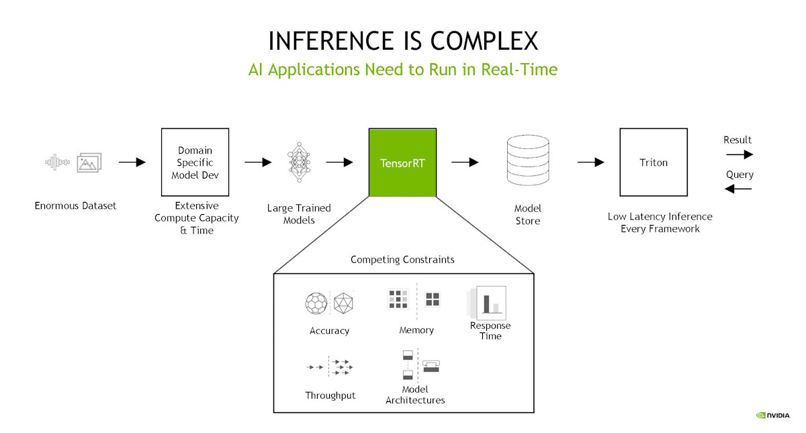

# Mastering TensorRT with trtexec: A Comprehensive Guide to Optimization and Inference

## Introduction to `trtexec`

`trtexec` is a versatile command-line tool provided by NVIDIA as part of the TensorRT SDK, designed to streamline the process of building, optimizing, and deploying deep learning models on NVIDIA GPUs. It offers a powerful interface for converting models from various formats, such as ONNX, into highly optimized TensorRT engines that are fine-tuned for performance on specific hardware configurations. Whether you're a developer looking to optimize inference times or an engineer focused on deploying models in production, `trtexec` serves as a critical tool in the TensorRT ecosystem. In this article, we will explore the key features of `trtexec`, delve into the different options it provides, and demonstrate practical examples of how to use it effectively.



## Features of `trtexec`

`trtexec` comes with a range of features that make it indispensable for model optimization and deployment:

- **Model Conversion**: `trtexec` can convert ONNX models into TensorRT engine files, which are optimized for fast and efficient inference on NVIDIA GPUs. This conversion process allows models to take full advantage of TensorRT’s optimizations, such as reduced precision (FP16, INT8) and layer fusion.

- **Inference Execution**: Beyond just model conversion, `trtexec` allows users to execute inference on the generated TensorRT engines. This feature is critical for validating the performance of the models in real-world scenarios.

- **Optimization Techniques**: The tool supports a variety of optimization techniques, including precision calibration (FP16, INT8), dynamic shape support, and custom memory pool management. These options enable fine-tuning of models to achieve the best balance between performance and accuracy.

- **Profiling and Benchmarking**: `trtexec` includes comprehensive profiling capabilities, providing detailed insights into the performance of each layer in the model. It can generate reports on inference times, memory usage, and more, making it easier to identify bottlenecks and optimize performance.

- **Customizability**: With `trtexec`, users can specify custom input/output formats, manage memory allocation strategies, and apply precision constraints at the layer level. This level of control ensures that the TensorRT engine meets the specific needs of different deployment environments.

## Overview of `trtexec` Options

`trtexec` provides a wide array of options that can be grouped into several categories, each serving a distinct purpose:

- **Model Options**: These options are used to specify the input model file, typically in ONNX format, which `trtexec` will convert into a TensorRT engine.

- **Build Options**: These options control the engine-building process, including setting up dynamic shapes, choosing precision modes (FP16, INT8), and configuring memory pools. Build options are critical for optimizing the model for specific hardware.

- **Inference Options**: These options determine how the inference is performed on the built engine. They include settings for input shapes, iteration counts, and execution strategies (e.g., multithreading, managed memory). Inference options are essential for evaluating the performance of the model under different conditions.

- **Reporting Options**: These options enable detailed logging and profiling, allowing users to generate reports on performance metrics, layer information, and other critical data. Reporting options are vital for understanding the efficiency of the model and identifying areas for improvement.

- **System Options**: These options manage the system-specific configurations, such as selecting CUDA devices, using Deep Learning Accelerator (DLA) cores, and handling plugins. System options ensure that `trtexec` is optimized for the specific hardware it is running on.

### When to Use `trtexec` with Different Options

Understanding when and how to use the different `trtexec` options can significantly impact the performance and efficiency of your deep learning models:

- **Build Options**: Use build options when converting a model from ONNX to a TensorRT engine. These options are particularly useful when you need to optimize the model for specific hardware, enable dynamic input shapes, or fine-tune the precision settings for improved performance.

  - **Scenario**: You have a deep learning model in ONNX format and need to deploy it on a production server with NVIDIA GPUs. By using build options, you can create a TensorRT engine that is optimized for the server’s GPU, ensuring faster inference times and reduced latency.

- **Inference Options**: These options are critical when you need to test or deploy the TensorRT engine. They allow you to configure how the engine processes inputs, manage concurrent executions, and measure the engine’s performance under different conditions.

  - **Scenario**: After building the TensorRT engine, you want to benchmark its performance across different batch sizes and input shapes. Inference options allow you to automate this testing and gather precise performance data.

- **Reporting Options**: Use reporting options when you need detailed insights into the TensorRT engine’s performance. These options help you generate logs, export profiling data, and analyze layer-specific execution times, which are essential for further optimization.

  - **Scenario**: You notice that your model’s inference time is slower than expected. By enabling reporting options, you can identify which layers are causing the bottleneck and take steps to optimize them.

- **System Options**: These options are used when configuring `trtexec` for a specific system environment. Whether you are working with a multi-GPU setup, using DLA cores, or loading custom plugins, system options ensure that `trtexec` is tailored to your hardware.

  - **Scenario**: You are deploying a model on a server with multiple GPUs and want to ensure that `trtexec` utilizes the most suitable GPU for your application. System options allow you to specify the exact GPU to use, optimizing resource allocation and performance.

### Understanding the Options of `trtexec`

In this chapter, we dive into the various options available in the `trtexec` tool, which are crucial for optimizing, building, and deploying deep learning models on NVIDIA GPUs. By exploring these options—categorized into Model, Build, Inference, Reporting, and System settings—you will gain a comprehensive understanding of how to tailor TensorRT engines for specific use cases. This chapter provides a detailed explanation of each option, helping you to effectively utilize `trtexec` for your model optimization and deployment workflows.

#### 1. Model Options + Help

| Option                     | Description                                                                                      |
|----------------------------|--------------------------------------------------------------------------------------------------|
| `--onnx=<file>`            | Specifies the ONNX model file to be converted into a TensorRT engine.                             |
| `--help`, `-h`             | Displays the help message with a summary of all available options.                                |

#### 2. Build Options

| Option                      | Description                                                                                                                                                                |
|-----------------------------|----------------------------------------------------------------------------------------------------------------------------------------------------------------------------|
| `--minShapes=spec`          | Builds with dynamic shapes using a profile with the minimum shapes provided.                                                                                               |
| `--optShapes=spec`          | Builds with dynamic shapes using a profile with the optimal shapes provided.                                                                                               |
| `--maxShapes=spec`          | Builds with dynamic shapes using a profile with the maximum shapes provided.                                                                                               |
| `--minShapesCalib=spec`     | Calibrates with dynamic shapes using a profile with the minimum shapes provided (used for INT8 calibration).                                                               |
| `--optShapesCalib=spec`     | Calibrates with dynamic shapes using a profile with the optimal shapes provided (used for INT8 calibration).                                                               |
| `--maxShapesCalib=spec`     | Calibrates with dynamic shapes using a profile with the maximum shapes provided (used for INT8 calibration).                                                               |
| `--inputIOFormats=spec`     | Specifies the type and format of each input tensor (e.g., fp32:chw).                                                                                                       |
| `--outputIOFormats=spec`    | Specifies the type and format of each output tensor (e.g., fp32:chw).                                                                                                      |
| `--memPoolSize=poolspec`    | Specifies size constraints for memory pools, such as workspace or tactic shared memory.                                                                                     |
| `--profilingVerbosity=mode` | Specifies the verbosity of profiling (`layer_names_only`, `detailed`, `none`).                                                                                             |
| `--avgTiming=M`             | Sets the number of times averaged in each iteration for kernel selection (default is 8).                                                                                    |
| `--refit`                   | Marks the engine as refittable, allowing inspection and refitting of weights after building.                                                                                 |
| `--stripWeights`            | Strips weights from the plan; works with refit to reduce engine size.                                                                                                      |
| `--stripAllWeights`         | Strips all weights and marks them as refittable, disregarding performance impacts.                                                                                          |
| `--versionCompatible`, `--vc` | Marks the engine as version-compatible, allowing it to be used with newer versions of TensorRT on the same OS.                                                              |
| `--pluginInstanceNorm`, `--pi` | Sets `kNATIVE_INSTANCENORM` to false in the ONNX parser, using a plugin InstanceNorm implementation instead.                                                               |
| `--useRuntime=runtime`      | Specifies the TensorRT runtime to execute the engine (`full`, `lean`, `dispatch`).                                                                                          |
| `--sparsity=spec`           | Controls sparsity (`disable`, `enable`, `force`) to optimize the engine using sparse tactics.                                                                               |
| `--noTF32`                  | Disables TF32 precision (default is enabled, in addition to FP32).                                                                                                         |
| `--fp16`                    | Enables FP16 precision, in addition to FP32 (default is disabled).                                                                                                         |
| `--bf16`                    | Enables BF16 precision, in addition to FP32 (default is disabled).                                                                                                         |
| `--int8`                    | Enables INT8 precision, in addition to FP32 (default is disabled).                                                                                                         |
| `--fp8`                     | Enables FP8 precision, in addition to FP32 (default is disabled).                                                                                                          |
| `--int4`                    | Enables INT4 precision, in addition to FP32 (default is disabled).                                                                                                         |
| `--best`                    | Enables all precisions to achieve the best performance (default is disabled).                                                                                               |
| `--stronglyTyped`           | Creates a strongly typed network (default is disabled).                                                                                                                    |
| `--directIO`                | Avoids reformatting at network boundaries (default is disabled).                                                                                                           |
| `--precisionConstraints=spec` | Controls precision constraint settings (`none`, `obey`, `prefer`).                                                                                                          |
| `--layerPrecisions=spec`    | Controls per-layer precision constraints (effective when `precisionConstraints` is set to `obey` or `prefer`).                                                              |
| `--layerOutputTypes=spec`   | Controls per-layer output type constraints (effective when `precisionConstraints` is set to `obey` or `prefer`).                                                           |
| `--layerDeviceTypes=spec`   | Specifies layer-specific device types (`GPU`, `DLA`).                                                                                                                      |
| `--calib=<file>`            | Reads an INT8 calibration cache file.                                                                                                                                       |
| `--safe`                    | Enables building a safety-certified engine (DLA standalone).                                                                                                               |
| `--buildDLAStandalone`      | Enables building a DLA standalone loadable engine.                                                                                                                         |
| `--allowGPUFallback`        | Allows GPU fallback for unsupported layers when DLA is enabled.                                                                                                            |
| `--consistency`             | Performs consistency checking on a safety-certified engine.                                                                                                                |
| `--restricted`              | Enables safety scope checking with `kSAFETY_SCOPE` build flag.                                                                                                             |
| `--saveEngine=<file>`       | Saves the serialized engine to a file.                                                                                                                                      |
| `--loadEngine=<file>`       | Loads a serialized engine from a file.                                                                                                                                      |
| `--getPlanVersionOnly`      | Prints TensorRT version when the loaded plan was created (works without deserialization).                                                                                   |
| `--tacticSources=tactics`   | Specifies tactics to be used by adding or removing tactics from the default sources (`CUBLAS`, `CUBLAS_LT`, `CUDNN`, `EDGE_MASK_CONVOLUTIONS`, etc.).                        |
| `--noBuilderCache`          | Disables the timing cache in the builder (default is to enable).                                                                                                           |
| `--noCompilationCache`      | Disables the compilation cache in the builder (default is to enable).                                                                                                       |
| `--errorOnTimingCacheMiss`  | Emits an error when a tactic being timed is not present in the timing cache (default is false).                                                                             |
| `--timingCacheFile=<file>`  | Saves/loads the serialized global timing cache.                                                                                                                            |
| `--preview=features`        | Specifies preview features by adding or removing features from the default list.                                                                                           |
| `--builderOptimizationLevel` | Sets the builder optimization level (default is 3, valid values are 0-5).                                                                                                   |
| `--hardwareCompatibilityLevel=mode` | Makes the engine file compatible with other GPU architectures (`none`, `ampere+`).                                                                                     |
| `--runtimePlatform=platform` | Sets the target platform for runtime execution (`SameAsBuild`, `WindowsAMD64`).                                                                                             |
| `--tempdir=<dir>`           | Overrides the default temporary directory TensorRT will use when creating temporary files.                                                                                  |
| `--tempfileControls=controls` | Controls what TensorRT is allowed to use when creating temporary executable files (`in_memory:allow`, `temporary:deny`).                                                    |
| `--maxAuxStreams=N`         | Sets the maximum number of auxiliary streams per inference stream that TRT is allowed to use.                                                                               |
| `--profile`                 | Builds with dynamic shapes using a profile with the provided min/max/opt shapes (can be specified multiple times to create multiple profiles).                              |
| `--calibProfile`            | Selects the optimization profile to calibrate by index (default is 0).                                                                                                      |
| `--allowWeightStreaming`    | Enables a weight streaming engine; requires `--stronglyTyped`.                                                                                                             |
| `--markDebug`               | Specifies a list of tensor names to be marked as debug tensors.                                                                                                             |

#### 3. Inference Options

| Option                      | Description                                                                                                                                                                |
|-----------------------------|----------------------------------------------------------------------------------------------------------------------------------------------------------------------------|
| `--shapes=spec`             | Sets input shapes for dynamic shapes inference inputs.                                                                                                                     |
| `--loadInputs=spec`         | Loads input values from files (default is to generate random inputs).                                                                                                      |
| `--iterations=N`            | Runs at least N inference iterations (default is 10).                                                                                                                      |
| `--warmUp=N`                | Runs for N milliseconds to warm up before measuring performance (default is 200 ms).                                                                                         |
| `--duration=N`              | Runs performance measurements for at least N seconds wall-clock time (default is 3 seconds).                                                                                  |
| `--sleepTime=N`             | Delays inference start with a gap of N milliseconds between launch and compute (default is 0).                                                                             |
| `--idleTime=N`              | Sleeps N milliseconds between two continuous iterations (default is 0).                                                                                                    |
| `--infStreams=N`            | Instantiates N execution contexts to run inference concurrently (default is 1).                                                                                            |
| `--exposeDMA`               | Serializes DMA transfers to and from the device (default is disabled).                                                                                                     |
| `--noDataTransfers`         | Disables DMA transfers to and from the device (default is enabled).                                                                                                        |
| `--useManagedMemory`        | Uses managed memory instead of separate host and device allocations (default is disabled).                                                                                 |
| `--useSpinWait`             | Actively

 synchronizes on GPU events, decreasing synchronization time but increasing CPU usage and power consumption (default is disabled).                                  |
| `--threads`                 | Enables multithreading to drive engines with independent threads or speed up refitting (default is disabled).                                                               |
| `--useCudaGraph`            | Uses CUDA Graph to capture engine execution and then launch inference (default is disabled).                                                                               |
| `--timeDeserialize`         | Times the amount of time it takes to deserialize the network and exit.                                                                                                     |
| `--timeRefit`               | Times the amount of time it takes to refit the engine before inference.                                                                                                    |
| `--separateProfileRun`      | Does not attach the profiler in the benchmark run; if profiling is enabled, a second profile run will be executed (default is disabled).                                    |
| `--skipInference`           | Exits after the engine has been built and skips inference performance measurement (default is disabled).                                                                    |
| `--persistentCacheRatio`    | Sets the persistent cache limit in ratio (e.g., 0.5 represents half of the maximum persistent L2 size, default is 0).                                                      |
| `--useProfile`              | Sets the optimization profile for the inference context (default is 0).                                                                                                    |
| `--allocationStrategy=spec` | Specifies how the internal device memory for inference is allocated (`static`, `profile`, `runtime`).                                                                       |
| `--saveDebugTensors`        | Specifies a list of tensor names to turn on the debug state and filename to save raw outputs to.                                                                            |
| `--weightStreamingBudget`   | Sets the maximum amount of GPU memory TensorRT is allowed to use for weights, with various options for how much memory to allocate.                                         |

#### 4. Reporting Options

| Option                      | Description                                                                                                                                                                |
|-----------------------------|----------------------------------------------------------------------------------------------------------------------------------------------------------------------------|
| `--verbose`                 | Enables verbose logging (default is false).                                                                                                                                |
| `--avgRuns=N`               | Reports performance measurements averaged over N consecutive iterations (default is 10).                                                                                     |
| `--percentile=P1,P2,P3,...` | Reports performance for the specified percentiles (default is 90%, 95%, 99%).                                                                                               |
| `--dumpRefit`               | Prints the refittable layers and weights from a refittable engine.                                                                                                          |
| `--dumpOutput`              | Prints the output tensor(s) of the last inference iteration (default is disabled).                                                                                           |
| `--dumpRawBindingsToFile`   | Prints the input/output tensor(s) of the last inference iteration to a file (default is disabled).                                                                          |
| `--dumpProfile`             | Prints profile information per layer (default is disabled).                                                                                                                |
| `--dumpLayerInfo`           | Prints layer information of the engine to the console (default is disabled).                                                                                                |
| `--dumpOptimizationProfile` | Prints the optimization profile(s) information (default is disabled).                                                                                                       |
| `--exportTimes=<file>`      | Writes the timing results in a JSON file (default is disabled).                                                                                                             |
| `--exportOutput=<file>`     | Writes the output tensors to a JSON file (default is disabled).                                                                                                             |
| `--exportProfile=<file>`    | Writes the profile information per layer in a JSON file (default is disabled).                                                                                               |
| `--exportLayerInfo=<file>`  | Writes the layer information of the engine in a JSON file (default is disabled).                                                                                             |

#### 5. System Options

| Option                      | Description                                                                                                                                                                |
|-----------------------------|----------------------------------------------------------------------------------------------------------------------------------------------------------------------------|
| `--device=N`                | Selects CUDA device N (default is 0).                                                                                                                                       |
| `--useDLACore=N`            | Selects DLA core N for layers that support DLA (default is none).                                                                                                          |
| `--staticPlugins`           | Specifies a plugin library (.so) to load statically (can be specified multiple times).                                                                                     |
| `--dynamicPlugins`          | Specifies a plugin library (.so) to load dynamically and may be serialized with the engine if included in `--setPluginsToSerialize` (can be specified multiple times).       |
| `--setPluginsToSerialize`   | Specifies a plugin library (.so) to be serialized with the engine (can be specified multiple times).                                                                        |
| `--ignoreParsedPluginLibs`  | Ignores plugin libraries specified by the ONNX parser when building a version-compatible engine, unless `--excludeLeanRuntime` is specified.                                |


## Examples of Using `trtexec`

In this section, we'll provide practical examples of using `trtexec` with different options to help you understand how to apply these features to your deep learning workflows. Each set of examples corresponds to a specific category of options: Build, Inference, Reporting, and System.

### Build Options

The following examples demonstrate how to use `trtexec` to build TensorRT engines with different configurations:

1. **Building with Dynamic Shapes and FP16 Precision**:
   ```bash
   /usr/src/tensorrt/bin/trtexec --onnx=model.onnx \
                                 --minShapes=input0:1x3x224x224 \
                                 --optShapes=input0:1x3x512x512 \
                                 --maxShapes=input0:1x3x1024x1024 \
                                 --fp16 \
                                 --saveEngine=model_fp16_dynamic.engine
   ```
   - This command builds a TensorRT engine from an ONNX model, supporting dynamic input shapes and FP16 precision, and saves the engine as `model_fp16_dynamic.engine`.

2. **Building with INT8 Precision Using Calibration Cache**:
   ```bash
   /usr/src/tensorrt/bin/trtexec --onnx=model.onnx \
                                 --minShapes=input0:1x3x256x256 \
                                 --optShapes=input0:1x3x512x512 \
                                 --maxShapes=input0:1x3x1024x1024 \
                                 --int8 \
                                 --calib=calibration.cache \
                                 --saveEngine=model_int8.engine
   ```
   - This command builds an engine with INT8 precision using a pre-generated calibration cache, which is essential for optimizing models for low precision inference.

3. **Building with Sparsity Enabled and Memory Pool Constraints**:
   ```bash
   /usr/src/tensorrt/bin/trtexec --onnx=model.onnx \
                                 --minShapes=input0:1x3x128x128 \
                                 --optShapes=input0:1x3x256x256 \
                                 --maxShapes=input0:1x3x512x512 \
                                 --sparsity=enable \
                                 --memPoolSize=workspace:4096 \
                                 --saveEngine=model_sparse.engine
   ```
   - This command enables sparsity tactics and sets a memory pool constraint of 4GB for the workspace, optimizing the engine for reduced memory usage.

4. **Building with Specific Input/Output Formats and Strongly Typed Network**:
   ```bash
   /usr/src/tensorrt/bin/trtexec --onnx=model.onnx \
                                 --minShapes=input0:1x3x224x224 \
                                 --optShapes=input0:1x3x512x512 \
                                 --maxShapes=input0:1x3x1024x1024 \
                                 --inputIOFormats=fp16:chw \
                                 --outputIOFormats=fp16:chw \
                                 --stronglyTyped \
                                 --saveEngine=model_strongly_typed.engine
   ```
   - This example specifies that both input and output formats should use FP16 in CHW layout and builds a strongly typed network, ensuring consistent precision across the engine.

5. **Building with Multiple Optimization Profiles**:
   ```bash
   /usr/src/tensorrt/bin/trtexec --onnx=model.onnx \
                                 --profile=0 --minShapes=input0:1x3x128x128 --optShapes=input0:1x3x256x256 --maxShapes=input0:1x3x512x512 \
                                 --profile=1 --minShapes=input0:1x3x512x512 --optShapes=input0:1x3x1024x1024 --maxShapes=input0:1x3x2048x2048 \
                                 --saveEngine=model_multi_profile.engine
   ```
   - This command builds an engine with two different optimization profiles, enabling the engine to efficiently handle a wider range of input sizes.

6. **Building with BF16 Precision and Custom Memory Pool Sizes**:
   ```bash
   /usr/src/tensorrt/bin/trtexec --onnx=model.onnx \
                                 --minShapes=input0:1x3x320x320 \
                                 --optShapes=input0:1x3x640x640 \
                                 --maxShapes=input0:1x3x1280x1280 \
                                 --bf16 \
                                 --memPoolSize=workspace:8192,tacticSharedMem:1024 \
                                 --saveEngine=model_bf16_mem.engine
   ```
   - This example builds an engine with BF16 precision and customizes memory pool sizes for optimal performance, particularly in memory-constrained environments.

7. **Building with INT4 Precision and Version Compatibility**:
   ```bash
   /usr/src/tensorrt/bin/trtexec --onnx=model.onnx \
                                 --minShapes=input0:1x3x128x128 \
                                 --optShapes=input0:1x3x256x256 \
                                 --maxShapes=input0:1x3x512x512 \
                                 --int4 \
                                 --versionCompatible \
                                 --saveEngine=model_int4_vc.engine
   ```
   - This command builds an engine with INT4 precision and marks it as version-compatible, ensuring it can be used with future versions of TensorRT.

8. **Building with Specific Layer Precision Constraints**:
   ```bash
   /usr/src/tensorrt/bin/trtexec --onnx=model.onnx \
                                 --minShapes=input0:1x3x224x224 \
                                 --optShapes=input0:1x3x448x448 \
                                 --maxShapes=input0:1x3x1024x1024 \
                                 --precisionConstraints=prefer \
                                 --layerPrecisions=conv1:fp16,conv2:int8 \
                                 --saveEngine=model_layer_prec.engine
   ```
   - This example demonstrates how to enforce specific precision constraints on different layers, enabling a mixed-precision approach that balances performance and accuracy.

### Inference Options

These examples showcase how to run inference using `trtexec`, with configurations that affect performance and behavior:

1. **Running Inference with Dynamic Input Shapes and Multiple Iterations**:
   ```bash
   /usr/src/tensorrt/bin/trtexec --loadEngine=model_fp16_dynamic.engine \
                                 --shapes=input0:1x3x256x256,input1:1x3x128x128 \
                                 --iterations=100 \
                                 --useCudaGraph \
                                 --exportOutput=output.json
   ```
   - This command runs inference on a TensorRT engine with dynamic input shapes, performing 100 iterations, and uses CUDA Graphs for optimized execution. The output tensors are exported to `output.json`.

2. **Running Inference with Warm-Up and Profiling**:
   ```bash
   /usr/src/tensorrt/bin/trtexec --loadEngine=model_int8.engine \
                                 --shapes=input0:1x3x512x512 \
                                 --warmUp=500 \
                                 --duration=10 \
                                 --verbose \
                                 --exportTimes=timing_results.json
   ```
   - This command runs inference with a 500-millisecond warm-up time, measures performance for 10 seconds, and logs detailed timing information to `timing_results.json`.

3. **Running Inference with Multiple Execution Streams and Managed Memory**:
   ```bash
   /usr/src/tensorrt/bin/trtexec --loadEngine=model_bf16_mem.engine \
                                 --shapes=input0:1x3x320x320 \
                                 --infStreams=4 \
                                 --useManagedMemory \
                                 --iterations=50 \
                                 --exportProfile=profile_info.json
   ```
   - This example configures inference to run with 4 parallel execution streams, uses managed memory, and performs 50 iterations, exporting profiling data to `profile_info.json`.

4. **Running Inference with Custom Input Data and Skipping Data Transfers**:
   ```bash
   /usr/src/tensorrt/bin/trtexec --loadEngine=model_strongly_typed.engine \
                                 --loadInputs=input0:input_data.bin \
                                 --noDataTransfers \
                                 --iterations=200 \
                                 --dumpOutput
   ```
   - This command loads custom input data from a binary file and runs inference while skipping DMA data transfers. It also dumps the output tensor(s) of the last iteration to the console.

5. **Running Inference with Specific Memory Allocation Strategy and Debugging**:
   ```bash
   /usr/src/tensorrt/bin/trtexec --loadEngine=model_multi_profile.engine \
                                 --shapes=input0:1x3x448x448 \
                                 --allocationStrategy=runtime \
                                 --useSpinWait \
                                 --markDebug=input0,output0 \
                                 --saveDebugTensors=debug_tensors.bin
   ```
   - This example runs inference with a runtime-based memory allocation strategy, uses spin-wait synchronization, and marks specific tensors for debugging, saving the debug data to `debug_tensors.bin`.

### Reporting Options

The following examples demonstrate how to use reporting options to gain insights into model performance:

1. **Verbose Logging with Average Performance Runs and Percentile Reporting**:
   ```bash
   /usr/src/tensorrt/bin/trtexec --loadEngine=model_fp16_dynamic.engine \
                                 --verbose \
                                 --avgRuns=50 \
                                 --percentile=50,90,95,99 \
                                 --exportTimes=performance_times.json
   ```
   - This command enables verbose logging, averages performance over 50 runs, reports performance percentiles, and exports timing results to `performance_times.json`.

2. **Dumping Layer Information and Exporting Profile Information**:
   ```bash
   /usr/src/tensorrt/bin/trtexec --loadEngine=model_int8.engine \
                                 --dumpLayerInfo \
                                 --dumpOptimizationProfile \
                                 --exportProfile=profile_details.json \
                                 --exportLayerInfo=layer_info.json
   ```
   - This command prints detailed layer information and optimization profiles to the console, and exports the profile and layer information to JSON files.

3. **Dumping Output Tensors and Exporting Raw Bindings to File**:
   ```bash
   /usr/src/tensorrt/bin/trtexec --loadEngine=model_bf16_mem.engine \
                                 --dumpOutput \
                                 --dumpRawBindingsToFile \
                                 --exportOutput=output_tensors.json \
                                 --exportTimes=timing_output.json
   ```
   - This example dumps the output tensors of the last inference iteration to the console, prints raw input/output bindings to a file, and exports the output tensors and timing results to JSON files.

### System Options

Here are examples of using system options to configure `trtexec` for specific hardware environments:

1. **Selecting a Specific CUDA Device and Using a DLA Core**:
   ```bash
   /usr/src/tensorrt/bin/trtexec --onnx=model.onnx \
                                 --device=1 \
                                 --useDLACore=0 \
                                 --allowGPUFallback \
                                 --saveEngine=model_dla.engine
   ```
   - This command builds a TensorRT engine using CUDA device 1 and DLA core 0, allowing GPU fallback for unsupported layers, and saves the engine as `model_dla.engine`.

2. **Using Static and Dynamic Plugins with Version-Compatible Engine**:
   ```bash
   /usr/src/tensorrt/bin/trtexec --onnx=model.onnx \
                                 --staticPlugins=/path/to/pluginA.so \
                                 --dynamicPlugins=/path/to/pluginB.so \
                                 --versionCompatible \
                                 --saveEngine=model_plugins_vc.engine
   ```
   - This command builds an engine using both static and dynamic plugins, marks the engine as version-compatible, and saves it as `model_plugins_vc.engine`.


## Handling Post-Training Quantization (PTQ)

INT8 calibration is a key step in optimizing your model for efficient inference by quantizing the model's weights and activations. This process allows the model to run efficiently with INT8 precision, which can lead to significant performance improvements, especially on NVIDIA hardware. Using `trtexec`, you can perform this calibration process with your ONNX model, ensuring that your model is ready for INT8 inference.

### Overview of INT8 Calibration

INT8 calibration involves determining the appropriate quantization parameters for the model’s weights and activations. To do this accurately, you need a representative dataset that captures the typical input distribution your model will encounter in production. This dataset is crucial as it helps to establish the dynamic range of the model's activations, ensuring that the quantized model maintains accuracy.

### Steps for INT8 Calibration Using `trtexec`

1. **Prepare Your Model**:
   - Ensure that your model is in ONNX format, as `trtexec` supports ONNX models for calibration. This format is necessary to proceed with the INT8 calibration.

2. **Collect Calibration Data**:
   - Gather a representative dataset that closely reflects the input data your model will process in a production environment. This dataset will be used during the calibration process to determine the quantization parameters.

3. **Run Calibration with `trtexec`**:
   - Use the following command structure to perform the calibration and generate the INT8 engine:
     ```sh
     trtexec --onnx=<model.onnx> --int8 --saveEngine=<output.engine> --calib=<calibration.cache> --verbose
     ```
     - `--onnx=<model.onnx>`: Specifies the input ONNX model.
     - `--int8`: Enables INT8 mode for the engine, initiating the calibration process.
     - `--saveEngine=<output.engine>`: Defines the filename for the serialized INT8 engine.
     - `--calib=<calibration.cache>`: Specifies the filename for the calibration cache, which will store the quantization parameters.

4. **Calibration Cache**:
   - If you have previously generated a calibration cache, you can reuse it to skip the calibration step in future runs. The calibration cache file contains the quantization parameters determined from earlier calibration processes, saving time and ensuring consistency.

### Handling Errors

If you encounter errors while loading the calibration cache or during the calibration process, check the following:
- Ensure that the calibration cache file is correctly formatted and compatible with the model you are using. The file should contain statistics about the activations gathered during previous calibration runs.
- Verify that the calibration data aligns with the model's input requirements, as incorrect formatting or shape mismatches can lead to errors.

### Example Command

Here’s an example command that demonstrates how to run `trtexec` for INT8 calibration:
```sh
trtexec --onnx=my_model.onnx --int8 --saveEngine=my_model_int8.engine --calib=my_model_calibration.cache --verbose
```
This command will load the specified ONNX model, perform INT8 calibration using the provided representative dataset, and save the resulting INT8 engine and calibration cache.

### Important Considerations

1. **Calibration Data Format**:
   - The calibration data should be formatted correctly, typically as a binary file containing the input data in the expected shape. Ensure that the data meets the model's input requirements to avoid calibration issues.

2. **Performance Monitoring**:
   - Use the `--verbose` flag to obtain detailed logs about the calibration process. These logs can help you diagnose issues and ensure that the calibration is performing as expected.

3. **Model Compatibility**:
   - Ensure that your model is compatible with INT8 inference. Not all layers or operations may support INT8, and you might need to adjust your model architecture to enable full INT8 quantization.

By following these steps, you can effectively perform INT8 calibration using `trtexec` and optimize your model for high-performance inference on NVIDIA hardware. This process ensures that your model runs efficiently with reduced precision while maintaining the necessary accuracy for your application.


## Performance Benchmarking

`trtexec` is a command-line tool provided by TensorRT for performance benchmarking of deep learning models. It allows you to measure the inference performance of your models, providing metrics such as throughput and latency. This tool is particularly useful for evaluating the efficiency of TensorRT optimizations and for comparing different model configurations.

**Overview of Performance Benchmarking**:

- **`trtexec`**: A tool for benchmarking TensorRT models.
- **ONNX Models**: Directly benchmark ONNX models using `trtexec`.
- **Quantization**: Improve performance by quantizing models and benchmarking them.
- **Per-Layer Profiling**: Identify performance bottlenecks by measuring per-layer runtime.
- **Plan Files**: Benchmark pre-built TensorRT plan files.
- **Custom Parameters**: Adjust warm-up duration and number of iterations for benchmarking.

### A. Performance Benchmarking with an ONNX File

If your model is in ONNX format, you can directly measure its performance using `trtexec`.

#### Example: Benchmarking ResNet-50

1. **Determining Input Shapes**:
   - Use tools like Netron or Polygraphy to inspect the ONNX model and determine input tensor names and shapes.
   - Example output from Polygraphy:
     ```sh
     polygraphy inspect model resnet50-v1-12.onnx
     ```
     Output:
     ```
     [I] Loading model: /home/pohanh/trt/resnet50-v1-12.onnx
     [I] ==== ONNX Model ====
         Name: mxnet_converted_model | ONNX Opset: 12
         ---- 1 Graph Input(s) ----
         {data [dtype=float32, shape=('N', 3, 224, 224)]}
         ---- 1 Graph Output(s) ----
         {resnetv17_dense0_fwd [dtype=float32, shape=('N', 1000)]}
     ```

2. **Command**:
   ```sh
   trtexec --onnx=resnet50-v1-12.onnx --shapes=data:4x3x224x224 --fp16 --noDataTransfers --useCudaGraph --useSpinWait
   ```

   Flags:
     - `--onnx`: Specifies the path to the ONNX file.
     - `--shapes`: Specifies the input tensor shapes in the format `name:shape`.
     - `--fp16`: Enables FP16 precision.
     - `--noDataTransfers`, `--useCudaGraph`, `--useSpinWait`: Flags to stabilize performance results.

3. **Performance Summary**:
   After running the command, `trtexec` will output a performance summary:
   ```
   [04/25/2024-23:57:45] [I] === Performance summary ===
   [04/25/2024-23:57:45] [I] Throughput: 507.399 qps
   [04/25/2024-23:57:45] [I] Latency: min = 1.96301 ms, max = 1.97534 ms, mean = 1.96921 ms, median = 1.96917 ms, percentile(90%) = 1.97122 ms, percentile(95%) = 1.97229 ms, percentile(99%) = 1.97424 ms
   ```

### B. Performance Benchmarking with ONNX+Quantization

Quantization can further improve performance by reducing the precision of the model's weights and activations.

#### Example: Quantizing and Benchmarking ResNet-50

1. **Quantize the Model**:
   ```sh
   pip3 install --no-cache-dir --extra-index-url https://pypi.nvidia.com nvidia-modelopt
   python3 -m modelopt.onnx.quantization --onnx_path resnet50-v1-12.onnx --quantize_mode int8 --output_path resnet50-v1-12-quantized.onnx
   ```

2. **Benchmark the Quantized Model**:
   ```sh
   trtexec --onnx=resnet50-v1-12-quantized.onnx --shapes=data:4x3x224x224 --stronglyTyped --noDataTransfers --useCudaGraph --useSpinWait
   ```

3. **Performance Summary**:
   ```
   [04/26/2024-00:31:43] [I] === Performance summary ===
   [04/26/2024-00:31:43] [I] Throughput: 811.74 qps
   [04/26/2024-00:31:43] [I] Latency: min = 1.22559 ms, max = 1.23608 ms, mean = 1.2303 ms, median = 1.22998 ms, percentile(90%) = 1.23193 ms, percentile(95%) = 1.23291 ms, percentile(99%) = 1.23395 ms
   ```

### C. Per-Layer Runtime and Layer Information

To identify performance bottlenecks, you can measure per-layer runtime and get detailed layer information.

#### Example: Detailed Profiling

1. **Command**:
   ```sh
   trtexec --onnx=resnet50-v1-12-quantized.onnx --shapes=data:4x3x224x224 --stronglyTyped --noDataTransfers --useCudaGraph --useSpinWait --profilingVerbosity=detailed --dumpLayerInfo --dumpProfile --separateProfileRun
   ```

2. **Example Log**:
   ```
   Name: resnetv17_stage1_conv0_weight + resnetv17_stage1_conv0_weight_QuantizeLinear + resnetv17_stage1_conv0_fwd, LayerType: CaskConvolution, Inputs: [ { Name: resnetv17_pool0_fwd_QuantizeLinear_Output_1, Location: Device, Dimensions: [4,64,56,56], Format/Datatype: Thirty-two wide channel vectorized row major Int8 format }], Outputs: [ { Name: resnetv17_stage1_relu0_fwd_QuantizeLinear_Output, Location: Device, Dimensions: [4,64,56,56], Format/Datatype: Thirty-two wide channel vectorized row major Int8 format }]
   ```

3. **Per-Layer Runtime**:
   ```
   [04/26/2024-00:42:55] [I]    Time(ms)     Avg.(ms)   Median(ms)   Time(%)   Layer
   [04/26/2024-00:42:55] [I]       56.57       0.0255       0.0256       1.8   resnetv17_stage4_conv7_weight + resnetv17_stage4_conv7_weight_QuantizeLinear + resnetv17_stage4_conv7_fwd
   ```

### D. Performance Benchmarking with TensorRT Plan File

If you have a TensorRT plan file, you can benchmark it directly.

#### Example: Benchmarking a Plan File

1. **Command**:
   ```sh
   trtexec --loadEngine=resnet50-v1-12-quantized.plan --shapes=data:4x3x224x224 --noDataTransfers --useCudaGraph --useSpinWait
   ```

### E. Duration and Number of Iterations

You can customize the warm-up duration and the number of iterations for benchmarking.

#### Example: Customizing Benchmark Parameters

1. **Command**:
   ```sh
   trtexec --onnx=resnet50-v1-12.onnx --shapes=data:4x3x224x224 --fp16 --noDataTransfers --useCudaGraph --useSpinWait --warmUp=500 --iterations=100 --duration=60
   ```


## Conclusion

`trtexec` is a powerful and versatile tool within the TensorRT framework that plays a critical role in optimizing deep learning models for deployment on NVIDIA GPUs. By leveraging the diverse set of options provided by `trtexec`, developers and engineers can fine-tune their models for various performance needs, whether it's maximizing inference speed, minimizing memory usage, or balancing precision and accuracy. The examples provided in this article illustrate how to effectively use `trtexec` for different stages of model deployment, including building, inference, reporting, and system configuration.

In summary, `trtexec` simplifies the process of converting models to TensorRT engines, provides detailed insights into model performance, and offers the flexibility needed to tailor models for specific hardware setups. As deep learning models continue to grow in complexity, tools like `trtexec` become indispensable in ensuring that these models can be efficiently and effectively deployed in production environments.

Whether you are just starting with TensorRT or are looking to optimize existing models, mastering `trtexec` will help you achieve better performance and smoother deployment, making it an essential part of your deep learning toolkit.


## Reference

For further reading and a deeper understanding of TensorRT and `trtexec`, consider exploring the following resources:

- [NVIDIA TensorRT Developer Guide](https://docs.nvidia.com/deeplearning/tensorrt/developer-guide/index.html): The official documentation provides comprehensive information on TensorRT, including installation, API reference, and detailed guides on various features.

- [NVIDIA TensorRT GitHub Repository](https://github.com/NVIDIA/TensorRT): This repository contains the source code, examples, and additional resources for TensorRT. It’s a valuable resource for developers looking to contribute or customize their TensorRT experience.

- [YouTube: Getting Started with TensorRT](https://www.youtube.com/watch?v=UnIuMXGylfY): This video provides an introduction to TensorRT, including how to get started with model optimization and deployment using `trtexec`.

These references will help you deepen your understanding of TensorRT and how to leverage its full potential in your deep learning projects.

