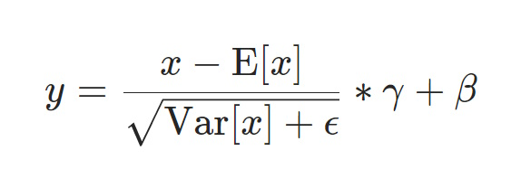
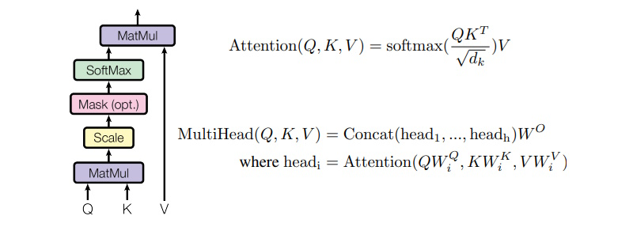
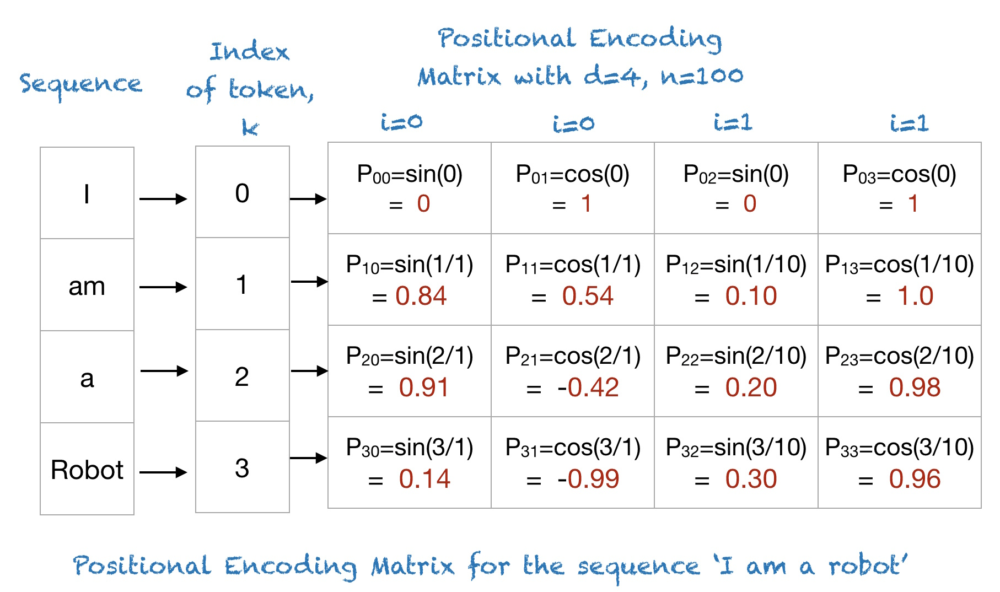
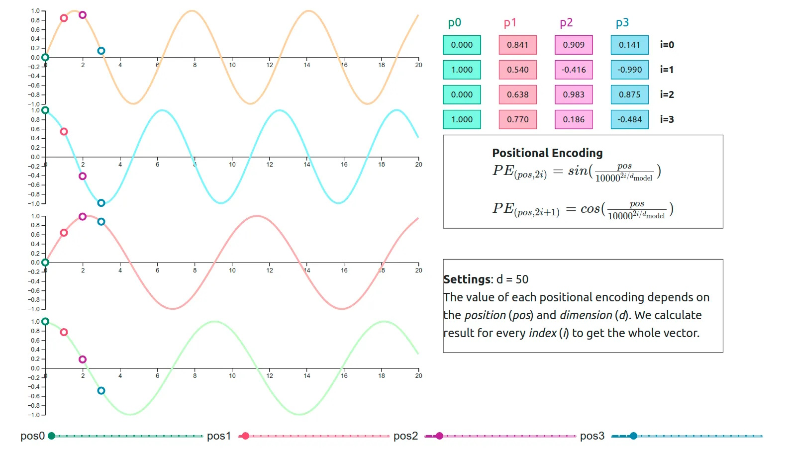
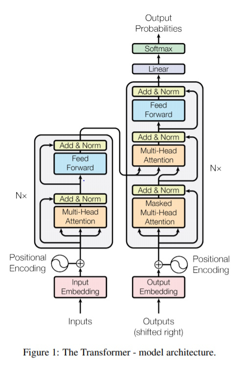

### [Chinese Version](vanilla_transformer_explained_zhtw.md)

# The Vanilla Transformer Explained: Key Concepts and Source Code

## Introduction

Transformer models have revolutionized the field of Natural Language Processing (NLP). Their ability to handle sequential data and capture long-range dependencies has made them a cornerstone in the development of state-of-the-art language models like BERT, GPT, and T5. Transformers eschew traditional recurrent neural network (RNN) architectures, enabling more efficient parallelization and improved performance on a wide array of NLP tasks.

## Overview of the Transformer Model
### Architecture
The Transformer model, introduced by Vaswani et al. in 2017, features an encoder-decoder architecture. Unlike RNNs, Transformers rely entirely on self-attention mechanisms to draw global dependencies between input and output. This architecture consists of stacked layers of encoders and decoders, each containing multi-head self-attention mechanisms and position-wise fully connected feed-forward networks.

### Key Components
#### Self-Attention Mechanism
Self-attention allows the model to weigh the importance of different words in a sentence when encoding a particular word. This mechanism computes a set of attention scores for each word pair in the input sequence, enabling the model to focus on relevant words when generating representations.

#### Multi-Head Attention
Multi-head attention extends the self-attention mechanism by employing multiple attention heads. Each head operates independently and the results are concatenated and linearly transformed. This allows the model to capture different aspects of the relationships between words.

#### Positional Encoding
Since Transformers do not inherently process input sequences in order, positional encoding is used to inject sequence order information. These encodings are added to the input embeddings and enable the model to recognize the position of each word within the sequence.

#### Feed-Forward Networks
Each encoder and decoder layer contains a position-wise feed-forward network that consists of two linear transformations with a ReLU activation in between. This network processes each position independently, contributing to the transformation of input embeddings into higher-level representations.

Transformers' architecture and these key components work together to handle complex language tasks efficiently and effectively, making them a fundamental tool in modern NLP.

### Model Parameters
Here is a detailed explanation of the model parameters provided in Transformer:

| Parameter      | Description                                                                                         | Example Value | Example Explanation                                                                              |
|----------------|-----------------------------------------------------------------------------------------------------|---------------|--------------------------------------------------------------------------------------------------|
| `batch_size`   | The number of samples processed together in one forward and backward pass through the network.      | 128           | If you have 1,280 samples and `batch_size` is 128, you will complete 10 iterations per epoch.   |
| `max_len`      | The maximum sequence length that the model will handle.                                             | 4096          | Sentences or sequences longer than 4096 tokens will be truncated or padded to this length.        |
| `d_model`      | The dimension of the input embeddings and the hidden states in the model.                           | 512           | Each word/token is represented by a 512-dimensional vector (so called token embeddings).          |
| `n_layers`     | The number of layers (or blocks) in the encoder and decoder of the transformer model.               | 6             | The encoder and decoder each have 6 stacked layers.                                              |
| `n_heads`      | The number of attention heads in the multi-head attention mechanism.                                | 8             | The attention mechanism splits into 8 separate heads to focus on different parts of the sequence.|
| `ffn_hidden`   | The number of units in the hidden layer of the position-wise feed-forward neural network.           | 2048          | The feed-forward network has a hidden layer with 2048 units.                                     |
| `drop_prob`    | The dropout probability used in various layers to prevent overfitting by randomly setting neurons to zero during training. | 0.1           | 10% of the neurons are randomly set to zero during each forward pass to prevent overfitting.     |


## Implementation of Transformer Model

### LayerNorm
The LayerNorm (Layer Normalization) class normalizes the input tensor along the last dimension, which is typically the feature dimension in a sequence. This helps in stabilizing the learning process and improves the convergence speed.




```python
class LayerNorm(nn.Module):
    def __init__(self, d_model, eps=1e-12):
        """
        Initializes the LayerNorm module.

        Args:
            d_model (int): Dimensionality of the input.
            eps (float): Small epsilon value to avoid division by zero.
        """
        super(LayerNorm, self).__init__()

        # 'gamma' and 'beta' are learnable parameters that scale and shift the normalized output, respectively. 
        # Initially, gamma is set to ones and beta is set to zeros.
        self.gamma = nn.Parameter(torch.ones(d_model))
        self.beta = nn.Parameter(torch.zeros(d_model))

        # a small epsilon value to avoid division by zero during normalization.
        self.eps = eps

    def forward(self, x):
        """
        Forward pass of the LayerNorm module.

        Args:
            x (torch.Tensor): Input tensor of shape [batch_size, seq_len, d_model].

        Returns:
            torch.Tensor: Normalized tensor of shape [batch_size, seq_len, d_model].
        """
        # Computes the mean of the input tensor x along the last dimension (d_model). The result has shape [batch_size, seq_len, 1].
        mean = x.mean(-1, keepdim=True)
        
        # Computes the variance of the input tensor x along the last dimension. The result also has shape [batch_size, seq_len, 1].
        var = x.var(-1, unbiased=False, keepdim=True)
        
        # Subtract the mean from the input tensor and divide by the standard deviation (square root of variance plus eps). 
        # This standardizes the input to have zero mean and unit variance.
        # The result out has shape [batch_size, seq_len, d_model].
        out = (x - mean) / torch.sqrt(var + self.eps)

        # Multiplies the normalized tensor element-wise to scale the normalized values. It has shape [d_model], but it is broadcasted to match the shape of out.
        # Adds to the scaled tensor element-wise to shift the normalized values. It also has shape [d_model], and it is broadcasted to match the shape of out.
        out = self.gamma * out + self.beta
        
        # The final output tensor has shape [batch_size, seq_len, d_model].
        return out
```
Summary:
- The input tensor `x` of shape `[batch_size, seq_len, d_model]` is normalized along the `d_model` dimension.
- The normalization process ensures that for each position in the sequence (for each `[batch_size, seq_len]`), the features (of length `d_model`) have a mean of 0 and a variance of 1.
- The learnable parameters `gamma` and `beta` then scale and shift these normalized values to allow the model to learn the optimal scaling and shifting for each feature dimension.

Resources
- **[Layer Normalization on Papers with Code](https://paperswithcode.com/method/layer-normalization)**
- **[Implementation of LayerNorm in PyTorch](https://pytorch.org/docs/stable/generated/torch.nn.LayerNorm.html#layernorm)**


### PositionwiseFeedForward
The PositionwiseFeedForward class applies a feed-forward neural network to each position of the input sequence independently. This is an essential component of the Transformer model, providing non-linearity and mixing the features after the self-attention mechanism.

```python
class PositionwiseFeedForward(nn.Module):
    def __init__(self, d_model, hidden, drop_prob=0.1):
        """
        Initializes the PositionwiseFeedForward module.

        Args:
            d_model (int): Dimensionality of the input.
            hidden (int): Number of hidden units in the feed-forward network.
            drop_prob (float): Dropout probability.
        """
        super(PositionwiseFeedForward, self).__init__()

        # 'linear1' A linear transformation that maps the input from d_model dimensions to hidden dimensions.
        self.linear1 = nn.Linear(d_model, hidden)
        
        # 'linear2' A linear transformation that maps the hidden layer back to d_model dimensions.
        self.linear2 = nn.Linear(hidden, d_model)

        self.relu = nn.ReLU()
        self.dropout = nn.Dropout(p=drop_prob)

    def forward(self, x):
        """
        Forward pass of the PositionwiseFeedForward module.

        Args:
            x (torch.Tensor): Input tensor of shape [batch_size, seq_len, d_model].

        Returns:
            torch.Tensor: Output tensor of shape [batch_size, seq_len, d_model].
        """
        x = self.linear1(x)  # [batch_size, seq_len, hidden]
        x = self.relu(x)  # [batch_size, seq_len, hidden]
        x = self.dropout(x)  # [batch_size, seq_len, hidden]
        x = self.linear2(x)  # [batch_size, seq_len, d_model]
        return x
```

Summary:
- Input: The input tensor x has shape [batch_size, seq_len, d_model].
- Linear1: The input is linearly transformed to shape [batch_size, seq_len, hidden].
- ReLU: The ReLU activation is applied, maintaining the shape [batch_size, seq_len, hidden].
- Dropout: Dropout is applied, maintaining the shape [batch_size, seq_len, hidden].
- Linear2: The output is linearly transformed back to shape [batch_size, seq_len, d_model].
- Output: The output tensor has the same shape as the input, [batch_size, seq_len, d_model].

This feed-forward network is applied independently to each position of the sequence, enabling the model to learn complex transformations and representations for each token in the sequence.


### ScaleDotProductAttention
The ScaleDotProductAttention class performs the scaled dot-product attention mechanism, a fundamental part of the Transformer model. This mechanism calculates the attention weights and applies them to the values to produce the output.

The self-attention mechanism can be mathematically described by the following formula:
Scaled Dot-Product Attention:
<br/>

Where:
- \( Q \) (Query) is a matrix of query vectors.
- \( K \) (Key) is a matrix of key vectors.
- \( V \) (Value) is a matrix of value vectors.
- \( d_k \) is the dimensionality of the key vectors (typically equal to the dimensionality of the queries and values).

```python
class ScaleDotProductAttention(nn.Module):
    def __init__(self):
        """
        Initializes the ScaleDotProductAttention module.
        """
        super(ScaleDotProductAttention, self).__init__()

        # This initializes the softmax layer, which will be used to convert the attention scores into probabilities.
        self.softmax = nn.Softmax(dim=-1)

    def forward(self, q, k, v, mask=None, e=1e-12):
        """
        Forward pass of the ScaleDotProductAttention module.

        Args:
            q (torch.Tensor): Query tensor of shape [batch_size, n_head, seq_len, d_tensor].
            k (torch.Tensor): Key tensor of shape [batch_size, n_head, seq_len, d_tensor].
            v (torch.Tensor): Value tensor of shape [batch_size, n_head, seq_len, d_tensor].
            mask (torch.Tensor, optional): Mask tensor of shape [batch_size, 1, seq_len, seq_len].
            e (float): Small epsilon value to avoid division by zero.

        Returns:
            torch.Tensor: Output tensor of shape [batch_size, n_head, seq_len, d_tensor].
            torch.Tensor: Attention scores tensor of shape [batch_size, n_head, seq_len, seq_len].
        """
        batch_size, head, length, d_tensor = k.size()
        k_t = k.transpose(2, 3)

        # The @ operator in Python is used for matrix multiplication. 
        # In this case, it's multiplying the query q and the transposed key k_t. 
        # This operation gives a measure of the alignment between the query and the key.
        
        # math.sqrt(d_tensor) is taking the square root of d_tensor, where d_tensor is likely the dimension of the key vectors. 
        # This is a scaling factor that is used in the Transformer model to prevent the dot product between the query and key 
        # from growing too large, which can lead to gradients that are too small and a model that is difficult to train.
        score = (q @ k_t) / math.sqrt(d_tensor)  # [batch_size, n_head, seq_len, seq_len]
        
        if mask is not None:
            # The masked_fill function is a PyTorch method that replaces certain elements of the score tensor based on the mask. 
            # Specifically, it replaces the elements where mask == 0 (i.e., where the mask is False) with the value -10000.
            # The value -10000 is used because the attention scores are typically passed through a softmax function, 
            # which converts them into probabilities. The softmax of -10000 is very close to 0, so this effectively masks out the 
            # corresponding elements in the attention scores, causing them to have very little impact on the final result.
            score = score.masked_fill(mask == 0, -10000)
        
        # The softmax function is used to convert the raw attention scores into probabilities. 
        # It does this by exponentiating each score and then dividing by the sum of all the exponentiated scores. 
        # This ensures that the attention scores are all between 0 and 1 and sum to 1, so they can be interpreted as probabilities.
        score = self.softmax(score)  # [batch_size, n_head, seq_len, seq_len]

        # The v variable is a tensor representing the value vectors, which are part of the input to the attention mechanism. 
        # The line v = score @ v performs a matrix multiplication between the score tensor and the value tensor. 
        # This operation computes a weighted sum of the value vectors, where the weights are given by the attention probabilities. 
        # This weighted sum is the output of the attention layer.
        v = score @ v  # [batch_size, n_head, seq_len, d_tensor]
        return v, score
```

Summary:
- Input: The input tensors q, k, and v have the shape [batch_size, n_head, seq_len, d_tensor].
- Transpose: The key tensor k is transposed to shape [batch_size, n_head, d_tensor, seq_len].
- Matrix Multiplication: Calculate the attention scores using the scaled dot-product, resulting in a score tensor of shape [batch_size, n_head, seq_len, - seq_len].
- Masking: Optionally mask certain positions in the score tensor.
- Softmax: Apply the softmax function to convert the scores to probabilities, maintaining the shape [batch_size, n_head, seq_len, seq_len].
- Output Calculation: Multiply the score tensor by the value tensor v to get the final output tensor of shape [batch_size, n_head, seq_len, d_tensor].
- Output: Return the output tensor and the attention scores tensor.


### MultiHeadAttention
The MultiHeadAttention class implements the multi-head attention mechanism used in the Transformer model. This mechanism allows the model to jointly attend to information from different representation subspaces at different positions.

```python
class MultiHeadAttention(nn.Module):
    def __init__(self, d_model, n_head):
        """
        Initializes the MultiHeadAttention module.

        Args:
            d_model (int): Dimension of token embeddings.
            n_head (int): Number of attention heads.
        """
        super(MultiHeadAttention, self).__init__()
        self.n_head = n_head
        self.attention = ScaleDotProductAttention()
        
        # Why Do We Need Linear Projections?
        # Dimensionality Transformation: The linear projections allow the model to transform the input tensor into different subspaces (query, key, and value spaces).
        # Learnable Parameters: By using linear layers for projections, the model introduces learnable parameters that can adapt during training. 
        # Handling Multiple Heads: When using multiple heads in multi-head attention, linear projections allow each head to have its own set of parameters for queries, keys, and values. 
        self.w_q = nn.Linear(d_model, d_model)
        self.w_k = nn.Linear(d_model, d_model)
        self.w_v = nn.Linear(d_model, d_model)
        
        self.w_concat = nn.Linear(d_model, d_model)

    def forward(self, q, k, v, mask=None):
        """
        Forward pass of the MultiHeadAttention module.

        Args:
            q (torch.Tensor): Query tensor of shape [batch_size, seq_len, d_model].
            k (torch.Tensor): Key tensor of shape [batch_size, seq_len, d_model].
            v (torch.Tensor): Value tensor of shape [batch_size, seq_len, d_model].
            mask (torch.Tensor, optional): Mask tensor of shape [batch_size, 1, seq_len, seq_len].

        Returns:
            torch.Tensor: Output tensor of shape [batch_size, seq_len, d_model].
        """
        # Linear Projections: 
        # The input tensors q, k, and v are projected into the query, key, and value spaces using linear transformations.
        q, k, v = self.w_q(q), self.w_k(k), self.w_v(v)  # [batch_size, seq_len, d_model]

        # Split into Multiple Heads: 
        # The projected tensors are split into n_head heads. Each head has a dimensionality of d_tensor = d_model // n_head.
        q, k, v = self.split(q), self.split(k), self.split(v)  # [batch_size, n_head, seq_len, d_tensor]

        # Scaled Dot-Product Attention:
        # The attention method applies scaled dot-product attention to the split tensors.
        out, attention = self.attention(q, k, v, mask=mask)  # [batch_size, n_head, seq_len, d_tensor]

        # Concatenate Heads:
        # The outputs of the multiple heads are concatenated back into a single tensor.
        out = self.concat(out)  # [batch_size, seq_len, d_model]

        # Final Linear Transformation:
        # The concatenated tensor is passed through a final linear transformation. 
        out = self.w_concat(out)  # [batch_size, seq_len, d_model]

        return out

    def split(self, tensor):
        """
        Splits the input tensor into multiple heads.

        Args:
            tensor (torch.Tensor): Input tensor of shape [batch_size, seq_len, d_model].

        Returns:
            torch.Tensor: Tensor split into heads of shape [batch_size, n_head, seq_len, d_tensor].
        """
        batch_size, length, d_model = tensor.size()

        # d_tensor is calculated as the integer division of 'dimension of token embeddings' by 'number of attention heads'.
        d_tensor = d_model // self.n_head

        # The tensor variable is then reshaped using the view method.
        # This method swaps two dimensions of the tensor with transpose method.
        tensor = tensor.view(batch_size, length, self.n_head, d_tensor).transpose(1, 2)
        return tensor

    def concat(self, tensor):
        """
        Concatenates the multi-head tensor back into a single tensor.

        Args:
            tensor (torch.Tensor): Input tensor of shape [batch_size, n_head, seq_len, d_tensor].

        Returns:
            torch.Tensor: Concatenated tensor of shape [batch_size, seq_len, d_model].
        """
        batch_size, head, length, d_tensor = tensor.size()

        # d_model is calculated as the product of 'number of attention heads' and d_tensor
        d_model = head * d_tensor

        # The transpose method is called on the tensor to swap the second and third dimensions:
        #   [batch_size, head, length, d_tensor] => [batch_size, length, head, d_tensor]
        # The contiguous method is called to ensure that the tensor is stored in a contiguous block of memory.
        # The view method is used to reshape the tensor (d_model == head * d_tensor):
        #   [batch_size, length, head, d_tensor] => [batch_size, length, d_model] 
        tensor = tensor.transpose(1, 2).contiguous().view(batch_size, length, d_model)
        return tensor
```

Summary:
- Input: Tensors q, k, v with shape [batch_size, seq_len, d_model].
- Linear Projections: Project to shape [batch_size, seq_len, d_model].
- Split: Split into n_head heads, shape [batch_size, n_head, seq_len, d_tensor].
- Attention: Apply scaled dot-product attention, shape [batch_size, n_head, seq_len, d_tensor].
- Concat: Concatenate heads, shape [batch_size, seq_len, d_model].
- Linear Transformation: Apply final linear transformation, shape [batch_size, seq_len, d_model].
- Output: Return tensor of shape [batch_size, seq_len, d_model].


### TokenEmbedding
The TokenEmbedding class is a subclass of nn.Embedding from PyTorch. It is used to convert token indices into dense vectors of a fixed size (d_model). This is typically the first layer in a neural network that processes sequences of tokens, such as words in a sentence.

Reference: [Definition of nn.Embedding](https://pytorch.org/docs/stable/generated/torch.nn.Embedding.html)

```python
class TokenEmbedding(nn.Embedding):
    def __init__(self, vocab_size, d_model):
        """
        Initializes the TokenEmbedding module.

        Args:
            vocab_size (int): The number of unique tokens in the vocabulary.
            d_model (int): Dimensionality of the embeddings.
        """
        super(TokenEmbedding, self).__init__(vocab_size, d_model, padding_idx=1)
```

Example:
1. Vocabulary and Embedding Dimension:
    - Suppose the `vocab_size` is 10,000 (i.e., there are 10,000 unique tokens).
    - Suppose `d_model` is 512 (i.e., each token is represented by a 512-dimensional vector).
2. Input Tensor:
    - Assume the input tensor is `x`, with shape `(batch_size, seq_len)`, where:
        - `batch_size` is the number of sequences (e.g., sentences) in the batch.
        - `seq_len` is the length of each sequence.
    ```python
    # Example input tensor with batch_size=2 and seq_len=3
    x = torch.tensor([[2, 4, 1], [3, 5, 1]])
    ```
3. Embedding Lookup:
    - The `TokenEmbedding` layer processes the input tensor `x` and looks up the embedding vectors for each token index.
    - The output tensor will have the shape `(batch_size, seq_len, d_model)`.
    ```python
    # Assuming the embedding layer is initialized
    embedding_layer = TokenEmbedding(vocab_size=10000, d_model=512)

    # Forward pass
    embeddings = embedding_layer(x)
    ```
    - If `x` is `[[2, 4, 1], [3, 5, 1]]` and `d_model` is 512:
        - The embedding for token `2` is a 512-dimensional vector.
        - The embedding for token `4` is a 512-dimensional vector.
        - The embedding for token `1` (padding) is a 512-dimensional zero vector.
    - The output `embeddings` will have the shape `(2, 3, 512)`, where:
        - The first dimension is the batch size (2).
        - The second dimension is the sequence length (3).
        - The third dimension is the embedding size (512).

Summary:<br/>
The `TokenEmbedding` class transforms token indices into dense vectors (embeddings) using an embedding matrix. The embedding matrix is learned during training, allowing the model to capture semantic information about the tokens. The process involves looking up each token index in the embedding matrix and returning the corresponding embedding vector. This is essential for converting discrete tokens into continuous representations that can be processed by neural networks.


### PositionalEncoding
The PositionalEncoding class adds positional information to the token embeddings. This is important in transformer models because, unlike recurrent neural networks, transformers do not inherently capture the order of the input tokens. Positional encoding helps the model understand the position of each token in the sequence.

Positional Encoding Visualization:
<br>
<br>

```python
class PositionalEncoding(nn.Module):
    def __init__(self, d_model, max_len, device):
        """
        Initializes the PositionalEncoding module.

        Args:
            d_model (int): Dimensionality of the model's hidden states.
            max_len (int): Maximum length of the input sequences.
            device (torch.device): Device to run the model on (CPU or GPU).
        """
        super(PositionalEncoding, self).__init__()
        self.encoding = torch.zeros(max_len, d_model, device=device)
        self.encoding.requires_grad = False

        # The pos variable is a tensor that contains the positions, which are just the integers from 0 to max_len - 1. 
        # The unsqueeze method is called to add an extra dimension to this tensor, turning it from a 1D tensor into a 2D tensor.
        pos = torch.arange(0, max_len, device=device)
        pos = pos.float().unsqueeze(dim=1)

        # The _2i variable is a tensor that contains the even integers from 0 to d_model - 1. 
        # This is used to create different positional encodings for the even and odd positions.
        _2i = torch.arange(0, d_model, step=2, device=device).float()

        # [:, 0::2] line is applying a sine function to the positions and storing the result in the even columns of self.encoding.
        # [:, 1::2] line is doing the same with a cosine function for the odd columns. 
        # The positions are divided by (10000 ** (_2i / d_model)) to ensure that the positional encoding varies smoothly and slowly with the position.
        # This division operation results in different frequencies of the sine and cosine functions for different dimensions, 
        # which allows the model to learn to attend to relative positions.
        self.encoding[:, 0::2] = torch.sin(pos / (10000 ** (_2i / d_model)))
        self.encoding[:, 1::2] = torch.cos(pos / (10000 ** (_2i / d_model)))

    def forward(self, x):
        """
        Forward pass of the PositionalEncoding module.

        Args:
            x (torch.Tensor): Input tensor of shape [batch_size, seq_len].

        Returns:
            torch.Tensor: Positional encoding tensor of shape [seq_len, d_model].
        """
        batch_size, seq_len = x.size()

        # The [:seq_len, :] part is slicing the tensor to select only the first seq_len rows.
        # This operation ensures that the encoding is the same length as the sequences.
        # The unsqueeze(0) method is called to add an extra dimension to the tensor at the beginning. 
        # The expand(batch_size, -1, -1) method is called to repeat the tensor along the specified dimensions.
        return self.encoding[:seq_len, :].unsqueeze(0).expand(batch_size, -1, -1)
```

References on Positional Encoding in Transformer Models:
- [A Gentle Introduction to Positional Encoding in Transformer Models (Part 1)](https://machinelearningmastery.com/a-gentle-introduction-to-positional-encoding-in-transformer-models-part-1/)
- [Understanding Positional Encoding in Transformers](https://towardsdatascience.com/understanding-positional-encoding-in-transformers-dc6bafc021ab)


### TransformerEmbedding
The TransformerEmbedding class combines token embeddings and positional encodings to produce the input embeddings for the transformer model. This class ensures that the model can incorporate both the semantic information of the tokens and their positional information within the sequence.

```python
class TransformerEmbedding(nn.Module):
    def __init__(self, vocab_size, d_model, max_len, drop_prob, device):
        """
        Initializes the TransformerEmbedding module.

        Args:
            vocab_size (int): Size of the vocabulary.
            d_model (int): Dimensionality of the token embeddings.
            max_len (int): Maximum length of the input sequences.
            drop_prob (float): Dropout probability.
            device (torch.device): Device to run the model on (CPU or GPU).
        """
        super(TransformerEmbedding, self).__init__()
        self.tok_emb = TokenEmbedding(vocab_size, d_model)
        self.pos_emb = PositionalEncoding(d_model, max_len, device)
        self.drop_out = nn.Dropout(p=drop_prob)

    def forward(self, x):
        """
        Forward pass of the TransformerEmbedding module.

        Args:
            x (torch.Tensor): Input tensor of shape [batch_size, seq_len].

        Returns:
            torch.Tensor: Embedded tensor of shape [batch_size, seq_len, d_model].
        """
        # convert the token IDs into token embeddings
        # generate positional embeddings
        tok_emb = self.tok_emb(x)       
        pos_emb = self.pos_emb(x)       

        # The tok_emb + pos_emb operation is adding the token embeddings and the positional embeddings together. 
        # This is done to combine the information about the tokens and their positions into a single representation. 
        # This combined representation is then returned as the output of this code block.
        return self.drop_out(tok_emb + pos_emb)
```
Summary:
1. Token Embeddings:
    - The input tensor `x` of shape `(batch_size, seq_len)` contains token indices.
    - These indices are converted into dense vectors by the `TokenEmbedding` layer, resulting in a tensor of shape `(batch_size, seq_len, d_model)`.
2. Positional Encodings:
    - The positional encoding matrix is precomputed during initialization and has the shape `(max_len, d_model)`.
    - During the forward pass, the relevant slice of this matrix is extracted to match the sequence length (`seq_len`), resulting in a tensor of shape `(seq_len, d_model)`.
    - This slice is then expanded to match the batch size, resulting in a tensor of shape `(batch_size, seq_len, d_model)`.
3. Combining and Dropout:
    - The token embeddings and positional encodings are added together element-wise.
    - The combined tensor is then passed through a dropout layer to prevent overfitting.
    - The final output tensor has the shape `(batch_size, seq_len, d_model)`.


### EncoderLayer
The EncoderLayer class implements a single layer of the transformer encoder. Each encoder layer consists of a multi-head self-attention mechanism followed by a position-wise feed-forward network. Layer normalization and dropout are applied at various points to ensure stability and prevent overfitting.

```python
class EncoderLayer(nn.Module):
    def __init__(self, d_model, ffn_hidden, n_head, drop_prob):
        """
        Initializes the EncoderLayer module.

        Args:
            d_model (int): Dimensionality of the model's hidden states.
            ffn_hidden (int): Number of hidden units in the feed-forward network.
            n_head (int): Number of attention heads.
            drop_prob (float): Dropout probability.
        """
        super(EncoderLayer, self).__init__()
        self.attention = MultiHeadAttention(d_model=d_model, n_head=n_head)
        self.norm1 = LayerNorm(d_model=d_model)
        self.dropout1 = nn.Dropout(p=drop_prob)
        self.ffn = PositionwiseFeedForward(d_model=d_model, hidden=ffn_hidden, drop_prob=drop_prob)
        self.norm2 = LayerNorm(d_model=d_model)
        self.dropout2 = nn.Dropout(p=drop_prob)

    def forward(self, x, src_mask):
        """
        Forward pass of the EncoderLayer module.

        Args:
            x (torch.Tensor): Input tensor of shape [batch_size, seq_len, d_model].
            src_mask (torch.Tensor): Source mask tensor of shape [batch_size, 1, 1, src_seq_len].

        Returns:
            torch.Tensor: Output tensor of shape [batch_size, seq_len, d_model].
        """
        # Save the input tensor for the residual connection
        _x = x

        # Apply multi-head attention
        # Apply dropout after attention
        # Apply residual connection and layer normalization
        x = self.attention(q=x, k=x, v=x, mask=src_mask)  # [batch_size, seq_len, d_model]
        x = self.dropout1(x)                              # [batch_size, seq_len, d_model]
        x = self.norm1(x + _x)                            # [batch_size, seq_len, d_model]

        # Save the intermediate output for the next residual connection
        _x = x
        
        # Apply position-wise feed-forward network
        # Apply dropout after feed-forward network
        # Apply residual connection and layer normalization
        x = self.ffn(x)         # [batch_size, seq_len, d_model]
        x = self.dropout2(x)    # [batch_size, seq_len, d_model]
        x = self.norm2(x + _x)  # [batch_size, seq_len, d_model]
        return x
```
Summary: <br/>
By processing the input tensor through these steps, the EncoderLayer effectively captures both local and global dependencies within the sequence, stabilizes training with normalization, and prevents overfitting with dropout. This process is repeated for each layer in the encoder stack, allowing the model to build increasingly complex representations of the input data.


### Encoder
The Encoder class is part of the transformer architecture. It consists of multiple layers, each containing a multi-head self-attention mechanism and a feed-forward network. This class handles the embedding of input tokens, applies positional encodings, and processes the input through several encoder layers.

```python
class Encoder(nn.Module):
    def __init__(self, enc_voc_size, max_len, d_model, ffn_hidden, n_head, n_layers, drop_prob, device):
        """
        Initializes the Encoder module.

        Args:
            enc_voc_size (int): Size of the encoder's vocabulary.
            max_len (int): Maximum length of the input sequences.
            d_model (int): Dimensionality of the model's hidden states.
            ffn_hidden (int): Number of hidden units in the feed-forward network.
            n_head (int): Number of attention heads.
            n_layers (int): Number of encoder layers.
            drop_prob (float): Dropout probability.
            device (torch.device): Device to run the model on (CPU or GPU).
        """
        super().__init__()

        # Initialize the embedding layer which combines token embeddings and positional encodings
        self.emb = TransformerEmbedding(d_model=d_model,
                                        max_len=max_len,
                                        vocab_size=enc_voc_size,
                                        drop_prob=drop_prob,
                                        device=device)
        
        # Initialize a stack of encoder layers
        self.layers = nn.ModuleList([EncoderLayer(d_model=d_model,
                                                  ffn_hidden=ffn_hidden,
                                                  n_head=n_head,
                                                  drop_prob=drop_prob)
                                     for _ in range(n_layers)])

    def forward(self, x, src_mask):
        """
        Forward pass of the Encoder module.

        Args:
            x (torch.Tensor): Input tensor of shape [batch_size, seq_len].
            src_mask (torch.Tensor): Source mask tensor of shape [batch_size, 1, 1, src_seq_len].

        Returns:
            torch.Tensor: Encoded tensor of shape [batch_size, seq_len, d_model].
        """
        # Apply token embedding and positional encoding
        x = self.emb(x)  # [batch_size, seq_len, d_model]
        
        # Pass the input through each encoder layer
        for layer in self.layers:
            x = layer(x, src_mask)  # [batch_size, seq_len, d_model]
        
        return x
```
Summary:
1. Token Embedding and Positional Encoding:
    - The input tensor of token indices is transformed into a dense representation by the `TransformerEmbedding` layer.
    - This layer combines token embeddings and positional encodings, resulting in a tensor of shape `[batch_size, seq_len, d_model]`.
2. Encoder Layers:
    - Each `EncoderLayer` applies the following operations:
        - Multi-Head Attention:
            - Computes attention scores, applies the source mask, and generates context vectors.
            - Output Shape: `[batch_size, seq_len, d_model]`
        - Add & Normalize:
            - Applies residual connections and layer normalization.
            - Output Shape: `[batch_size, seq_len, d_model]`
        - Feed-Forward Network:
            - Applies two linear transformations with a ReLU activation in between.
            - Output Shape: `[batch_size, seq_len, d_model]`
        - Add & Normalize:
            - Applies residual connections and layer normalization.
            - Output Shape: `[batch_size, seq_len, d_model]`

By passing the input tensor through these steps, the `Encoder` class builds a complex representation of the input sequence, capturing both local and global dependencies within the data. The final output tensor can then be used as input to the decoder or for other downstream tasks.


### DecoderLayer
The `DecoderLayer` class is part of the transformer architecture and represents a single layer in the decoder. Each decoder layer consists of three main components:

1. **Self-Attention Mechanism**: Attends to the previous positions in the target sequence.
2. **Encoder-Decoder Attention Mechanism**: Attends to the encoder's output.
3. **Feed-Forward Network**: Applies non-linearity and projection.

Layer normalization and dropout are applied at various points to ensure stability and prevent overfitting.

```python
class DecoderLayer(nn.Module):
    def __init__(self, d_model, ffn_hidden, n_head, drop_prob):
        """
        Initializes the DecoderLayer module.

        Args:
            d_model (int): Dimensionality of the model's hidden states.
            ffn_hidden (int): Number of hidden units in the feed-forward network.
            n_head (int): Number of attention heads.
            drop_prob (float): Dropout probability.
        """
        super(DecoderLayer, self).__init__()

        self.self_attention = MultiHeadAttention(d_model=d_model, n_head=n_head)    # Self-attention mechanism
        self.norm1 = LayerNorm(d_model=d_model)     # Layer normalization after self-attention
        self.dropout1 = nn.Dropout(p=drop_prob)     # Dropout after self-attention
        self.enc_dec_attention = MultiHeadAttention(d_model=d_model, n_head=n_head) # Encoder-decoder attention mechanism
        self.norm2 = LayerNorm(d_model=d_model)     # Layer normalization after encoder-decoder attention
        self.dropout2 = nn.Dropout(p=drop_prob)     # Dropout after encoder-decoder attention
        self.ffn = PositionwiseFeedForward(d_model=d_model, hidden=ffn_hidden, drop_prob=drop_prob) # Position-wise feed-forward network
        self.norm3 = LayerNorm(d_model=d_model)     # Layer normalization after feed-forward network
        self.dropout3 = nn.Dropout(p=drop_prob)     # Dropout after feed-forward network

    def forward(self, dec, enc, trg_mask, src_mask):
        """
        Forward pass of the DecoderLayer module.

        Args:
            dec (torch.Tensor): Decoder input tensor of shape [batch_size, trg_seq_len, d_model].
            enc (torch.Tensor): Encoded source tensor of shape [batch_size, src_seq_len, d_model].
            trg_mask (torch.Tensor): Target mask tensor of shape [batch_size, 1, trg_seq_len, trg_seq_len].
            src_mask (torch.Tensor): Source mask tensor of shape [batch_size, 1, 1, src_seq_len].

        Returns:
            torch.Tensor: Output tensor of shape [batch_size, trg_seq_len, d_model].
        """
        # 1. Self-attention with masking to prevent attending to future tokens
        _x = dec

        # Applies multi-head self-attention to the decoder input.
        # Prevents attending to future tokens in the target sequence using `trg_mask`.
        x = self.self_attention(q=dec, k=dec, v=dec, mask=trg_mask)  # [batch_size, trg_seq_len, d_model]
        
        # Applies dropout to the self-attention output.
        # Adds the original input tensor `_x` (residual connection) and applies layer normalization. 
        # The output tensor `x` retains the shape `[batch_size, trg_seq_len, d_model]`.
        x = self.dropout1(x)    # [batch_size, trg_seq_len, d_model]
        x = self.norm1(x + _x)  # [batch_size, trg_seq_len, d_model]
        
        # 2.Dropout after feed-forward network
        if enc is not None:
            _x = x
            # Applies multi-head attention to the combined encoder and decoder outputs.
            # Uses the encoder's output `enc` as the key and value, and the decoder's self-attention output `x` as the query.
            # Applies `src_mask` to prevent attending to padding tokens in the source sequence.
            x = self.enc_dec_attention(q=x, k=enc, v=enc, mask=src_mask)  # [batch_size, trg_seq_len, d_model]
            x = self.dropout2(x)    # [batch_size, trg_seq_len, d_model]
            x = self.norm2(x + _x)  # [batch_size, trg_seq_len, d_model]
        
        # 3. Feed-forward network
        _x = x

        # Consists of two linear transformations with a ReLU activation in between.
        # The output tensor `x` retains the shape `[batch_size, trg_seq_len, d_model]`.
        x = self.ffn(x)  # [batch_size, trg_seq_len, d_model]

        # Applies dropout to the feed-forward network output.
        # Adds the previous input tensor `_x` (residual connection) and applies layer normalization. 
        # The final output tensor `x` has the shape `[batch_size, trg_seq_len, d_model]`.
        x = self.dropout3(x)    # [batch_size, trg_seq_len, d_model]
        x = self.norm3(x + _x)  # [batch_size, trg_seq_len, d_model]
        return x
```
Summary:<br/>
By processing the input tensor through these steps, the `DecoderLayer` effectively attends to both the target sequence and the encoded source sequence, allowing the model to generate predictions that are informed by both the context of the target and the information in the source. This process is repeated for each layer in the decoder stack, enabling the model to build increasingly complex representations of the target sequence conditioned on the source sequence.


### Decoder
The Decoder class is part of the transformer architecture and represents the entire decoder component of the model. It consists of multiple layers, each containing self-attention, encoder-decoder attention, and a feed-forward network. This class handles the embedding of target tokens, processes them through several decoder layers, and finally projects the output to the vocabulary size.

```python
class Decoder(nn.Module):
    def __init__(self, dec_voc_size, max_len, d_model, ffn_hidden, n_head, n_layers, drop_prob, device):
        """
        Initializes the Decoder module.

        Args:
            dec_voc_size (int): Size of the decoder's vocabulary.
            max_len (int): Maximum length of the input sequences.
            d_model (int): Dimensionality of the model's hidden states.
            ffn_hidden (int): Number of hidden units in the feed-forward network.
            n_head (int): Number of attention heads.
            n_layers (int): Number of decoder layers.
            drop_prob (float): Dropout probability.
            device (torch.device): Device to run the model on (CPU or GPU).
        """
        super().__init__()
        
        # Initialize the embedding layer which combines token embeddings and positional encodings
        self.emb = TransformerEmbedding(d_model=d_model,
                                        drop_prob=drop_prob,
                                        max_len=max_len,
                                        vocab_size=dec_voc_size,
                                        device=device)
        
        # Initialize a stack of decoder layers
        self.layers = nn.ModuleList([DecoderLayer(d_model=d_model,
                                                  ffn_hidden=ffn_hidden,
                                                  n_head=n_head,
                                                  drop_prob=drop_prob)
                                     for _ in range(n_layers)])
        
        # Linear layer to project the output to the size of the vocabulary
        self.linear = nn.Linear(d_model, dec_voc_size)

    def forward(self, trg, enc_src, trg_mask, src_mask):
        """
        Forward pass of the Decoder module.

        Args:
            trg (torch.Tensor): Target input sequences (decoder input), shape [batch_size, trg_seq_len].
            enc_src (torch.Tensor): Encoded source sequences (encoder output), shape [batch_size, src_seq_len, d_model].
            trg_mask (torch.Tensor): Target mask for self-attention, shape [batch_size, 1, trg_seq_len, trg_seq_len].
            src_mask (torch.Tensor): Source mask for encoder-decoder attention, shape [batch_size, 1, 1, src_seq_len].

        Returns:
            torch.Tensor: Output logits for each token in the target vocabulary, shape [batch_size, trg_seq_len, dec_voc_size].
        """
        # Apply token embedding and positional encoding
        trg = self.emb(trg)  # [batch_size, trg_seq_len, d_model]
        
        # Pass the input through each decoder layer
        for layer in self.layers:
            trg = layer(trg, enc_src, trg_mask, src_mask)  # [batch_size, trg_seq_len, d_model]
        
        # Apply the final linear layer to project to the vocabulary size
        output = self.linear(trg)  # [batch_size, trg_seq_len, dec_voc_size]
        return output
```
Summary:
1. Token Embedding and Positional Encoding:
    - The target token indices are transformed into a dense representation by the `TransformerEmbedding` layer.
    - This layer combines token embeddings and positional encodings, resulting in a tensor of shape `[batch_size, trg_seq_len, d_model]`.
2. Decoder Layers:
    - Each `DecoderLayer` applies the following operations:
        - Self-Attention:
            - Computes attention scores within the target sequence.
            - Prevents attending to future positions using the target mask `trg_mask`.
            - Output Shape: `[batch_size, trg_seq_len, d_model]`
        - Encoder-Decoder Attention:
            - Computes attention scores using the encoder's output as key and value, and the decoder's self-attention output as query.
            - Applies the source mask `src_mask` to prevent attending to padding tokens.
            - Output Shape: `[batch_size, trg_seq_len, d_model]`
        - Feed-Forward Network:
            - Applies two linear transformations with a ReLU activation in between.
            - Output Shape: `[batch_size, trg_seq_len, d_model]`
        - Dropout and Residual Connections:
            - Adds residual connections and applies dropout and layer normalization at each step.
3. Final Linear Projection:
    - The final decoder output tensor is projected to the size of the vocabulary using a linear layer.
    - This produces the logits for each token in the target vocabulary.
    - Final Output Shape: `[batch_size, trg_seq_len, dec_voc_size]`

By processing the target tensor through these steps, the `Decoder` class generates predictions for each position in the target sequence, conditioned on both the previous positions in the target sequence and the encoded source sequence. This process allows the model to generate sequences in a sequential manner, effectively leveraging the context provided by the source sequence.


### Transformer
The Transformer class is the core of the transformer architecture, combining both the encoder and decoder components. It handles input masking, processes the input sequences through the encoder and decoder, and outputs logits for each token in the target vocabulary.



```python
class Transformer(nn.Module):
    def __init__(self, src_pad_idx, trg_pad_idx, trg_sos_idx, enc_voc_size, dec_voc_size, d_model, n_head, max_len,
                 ffn_hidden, n_layers, drop_prob, device):
        """
        Initializes the Transformer module.

        Args:
            src_pad_idx (int): Padding index for source sequences.
            trg_pad_idx (int): Padding index for target sequences.
            trg_sos_idx (int): Start-of-sequence index for target sequences.
            enc_voc_size (int): Size of the encoder's vocabulary.
            dec_voc_size (int): Size of the decoder's vocabulary.
            d_model (int): Dimensionality of the model's hidden states.
            n_head (int): Number of attention heads.
            max_len (int): Maximum length of the input sequences.
            ffn_hidden (int): Number of hidden units in the feed-forward network.
            n_layers (int): Number of encoder and decoder layers.
            drop_prob (float): Dropout probability.
            device (torch.device): Device to run the model on (CPU or GPU).
        """
        super().__init__()
        self.src_pad_idx = src_pad_idx
        self.trg_pad_idx = trg_pad_idx
        self.trg_sos_idx = trg_sos_idx
        self.device = device
        self.encoder = Encoder(d_model=d_model,
                               n_head=n_head,
                               max_len=max_len,
                               ffn_hidden=ffn_hidden,
                               enc_voc_size=enc_voc_size,
                               drop_prob=drop_prob,
                               n_layers=n_layers,
                               device=device)
        self.decoder = Decoder(d_model=d_model,
                               n_head=n_head,
                               max_len=max_len,
                               ffn_hidden=ffn_hidden,
                               dec_voc_size=dec_voc_size,
                               drop_prob=drop_prob,
                               n_layers=n_layers,
                               device=device)

    def forward(self, src, trg):
        """
        Forward pass of the Transformer module.

        Args:
            src (torch.Tensor): Source input sequences, shape [batch_size, src_seq_len].
            trg (torch.Tensor): Target input sequences, shape [batch_size, trg_seq_len].

        Returns:
            torch.Tensor: Output logits for each token in the target vocabulary, shape [batch_size, trg_seq_len, dec_voc_size].
        """
        src_mask = self.make_src_mask(src)  # [batch_size, 1, 1, src_seq_len]
        trg_mask = self.make_trg_mask(trg)  # [batch_size, 1, trg_seq_len, trg_seq_len]
        enc_src = self.encoder(src, src_mask)  # [batch_size, src_seq_len, d_model]
        output = self.decoder(trg, enc_src, trg_mask, src_mask)  # [batch_size, trg_seq_len, dec_voc_size]
        return output

    def make_src_mask(self, src):
        """
        Creates a source mask to hide padding tokens.

        Args:
            src (torch.Tensor): Source input sequences, shape [batch_size, src_seq_len].

        Returns:
            torch.Tensor: Source mask tensor, shape [batch_size, 1, 1, src_seq_len].
        """
        # The expression src != self.src_pad_idx is creating a boolean mask that indicates where the tokens in the input 
        # are not equal to self.src_pad_idx. 
        # This src_pad_idx is likely the special token ID used for padding. 
        # Padding is used in batch processing to make all sequences in a batch the same length by adding special padding tokens 
        # to the end of the shorter sequences.

        # The unsqueeze(1).unsqueeze(2) part is calling the unsqueeze method twice to add two extra dimensions to the mask. 
        #   [batch_size, src_seq_len] => [batch_size, 1, 1, src_seq_len]
        # The unsqueeze method in PyTorch is used to add an extra dimension to a tensor at the specified position. 
        # This is often done to match the shape requirements of subsequent operations.
        src_mask = (src != self.src_pad_idx).unsqueeze(1).unsqueeze(2)
        return src_mask

    def make_trg_mask(self, trg):
        """
        Creates a target mask to hide padding tokens and future tokens.

        Args:
            trg (torch.Tensor): Target input sequences, shape [batch_size, trg_seq_len].

        Returns:
            torch.Tensor: Target mask tensor, shape [batch_size, 1, trg_seq_len, trg_seq_len].
        """
        # The unsqueeze(1).unsqueeze(3) part is calling the unsqueeze method twice to add two extra dimensions to the mask. 
        #   [batch_size, trg_seq_len] => [batch_size, 1, trg_seq_len, 1]
        # The unsqueeze method in PyTorch is used to add an extra dimension to a tensor at the specified position.
        trg_pad_mask = (trg != self.trg_pad_idx).unsqueeze(1).unsqueeze(3)  # [batch_size, 1, trg_seq_len, 1]
        trg_len = trg.shape[1]

        # The trg_sub_mask is a lower triangular matrix of ones, created using the torch.tril function. 
        # This mask is used in the decoder to ensure that the predictions for each token only depend on the earlier tokens in the sequence. 
        # This is necessary because during training, the entire output sequence is passed into the decoder at once, 
        # but during inference, the output sequence is generated one token at a time.
        trg_sub_mask = torch.tril(torch.ones(trg_len, trg_len)).type(torch.ByteTensor).to(self.device) # [trg_seq_len, trg_seq_len]

        # Finally, the trg_mask is the logical AND of the trg_pad_mask and the trg_sub_mask. 
        # This mask is used in the attention mechanism in the decoder to prevent the model from attending to the 
        # padding tokens and the future tokens.
        trg_mask = trg_pad_mask & trg_sub_mask  # [batch_size, 1, trg_seq_len, trg_seq_len]
        return trg_mask
```
Summary:
1. Source Mask (`make_src_mask`):
    - The source mask is created by comparing the source tensor `src` with the padding index `src_pad_idx`.
    - The resulting mask has the shape `[batch_size, 1, 1, src_seq_len]`, where padding tokens are masked out.
2. Target Mask (`make_trg_mask`):
    - The target mask is created by comparing the target tensor `trg` with the padding index `trg_pad_idx`.
    - An additional lower triangular mask (`trg_sub_mask`) is created to prevent attending to future tokens.
    - The combined target mask has the shape `[batch_size, 1, trg_seq_len, trg_seq_len]`.
3. Encoding:
    - The source tensor `src` is passed through the encoder along with the source mask `src_mask`.
    - The encoder processes the input sequences through its embedding, positional encoding, and multiple encoder layers.
    - The encoder output `enc_src` has the shape `[batch_size, src_seq_len, d_model]`.
4. Decoding:
    - The target tensor `trg` is passed through the decoder along with the encoder output `enc_src`, target mask `trg_mask`, and source mask `src_mask`.
    - The decoder processes the input sequences through its embedding, positional encoding, and multiple decoder layers.
    - The final decoder output is projected to the size of the vocabulary using a linear layer.
    - The output tensor has the shape `[batch_size, trg_seq_len, dec_voc_size]`.

By processing the source and target tensors through these steps, the `Transformer` class enables sequence-to-sequence modeling, where the model learns to generate target sequences conditioned on the input source sequences. The use of masking ensures that the model attends to the appropriate tokens and prevents information leakage from future tokens in the target sequence.


## Calling Sequence Explanation

### Constructing the Transformer
This tree view introduces the calling sequence for the Transformer.__init__() method, outlining the hierarchical structure and detailed steps of how each component and sub-component is set up during the initialization process.

```
Transformer.__init__()
│
├── Encoder.__init__(d_model=d_model, n_head=n_head, max_len=max_len,...)
│   ├── TransformerEmbedding.__init__(d_model=d_model, drop_prob=drop_prob,...)
│   │   ├── TokenEmbedding.__init__(vocab_size=enc_voc_size, d_model=d_model)
│   │   └── PositionalEncoding.__init__(d_model=d_model, max_len=max_len, device=device)
│   │
│   └── EncoderLayer.__init__(d_model=d_model, ffn_hidden=ffn_hidden,...)
│       ├── MultiHeadAttention.__init__(d_model=d_model, n_head=n_head)
│       │   └── ScaleDotProductAttention.__init__()
│       │
│       ├── LayerNorm.__init__(d_model=d_model)
│       ├── PositionwiseFeedForward.__init__(d_model=d_model, hidden=ffn_hidden, drop_prob=drop_prob)
│       ├── LayerNorm.__init__(d_model=d_model)
│       └── Dropout.__init__(p=drop_prob)
│
└── Decoder.__init__(d_model=d_model, n_head=n_head, max_len=max_len,...)
    ├── TransformerEmbedding.__init__(d_model=d_model, drop_prob=drop_prob,...)
    │   ├── TokenEmbedding.__init__(vocab_size=dec_voc_size, d_model=d_model)
    │   └── PositionalEncoding.__init__(d_model=d_model, max_len=max_len, device=device)
    │
    └── DecoderLayer.__init__(d_model=d_model, ffn_hidden=ffn_hidden,...)
        ├── MultiHeadAttention.__init__(d_model=d_model, n_head=n_head)
        │   └── ScaleDotProductAttention.__init__()
        │
        ├── LayerNorm.__init__(d_model=d_model)
        ├── MultiHeadAttention.__init__(d_model=d_model, n_head=n_head)
        │   └── ScaleDotProductAttention.__init__()
        │
        ├── LayerNorm.__init__(d_model=d_model)
        ├── PositionwiseFeedForward.__init__(d_model=d_model, hidden=ffn_hidden, drop_prob=drop_prob)
        ├── LayerNorm.__init__(d_model=d_model)
        └── Dropout.__init__(p=drop_prob)
```

### Forward Pass
This tree view introduces the calling sequence for the Transformer.forward() method, outlining the hierarchical structure and detailed steps of how each component and sub-component is processed during the forward pass.

```
Transformer.forward(src, trg)
│
├── make_src_mask(src)
│   ├── (src != self.src_pad_idx)
│   ├── .unsqueeze(1)
│   └── .unsqueeze(2)
│
├── make_trg_mask(trg)
│   ├── (trg != self.trg_pad_idx)
│   ├── .unsqueeze(1)
│   ├── .unsqueeze(3)
│   ├── trg.shape[1]
│   ├── torch.tril(torch.ones(trg_len, trg_len)).type(torch.ByteTensor).to(self.device)
│   └── trg_pad_mask & trg_sub_mask
│
├── Encoder.forward(src, src_mask)
│   ├── TransformerEmbedding.forward(src)
│   │   ├── TokenEmbedding.forward(src)
│   │   ├── PositionalEncoding.forward(src)
│   │   └── Dropout.forward(tok_emb + pos_emb)
│   │
│   ├── EncoderLayer.forward(x, src_mask) (n_layers times)
│   │   ├── MultiHeadAttention.forward(q=x, k=x, v=x, mask=src_mask)
│   │   │   ├── Linear(w_q).forward(q)
│   │   │   ├── Linear(w_k).forward(k)
│   │   │   ├── Linear(w_v).forward(v)
│   │   │   ├── MultiHeadAttention.split(tensor)
│   │   │   ├── ScaleDotProductAttention.forward(q, k, v, mask)
│   │   │   ├── MultiHeadAttention.concat(tensor)
│   │   │   └── Linear(w_concat).forward(out)
│   │   │
│   │   ├── Dropout.forward(x)
│   │   ├── LayerNorm.forward(x + _x)
│   │   ├── PositionwiseFeedForward.forward(x)
│   │   │   ├── Linear(linear1).forward(x)
│   │   │   ├── ReLU.forward(x)
│   │   │   ├── Dropout.forward(x)
│   │   │   └── Linear(linear2).forward(x)
│   │   │
│   │   ├── Dropout.forward(x)
│   │   └── LayerNorm.forward(x + _x)
│   │
│   └── return x
│
├── Decoder.forward(trg, enc_src, trg_mask, src_mask)
│   ├── TransformerEmbedding.forward(trg)
│   │   ├── TokenEmbedding.forward(trg)
│   │   ├── PositionalEncoding.forward(trg)
│   │   └── Dropout.forward(tok_emb + pos_emb)
│   │
│   ├── DecoderLayer.forward(trg, enc_src, trg_mask, src_mask) (n_layers times)
│   │   ├── MultiHeadAttention.forward(q=trg, k=trg, v=trg, mask=trg_mask) (self-attention)
│   │   │   ├── Linear(w_q).forward(q)
│   │   │   ├── Linear(w_k).forward(k)
│   │   │   ├── Linear(w_v).forward(v)
│   │   │   ├── MultiHeadAttention.split(tensor)
│   │   │   ├── ScaleDotProductAttention.forward(q, k, v, mask)
│   │   │   ├── MultiHeadAttention.concat(tensor)
│   │   │   └── Linear(w_concat).forward(out)
│   │   │
│   │   ├── Dropout.forward(x)
│   │   ├── LayerNorm.forward(x + _x)
│   │   ├── MultiHeadAttention.forward(q=x, k=enc_src, v=enc_src, mask=src_mask) (encoder-decoder attention)
│   │   │   ├── Linear(w_q).forward(q)
│   │   │   ├── Linear(w_k).forward(k)
│   │   │   ├── Linear(w_v).forward(v)
│   │   │   ├── MultiHeadAttention.split(tensor)
│   │   │   ├── ScaleDotProductAttention.forward(q, k, v, mask)
│   │   │   ├── MultiHeadAttention.concat(tensor)
│   │   │   └── Linear(w_concat).forward(out)
│   │   │
│   │   ├── Dropout.forward(x)
│   │   ├── LayerNorm.forward(x + _x)
│   │   ├── PositionwiseFeedForward.forward(x)
│   │   │   ├── Linear(linear1).forward(x)
│   │   │   ├── ReLU.forward(x)
│   │   │   ├── Dropout.forward(x)
│   │   │   └── Linear(linear2).forward(x)
│   │   │
│   │   ├── Dropout.forward(x)
│   │   └── LayerNorm.forward(x + _x)
│   │
│   └── Linear.forward(trg)
│
└── return output
```


## Introduction of Padding Tokens
**Padding tokens** are special tokens added to sequences to ensure that all sequences in a batch have the same length. This is particularly important in natural language processing (NLP) tasks where sentences or sequences can vary in length. By padding shorter sequences, we can achieve uniform input dimensions, which is necessary for efficient batch processing and parallelization on hardware like GPUs.

### Why We Need to Hide Padding Tokens
Padding tokens do not carry any meaningful information related to the actual input data. Therefore, it is crucial to hide or mask these tokens during the model's training and inference processes to prevent them from influencing the computations. Here are the primary reasons:
1. **Avoiding Influence on Attention Mechanisms**:
   - In transformer models, the attention mechanism calculates attention scores between tokens in a sequence. If padding tokens are not masked, they could affect these scores, leading to incorrect or misleading attention distributions.
   - By masking padding tokens, we ensure that they do not contribute to the calculation of attention scores, allowing the model to focus on the meaningful parts of the sequence.
2. **Ensuring Accurate Loss Calculation**:
   - When calculating the loss (e.g., cross-entropy loss for language modeling tasks), including padding tokens would affect the loss value and gradients.
   - By masking padding tokens, we ensure that the loss calculation only considers actual data tokens, leading to more accurate training.

### Example
Let's consider an example with `seq_len = 3` and `d_model = 10`.

Suppose we have a batch of sequences with varying lengths:
- Sequence 1: [7, 2, 3]
- Sequence 2: [5, 1]
- Sequence 3: [4]

We pad these sequences to ensure they all have the same length:

```plaintext
Original Sequences:
[ [7, 2, 3],
  [5, 1, 0],  # 0 is the padding token
  [4, 0, 0] ] # 0 is the padding token
```

### Embedding Representation
After embedding these sequences, suppose our embedding dimension (`d_model`) is 10. The embedded sequences might look like this (with random values for illustration):

```plaintext
Embedded Sequences:
[
  [[0.1, 0.2, ..., 0.9], [0.2, 0.3, ..., 0.1], [0.5, 0.7, ..., 0.6]],
  [[0.3, 0.4, ..., 0.8], [0.1, 0.5, ..., 0.2], [0.0, 0.0, ..., 0.0]],  # Padding
  [[0.6, 0.7, ..., 0.4], [0.0, 0.0, ..., 0.0], [0.0, 0.0, ..., 0.0]]   # Padding
]
```

### Source Mask
We create a source mask to hide the padding tokens in the source sequences:

```python
def make_src_mask(self, src):
    # src: [batch_size, src_seq_len]
    src_mask = (src != self.src_pad_idx).unsqueeze(1).unsqueeze(2)
    # src_mask: [batch_size, 1, 1, src_seq_len]
    return src_mask
```

For the given sequences, the source mask would be:

```plaintext
Source Mask:
[
  [[[1, 1, 1]]],  # All tokens are real
  [[[1, 1, 0]]],  # Last token is padding
  [[[1, 0, 0]]]   # Last two tokens are padding
]
```

### Target Mask
We create a target mask to hide padding tokens and future tokens in the target sequences:

```python
def make_trg_mask(self, trg):
    # trg: [batch_size, trg_seq_len]
    trg_pad_mask = (trg != self.trg_pad_idx).unsqueeze(1).unsqueeze(3)
    trg_len = trg.shape[1]
    trg_sub_mask = torch.tril(torch.ones(trg_len, trg_len)).type(torch.ByteTensor).to(self.device)
    trg_mask = trg_pad_mask & trg_sub_mask
    # trg_mask: [batch_size, 1, trg_seq_len, trg_seq_len]
    return trg_mask
```

For the given sequences, the target mask would be:

```plaintext
Target Mask:
[
  [[[1, 0, 0],    # Self-attention mask to prevent attending to future tokens
    [1, 1, 0],
    [1, 1, 1]]],
  
  [[[1, 0, 0],    # Mask last token (padding) and future tokens
    [1, 1, 0],
    [0, 0, 0]]],
  
  [[[1, 0, 0],    # Mask last two tokens (padding) and future tokens
    [0, 0, 0],
    [0, 0, 0]]]
]
```

### Summary
- **Padding Tokens**: Special tokens added to sequences to ensure uniform length in a batch. In this example, `0` is used as the padding token.
- **Source Mask**: Masks padding tokens in the source sequences during attention calculations to ensure they do not influence the model's computations.
- **Target Mask**: Masks both padding tokens and future tokens in the target sequences during attention calculations to prevent information leakage and ensure accurate training.

By hiding padding tokens, we ensure that the model's attention mechanisms and loss calculations focus only on meaningful data, leading to more accurate and efficient training and inference.


## Conclusion
The article provides an overview of the transformer's architecture, focusing on its encoder and decoder components. It details the roles of key components such as LayerNorm, which normalizes inputs to stabilize training; PositionwiseFeedForward, which applies linear transformations and dropout; and MultiHeadAttention, which performs self-attention across multiple heads to allow the model to focus on different parts of the input sequence simultaneously. It also explains TokenEmbedding, which converts input indices into dense vectors, and PositionalEncoding, which adds positional information to token embeddings.

The article then delves into the EncoderLayer and DecoderLayer. The EncoderLayer comprises multi-head self-attention and feed-forward layers with residual connections and normalization, while the DecoderLayer includes an additional multi-head attention layer for encoder-decoder attention. The initialization process of the transformer model is described, highlighting how the `Transformer.__init__()` method sets up the encoder and decoder components, padding indices, and prepares the model for training on the specified device.

Finally, the forward pass of the transformer model is explained, detailing how the `Transformer.forward()` method processes source and target sequences through the encoder and decoder, creating masks to hide padding and future tokens. The training process includes data preparation, loss calculation, optimization, and a training loop to update model weights. The article concludes with calling sequence tree views for the initialization and forward pass methods, offering a comprehensive understanding of the transformer's structure, initialization, forward pass, and training process.

## References
The content and code discussed in this article are primarily based on the following sources. For a deeper understanding of the design principles and implementation details of transformers, it's recommended to explore these references:

- [Hugging Face Transformers](https://github.com/huggingface/transformers)
- [Hyunwoongko Transformer](https://github.com/hyunwoongko/transformer)
- [Gordicaleksa PyTorch Original Transformer](https://github.com/gordicaleksa/pytorch-original-transformer)

### Additional Resources on Transformers

- **Illustrated Guide to Transformers Neural Network: A step by step explanation**
  <br/>[](https://www.youtube.com/watch?v=4Bdc55j80l8)

- **Various Self-attention Mechanisms (Hung-Yi Lee)**
  <br/>[](https://www.youtube.com/watch?v=yHoAq1IT_og)

- **Understanding and Coding the Self-Attention Mechanism of Large Language Models From Scratch**
  <br/><a href="[default.asp](https://sebastianraschka.com/blog/2023/self-attention-from-scratch.html)"></a>


