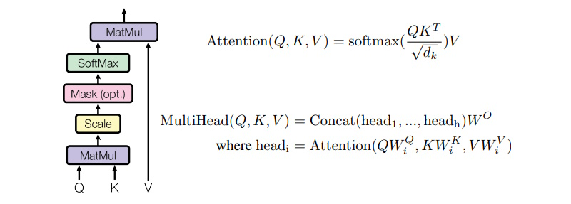

### [English Version](vanilla_transformer_explained_enus.md)

# Vanilla Transformer 解釋：關鍵概念與源代碼

## 介紹

Transformer 模型在自然語言處理 (NLP) 領域引起了革命性的變革。它們處理序列數據和捕捉長程依賴的能力，使其成為 BERT、GPT 和 T5 等最先進語言模型的基石。Transformer 模型摒棄了傳統的遞歸神經網絡 (RNN) 架構，使得更高效的並行化和更好的性能成為可能，廣泛應用於各種 NLP 任務。

## Transformer 模型概述
### 架構
Transformer 模型由 Vaswani 等人在 2017 年提出，具有編碼器-解碼器架構。與 RNN 不同，Transformer 完全依賴自注意力機制來繪製輸入和輸出之間的全局依賴。這種架構由堆疊的編碼器和解碼器層組成，每層包含多頭自注意力機制和位置全連接前饋網絡。

### 關鍵組件
#### 自注意力機制
自注意力機制允許模型在編碼特定單詞時權衡句子中不同單詞的重要性。這種機制為輸入序列中的每對單詞計算一組注意力分數，使模型在生成表示時能夠關注相關單詞。

#### 多頭注意力
多頭注意力機制通過使用多個注意力頭來擴展自注意力機制。每個頭獨立運行，結果會被拼接並進行線性變換。這使得模型能夠捕捉單詞之間關係的不同方面。

#### 位置編碼
由於 Transformer 不會固有地按順序處理輸入序列，因此需要位置編碼來注入序列順序信息。這些編碼會添加到輸入嵌入中，使模型能夠識別序列中每個單詞的位置。

#### 前饋網絡
每個編碼器和解碼器層包含一個位置前饋網絡，由兩個線性變換和 ReLU 激活組成，並伴隨 dropout。這個網絡獨立地處理每個位置，有助於將輸入嵌入轉換為更高級的表示。

Transformer 的架構和這些關鍵組件協同工作，高效且有效地處理複雜的語言任務，使其成為現代 NLP 的基本工具。

### 模型參數
以下是 Transformer 中提供的模型參數的詳細說明：

| 參數            | 描述                                                                                         | 示例值 | 示例說明                                                                                   |
|----------------|------------------------------------------------------------------------------------------------|---------|---------------------------------------------------------------------------------------------|
| `batch_size`   | 每次前向和後向傳遞中一起處理的樣本數。                                                          | 128     | 如果有 1280 個樣本，`batch_size` 為 128，那麼每個 epoch 將完成 10 次迭代。                   |
| `max_len`      | 模型將處理的最大序列長度。                                                                     | 4096    | 長度超過 4096 個標記的句子或序列將被截斷或填充到此長度。                                      |
| `d_model`      | 輸入嵌入和模型中隱藏狀態的維度。                                                               | 512     | 每個單詞/標記由一個 512 維的向量表示（即所謂的標記嵌入）。                                    |
| `n_layers`     | Transformer 模型中編碼器和解碼器的層數。                                                        | 6       | 編碼器和解碼器各有 6 層堆疊。                                                               |
| `n_heads`      | 多頭注意力機制中的注意力頭數。                                                                 | 8       | 注意力機制分為 8 個獨立的頭，專注於序列的不同部分。                                         |
| `ffn_hidden`   | 位置前饋神經網絡中的隱藏層單元數。                                                             | 2048    | 前饋網絡有一個 2048 個單元的隱藏層。                                                        |
| `drop_prob`    | 用於防止過擬合的 dropout 機率，訓練期間隨機將神經元設置為零。                                   | 0.1     | 在每次前向傳遞中，隨機將 10% 的神經元設置為零，以防止過擬合。                              |

## Transformer 模型實現

### 層級正規化 (LayerNorm)
LayerNorm (層級正規化) 類別在最後一個維度對輸入張量進行正規化，這通常是序列中的特徵維度。這有助於穩定學習過程並提高收斂速度。


```python
class LayerNorm(nn.Module):
    def __init__(self, d_model, eps=1e-12):
        """
        初始化 LayerNorm 模組。

        參數:
            d_model (int): 輸入的維度。
            eps (float): 小的 epsilon 值以避免除以零。
        """
        super(LayerNorm, self).__init__()

        # 'gamma' 和 'beta' 是可學習的參數，分別用於縮放和平移正規化後的輸出。
        # 最初，gamma 設為全 1，beta 設為全 0。
        self.gamma = nn.Parameter(torch.ones(d_model))
        self.beta = nn.Parameter(torch.zeros(d_model))

        # 小的 epsilon 值以避免在正規化期間除以零。
        self.eps = eps

    def forward(self, x):
        """
        LayerNorm 模組的前向傳播。

        參數:
            x (torch.Tensor): 形狀為 [batch_size, seq_len, d_model] 的輸入張量。

        返回:
            torch.Tensor: 形狀為 [batch_size, seq_len, d_model] 的正規化張量。
        """
        # 計算輸入張量 x 在最後一個維度 (d_model) 上的均值。結果的形狀為 [batch_size, seq_len, 1]。
        mean = x.mean(-1, keepdim=True)
        
        # 計算輸入張量 x 在最後一個維度上的變異數。結果的形狀也是 [batch_size, seq_len, 1]。
        var = x.var(-1, unbiased=False, keepdim=True)
        
        # 從輸入張量中減去均值，並除以標準差 (變異數的平方根加上 eps)。
        # 這將輸入標準化，使其具有零均值和單位方差。
        # 結果 out 的形狀為 [batch_size, seq_len, d_model]。
        out = (x - mean) / torch.sqrt(var + self.eps)

        # 按元素縮放正規化張量，以縮放正規化值。形狀為 [d_model]，但會廣播以匹配 out 的形狀。
        # 按元素平移縮放後的張量，以平移正規化值。形狀也是 [d_model]，會廣播以匹配 out 的形狀。
        out = self.gamma * out + self.beta
        
        # 最終輸出張量的形狀為 [batch_size, seq_len, d_model]。
        return out
```
總結:
- 形狀為 `[batch_size, seq_len, d_model]` 的輸入張量 `x` 在 `d_model` 維度上進行正規化。
- 正規化過程確保對於序列中的每個位置 (對於每個 `[batch_size, seq_len]`)，特徵 (長度為 `d_model`) 的均值為 0，方差為 1。
- 可學習的參數 `gamma` 和 `beta` 隨後縮放和平移這些正規化值，以使模型能夠學習每個特徵維度的最佳縮放和平移。

資源
- **[Papers with Code 上的層級正規化](https://paperswithcode.com/method/layer-normalization)**
- **[PyTorch 中 LayerNorm 的實現](https://pytorch.org/docs/stable/generated/torch.nn.LayerNorm.html#layernorm)**

### 位置前饋網路 (PositionwiseFeedForward)
PositionwiseFeedForward 類別將前饋神經網路獨立地應用於輸入序列的每個位置。這是 Transformer 模型的一個基本組成部分，提供非線性並在自注意機制之後混合特徵。

```python
class PositionwiseFeedForward(nn.Module):
    def __init__(self, d_model, hidden, drop_prob=0.1):
        """
        初始化 PositionwiseFeedForward 模組。

        參數:
            d_model (int): 輸入的維度。
            hidden (int): 前饋網路中的隱藏單元數。
            drop_prob (float): Dropout 機率。
        """
        super(PositionwiseFeedForward, self).__init__()

        # 'linear1' 將輸入從 d_model 維度映射到 hidden 維度的線性變換。
        self.linear1 = nn.Linear(d_model, hidden)
        
        # 'linear2' 將隱藏層映射回 d_model 維度的線性變換。
        self.linear2 = nn.Linear(hidden, d_model)

        self.relu = nn.ReLU()
        self.dropout = nn.Dropout(p=drop_prob)

    def forward(self, x):
        """
        PositionwiseFeedForward 模組的前向傳播。

        參數:
            x (torch.Tensor): 形狀為 [batch_size, seq_len, d_model] 的輸入張量。

        返回:
            torch.Tensor: 形狀為 [batch_size, seq_len, d_model] 的輸出張量。
        """
        x = self.linear1(x)  # [batch_size, seq_len, hidden]
        x = self.relu(x)  # [batch_size, seq_len, hidden]
        x = self.dropout(x)  # [batch_size, seq_len, hidden]
        x = self.linear2(x)  # [batch_size, seq_len, d_model]
        return x
```

總結:
- 輸入：輸入張量 x 的形狀為 [batch_size, seq_len, d_model]。
- Linear1：輸入線性變換為形狀 [batch_size, seq_len, hidden]。
- ReLU：應用 ReLU 激活，維持形狀 [batch_size, seq_len, hidden]。
- Dropout：應用 Dropout，維持形狀 [batch_size, seq_len, hidden]。
- Linear2：輸出線性變換回形狀 [batch_size, seq_len, d_model]。
- 輸出：輸出張量與輸入張量形狀相同，為 [batch_size, seq_len, d_model]。

這個前饋網路獨立地應用於序列的每個位置，使模型能夠學習每個序列中的標記的複雜變換和表示。


### 縮放點積注意力機制 (ScaleDotProductAttention)
ScaleDotProductAttention 類別執行縮放點積注意力機制，這是 Transformer 模型的一個基本部分。這個機制計算注意力權重並將它們應用於值以生成輸出。

自注意力機制可以用以下公式來數學描述：
縮放點積注意力機制：
<br/>

其中：
- \( Q \)（Query）是查詢向量的矩陣。
- \( K \)（Key）是鍵向量的矩陣。
- \( V \)（Value）是值向量的矩陣。
- \( d_k \) 是鍵向量的維度（通常等於查詢和值的維度）。

```python
class ScaleDotProductAttention(nn.Module):
    def __init__(self):
        """
        初始化 ScaleDotProductAttention 模組。
        """
        super(ScaleDotProductAttention, self).__init__()

        # 初始化 softmax 層，用於將注意力分數轉換為概率。
        self.softmax = nn.Softmax(dim=-1)

    def forward(self, q, k, v, mask=None, e=1e-12):
        """
        ScaleDotProductAttention 模組的前向傳播。

        參數:
            q (torch.Tensor): 形狀為 [batch_size, n_head, seq_len, d_tensor] 的查詢張量。
            k (torch.Tensor): 形狀為 [batch_size, n_head, seq_len, d_tensor] 的鍵張量。
            v (torch.Tensor): 形狀為 [batch_size, n_head, seq_len, d_tensor] 的值張量。
            mask (torch.Tensor, 選填): 形狀為 [batch_size, 1, seq_len, seq_len] 的遮罩張量。
            e (float): 小的 epsilon 值以避免除以零。

        返回:
            torch.Tensor: 形狀為 [batch_size, n_head, seq_len, d_tensor] 的輸出張量。
            torch.Tensor: 形狀為 [batch_size, n_head, seq_len, seq_len] 的注意力分數張量。
        """
        batch_size, head, length, d_tensor = k.size()
        k_t = k.transpose(2, 3)

        # @ 運算符在 Python 中用於矩陣乘法。
        # 在這裡，它將查詢 q 和轉置後的鍵 k_t 相乘。
        # 這個操作測量查詢和鍵之間的對齊程度。
        
        # math.sqrt(d_tensor) 取 d_tensor 的平方根，其中 d_tensor 可能是鍵向量的維度。
        # 這是一個縮放因子，用於在 Transformer 模型中防止查詢和鍵之間的點積變得過大，這會導致梯度過小並且模型難以訓練。
        score = (q @ k_t) / math.sqrt(d_tensor)  # [batch_size, n_head, seq_len, seq_len]
        
        if mask is not None:
            # masked_fill 函數是 PyTorch 方法，用於根據遮罩替換 score 張量的某些元素。
            # 具體來說，它將 mask == 0 (即遮罩為 False) 的元素替換為 -10000。
            # -10000 的值被用於因為注意力分數通常會通過 softmax 函數，該函數將它們轉換為概率。
            # softmax(-10000) 非常接近 0，因此這有效地遮蔽了注意力分數中對應的元素，導致它們對最終結果的影響很小。
            score = score.masked_fill(mask == 0, -10000)
        
        # softmax 函數用於將原始注意力分數轉換為概率。
        # 它通過對每個分數取指數，然後除以所有指數分數的總和來實現這一點。
        # 這確保了注意力分數都在 0 和 1 之間，並且總和為 1，因此可以將它們解釋為概率。
        score = self.softmax(score)  # [batch_size, n_head, seq_len, seq_len]

        # v 變量是一個代表值向量的張量，是注意力機制輸入的一部分。
        # v = score @ v 行執行 score 張量和值張量之間的矩陣乘法。
        # 這個操作計算值向量的加權和，其中權重由注意力概率給出。
        # 這個加權和是注意力層的輸出。
        v = score @ v  # [batch_size, n_head, seq_len, d_tensor]
        return v, score
```

總結:
- 輸入：輸入張量 q, k, 和 v 的形狀為 [batch_size, n_head, seq_len, d_tensor]。
- 轉置：鍵張量 k 被轉置為形狀 [batch_size, n_head, d_tensor, seq_len]。
- 矩陣乘法：使用縮放點積計算注意力分數，生成形狀為 [batch_size, n_head, seq_len, seq_len] 的分數張量。
- 遮蔽：選擇性地遮蔽分數張量中的某些位置。
- Softmax：應用 softmax 函數將分數轉換為概率，保持形狀 [batch_size, n_head, seq_len, seq_len]。
- 輸出計算：將分數張量與值張量 v 相乘得到最終輸出張量，形狀為 [batch_size, n_head, seq_len, d_tensor]。
- 輸出：返回輸出張量和注意力分數張量。


### 多頭注意力機制 (MultiHeadAttention)
MultiHeadAttention 類別實現了 Transformer 模型中使用的多頭注意力機制。這種機制允許模型在不同的位置共同關注來自不同表示子空間的信息。

```python
class MultiHeadAttention(nn.Module):
    def __init__(self, d_model, n_head):
        """
        初始化 MultiHeadAttention 模組。

        參數:
            d_model (int): 標記嵌入的維度。
            n_head (int): 注意力頭的數量。
        """
        super(MultiHeadAttention, self).__init__()
        self.n_head = n_head
        self.attention = ScaleDotProductAttention()
        
        # 為什麼我們需要線性投影？
        # 維度變換：線性投影允許模型將輸入張量轉換到不同的子空間（查詢、鍵和值空間）。
        # 可學習參數：通過使用線性層進行投影，模型引入了可在訓練過程中調整的可學習參數。
        # 處理多頭：在多頭注意力中使用多個頭時，線性投影允許每個頭擁有自己的查詢、鍵和值參數。
        self.w_q = nn.Linear(d_model, d_model)
        self.w_k = nn.Linear(d_model, d_model)
        self.w_v = nn.Linear(d_model, d_model)
        
        self.w_concat = nn.Linear(d_model, d_model)

    def forward(self, q, k, v, mask=None):
        """
        MultiHeadAttention 模組的前向傳播。

        參數:
            q (torch.Tensor): 形狀為 [batch_size, seq_len, d_model] 的查詢張量。
            k (torch.Tensor): 形狀為 [batch_size, seq_len, d_model] 的鍵張量。
            v (torch.Tensor): 形狀為 [batch_size, seq_len, d_model] 的值張量。
            mask (torch.Tensor, 選填): 形狀為 [batch_size, 1, seq_len, seq_len] 的遮罩張量。

        返回:
            torch.Tensor: 形狀為 [batch_size, seq_len, d_model] 的輸出張量。
        """
        # 線性投影：
        # 輸入張量 q, k 和 v 通過線性變換投影到查詢、鍵和值空間。
        q, k, v = self.w_q(q), self.w_k(k), self.w_v(v)  # [batch_size, seq_len, d_model]

        # 拆分成多個頭：
        # 投影後的張量拆分成 n_head 個頭。每個頭的維度為 d_tensor = d_model // n_head。
        q, k, v = self.split(q), self.split(k), self.split(v)  # [batch_size, n_head, seq_len, d_tensor]

        # 縮放點積注意力：
        # 注意力方法將縮放點積注意力應用於拆分後的張量。
        out, attention = self.attention(q, k, v, mask=mask)  # [batch_size, n_head, seq_len, d_tensor]

        # 合併頭：
        # 多個頭的輸出重新合併成一個張量。
        out = self.concat(out)  # [batch_size, seq_len, d_model]

        # 最終線性變換：
        # 合併後的張量通過最終線性變換。
        out = self.w_concat(out)  # [batch_size, seq_len, d_model]

        return out

    def split(self, tensor):
        """
        將輸入張量拆分成多個頭。

        參數:
            tensor (torch.Tensor): 形狀為 [batch_size, seq_len, d_model] 的輸入張量。

        返回:
            torch.Tensor: 拆分成多個頭後的張量，形狀為 [batch_size, n_head, seq_len, d_tensor]。
        """
        batch_size, length, d_model = tensor.size()

        # d_tensor 計算為“標記嵌入維度”除以“注意力頭的數量”。
        d_tensor = d_model // self.n_head

        # tensor 變量通過 view 方法重新塑形。
        # 這個方法用 transpose 方法交換張量的兩個維度。
        tensor = tensor.view(batch_size, length, self.n_head, d_tensor).transpose(1, 2)
        return tensor

    def concat(self, tensor):
        """
        將多頭張量重新合併成單一張量。

        參數:
            tensor (torch.Tensor): 形狀為 [batch_size, n_head, seq_len, d_tensor] 的輸入張量。

        返回:
            torch.Tensor: 合併後的張量，形狀為 [batch_size, seq_len, d_model]。
        """
        batch_size, head, length, d_tensor = tensor.size()

        # d_model 計算為“注意力頭的數量”乘以 d_tensor。
        d_model = head * d_tensor

        # transpose 方法調用在張量上交換第二和第三維度：
        #   [batch_size, head, length, d_tensor] => [batch_size, length, head, d_tensor]
        # contiguous 方法用於確保張量存儲在連續的內存塊中。
        # view 方法用於重新塑形張量（d_model == head * d_tensor）：
        #   [batch_size, length, head, d_tensor] => [batch_size, length, d_model] 
        tensor = tensor.transpose(1, 2).contiguous().view(batch_size, length, d_model)
        return tensor
```

總結:
- 輸入：形狀為 [batch_size, seq_len, d_model] 的張量 q, k, v。
- 線性投影：投影為形狀 [batch_size, seq_len, d_model]。
- 拆分：拆分成 n_head 個頭，形狀為 [batch_size, n_head, seq_len, d_tensor]。
- 注意力：應用縮放點積注意力，形狀為 [batch_size, n_head, seq_len, d_tensor]。
- 合併：合併頭，形狀為 [batch_size, seq_len, d_model]。
- 線性變換：應用最終線性變換，形狀為 [batch_size, seq_len, d_model]。
- 輸出：返回形狀為 [batch_size, seq_len, d_model] 的張量。

### TokenEmbedding
TokenEmbedding 類別是 PyTorch 中 nn.Embedding 的子類。它用於將標記索引轉換為固定大小（d_model）的密集向量。這通常是處理標記序列（如句子中的單詞）的神經網絡的第一層。

參考: [nn.Embedding 的定義](https://pytorch.org/docs/stable/generated/torch.nn.Embedding.html)

```python
class TokenEmbedding(nn.Embedding):
    def __init__(self, vocab_size, d_model):
        """
        初始化 TokenEmbedding 模組。

        參數:
            vocab_size (int): 詞彙表中獨特標記的數量。
            d_model (int): 嵌入的維度。
        """
        super(TokenEmbedding, self).__init__(vocab_size, d_model, padding_idx=1)
```

範例:
1. 詞彙表和嵌入維度:
    - 假設 `vocab_size` 是 10,000（即有 10,000 個獨特標記）。
    - 假設 `d_model` 是 512（即每個標記由 512 維向量表示）。
2. 輸入張量:
    - 假設輸入張量是 `x`，其形狀為 `(batch_size, seq_len)`，其中:
        - `batch_size` 是批次中序列（例如句子）的數量。
        - `seq_len` 是每個序列的長度。
    ```python
    # 具有 batch_size=2 和 seq_len=3 的示例輸入張量
    x = torch.tensor([[2, 4, 1], [3, 5, 1]])
    ```
3. 嵌入查詢:
    - `TokenEmbedding` 層處理輸入張量 `x`，並查詢每個標記索引的嵌入向量。
    - 輸出張量將具有形狀 `(batch_size, seq_len, d_model)`。
    ```python
    # 假設嵌入層已初始化
    embedding_layer = TokenEmbedding(vocab_size=10000, d_model=512)

    # 前向傳播
    embeddings = embedding_layer(x)
    ```
    - 如果 `x` 是 `[[2, 4, 1], [3, 5, 1]]` 且 `d_model` 是 512:
        - 標記 `2` 的嵌入是 512 維向量。
        - 標記 `4` 的嵌入是 512 維向量。
        - 標記 `1`（填充）的嵌入是 512 維的零向量。
    - 輸出 `embeddings` 的形狀將為 `(2, 3, 512)`，其中:
        - 第一維是批次大小 (2)。
        - 第二維是序列長度 (3)。
        - 第三維是嵌入大小 (512)。

總結:<br/>
`TokenEmbedding` 類別使用嵌入矩陣將標記索引轉換為密集向量（嵌入）。嵌入矩陣在訓練期間學習，允許模型捕捉標記的語義信息。這個過程包括查詢嵌入矩陣中的每個標記索引並返回相應的嵌入向量。這對於將離散標記轉換為神經網絡可以處理的連續表示至關重要。

### 位置編碼 (PositionalEncoding)
PositionalEncoding 類別向標記嵌入添加位置資訊。這在 Transformer 模型中很重要，因為與循環神經網絡不同，Transformer 本身並不捕捉輸入標記的順序。位置編碼幫助模型理解序列中每個標記的位置。

位置編碼可視化:
<br>
<br>

```python
class PositionalEncoding(nn.Module):
    def __init__(self, d_model, max_len, device):
        """
        初始化 PositionalEncoding 模組。

        參數:
            d_model (int): 模型隱藏狀態的維度。
            max_len (int): 輸入序列的最大長度。
            device (torch.device): 執行模型的設備 (CPU 或 GPU)。
        """
        super(PositionalEncoding, self).__init__()
        self.encoding = torch.zeros(max_len, d_model, device=device)
        self.encoding.requires_grad = False

        # pos 變量是一個包含位置的張量，這些位置只是從 0 到 max_len - 1 的整數。
        # unsqueeze 方法被調用以向這個張量添加一個額外的維度，將其從 1D 張量變為 2D 張量。
        pos = torch.arange(0, max_len, device=device)
        pos = pos.float().unsqueeze(dim=1)

        # _2i 變量是一個包含從 0 到 d_model - 1 的偶數整數的張量。
        # 這被用來為偶數和奇數位置創建不同的位置編碼。
        _2i = torch.arange(0, d_model, step=2, device=device).float()

        # [:, 0::2] 行對位置應用正弦函數，並將結果存儲在 self.encoding 的偶數列中。
        # [:, 1::2] 行對奇數列應用余弦函數。
        # 位置被除以 (10000 ** (_2i / d_model)) 以確保位置編碼隨位置平滑且緩慢地變化。
        # 這個除法操作導致不同維度的正弦和余弦函數的頻率不同，這允許模型學習關注相對位置。
        self.encoding[:, 0::2] = torch.sin(pos / (10000 ** (_2i / d_model)))
        self.encoding[:, 1::2] = torch.cos(pos / (10000 ** (_2i / d_model)))

    def forward(self, x):
        """
        PositionalEncoding 模組的前向傳播。

        參數:
            x (torch.Tensor): 形狀為 [batch_size, seq_len] 的輸入張量。

        返回:
            torch.Tensor: 形狀為 [seq_len, d_model] 的位置編碼張量。
        """
        batch_size, seq_len = x.size()

        # [:seq_len, :] 部分是切片操作，用於選擇張量的前 seq_len 行。
        # 這個操作確保編碼與序列長度相同。
        # unsqueeze(0) 方法被調用以在張量的開頭添加一個額外的維度。
        # expand(batch_size, -1, -1) 方法被調用以沿指定維度重複張量。
        return self.encoding[:seq_len, :].unsqueeze(0).expand(batch_size, -1, -1)
```

關於 Transformer 模型中位置編碼的參考資料：
- [Transformer 模型中位置編碼的簡單介紹 (第1部分)](https://machinelearningmastery.com/a-gentle-introduction-to-positional-encoding-in-transformer-models-part-1/)
- [理解 Transformer 中的位置編碼](https://towardsdatascience.com/understanding-positional-encoding-in-transformers-dc6bafc021ab)


### TransformerEmbedding
TransformerEmbedding 類別結合了標記嵌入和位置編碼來生成 Transformer 模型的輸入嵌入。這個類別確保模型能夠同時包含標記的語義信息及其在序列中的位置信息。

```python
class TransformerEmbedding(nn.Module):
    def __init__(self, vocab_size, d_model, max_len, drop_prob, device):
        """
        初始化 TransformerEmbedding 模組。

        參數:
            vocab_size (int): 詞彙表的大小。
            d_model (int): 標記嵌入的維度。
            max_len (int): 輸入序列的最大長度。
            drop_prob (float): Dropout 機率。
            device (torch.device): 執行模型的設備 (CPU 或 GPU)。
        """
        super(TransformerEmbedding, self).__init__()
        self.tok_emb = TokenEmbedding(vocab_size, d_model)
        self.pos_emb = PositionalEncoding(d_model, max_len, device)
        self.drop_out = nn.Dropout(p=drop_prob)

    def forward(self, x):
        """
        TransformerEmbedding 模組的前向傳播。

        參數:
            x (torch.Tensor): 形狀為 [batch_size, seq_len] 的輸入張量。

        返回:
            torch.Tensor: 形狀為 [batch_size, seq_len, d_model] 的嵌入張量。
        """
        # 將標記 ID 轉換為標記嵌入
        # 生成位置嵌入
        tok_emb = self.tok_emb(x)       
        pos_emb = self.pos_emb(x)       

        # tok_emb + pos_emb 操作是將標記嵌入和位置嵌入相加。
        # 這是為了將標記和它們的位置的信息結合到一個單一的表示中。
        # 這個結合的表示作為這段代碼塊的輸出返回。
        return self.drop_out(tok_emb + pos_emb)
```
總結:
1. 標記嵌入:
    - 形狀為 `(batch_size, seq_len)` 的輸入張量 `x` 包含標記索引。
    - 這些索引通過 `TokenEmbedding` 層轉換為密集向量，生成形狀為 `(batch_size, seq_len, d_model)` 的張量。
2. 位置編碼:
    - 位置編碼矩陣在初始化期間預先計算，形狀為 `(max_len, d_model)`。
    - 在前向傳播過程中，從這個矩陣中提取與序列長度 (`seq_len`) 匹配的相關部分，生成形狀為 `(seq_len, d_model)` 的張量。
    - 然後將這個部分擴展以匹配批次大小，生成形狀為 `(batch_size, seq_len, d_model)` 的張量。
3. 結合和 Dropout:
    - 將標記嵌入和位置編碼逐元素相加。
    - 然後將結合的張量通過 Dropout 層以防止過擬合。
    - 最終輸出張量的形狀為 `(batch_size, seq_len, d_model)`。

### EncoderLayer
EncoderLayer 類別實現了 Transformer 編碼器的一個層。每個編碼器層由一個多頭自注意力機制，接著是位置前饋網路組成。層級正規化和 Dropout 在各個點應用，以確保穩定性並防止過擬合。

```python
class EncoderLayer(nn.Module):
    def __init__(self, d_model, ffn_hidden, n_head, drop_prob):
        """
        初始化 EncoderLayer 模組。

        參數:
            d_model (int): 模型隱藏狀態的維度。
            ffn_hidden (int): 前饋網路中的隱藏單元數。
            n_head (int): 注意力頭的數量。
            drop_prob (float): Dropout 機率。
        """
        super(EncoderLayer, self).__init__()
        self.attention = MultiHeadAttention(d_model=d_model, n_head=n_head)
        self.norm1 = LayerNorm(d_model=d_model)
        self.dropout1 = nn.Dropout(p=drop_prob)
        self.ffn = PositionwiseFeedForward(d_model=d_model, hidden=ffn_hidden, drop_prob=drop_prob)
        self.norm2 = LayerNorm(d_model=d_model)
        self.dropout2 = nn.Dropout(p=drop_prob)

    def forward(self, x, src_mask):
        """
        EncoderLayer 模組的前向傳播。

        參數:
            x (torch.Tensor): 形狀為 [batch_size, seq_len, d_model] 的輸入張量。
            src_mask (torch.Tensor): 形狀為 [batch_size, 1, 1, src_seq_len] 的源遮罩張量。

        返回:
            torch.Tensor: 形狀為 [batch_size, seq_len, d_model] 的輸出張量。
        """
        # 保存輸入張量以用於殘差連接
        _x = x

        # 應用多頭注意力
        # 在注意力後應用 Dropout
        # 應用殘差連接和層級正規化
        x = self.attention(q=x, k=x, v=x, mask=src_mask)  # [batch_size, seq_len, d_model]
        x = self.dropout1(x)                              # [batch_size, seq_len, d_model]
        x = self.norm1(x + _x)                            # [batch_size, seq_len, d_model]

        # 保存中間輸出以用於下一個殘差連接
        _x = x
        
        # 應用位置前饋網路
        # 在前饋網路後應用 Dropout
        # 應用殘差連接和層級正規化
        x = self.ffn(x)         # [batch_size, seq_len, d_model]
        x = self.dropout2(x)    # [batch_size, seq_len, d_model]
        x = self.norm2(x + _x)  # [batch_size, seq_len, d_model]
        return x
```
總結: <br/>
通過將輸入張量經過這些步驟處理，EncoderLayer 有效地捕捉序列中的局部和全局依賴關係，通過正規化穩定訓練，並通過 Dropout 防止過擬合。這個過程在編碼器堆疊中的每一層重複，允許模型構建越來越複雜的輸入數據表示。

### Encoder
Encoder 類別是 Transformer 架構的一部分。它由多個層組成，每層包含一個多頭自注意力機制和一個前饋網絡。這個類別處理輸入標記的嵌入，應用位置編碼，並通過若干編碼器層處理輸入。

```python
class Encoder(nn.Module):
    def __init__(self, enc_voc_size, max_len, d_model, ffn_hidden, n_head, n_layers, drop_prob, device):
        """
        初始化 Encoder 模組。

        參數:
            enc_voc_size (int): 編碼器詞彙表的大小。
            max_len (int): 輸入序列的最大長度。
            d_model (int): 模型隱藏狀態的維度。
            ffn_hidden (int): 前饋網絡中的隱藏單元數。
            n_head (int): 注意力頭的數量。
            n_layers (int): 編碼器層的數量。
            drop_prob (float): Dropout 機率。
            device (torch.device): 執行模型的設備 (CPU 或 GPU)。
        """
        super().__init__()

        # 初始化嵌入層，結合標記嵌入和位置編碼
        self.emb = TransformerEmbedding(d_model=d_model,
                                        max_len=max_len,
                                        vocab_size=enc_voc_size,
                                        drop_prob=drop_prob,
                                        device=device)
        
        # 初始化編碼器層堆疊
        self.layers = nn.ModuleList([EncoderLayer(d_model=d_model,
                                                  ffn_hidden=ffn_hidden,
                                                  n_head=n_head,
                                                  drop_prob=drop_prob)
                                     for _ in range(n_layers)])

    def forward(self, x, src_mask):
        """
        Encoder 模組的前向傳播。

        參數:
            x (torch.Tensor): 形狀為 [batch_size, seq_len] 的輸入張量。
            src_mask (torch.Tensor): 形狀為 [batch_size, 1, 1, src_seq_len] 的源遮罩張量。

        返回:
            torch.Tensor: 形狀為 [batch_size, seq_len, d_model] 的編碼張量。
        """
        # 應用標記嵌入和位置編碼
        x = self.emb(x)  # [batch_size, seq_len, d_model]
        
        # 將輸入通過每個編碼器層
        for layer in self.layers:
            x = layer(x, src_mask)  # [batch_size, seq_len, d_model]
        
        return x
```
總結:
1. 標記嵌入和位置編碼:
    - 標記索引的輸入張量通過 `TransformerEmbedding` 層轉換為密集表示。
    - 這個層結合標記嵌入和位置編碼，生成形狀為 `[batch_size, seq_len, d_model]` 的張量。
2. 編碼器層:
    - 每個 `EncoderLayer` 應用以下操作:
        - 多頭注意力:
            - 計算注意力分數，應用源遮罩，生成上下文向量。
            - 輸出形狀: `[batch_size, seq_len, d_model]`
        - 加和正規化:
            - 應用殘差連接和層級正規化。
            - 輸出形狀: `[batch_size, seq_len, d_model]`
        - 前饋網絡:
            - 應用兩個線性變換，中間有 ReLU 激活。
            - 輸出形狀: `[batch_size, seq_len, d_model]`
        - 加和正規化:
            - 應用殘差連接和層級正規化。
            - 輸出形狀: `[batch_size, seq_len, d_model]`

通過將輸入張量經過這些步驟處理，`Encoder` 類別構建了輸入序列的複雜表示，捕捉數據中的局部和全局依賴關係。最終的輸出張量可以用作解碼器的輸入或其他下游任務。


### DecoderLayer
DecoderLayer 類別是 Transformer 架構的一部分，代表解碼器中的一個層。每個解碼器層由三個主要組件組成：

1. **自注意力機制**：關注目標序列中的前一位置。
2. **編碼器-解碼器注意力機制**：關注編碼器的輸出。
3. **前饋網絡**：應用非線性和投影。

層級正規化和 Dropout 在各個點應用，以確保穩定性並防止過擬合。

```python
class DecoderLayer(nn.Module):
    def __init__(self, d_model, ffn_hidden, n_head, drop_prob):
        """
        初始化 DecoderLayer 模組。

        參數:
            d_model (int): 模型隱藏狀態的維度。
            ffn_hidden (int): 前饋網絡中的隱藏單元數。
            n_head (int): 注意力頭的數量。
            drop_prob (float): Dropout 機率。
        """
        super(DecoderLayer, self).__init__()

        self.self_attention = MultiHeadAttention(d_model=d_model, n_head=n_head)    # 自注意力機制
        self.norm1 = LayerNorm(d_model=d_model)     # 自注意力後的層級正規化
        self.dropout1 = nn.Dropout(p=drop_prob)     # 自注意力後的 Dropout
        self.enc_dec_attention = MultiHeadAttention(d_model=d_model, n_head=n_head) # 編碼器-解碼器注意力機制
        self.norm2 = LayerNorm(d_model=d_model)     # 編碼器-解碼器注意力後的層級正規化
        self.dropout2 = nn.Dropout(p=drop_prob)     # 編碼器-解碼器注意力後的 Dropout
        self.ffn = PositionwiseFeedForward(d_model=d_model, hidden=ffn_hidden, drop_prob=drop_prob) # 位置前饋網絡
        self.norm3 = LayerNorm(d_model=d_model)     # 前饋網絡後的層級正規化
        self.dropout3 = nn.Dropout(p=drop_prob)     # 前饋網絡後的 Dropout

    def forward(self, dec, enc, trg_mask, src_mask):
        """
        DecoderLayer 模組的前向傳播。

        參數:
            dec (torch.Tensor): 解碼器輸入張量，形狀為 [batch_size, trg_seq_len, d_model]。
            enc (torch.Tensor): 編碼的源張量，形狀為 [batch_size, src_seq_len, d_model]。
            trg_mask (torch.Tensor): 目標遮罩張量，形狀為 [batch_size, 1, trg_seq_len, trg_seq_len]。
            src_mask (torch.Tensor): 源遮罩張量，形狀為 [batch_size, 1, 1, src_seq_len]。

        返回:
            torch.Tensor: 輸出張量，形狀為 [batch_size, trg_seq_len, d_model]。
        """
        # 1. 自注意力機制，防止關注未來的標記
        _x = dec

        # 將多頭自注意力應用於解碼器輸入。
        # 使用 `trg_mask` 防止關注目標序列中的未來標記。
        x = self.self_attention(q=dec, k=dec, v=dec, mask=trg_mask)  # [batch_size, trg_seq_len, d_model]
        
        # 將 Dropout 應用於自注意力輸出。
        # 添加原始輸入張量 `_x`（殘差連接）並應用層級正規化。
        # 輸出張量 `x` 保持形狀為 `[batch_size, trg_seq_len, d_model]`。
        x = self.dropout1(x)    # [batch_size, trg_seq_len, d_model]
        x = self.norm1(x + _x)  # [batch_size, trg_seq_len, d_model]
        
        # 2. 編碼器-解碼器注意力機制
        if enc is not None:
            _x = x
            # 將多頭注意力應用於編碼器和解碼器的輸出。
            # 使用編碼器的輸出 `enc` 作為鍵和值，解碼器的自注意力輸出 `x` 作為查詢。
            # 使用 `src_mask` 防止關注源序列中的填充標記。
            x = self.enc_dec_attention(q=x, k=enc, v=enc, mask=src_mask)  # [batch_size, trg_seq_len, d_model]
            x = self.dropout2(x)    # [batch_size, trg_seq_len, d_model]
            x = self.norm2(x + _x)  # [batch_size, trg_seq_len, d_model]
        
        # 3. 前饋網絡
        _x = x

        # 包含兩個線性變換，中間有 ReLU 激活。
        # 輸出張量 `x` 保持形狀為 `[batch_size, trg_seq_len, d_model]`。
        x = self.ffn(x)  # [batch_size, trg_seq_len, d_model]

        # 將 Dropout 應用於前饋網絡輸出。
        # 添加之前的輸入張量 `_x`（殘差連接）並應用層級正規化。
        # 最終輸出張量 `x` 形狀為 `[batch_size, trg_seq_len, d_model]`。
        x = self.dropout3(x)    # [batch_size, trg_seq_len, d_model]
        x = self.norm3(x + _x)  # [batch_size, trg_seq_len, d_model]
        return x
```
總結:<br/>
通過將輸入張量經過這些步驟處理，`DecoderLayer` 能夠有效地關注目標序列和編碼的源序列，使模型能夠生成同時考慮到目標上下文和源信息的預測。這個過程在解碼器堆疊中的每一層重複，使模型能夠在源序列的條件下構建越來越複雜的目標序列表示。


### Decoder
Decoder 類別是 Transformer 架構的一部分，代表模型的整個解碼器組件。它由多個層組成，每層包含自注意力、編碼器-解碼器注意力和前饋網絡。這個類別處理目標標記的嵌入，通過若干解碼器層處理它們，最後將輸出投影到詞彙表大小。

```python
class Decoder(nn.Module):
    def __init__(self, dec_voc_size, max_len, d_model, ffn_hidden, n_head, n_layers, drop_prob, device):
        """
        初始化 Decoder 模組。

        參數:
            dec_voc_size (int): 解碼器詞彙表的大小。
            max_len (int): 輸入序列的最大長度。
            d_model (int): 模型隱藏狀態的維度。
            ffn_hidden (int): 前饋網絡中的隱藏單元數。
            n_head (int): 注意力頭的數量。
            n_layers (int): 解碼器層的數量。
            drop_prob (float): Dropout 機率。
            device (torch.device): 執行模型的設備 (CPU 或 GPU)。
        """
        super().__init__()
        
        # 初始化嵌入層，結合標記嵌入和位置編碼
        self.emb = TransformerEmbedding(d_model=d_model,
                                        drop_prob=drop_prob,
                                        max_len=max_len,
                                        vocab_size=dec_voc_size,
                                        device=device)
        
        # 初始化解碼器層堆疊
        self.layers = nn.ModuleList([DecoderLayer(d_model=d_model,
                                                  ffn_hidden=ffn_hidden,
                                                  n_head=n_head,
                                                  drop_prob=drop_prob)
                                     for _ in range(n_layers)])
        
        # 線性層將輸出投影到詞彙表大小
        self.linear = nn.Linear(d_model, dec_voc_size)

    def forward(self, trg, enc_src, trg_mask, src_mask):
        """
        Decoder 模組的前向傳播。

        參數:
            trg (torch.Tensor): 目標輸入序列（解碼器輸入），形狀為 [batch_size, trg_seq_len]。
            enc_src (torch.Tensor): 編碼的源序列（編碼器輸出），形狀為 [batch_size, src_seq_len, d_model]。
            trg_mask (torch.Tensor): 用於自注意力的目標遮罩，形狀為 [batch_size, 1, trg_seq_len, trg_seq_len]。
            src_mask (torch.Tensor): 用於編碼器-解碼器注意力的源遮罩，形狀為 [batch_size, 1, 1, src_seq_len]。

        返回:
            torch.Tensor: 目標詞彙表中每個標記的輸出 logits，形狀為 [batch_size, trg_seq_len, dec_voc_size]。
        """
        # 應用標記嵌入和位置編碼
        trg = self.emb(trg)  # [batch_size, trg_seq_len, d_model]
        
        # 將輸入通過每個解碼器層
        for layer in self.layers:
            trg = layer(trg, enc_src, trg_mask, src_mask)  # [batch_size, trg_seq_len, d_model]
        
        # 應用最終的線性層將輸出投影到詞彙表大小
        output = self.linear(trg)  # [batch_size, trg_seq_len, dec_voc_size]
        return output
```
總結:
1. 標記嵌入和位置編碼:
    - 目標標記索引通過 `TransformerEmbedding` 層轉換為密集表示。
    - 這個層結合標記嵌入和位置編碼，生成形狀為 `[batch_size, trg_seq_len, d_model]` 的張量。
2. 解碼器層:
    - 每個 `DecoderLayer` 應用以下操作:
        - 自注意力:
            - 計算目標序列內的注意力分數。
            - 使用目標遮罩 `trg_mask` 防止關注未來的位置。
            - 輸出形狀: `[batch_size, trg_seq_len, d_model]`
        - 編碼器-解碼器注意力:
            - 使用編碼器的輸出作為鍵和值，解碼器的自注意力輸出作為查詢，計算注意力分數。
            - 使用源遮罩 `src_mask` 防止關注填充標記。
            - 輸出形狀: `[batch_size, trg_seq_len, d_model]`
        - 前饋網絡:
            - 應用兩個線性變換，中間有 ReLU 激活。
            - 輸出形狀: `[batch_size, trg_seq_len, d_model]`
        - Dropout 和殘差連接:
            - 在每個步驟添加殘差連接並應用 Dropout 和層級正規化。
3. 最終線性投影:
    - 最終的解碼器輸出張量通過線性層投影到詞彙表大小。
    - 這生成目標詞彙表中每個標記的 logits。
    - 最終輸出形狀: `[batch_size, trg_seq_len, dec_voc_size]`

通過將目標張量經過這些步驟處理，`Decoder` 類別根據目標序列中的先前位置和編碼的源序列為目標序列中的每個位置生成預測。這個過程允許模型以順序方式生成序列，有效地利用源序列提供的上下文。


### Transformer
Transformer 類別是 Transformer 架構的核心，結合了編碼器和解碼器組件。它處理輸入遮罩，通過編碼器和解碼器處理輸入序列，並輸出目標詞彙表中每個標記的 logits。


```python
class Transformer(nn.Module):
    def __init__(self, src_pad_idx, trg_pad_idx, trg_sos_idx, enc_voc_size, dec_voc_size, d_model, n_head, max_len,
                 ffn_hidden, n_layers, drop_prob, device):
        """
        初始化 Transformer 模組。

        參數:
            src_pad_idx (int): 源序列的填充索引。
            trg_pad_idx (int): 目標序列的填充索引。
            trg_sos_idx (int): 目標序列的開始標記索引。
            enc_voc_size (int): 編碼器詞彙表的大小。
            dec_voc_size (int): 解碼器詞彙表的大小。
            d_model (int): 模型隱藏狀態的維度。
            n_head (int): 注意力頭的數量。
            max_len (int): 輸入序列的最大長度。
            ffn_hidden (int): 前饋網絡中的隱藏單元數。
            n_layers (int): 編碼器和解碼器層的數量。
            drop_prob (float): Dropout 機率。
            device (torch.device): 執行模型的設備 (CPU 或 GPU)。
        """
        super().__init__()
        self.src_pad_idx = src_pad_idx
        self.trg_pad_idx = trg_pad_idx
        self.trg_sos_idx = trg_sos_idx
        self.device = device
        self.encoder = Encoder(d_model=d_model,
                               n_head=n_head,
                               max_len=max_len,
                               ffn_hidden=ffn_hidden,
                               enc_voc_size=enc_voc_size,
                               drop_prob=drop_prob,
                               n_layers=n_layers,
                               device=device)
        self.decoder = Decoder(d_model=d_model,
                               n_head=n_head,
                               max_len=max_len,
                               ffn_hidden=ffn_hidden,
                               dec_voc_size=dec_voc_size,
                               drop_prob=drop_prob,
                               n_layers=n_layers,
                               device=device)

    def forward(self, src, trg):
        """
        Transformer 模組的前向傳播。

        參數:
            src (torch.Tensor): 源輸入序列，形狀為 [batch_size, src_seq_len]。
            trg (torch.Tensor): 目標輸入序列，形狀為 [batch_size, trg_seq_len]。

        返回:
            torch.Tensor: 目標詞彙表中每個標記的輸出 logits，形狀為 [batch_size, trg_seq_len, dec_voc_size]。
        """
        src_mask = self.make_src_mask(src)  # [batch_size, 1, 1, src_seq_len]
        trg_mask = self.make_trg_mask(trg)  # [batch_size, 1, trg_seq_len, trg_seq_len]
        enc_src = self.encoder(src, src_mask)  # [batch_size, src_seq_len, d_model]
        output = self.decoder(trg, enc_src, trg_mask, src_mask)  # [batch_size, trg_seq_len, dec_voc_size]
        return output

    def make_src_mask(self, src):
        """
        創建源遮罩以隱藏填充標記。

        參數:
            src (torch.Tensor): 源輸入序列，形狀為 [batch_size, src_seq_len]。

        返回:
            torch.Tensor: 源遮罩張量，形狀為 [batch_size, 1, 1, src_seq_len]。
        """
        src_mask = (src != self.src_pad_idx).unsqueeze(1).unsqueeze(2)
        return src_mask

    def make_trg_mask(self, trg):
        """
        創建目標遮罩以隱藏填充標記和未來標記。

        參數:
            trg (torch.Tensor): 目標輸入序列，形狀為 [batch_size, trg_seq_len]。

        返回:
            torch.Tensor: 目標遮罩張量，形狀為 [batch_size, 1, trg_seq_len, trg_seq_len]。
        """
        trg_pad_mask = (trg != self.trg_pad_idx).unsqueeze(1).unsqueeze(3)  # [batch_size, 1, trg_seq_len, 1]
        trg_len = trg.shape[1]

        trg_sub_mask = torch.tril(torch.ones(trg_len, trg_len)).type(torch.ByteTensor).to(self.device)  # [trg_seq_len, trg_seq_len]

        trg_mask = trg_pad_mask & trg_sub_mask  # [batch_size, 1, trg_seq_len, trg_seq_len]
        return trg_mask
```
總結:
1. 源遮罩 (`make_src_mask`):
    - 源遮罩通過將源張量 `src` 與填充索引 `src_pad_idx` 進行比較來創建。
    - 生成的遮罩形狀為 `[batch_size, 1, 1, src_seq_len]`，其中填充標記被遮蔽。
2. 目標遮罩 (`make_trg_mask`):
    - 目標遮罩通過將目標張量 `trg` 與填充索引 `trg_pad_idx` 進行比較來創建。
    - 另外還創建了一個下三角遮罩 (`trg_sub_mask`) 以防止關注未來的標記。
    - 結合的目標遮罩形狀為 `[batch_size, 1, trg_seq_len, trg_seq_len]`。
3. 編碼:
    - 源張量 `src` 通過編碼器和源遮罩 `src_mask` 傳遞。
    - 編碼器通過其嵌入層、位置編碼和多個編碼器層處理輸入序列。
    - 編碼器輸出 `enc_src` 的形狀為 `[batch_size, src_seq_len, d_model]`。
4. 解碼:
    - 目標張量 `trg` 通過解碼器和編碼器輸出 `enc_src`、目標遮罩 `trg_mask` 和源遮罩 `src_mask` 傳遞。
    - 解碼器通過其嵌入層、位置編碼和多個解碼器層處理輸入序列。
    - 最終的解碼器輸出通過線性層投影到詞彙表大小。
    - 輸出張量的形狀為 `[batch_size, trg_seq_len, dec_voc_size]`。

通過將源和目標張量經過這些步驟處理，`Transformer` 類別實現了序列到序列的建模，模型學習生成基於輸入源序列的目標序列。使用遮罩確保模型關注適當的標記並防止目標序列中未來標記的信息洩漏。


## 調用序列說明

### 構建 Transformer
此樹狀視圖介紹了 `Transformer.__init__()` 方法的調用序列，概述了在初始化過程中如何設置每個組件和子組件的層次結構和詳細步驟。

```
Transformer.__init__()
│
├── Encoder.__init__(d_model=d_model, n_head=n_head, max_len=max_len,...)
│   ├── TransformerEmbedding.__init__(d_model=d_model, drop_prob=drop_prob,...)
│   │   ├── TokenEmbedding.__init__(vocab_size=enc_voc_size, d_model=d_model)
│   │   └── PositionalEncoding.__init__(d_model=d_model, max_len=max_len, device=device)
│   │
│   └── EncoderLayer.__init__(d_model=d_model, ffn_hidden=ffn_hidden,...)
│       ├── MultiHeadAttention.__init__(d_model=d_model, n_head=n_head)
│       │   └── ScaleDotProductAttention.__init__()
│       │
│       ├── LayerNorm.__init__(d_model=d_model)
│       ├── PositionwiseFeedForward.__init__(d_model=d_model, hidden=ffn_hidden, drop_prob=drop_prob)
│       ├── LayerNorm.__init__(d_model=d_model)
│       └── Dropout.__init__(p=drop_prob)
│
└── Decoder.__init__(d_model=d_model, n_head=n_head, max_len=max_len,...)
    ├── TransformerEmbedding.__init__(d_model=d_model, drop_prob=drop_prob,...)
    │   ├── TokenEmbedding.__init__(vocab_size=dec_voc_size, d_model=d_model)
    │   └── PositionalEncoding.__init__(d_model=d_model, max_len=max_len, device=device)
    │
    └── DecoderLayer.__init__(d_model=d_model, ffn_hidden=ffn_hidden,...)
        ├── MultiHeadAttention.__init__(d_model=d_model, n_head=n_head)
        │   └── ScaleDotProductAttention.__init__()
        │
        ├── LayerNorm.__init__(d_model=d_model)
        ├── MultiHeadAttention.__init__(d_model=d_model, n_head=n_head)
        │   └── ScaleDotProductAttention.__init__()
        │
        ├── LayerNorm.__init__(d_model=d_model)
        ├── PositionwiseFeedForward.__init__(d_model=d_model, hidden=ffn_hidden, drop_prob=drop_prob)
        ├── LayerNorm.__init__(d_model=d_model)
        └── Dropout.__init__(p=drop_prob)
```

### 前向傳播
此樹狀視圖介紹了 `Transformer.forward()` 方法的調用序列，概述了在前向傳播過程中如何處理每個組件和子組件的層次結構和詳細步驟。
```
Transformer.forward(src, trg)
│
├── make_src_mask(src)
│   ├── (src != self.src_pad_idx)
│   ├── .unsqueeze(1)
│   └── .unsqueeze(2)
│
├── make_trg_mask(trg)
│   ├── (trg != self.trg_pad_idx)
│   ├── .unsqueeze(1)
│   ├── .unsqueeze(3)
│   ├── trg.shape[1]
│   ├── torch.tril(torch.ones(trg_len, trg_len)).type(torch.ByteTensor).to(self.device)
│   └── trg_pad_mask & trg_sub_mask
│
├── Encoder.forward(src, src_mask)
│   ├── TransformerEmbedding.forward(src)
│   │   ├── TokenEmbedding.forward(src)
│   │   ├── PositionalEncoding.forward(src)
│   │   └── Dropout.forward(tok_emb + pos_emb)
│   │
│   ├── EncoderLayer.forward(x, src_mask) (n_layers times)
│   │   ├── MultiHeadAttention.forward(q=x, k=x, v=x, mask=src_mask)
│   │   │   ├── Linear(w_q).forward(q)
│   │   │   ├── Linear(w_k).forward(k)
│   │   │   ├── Linear(w_v).forward(v)
│   │   │   ├── MultiHeadAttention.split(tensor)
│   │   │   ├── ScaleDotProductAttention.forward(q, k, v, mask)
│   │   │   ├── MultiHeadAttention.concat(tensor)
│   │   │   └── Linear(w_concat).forward(out)
│   │   │
│   │   ├── Dropout.forward(x)
│   │   ├── LayerNorm.forward(x + _x)
│   │   ├── PositionwiseFeedForward.forward(x)
│   │   │   ├── Linear(linear1).forward(x)
│   │   │   ├── ReLU.forward(x)
│   │   │   ├── Dropout.forward(x)
│   │   │   └── Linear(linear2).forward(x)
│   │   │
│   │   ├── Dropout.forward(x)
│   │   └── LayerNorm.forward(x + _x)
│   │
│   └── return x
│
├── Decoder.forward(trg, enc_src, trg_mask, src_mask)
│   ├── TransformerEmbedding.forward(trg)
│   │   ├── TokenEmbedding.forward(trg)
│   │   ├── PositionalEncoding.forward(trg)
│   │   └── Dropout.forward(tok_emb + pos_emb)
│   │
│   ├── DecoderLayer.forward(trg, enc_src, trg_mask, src_mask) (n_layers times)
│   │   ├── MultiHeadAttention.forward(q=trg, k=trg, v=trg, mask=trg_mask) (self-attention)
│   │   │   ├── Linear(w_q).forward(q)
│   │   │   ├── Linear(w_k).forward(k)
│   │   │   ├── Linear(w_v).forward(v)
│   │   │   ├── MultiHeadAttention.split(tensor)
│   │   │   ├── ScaleDotProductAttention.forward(q, k, v, mask)
│   │   │   ├── MultiHeadAttention.concat(tensor)
│   │   │   └── Linear(w_concat).forward(out)
│   │   │
│   │   ├── Dropout.forward(x)
│   │   ├── LayerNorm.forward(x + _x)
│   │   ├── MultiHeadAttention.forward(q=x, k=enc_src, v=enc_src, mask=src_mask) (encoder-decoder attention)
│   │   │   ├── Linear(w_q).forward(q)
│   │   │   ├── Linear(w_k).forward(k)
│   │   │   ├── Linear(w_v).forward(v)
│   │   │   ├── MultiHeadAttention.split(tensor)
│   │   │   ├── ScaleDotProductAttention.forward(q, k, v, mask)
│   │   │   ├── MultiHeadAttention.concat(tensor)
│   │   │   └── Linear(w_concat).forward(out)
│   │   │
│   │   ├── Dropout.forward(x)
│   │   ├── LayerNorm.forward(x + _x)
│   │   ├── PositionwiseFeedForward.forward(x)
│   │   │   ├── Linear(linear1).forward(x)
│   │   │   ├── ReLU.forward(x)
│   │   │   ├── Dropout.forward(x)
│   │   │   └── Linear(linear2).forward(x)
│   │   │
│   │   ├── Dropout.forward(x)
│   │   └── LayerNorm.forward(x + _x)
│   │
│   └── Linear.forward(trg)
│
└── return output
```

## 填充標記介紹
**填充標記** 是為了確保批次中的所有序列具有相同長度而添加到序列中的特殊標記。這在自然語言處理（NLP）任務中尤為重要，因為句子或序列的長度可能會有所不同。通過填充較短的序列，我們可以實現統一的輸入維度，這對於在 GPU 等硬件上進行高效的批處理和並行化是必要的。

### 為什麼我們需要隱藏填充標記
填充標記不包含與實際輸入數據相關的任何有意義的信息。因此，在模型的訓練和推理過程中，隱藏或遮罩這些標記以防止它們影響計算是至關重要的。主要原因如下：
1. **避免對注意力機制的影響**：
   - 在 Transformer 模型中，注意力機制計算序列中標記之間的注意力分數。如果填充標記未被遮罩，它們可能會影響這些分數，導致錯誤或誤導的注意力分佈。
   - 通過遮罩填充標記，我們確保它們不會參與注意力分數的計算，使模型能夠專注於序列中有意義的部分。
2. **確保損失計算的準確性**：
   - 在計算損失（例如語言模型任務中的交叉熵損失）時，包括填充標記會影響損失值和梯度。
   - 通過遮罩填充標記，我們確保損失計算僅考慮實際數據標記，從而使訓練更加準確。

### 範例
讓我們考慮一個 `seq_len = 3` 和 `d_model = 10` 的範例。

假設我們有一批不同長度的序列：
- 序列 1: [7, 2, 3]
- 序列 2: [5, 1]
- 序列 3: [4]

我們填充這些序列以確保它們具有相同的長度：

```plaintext
原始序列:
[ [7, 2, 3],
  [5, 1, 0],  # 0 是填充標記
  [4, 0, 0] ] # 0 是填充標記
```

### 嵌入表示
在嵌入這些序列之後，假設我們的嵌入維度 (`d_model`) 為 10。嵌入的序列可能如下所示（用隨機值進行說明）：

```plaintext
嵌入序列:
[
  [[0.1, 0.2, ..., 0.9], [0.2, 0.3, ..., 0.1], [0.5, 0.7, ..., 0.6]],
  [[0.3, 0.4, ..., 0.8], [0.1, 0.5, ..., 0.2], [0.0, 0.0, ..., 0.0]],  # 填充
  [[0.6, 0.7, ..., 0.4], [0.0, 0.0, ..., 0.0], [0.0, 0.0, ..., 0.0]]   # 填充
]
```

### 源遮罩
我們創建一個源遮罩來隱藏源序列中的填充標記：

```python
def make_src_mask(self, src):
    # src: [batch_size, src_seq_len]
    src_mask = (src != self.src_pad_idx).unsqueeze(1).unsqueeze(2)
    # src_mask: [batch_size, 1, 1, src_seq_len]
    return src_mask
```

對於給定的序列，源遮罩將是：

```plaintext
源遮罩:
[
  [[[1, 1, 1]]],  # 所有標記都是有效標記
  [[[1, 1, 0]]],  # 最後一個標記是填充
  [[[1, 0, 0]]]   # 最後兩個標記是填充
]
```

### 目標遮罩
我們創建一個目標遮罩來隱藏目標序列中的填充標記和未來標記：

```python
def make_trg_mask(self, trg):
    # trg: [batch_size, trg_seq_len]
    trg_pad_mask = (trg != self.trg_pad_idx).unsqueeze(1).unsqueeze(3)
    trg_len = trg.shape[1]
    trg_sub_mask = torch.tril(torch.ones(trg_len, trg_len)).type(torch.ByteTensor).to(self.device)
    trg_mask = trg_pad_mask & trg_sub_mask
    # trg_mask: [batch_size, 1, trg_seq_len, trg_seq_len]
    return trg_mask
```

對於給定的序列，目標遮罩將是：

```plaintext
目標遮罩:
[
  [[[1, 0, 0],    # 自注意力遮罩以防止關注未來的標記
    [1, 1, 0],
    [1, 1, 1]]],
  
  [[[1, 0, 0],    # 遮罩最後一個標記（填充）和未來標記
    [1, 1, 0],
    [0, 0, 0]]],
  
  [[[1, 0, 0],    # 遮罩最後兩個標記（填充）和未來標記
    [0, 0, 0],
    [0, 0, 0]]]
]
```

### 總結
- **填充標記**：為確保批次中所有序列具有統一長度而添加的特殊標記。在此範例中，`0` 被用作填充標記。
- **源遮罩**：在注意力計算過程中遮罩源序列中的填充標記，以確保它們不影響模型的計算。
- **目標遮罩**：在注意力計算過程中遮罩目標序列中的填充標記和未來標記，以防止信息洩漏並確保準確的訓練。

通過隱藏填充標記，我們確保模型的注意力機制和損失計算只專注於有意義的數據，從而提高訓練和推理的準確性和效率。

## 結論
本文概述了 Transformer 的架構，重點介紹了其編碼器和解碼器組件。它詳細說明了關鍵組件的作用，例如 LayerNorm，該組件正規化輸入以穩定訓練；PositionwiseFeedForward，該組件應用線性變換和 Dropout；MultiHeadAttention，該組件在多個頭上執行自注意力，使模型能夠同時關注輸入序列的不同部分。它還解釋了 TokenEmbedding，將輸入索引轉換為密集向量，以及 PositionalEncoding，為標記嵌入添加位置信息。

本文接著深入介紹了 EncoderLayer 和 DecoderLayer。EncoderLayer 包含多頭自注意力和前饋層，具有殘差連接和正規化，而 DecoderLayer 包括一個額外的多頭注意力層，用於編碼器-解碼器注意力。描述了 Transformer 模型的初始化過程，重點說明了 `Transformer.__init__()` 方法如何設置編碼器和解碼器組件、填充索引，並準備模型在指定設備上進行訓練。

最後，本文解釋了 Transformer 模型的前向傳播，詳細說明了 `Transformer.forward()` 方法如何通過編碼器和解碼器處理源和目標序列，創建遮罩以隱藏填充和未來標記。訓練過程包括數據準備、損失計算、優化和更新模型權重的訓練循環。本文最後以初始化和前向傳播方法的調用序列樹視圖結尾，提供了對 Transformer 結構、初始化、前向傳播和訓練過程的全面理解。

## 參考資料
本文討論的內容和代碼主要基於以下資源。為深入了解 Transformer 的設計原理和實施細節，建議探索這些參考資料：

- [Hugging Face Transformers](https://github.com/huggingface/transformers)
- [Hyunwoongko Transformer](https://github.com/hyunwoongko/transformer)
- [Gordicaleksa PyTorch Original Transformer](https://github.com/gordicaleksa/pytorch-original-transformer)

### 其他 Transformer 資源

- **Illustrated Guide to Transformers Neural Network: A step by step explanation**
  <br/>[](https://www.youtube.com/watch?v=4Bdc55j80l8)

- **Various Self-attention Mechanisms (Hung-Yi Lee)**
  <br/>[](https://www.youtube.com/watch?v=yHoAq1IT_og)

- **Understanding and Coding the Self-Attention Mechanism of Large Language Models From Scratch**
  <br/><a href="[default.asp](https://sebastianraschka.com/blog/2023/self-attention-from-scratch.html)"></a>


