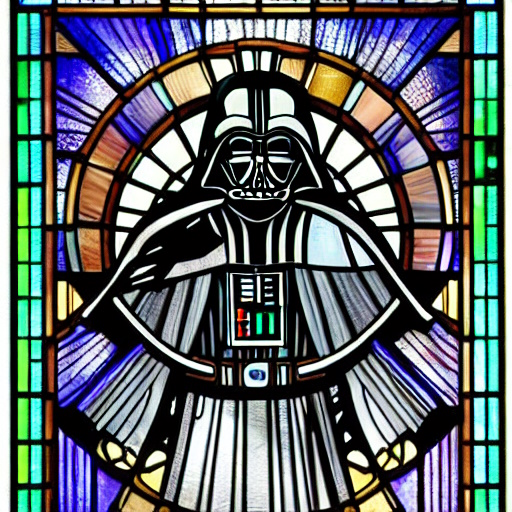
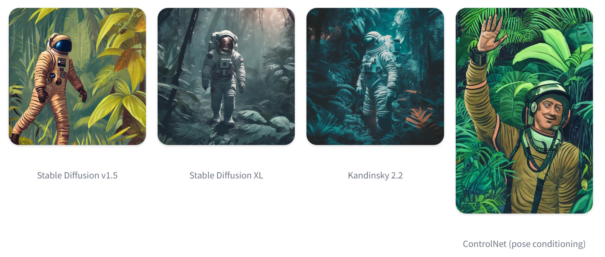
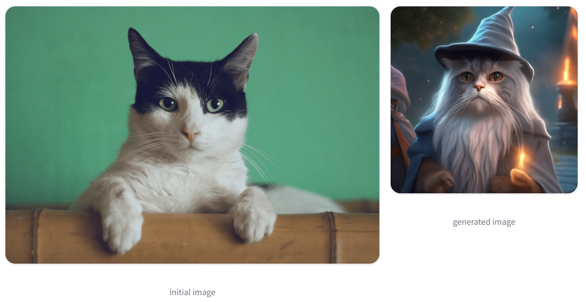
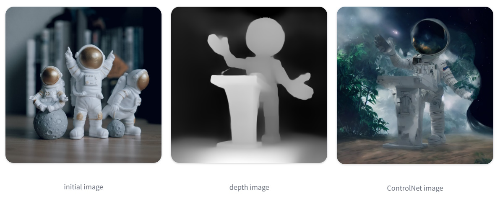
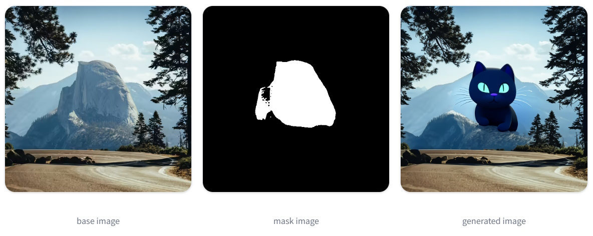
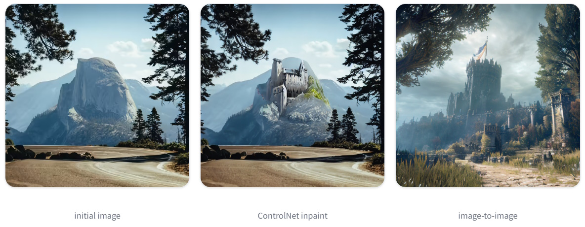
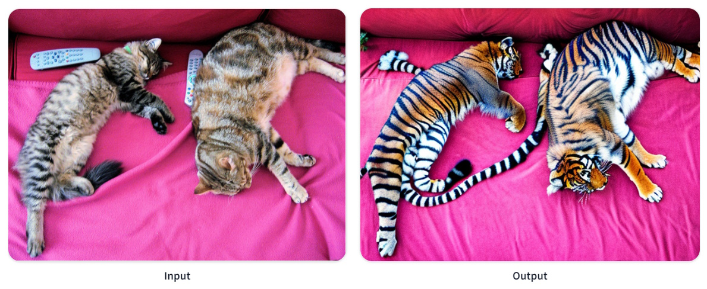

# Mastering Diffusion Models: From Text-to-Image to Depth-to-Image

## 1. Introduction

### Overview of Diffusion Models
**HuggingFace Diffusers** is the premier library for state-of-the-art pretrained diffusion models, capable of generating images, audio, and even 3D molecular structures. Whether you need a straightforward inference solution or aim to train your own diffusion model, **Diffusers** offers a modular toolbox that supports both scenarios. The library is built with a focus on usability over performance, simplicity over ease, and customizability over abstractions.

**The library's three main components are:**
1. **State-of-the-Art Diffusion Pipelines:** Easily perform inference with just a few lines of code. The library includes numerous pipelines; refer to the pipeline overview table for a complete list of available pipelines and their corresponding tasks.
2. **Interchangeable Noise Schedulers:** Balance trade-offs between generation speed and quality by choosing from a variety of noise schedulers.
3. **Pretrained Models:** Utilize these models as building blocks and combine them with schedulers to create your own end-to-end diffusion systems.

Diffusion models generate samples such as images or audio by denoising random Gaussian noise step-by-step. This approach has generated significant interest in generative AI, with numerous diffusion-generated images circulating online. Diffusers aims to make diffusion models widely accessible to everyone.

Whether you're a developer or a casual user, this quick tour will introduce you to Diffusers and get you up and running quickly. The library's three main components are:

1. **DiffusionPipeline**: A high-level, end-to-end class for rapidly generating samples from pretrained diffusion models for inference.
2. **Popular Pretrained Model Architectures and Modules**: Use these as building blocks to create custom diffusion systems.

### Features of Diffusion Models
Stable Diffusion XL enhances previous models with a larger UNet, dual text encoders, size and crop-conditioning, and a two-stage generation process, prioritizing high-quality image generation. Stable Diffusion XL Turbo, while maintaining the same architectural advancements, focuses on significantly faster inference through adversarial time-distillation, enabling it to generate images in as few as one step.

The Kandinsky models, progressing through versions 2.0 to 3.0, incorporate multilingual text encoders and an image prior model with CLIP for better text-image alignment. The latest version simplifies the architecture using Flan-UL2 for text encoding and Sber-MoVQGAN for decoding. Each Kandinsky version improves on image quality and supports a range of applications including text-to-image, image-to-image, inpainting, and interpolation, with enhanced training data handling for diverse resolutions and aspect ratios.

In essence, while Stable Diffusion XL focuses on improving the quality and detail of images generated from text descriptions, ControlNet provides a mechanism to control and fine-tune the image generation process by conditioning the model with additional input images, offering greater precision and flexibility in the output.

Here is a comparison table of the major Diffusion models:

| Feature                       | Stable Diffusion XL                 | Stable Diffusion XL Turbo            | Kandinsky Models            |
|-------------------------------|-------------------------------------|--------------------------------------|-----------------------------|
| **Main Improvement**          | Larger UNet, second text encoder    | Adversarial time-distillation        | Multilingual text-to-image generation               |
| **UNet Size**                 | 3x larger than previous versions    | Same as SDXL                         | Varies across versions, with BigGan-deep blocks in Kandinsky 3 |
| **Text Encoders**             | Original + OpenCLIP ViT-bigG/14     | Same as SDXL                         | Two multilingual encoders (Kandinsky 2.0); Flan-UL2 (Kandinsky 3) |
| **Additional Features**       | Size and crop-conditioning, two-stage model | Faster inference (as little as 1 step) | Image prior model with CLIP, MoVQ decoder, larger image encoder (Kandinsky 2.2), simplified architecture (Kandinsky 3) |
| **Inference Speed**           | Standard                            | Significantly faster                 | Varies; optimized with each version                 |
| **Image Quality**             | High                                | High, with faster generation         | High, with improvements in each version             |
| **Image Prior Model**         | No                                  | No                                   | Introduced in Kandinsky 2.1 (CLIP), enhanced in Kandinsky 2.2 |
| **Decoder**                   | Standard                            | Standard                             | MoVQ (Kandinsky 2.1), Sber-MoVQGAN (Kandinsky 3)    |
| **Text-to-Image**             | Yes                                 | Yes                                  | Yes                                                 |
| **Image-to-Image**            | Yes                                 | Yes                                  | Yes                                                 |
| **Inpainting**                | Yes                                 | Yes                                  | Yes                                                 |
| **Interpolation**             | Yes                                 | Yes                                  | Yes                                                 |
| **Support ControlNet**        | Yes                                 | Yes                                  | Yes                                                 |
| **Training Data Handling**    | Size and crop-conditioning to preserve data | Same as SDXL                         | Retrained on different resolutions and aspect ratios (Kandinsky 2.2) |
| **Architecture**              | Two-stage model                     | Same as SDXL                         | Simplified in Kandinsky 3                           |

The major differences between Stable Diffusion XL and ControlNet can be summarized as follows:

| Feature                        | Stable Diffusion XL                                     | ControlNet                                                      |
|--------------------------------|---------------------------------------------------------|-----------------------------------------------------------------|
| **Primary Function**           | Text-to-image generation                                | Controlling image diffusion models with additional input images |
| **Input Types**                | Text prompts                                            | Various conditioning inputs (e.g., canny edge, user sketching, human pose, depth) |
| **Control Mechanism**          | Utilizes a two-stage model process with a base model and refiner for high-quality image generation | Conditions the diffusion model with an additional image input for greater control over the generated output |
| **Architecture**               | Larger UNet, dual text encoders (original + OpenCLIP ViT-bigG/14), size and crop-conditioning | Works with existing diffusion models like Stable Diffusion, providing auxiliary models for added control |
| **Special Features**           | Two-stage generation process, size and crop-conditioning, improved parameter handling | Allows specific control over generated images using additional conditioning inputs, reducing the need for extensive prompt engineering |
| **Flexibility**                | Focused on improving the quality and detail of generated images through architectural enhancements | Offers greater flexibility and control over the image generation process by incorporating various conditioning inputs |
| **Use Case**                   | Generating high-quality images from text descriptions   | Fine-tuning and controlling image generation with specific conditioning inputs for targeted results |
| **Example Applications**       | Generating detailed and high-resolution images from text prompts | Creating images that follow specific guidelines or structures provided by additional input images (e.g., replicating human poses, following sketches) |


### Inpainting vs. Depth-to-Image Generation
**Inpainting**: It is a feature of Stable Diffusion models that allows for the replacement or editing of specific areas within an image. It is particularly useful for tasks such as image restoration, removing defects and artifacts, or replacing parts of an image with entirely new content. Inpainting relies on a mask where white pixels represent the areas to be filled in based on a text prompt, and black pixels represent the areas to be kept unchanged.

**Depth-to-Image**: It is a feature of Stable Diffusion models that enables the generation of new images conditioned on an initial image and a depth map. This process ensures that the generated images preserve the structural information of the original image. If no depth map is provided, the pipeline can automatically predict the depth using an integrated depth-estimation model. This feature is useful for enhancing images with a focus on maintaining their depth and spatial consistency.

Here is a table comparing the features of Inpainting and Depth-to-Image:

| Feature                | Inpainting                                                       | Depth-to-Image                                               |
|------------------------|------------------------------------------------------------------|--------------------------------------------------------------|
| **Primary Function**   | Replaces or edits specific areas of an image                     | Generates new images conditioned on an initial image and depth |
| **Use Case**           | Image restoration, removing defects and artifacts, replacing image areas | Enhancing images with structural preservation via depth maps |
| **Input Types**        | Text prompt, initial image, mask image                           | Text prompt, initial image, optional depth_map               |
| **Output Control**     | Controlled by a mask and text prompt                             | Controlled by text prompt, initial image, and depth_map      |
| **Mechanism**          | Fills in white pixel areas based on the text prompt              | Uses depth_map to maintain image structure while generating new content |
| **Tool**               | Mask determines which regions to fill                            | Depth_map provides additional structural information         |
| **Automation**         | Manual mask creation                                             | Automatic depth prediction if depth_map not provided         |
| **Complexity**         | Simple mask-based editing                                        | Complex depth-based conditioning for image generation        |
| **Example Applications** | Image defect removal, object replacement, artistic modifications | Scene reconstruction, image enhancement with preserved depth |


### Introduction to AutoPipeline
Diffusers offers a variety of pipelines for tasks such as generating images, videos, audio, and inpainting. Additionally, there are specialized pipelines for adapters and features like upscaling and super-resolution. Since different pipeline classes can use the same checkpoint by sharing the same pretrained model, it can be challenging to determine which pipeline class to use.

The AutoPipeline class simplifies this process. It is a generic, task-focused pipeline that allows you to concentrate on your specific task (e.g., **AutoPipelineForText2Image**, **AutoPipelineForImage2Image**, and **AutoPipelineForInpainting**) without needing to know the exact pipeline class. The AutoPipeline automatically selects the appropriate pipeline class for you.

Here is a comparison of the `AutoPipelineForText2Image`, `AutoPipelineForImage2Image`, and `AutoPipelineForInpainting` classes in a table format:

| Feature                               | AutoPipelineForText2Image                            | AutoPipelineForImage2Image                           | AutoPipelineForInpainting                           |
|---------------------------------------|------------------------------------------------------|------------------------------------------------------|----------------------------------------------------|
| **Class Purpose**                     | Instantiates a text-to-image pipeline                | Instantiates an image-to-image pipeline              | Instantiates an inpainting pipeline                |
| **Method: from_pretrained()**         | Available                                           | Available                                           | Available                                          |
| **Method: from_pipe()**               | Available                                           | Available                                           | Available                                          |
| **Evaluation Mode (model.eval())**    | Yes (by default)                                    | Yes (by default)                                    | Yes (by default)                                   |
| **ControlNet Support**                | Yes                                                 | Yes                                                 | Yes                                                |
| **Input Types**                       | Text prompt                                         | Text prompt, Initial image                           | Text prompt, Initial image, Mask image             |


## 2. Examples of Using Diffusers API

Here are several examples to explain how to use the HuggingFace Diffusers API:

| **Example**                       | **Description**                                                       |
|-----------------------------------|-----------------------------------------------------------------------|
| **Text-to-Image Generation**      | Generating an image from a text description.                                                                 |
| **Text-to-Image with ControlNet** | Enhancing text-to-image generation with additional conditioning inputs, such as human pose estimation.       |
| **Image-to-Image Generation**     | Creating a new image based on an initial image and a text prompt.                                            |
| **Image-to-Image with ControlNet**| Using depth maps and other conditioning images to control and guide the image generation process.            |
| **Inpainting Generation**         | Replacing or editing specific areas of an image using a mask and a text prompt.                              |
| **Inpainting with ControlNet**    | Providing more accurate and controlled inpainting by using additional conditioning images.                   |
| **Depth-to-Image Generation**     | Generating new images conditioned on an initial image and preserving structural details with a depth map.    |

### A) Text-to-Image Generation
When discussing diffusion models, text-to-image generation is often one of the first applications that comes to mind. This process involves creating an image from a text description, also known as a prompt (for example, “Astronaut in a jungle, cold color palette, muted colors, detailed, 8k”).

At a high level, a diffusion model takes a prompt and some random initial noise, then iteratively removes the noise to form an image. The denoising process is guided by the prompt, and once it concludes after a set number of time steps, the image representation is decoded into a final image.

**Example Code: Generating an Image from Text**
```python
# Import the necessary libraries
from diffusers import AutoPipelineForText2Image
import torch

# Define the model paths for different pretrained models
model_path = "runwayml/stable-diffusion-v1-5"
model_path = "stabilityai/stable-diffusion-xl-base-1.0"
model_path = "kandinsky-community/kandinsky-2-2-decoder"

# Load the text-to-image pipeline using the specified model path
# Use torch_dtype=torch.float16 for reduced memory usage and variant="fp16" for 16-bit precision
pipeline = AutoPipelineForText2Image.from_pretrained(
                model_path, torch_dtype=torch.float16, variant="fp16").to("cuda"
           )

# Generate an image based on the given text prompt
prompt = "stained glass of darth vader, backlight, centered composition, masterpiece, photorealistic, 8k"
image = pipeline(prompt).images[0]

# Save the generated image to a file
image.save("generated_image.png")
```



### B) Text-to-Image with ControlNet
ControlNet models are auxiliary models or adapters finetuned on top of text-to-image models like Stable Diffusion v1.5. By using ControlNet models in conjunction with text-to-image models, you gain more explicit control over the image generation process. ControlNet allows you to add an additional conditioning input image to the model. For example, providing an image of a human pose (represented by keypoints connected into a skeleton) as a conditioning input will guide the model to generate an image that adheres to the given pose. For more details on other conditioning inputs and how to use them, refer to the comprehensive ControlNet guide.

**Example Code: Using ControlNet for Human Pose Estimation**
```python
# Import the necessary libraries
from diffusers import ControlNetModel, AutoPipelineForText2Image
from diffusers.utils import load_image
import torch

# Define the path to the pretrained ControlNet model for human pose estimation
ctrl_model_path = "lllyasviel/control_v11p_sd15_openpose"

# Load the ControlNet model using the specified model path
# Use torch_dtype=torch.float16 for reduced memory usage and variant="fp16" for 16-bit precision
controlnet = ControlNetModel.from_pretrained(
                ctrl_model_path, torch_dtype=torch.float16, variant="fp16").to("cuda")

# Load an image to use as the pose estimation conditioning input
pose_image = load_image("https://huggingface.co/lllyasviel/control_v11p_sd15_openpose/resolve/main/images/control.png")

# Define the path to the Stable Diffusion model
sd_model_path = "runwayml/stable-diffusion-v1-5"

# Load the text-to-image pipeline using the specified Stable Diffusion model path and the ControlNet model
# Use torch_dtype=torch.float16 for reduced memory usage and variant="fp16" for 16-bit precision
pipeline = AutoPipelineForText2Image.from_pretrained(
                sd_model_path, controlnet=controlnet, torch_dtype=torch.float16, variant="fp16").to("cuda")

# Create a generator for reproducibility and set a manual seed
generator = torch.Generator("cuda").manual_seed(31)

# Generate an image based on the given text prompt and pose estimation image
prompt = "Astronaut in a jungle, cold color palette, muted colors, detailed, 8k"
image = pipeline(prompt, image=pose_image, generator=generator).images[0]

# Save the generated image to a file
image.save("generated_image.png")
```



### C) Image-to-Image Generation
Image-to-image generation is similar to text-to-image, but it also incorporates an initial image as a starting point for the diffusion process. This initial image is encoded into latent space, where noise is added. The latent diffusion model then takes both the prompt and the noisy latent image, predicts the added noise, and removes it from the initial latent image to produce a new latent image. Finally, a decoder transforms the new latent image back into a fully realized image.

**Example Code: Generating an Image from an Initial Image**
```python
# Import the necessary libraries
import torch
from diffusers import AutoPipelineForImage2Image
from diffusers.utils import load_image, make_image_grid

# Define the paths to different pretrained models
sd_model_path = "kandinsky-community/kandinsky-2-2-decoder"
sd_model_path = "runwayml/stable-diffusion-v1-5"
sd_model_path = "stabilityai/stable-diffusion-xl-refiner-1.0"

# Load the image-to-image pipeline using the specified model path
# Use torch_dtype=torch.float16 for reduced memory usage and use_safetensors=True for efficient memory handling
pipeline = AutoPipelineForImage2Image.from_pretrained(
    "kandinsky-community/kandinsky-2-2-decoder", torch_dtype=torch.float16, use_safetensors=True
)

# Enable model CPU offload to manage memory usage efficiently
pipeline.enable_model_cpu_offload()

# Enable xFormers memory efficient attention for better performance
# Remove this line if xFormers is not installed or if PyTorch 2.0 or higher is installed
pipeline.enable_xformers_memory_efficient_attention()

# Load an initial image to pass to the pipeline
url = "https://huggingface.co/datasets/huggingface/documentation-images/resolve/main/diffusers/img2img-init.png"
init_image = load_image(url)

# Define the prompt for image generation
prompt = "cat wizard, gandalf, lord of the rings, detailed, fantasy, cute, adorable, Pixar, Disney, 8k"

# Generate an image based on the prompt and the initial image
image = pipeline(prompt, image=init_image).images[0]

# Display the initial and generated images side by side in a grid
make_image_grid([init_image, image], rows=1, cols=2)
```



### D) Image-to-Image with ControlNet
ControlNets offer a more flexible and precise method for controlling image generation by using an additional conditioning image. This conditioning image can be a canny edge detection image, depth map, image segmentation, or even simple scribbles. Regardless of the type of conditioning image you use, ControlNet ensures that the generated image preserves the information from the conditioning input, providing greater control over the final output.

**Example Code: Using ControlNet with Depth Maps**
Load a ControlNet model conditioned on depth maps and the AutoPipelineForImage2Image.
Then, Generate a new image conditioned on the depth map, initial image, and prompt.
```python
# Import the necessary libraries
from diffusers import ControlNetModel, AutoPipelineForImage2Image
import torch

# Load the ControlNet model for depth conditioning
# Use torch_dtype=torch.float16 for reduced memory usage and variant="fp16" for 16-bit precision
ctrl_model_path = "lllyasviel/control_v11f1p_sd15_depth"
controlnet = ControlNetModel.from_pretrained(
                ctrl_model_path, torch_dtype=torch.float16, variant="fp16", use_safetensors=True
             )

# Load the image-to-image pipeline using the Stable Diffusion model path and the ControlNet model
# Use torch_dtype=torch.float16 for reduced memory usage and variant="fp16" for 16-bit precision
sd_model_path = "runwayml/stable-diffusion-v1-5"
pipeline = AutoPipelineForImage2Image.from_pretrained(
            sd_model_path, controlnet=controlnet, torch_dtype=torch.float16, variant="fp16", use_safetensors=True
           )

# Enable model CPU offload to manage memory usage efficiently
pipeline.enable_model_cpu_offload()

# Enable xFormers memory efficient attention for better performance
# Remove this line if xFormers is not installed or if PyTorch 2.0 or higher is installed
pipeline.enable_xformers_memory_efficient_attention()

# Define the prompt for image generation
prompt = "Astronaut in a jungle, cold color palette, muted colors, detailed, 8k"

# Generate an image based on the prompt, initial image, and control (depth) image
image_control_net = pipeline(prompt, image=init_image, control_image=depth_image).images[0]

# Display the initial, depth, and generated images side by side in a grid
make_image_grid([init_image, depth_image, image_control_net], rows=1, cols=3)
```



### E) Inpainting Generation
Inpainting involves replacing or editing specific areas of an image, making it a valuable tool for tasks like image restoration, removing defects and artifacts, or even completely replacing parts of an image. The process relies on a mask to determine which regions of the image to fill in. Areas to be inpainted are represented by white pixels, while areas to be preserved are represented by black pixels. The white pixels are then filled in based on the provided text prompt.

**Example Code: Inpainting with HuggingFace Diffusers**
```python
# Import the necessary libraries
import torch
from diffusers import AutoPipelineForInpainting
from diffusers.utils import load_image, make_image_grid

# Define the paths to different pretrained inpainting models
sd_model_path = "runwayml/stable-diffusion-inpainting"
sd_model_path = "diffusers/stable-diffusion-xl-1.0-inpainting-0.1"
sd_model_path = "kandinsky-community/kandinsky-2-2-decoder-inpaint"

# Load an inpainting checkpoint with the AutoPipelineForInpainting class
# This will automatically detect the appropriate pipeline class to load based on the checkpoint
pipeline = AutoPipelineForInpainting.from_pretrained(sd_model_path, torch_dtype=torch.float16)

# Enable model CPU offload to manage memory usage efficiently
pipeline.enable_model_cpu_offload()

# Enable xFormers memory efficient attention for better performance
# Remove this line if xFormers is not installed or if PyTorch 2.0 or higher is installed
pipeline.enable_xformers_memory_efficient_attention()

# Load the base and mask images for inpainting
init_image = load_image("https://path/to/diffusers/inpaint.png")
mask_image = load_image("https://path/to/diffusers/inpaint_mask.png")

# Create a prompt for inpainting and set a negative prompt to avoid undesired results
generator = torch.Generator("cuda").manual_seed(92)
prompt = "a black cat with glowing eyes, cute, adorable, disney, pixar, highly detailed, 8k"
negative_prompt = "bad anatomy, deformed, ugly, disfigured"

# Generate the inpainted image using the pipeline with the provided base image, mask image, and prompts
image = pipeline(prompt=prompt, negative_prompt=negative_prompt, image=init_image, mask_image=mask_image, 
                 generator=generator).images[0]

# Display the base, mask, and generated images side by side in a grid
make_image_grid([init_image, mask_image, image], rows=1, cols=3)
```



### F) Inpainting with ControlNet
ControlNet models, when used with other diffusion models like Stable Diffusion, provide an even more flexible and precise method for controlling image generation. In the context of inpainting, ControlNet accepts an additional conditioning image input that guides the diffusion model to preserve specific features in the image. This allows for more accurate and controlled inpainting, ensuring that the desired areas are modified while maintaining the integrity of the original features.

**Example Code: Using ControlNet for Inpainting**
```python
# Import the necessary libraries
import torch
import numpy as np
from diffusers import ControlNetModel, StableDiffusionControlNetInpaintPipeline
from diffusers.utils import load_image, make_image_grid

# Load the ControlNet model for inpainting
# Use torch_dtype=torch.float16 for reduced memory usage and variant="fp16" for 16-bit precision
controlnet = ControlNetModel.from_pretrained("lllyasviel/control_v11p_sd15_inpaint", torch_dtype=torch.float16, variant="fp16")

# Pass the ControlNet model to the Stable Diffusion ControlNet Inpainting Pipeline
pipeline = StableDiffusionControlNetInpaintPipeline.from_pretrained(
    "runwayml/stable-diffusion-inpainting", controlnet=controlnet, torch_dtype=torch.float16, variant="fp16"
)

# Enable model CPU offload to manage memory usage efficiently
pipeline.enable_model_cpu_offload()

# Enable xFormers memory efficient attention for better performance
# Remove this line if xFormers is not installed or if PyTorch 2.0 or higher is installed
pipeline.enable_xformers_memory_efficient_attention()

# Load the base and mask images for inpainting
init_image = load_image("https://huggingface.co/datasets/huggingface/documentation-images/resolve/main/diffusers/inpaint.png")
mask_image = load_image("https://huggingface.co/datasets/huggingface/documentation-images/resolve/main/diffusers/inpaint_mask.png")

# Prepare the control image by setting masked pixels to -1.0 and converting to tensor
def make_inpaint_condition(init_image, mask_image):
    init_image = np.array(init_image.convert("RGB")).astype(np.float32) / 255.0
    mask_image = np.array(mask_image.convert("L")).astype(np.float32) / 255.0

    # Ensure the base and mask images have the same dimensions
    assert init_image.shape[0:1] == mask_image.shape[0:1], "image and image_mask must have the same image size"

    # Set masked pixels to -1.0
    init_image[mask_image > 0.5] = -1.0
    init_image = np.expand_dims(init_image, 0).transpose(0, 3, 1, 2)
    init_image = torch.from_numpy(init_image)
    return init_image

control_image = make_inpaint_condition(init_image, mask_image)

# Generate an image from the base, mask, and control images
# The prompt guides the generation process, and the control image preserves the base image features
prompt = "concept art digital painting of an elven castle, inspired by lord of the rings, highly detailed, 8k"
image = pipeline(prompt=prompt, image=init_image, mask_image=mask_image, control_image=control_image).images[0]

# Display the base, mask, control, and generated images side by side in a grid
images = [init_image, mask_image, PIL.Image.fromarray(np.uint8(control_image[0][0])).convert('RGB'), image]
make_image_grid(images, rows=2, cols=2)
```



### G) Depth-to-Image Generation
The StableDiffusionDepth2ImgPipeline allows you to condition the generation of new images by providing both a text prompt and an initial image. Additionally, you can pass a depth_map to preserve the structural details of the image. If no depth_map is provided, the pipeline will automatically predict the depth using an integrated depth-estimation model. This feature ensures that the generated images maintain their original depth and spatial consistency.

**Example Code: Depth-to-Image Pipeline**
```python
# Import the necessary libraries
import torch
from diffusers import StableDiffusionDepth2ImgPipeline
from diffusers.utils import load_image, make_image_grid

# Load the Stable Diffusion Depth2Img pipeline
# Use torch_dtype=torch.float16 for reduced memory usage and use_safetensors=True for efficient memory handling
pipeline = StableDiffusionDepth2ImgPipeline.from_pretrained(
    "stabilityai/stable-diffusion-2-depth",
    torch_dtype=torch.float16,
    use_safetensors=True,
).to("cuda")

# Load the initial image to condition the generation of new images
init_image = load_image("http://images.cocodataset.org/val2017/000000039769.jpg")

# Define the prompt for image generation
prompt = "two tigers"

# Define a negative prompt to prevent certain undesired characteristics in the generated image
negative_prompt = "bad, deformed, ugly, bad anatomy"

# Generate an image based on the prompt, initial image, and negative prompt
# The strength parameter controls how much the initial image influences the final output
image = pipeline(prompt=prompt, image=init_image, negative_prompt=negative_prompt, strength=0.7).images[0]

# Display the initial and generated images side by side in a grid
make_image_grid([init_image, image], rows=1, cols=2)
```



## 3. Conclusion
We explored various advanced techniques and models in the realm of diffusion models in this article. These techniques demonstrate the versatility and power of diffusion models in generating and manipulating images with high precision and control. By leveraging models like Stable Diffusion XL and ControlNet, users can achieve a wide range of creative and practical applications, from high-quality image generation to detailed image editing and enhancement.

| Technique                          | Description                                                                                           | Key Features                                                                                       |
|------------------------------------|-------------------------------------------------------------------------------------------------------|----------------------------------------------------------------------------------------------------|
| **Text-to-Image**                  | Generates images from textual descriptions by iteratively denoising random initial noise.             | Uses prompts to guide image generation.                                                            |
| **Text-to-Image with ControlNet**  | Enhances text-to-image generation with additional conditioning inputs like human poses or other images.| Allows more controlled and precise image outputs.                                                  |
| **Image-to-Image**                 | Generates new images based on an initial image and a prompt, refining through the diffusion process.  | Encodes initial image to latent space, adds noise, and refines with a prompt.                      |
| **Image-to-Image with ControlNet** | Utilizes additional conditioning images (e.g., depth maps, canny edges, sketches) to guide generation.| Ensures specific features are preserved in the output.                                             |
| **Inpainting**                     | Replaces or edits specific areas of an image using a mask, filling in areas marked with white pixels. | Useful for image restoration, defect removal, and replacing parts of an image.                     |
| **Inpainting with ControlNet**     | Provides more flexible and accurate control over inpainting with additional conditioning images.      | Guides the diffusion model to maintain specific features during inpainting.                        |
| **Depth-to-Image**                 | Generates new images using a text prompt and initial image, preserving structural details via a depth map.| Uses depth map to maintain depth and spatial consistency, with automatic depth prediction if needed.|


## 4. References
For further reading and detailed documentation, refer to the following resources:
- [Hugging Face Diffusers Documentation](https://huggingface.co/docs/diffusers)
- [AutoPipeline Overview](https://huggingface.co/docs/diffusers/v0.28.2/en/api/pipelines/auto_pipeline)
- [AutoPipelineForImage2Image API](https://huggingface.co/docs/diffusers/v0.28.2/en/api/pipelines/auto_pipeline#diffusers.AutoPipelineForImage2Image)
- [AutoPipelineForInpainting API](https://huggingface.co/docs/diffusers/v0.28.2/en/api/pipelines/auto_pipeline#diffusers.AutoPipelineForInpainting)
- [Using Depth-to-Image Pipelines](https://huggingface.co/docs/diffusers/v0.28.2/en/using-diffusers/depth2img)

These links provide comprehensive guides and API references to help you effectively use and understand the various features and functionalities of Hugging Face Diffusers.


