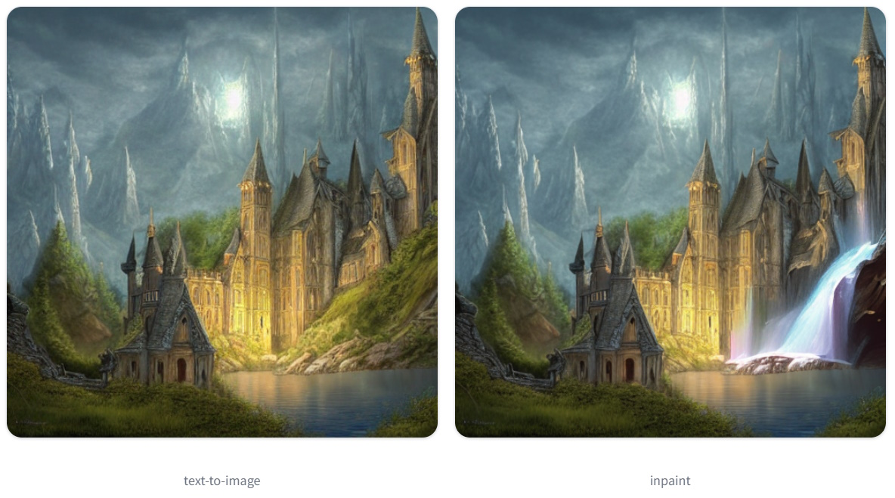
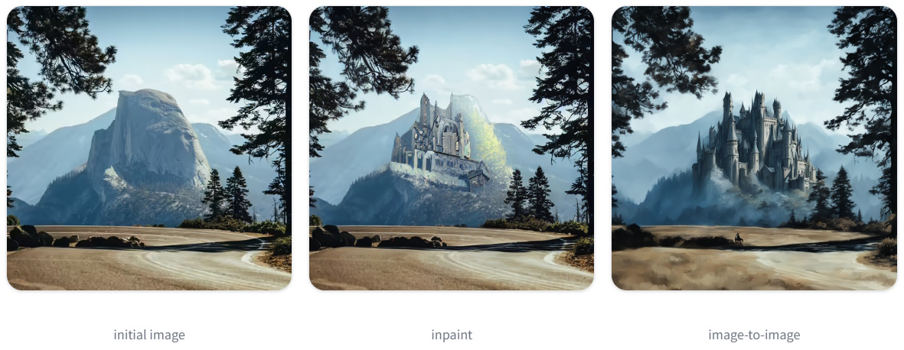

# Advanced Image Processing: Leveraging Chained Pipelines for Superior Results

## Introduction

### Overview of Chained Pipelines
In the realm of image processing and artificial intelligence, chained pipelines represent a sophisticated and powerful technique for generating, refining, and enhancing images. These pipelines involve the sequential use of different models, where the output of one model serves as the input for the next. By chaining various pipelines, such as image-to-image and inpainting models, it is possible to achieve remarkable results that would be challenging to attain with a single model alone.

Chained pipelines offer a flexible approach to image manipulation, enabling the creation of highly detailed and visually appealing images. This method allows for the combination of different models' strengths, facilitating complex transformations and refinements. Whether generating an image from text and then refining it, or iteratively applying style transfers and enhancements, chained pipelines open up a world of creative possibilities.

### Benefits of Chaining Pipelines
The benefits of chaining pipelines extend beyond simple image generation. By employing multiple stages of processing, each tailored to a specific aspect of image enhancement, this technique offers several key advantages:

1. **Improved Output Quality:** Each stage in the pipeline can focus on enhancing specific features, resulting in a more polished and high-quality final image. For instance, a text-to-image model can generate the initial scene, while subsequent image-to-image models refine details and add artistic styles.
2. **Enhanced Creativity and Flexibility:** Artists and designers can experiment with various transformations and effects, combining multiple styles and techniques to create unique and intricate images. This iterative process allows for greater creative freedom and the ability to explore different visual aesthetics.
3. **Memory and Computational Efficiency:** By keeping outputs in latent space and reusing the same pipeline components, chaining pipelines can reduce computational load and memory usage. This efficiency is particularly beneficial when working with high-resolution images or limited computational resources.
4. **Targeted Image Editing:** Inpainting pipelines, when chained with other models, allow for precise modifications to specific areas of an image. This targeted editing capability is ideal for tasks such as restoring missing areas, adding new elements, or correcting imperfections without affecting the overall composition.
5. **Combining Strengths of Different Models:** Different models excel at different tasks, such as texture generation, color enhancement, or detail refinement. By chaining these models, you can leverage their individual strengths to achieve superior results.


## Applications and Use Cases
In this section, we will explore the practical applications and use cases of chained pipelines in image processing. Chained pipelines, including both image-to-image and inpainting sequences, offer a versatile and powerful approach to creating, refining, and enhancing images. By leveraging multiple models and techniques in a sequential manner, these pipelines can achieve remarkable results across a variety of fields. We will delve into specific examples and workflows that demonstrate how these pipelines can be applied to solve real-world problems and enhance creative projects.

**Chained Image-to-Image Pipelines**
Chained image-to-image pipelines allow for progressive refinement and transformation of images. By starting with a basic generation and applying successive models, you can enhance details, apply styles, and improve overall quality. This approach is particularly useful for:
- **Text-to-Image-to-Image:** Generating initial images from textual descriptions and refining them further.
- **Image-to-Image-to-Image:** Iteratively applying different styles and enhancements.
- **Image-to-Upscaler-to-Super-Resolution:** Increasing image resolution and detail through upscaling and super-resolution techniques.

**Chained Inpainting Pipelines**
Inpainting pipelines focus on editing specific areas of an image while preserving the rest. Chaining these pipelines allows for detailed and precise modifications, making them ideal for:
- **Text-to-Image-to-Inpaint:** Generating images from text and then refining specific areas through inpainting.
- **Inpaint-to-Image-to-Image:** Combining inpainting with additional image transformations to enhance quality and detail.

### Use-Case 1: Text-to-Image-to-Image
Chaining a text-to-image and image-to-image pipeline allows you to generate an image from text and use the generated image as the initial image for the image-to-image pipeline. This is useful if you want to generate an image entirely from scratch. For example, let’s chain a Stable Diffusion and a Kandinsky model.

```python
# Import necessary libraries and functions from diffusers
from diffusers import AutoPipelineForText2Image, AutoPipelineForImage2Image
import torch
from diffusers.utils import make_image_grid

# Step 1: Generate an Image with the Text-to-Image Pipeline
# Load the text-to-image pipeline with Stable Diffusion model
pipeline = AutoPipelineForText2Image.from_pretrained(
    "runwayml/stable-diffusion-v1-5", torch_dtype=torch.float16, variant="fp16", use_safetensors=True
)

# Enable model CPU offloading for memory efficiency
pipeline.enable_model_cpu_offload()

# Enable xFormers memory efficient attention (if applicable)
pipeline.enable_xformers_memory_efficient_attention()

# Generate an image from text prompt
text2image = pipeline("Astronaut in a jungle, cold color palette, muted colors, detailed, 8k").images[0]

# Step 2: Pass the Generated Image to the Image-to-Image Pipeline
# Load the image-to-image pipeline with Kandinsky model
pipeline = AutoPipelineForImage2Image.from_pretrained(
    "kandinsky-community/kandinsky-2-2-decoder", torch_dtype=torch.float16, use_safetensors=True
)

# Enable model CPU offloading for memory efficiency
pipeline.enable_model_cpu_offload()

# Enable xFormers memory efficient attention (if applicable)
pipeline.enable_xformers_memory_efficient_attention()

# Use the generated image as input for the image-to-image pipeline with the same prompt
image2image = pipeline("Astronaut in a jungle, cold color palette, muted colors, detailed, 8k", image=text2image).images[0]

# Display the original and refined images side by side
make_image_grid([text2image, image2image], rows=1, cols=2)
```
This process demonstrates how to chain a text-to-image and image-to-image pipeline to generate and refine an image from scratch, combining the strengths of different models to achieve high-quality results.


### Use-Case 2: Image-to-Image-to-Image
You can chain multiple image-to-image pipelines together to create more compelling and varied images. This approach is useful for iteratively applying style transfers, generating short GIFs, restoring colors, or repairing missing areas in an image.

```python
import torch
from diffusers import AutoPipelineForImage2Image
from diffusers.utils import make_image_grid, load_image

# Step 1: Generate an Initial Image
# Load the image-to-image pipeline with Stable Diffusion model
pipeline = AutoPipelineForImage2Image.from_pretrained(
    "runwayml/stable-diffusion-v1-5", torch_dtype=torch.float16, variant="fp16", use_safetensors=True
)
pipeline.enable_model_cpu_offload()  # Enable model CPU offloading for memory efficiency
pipeline.enable_xformers_memory_efficient_attention()  # Enable xFormers memory efficient attention (if applicable)

# Prepare the initial image
url = "https://path/to/diffusers/img2img-init.png"
init_image = load_image(url)

# Define the prompt for the initial image generation
prompt = "Astronaut in a jungle, cold color palette, muted colors, detailed, 8k"

# Generate the initial image using the image-to-image pipeline
text2image = pipeline(prompt, image=init_image, output_type="latent").images[0]

# Note:
# It is important to specify `output_type="latent"` in the pipeline to keep all the outputs in latent space 
# and avoid an unnecessary decode-encode step. This only works if the chained pipelines are using the same VAE.

# Step 2: Apply Comic Book Art Style
# Load the image-to-image pipeline with Comic Diffusion model
pipeline = AutoPipelineForImage2Image.from_pretrained(
    "ogkalu/Comic-Diffusion", torch_dtype=torch.float16
)
pipeline.enable_model_cpu_offload()  # Enable model CPU offloading for memory efficiency
pipeline.enable_xformers_memory_efficient_attention()  # Enable xFormers memory efficient attention (if applicable)

# Define the prompt with the token "charliebo artstyle" to use the comic book style checkpoint
image2image = pipeline("Astronaut in a jungle, charliebo artstyle", image=text2image, output_type="latent").images[0]

# Step 3: Apply Pixel Art Style
# Load the image-to-image pipeline with Pixel Art Style model
pipeline = AutoPipelineForImage2Image.from_pretrained(
    "kohbanye/pixel-art-style", torch_dtype=torch.float16
)
pipeline.enable_model_cpu_offload()  # Enable model CPU offloading for memory efficiency
pipeline.enable_xformers_memory_efficient_attention()  # Enable xFormers memory efficient attention (if applicable)

# Define the prompt with the token "pixelartstyle" to use the pixel art style checkpoint
style_image = pipeline("Astronaut in a jungle, pixelartstyle", image=image2image).images[0]

# Display the initial and final images side by side
make_image_grid([init_image, style_image], rows=1, cols=2)
```
This workflow demonstrates how to chain multiple image-to-image pipelines to iteratively apply different styles and enhancements to an image, achieving complex and high-quality visual results.

### Use-Case 3: Image-to-Upscaler-to-Super-Resolution
Another effective technique involves chaining your image-to-image pipeline with both an upscaler and a super-resolution pipeline. This approach significantly enhances the detail and resolution of the final image.

```python
import torch
from diffusers import AutoPipelineForImage2Image
from diffusers import StableDiffusionLatentUpscalePipeline
from diffusers import StableDiffusionUpscalePipeline
from diffusers.utils import make_image_grid, load_image

# Step 1: Generate an Initial Image with Image-to-Image Pipeline
# Load the image-to-image pipeline with Stable Diffusion model
pipeline = AutoPipelineForImage2Image.from_pretrained(
    "runwayml/stable-diffusion-v1-5", torch_dtype=torch.float16, variant="fp16", use_safetensors=True
)
pipeline.enable_model_cpu_offload()  # Enable model CPU offloading for memory efficiency
pipeline.enable_xformers_memory_efficient_attention()  # Enable xFormers memory efficient attention (if applicable)

# Prepare the initial image
init_image = load_image("https://path/to/diffusers/img2img-init.png")

# Define the prompt for the initial image generation
prompt = "Astronaut in a jungle, cold color palette, muted colors, detailed, 8k"

# Generate the initial image using the image-to-image pipeline
image2image = pipeline(prompt, image=init_image, output_type="latent").images[0]

# Note:
# It is important to specify `output_type="latent"` in the pipeline to keep all the outputs in latent space
# and avoid an unnecessary decode-encode step. This only works if the chained pipelines are using the same VAE.

# Step 2: Increase Image Resolution with an Upscaler Pipeline
# Load the upscaler pipeline
upscaler = StableDiffusionLatentUpscalePipeline.from_pretrained(
    "stabilityai/sd-x2-latent-upscaler", torch_dtype=torch.float16, variant="fp16", use_safetensors=True
)
upscaler.enable_model_cpu_offload()  # Enable model CPU offloading for memory efficiency
upscaler.enable_xformers_memory_efficient_attention()  # Enable xFormers memory efficient attention (if applicable)

# Upscale the initial image
upscale_image = upscaler(prompt, image=image2image, output_type="latent").images[0]

# Step 3: Enhance Resolution with a Super-Resolution Pipeline
# Load the super-resolution pipeline
super_res = StableDiffusionUpscalePipeline.from_pretrained(
    "stabilityai/stable-diffusion-x4-upscaler", torch_dtype=torch.float16, variant="fp16", use_safetensors=True
)
super_res.enable_model_cpu_offload()  # Enable model CPU offloading for memory efficiency
super_res.enable_xformers_memory_efficient_attention()  # Enable xFormers memory efficient attention (if applicable)

# Further enhance the image resolution
high_res_image = super_res(prompt, image=upscale_image).images[0]

# Display the initial and final images side by side
make_image_grid([init_image, high_res_image.resize((512, 512))], rows=1, cols=2)
```
This workflow demonstrates how to chain an image-to-image pipeline with upscaler and super-resolution pipelines to iteratively increase the resolution and level of detail in an image, achieving high-quality visual results.


### Use-Case 4: Text-to-Image-to-Inpaint
Chaining a text-to-image and inpainting pipeline allows you to inpaint the generated image without providing a base image to begin with. This makes it convenient to edit your favorite text-to-image outputs without having to generate an entirely new image.

```python
import torch
from diffusers import AutoPipelineForText2Image, AutoPipelineForInpainting
from diffusers.utils import load_image, make_image_grid

# Step 1: Generate an Image with the Text-to-Image Pipeline
# Load the text-to-image pipeline with Stable Diffusion model
pipeline = AutoPipelineForText2Image.from_pretrained(
    "runwayml/stable-diffusion-v1-5", torch_dtype=torch.float16, variant="fp16", use_safetensors=True
)

# Enable model CPU offloading for memory efficiency
pipeline.enable_model_cpu_offload()

# Enable xFormers memory efficient attention (if applicable)
pipeline.enable_xformers_memory_efficient_attention()

# Generate an image from text prompt
text2image = pipeline(
    "concept art digital painting of an elven castle, inspired by lord of the rings, highly detailed, 8k"
).images[0]

# Step 2: Load the Mask Image
# Load the mask image to define the area for inpainting
mask_image = load_image("https://path/to/diffusers/inpaint_text-chain-mask.png")

# Step 3: Inpaint the Masked Area with a Waterfall
# Load the inpainting pipeline with Kandinsky model
pipeline = AutoPipelineForInpainting.from_pretrained(
    "kandinsky-community/kandinsky-2-2-decoder-inpaint", torch_dtype=torch.float16
)

# Enable model CPU offloading for memory efficiency
pipeline.enable_model_cpu_offload()

# Enable xFormers memory efficient attention (if applicable)
pipeline.enable_xformers_memory_efficient_attention()

# Define the prompt for inpainting the masked area
prompt = "digital painting of a fantasy waterfall, cloudy"

# Inpaint the masked area on the generated image
inpaint_image = pipeline(prompt=prompt, image=text2image, mask_image=mask_image).images[0]

# Display the original image, mask image, and inpainted image side by side
make_image_grid([text2image, mask_image, inpaint_image], rows=1, cols=3)
```


This workflow demonstrates how to chain a text-to-image pipeline with an inpainting pipeline to generate and refine an image, allowing for precise modifications and enhancements without starting from scratch.


### Use-Case 5: Inpaint-to-Image-to-Image
You can also chain an inpainting pipeline before another pipeline like image-to-image or an upscaler to improve the quality.

Image-to-image and inpainting are similar tasks. Image-to-image generates a new image that resembles the existing provided image. Inpainting does the same thing but only transforms the image area defined by the mask, leaving the rest of the image unchanged. Inpainting is a more precise tool for making specific changes, whereas image-to-image has a broader scope for making more sweeping changes.

```python
import torch
from diffusers import AutoPipelineForInpainting, AutoPipelineForImage2Image
from diffusers.utils import load_image, make_image_grid

# Step 1: Inpaint an Image
# Load the inpainting pipeline with Stable Diffusion model
pipeline = AutoPipelineForInpainting.from_pretrained(
    "runwayml/stable-diffusion-inpainting", torch_dtype=torch.float16, variant="fp16"
)

# Enable model CPU offloading for memory efficiency
pipeline.enable_model_cpu_offload()

# Enable xFormers memory efficient attention (if applicable)
pipeline.enable_xformers_memory_efficient_attention()

# Load base and mask images
init_image = load_image("https://path/to/diffusers/inpaint.png")
mask_image = load_image("https://path/to/inpaint_mask.png")

# Define the prompt for inpainting
prompt = "concept art digital painting of an elven castle, inspired by lord of the rings, highly detailed, 8k"

# Inpaint the image using the mask
image_inpainting = pipeline(prompt=prompt, image=init_image, mask_image=mask_image).images[0]

# Resize the inpainted image to 1024x1024 for further processing
image_inpainting = image_inpainting.resize((1024, 1024))

# Step 2: Enhance Details with SDXL's Refiner Model
# Load the SDXL refiner inpainting pipeline
pipeline = AutoPipelineForInpainting.from_pretrained(
    "stabilityai/stable-diffusion-xl-refiner-1.0", torch_dtype=torch.float16, variant="fp16"
)

# Enable model CPU offloading for memory efficiency
pipeline.enable_model_cpu_offload()

# Enable xFormers memory efficient attention (if applicable)
pipeline.enable_xformers_memory_efficient_attention()

# Enhance the image details using the refiner model
enhance_image = pipeline(prompt=prompt, image=image_inpainting, mask_image=mask_image, output_type="latent").images[0]

# It is important to specify output_type="latent" to keep all the outputs in latent space and avoid unnecessary decode-encode steps.
# This only works if the chained pipelines are using the same VAE.

# Note: 
# It is important to specify `output_type="latent"` in the pipeline to keep all the outputs in latent space 
# to avoid an unnecessary decode-encode step. This only works if the chained pipelines are using the same VAE. 
# For example, in the Text-to-image-to-inpaint section, Kandinsky 2.2 uses a different VAE class than the 
# Stable Diffusion model, so it won’t work. But if you use Stable Diffusion v1.5 for both pipelines, 
# then you can keep everything in latent space because they both use AutoencoderKL.

# Step 3: Apply Final Touches with Image-to-Image Pipeline
# Load the image-to-image pipeline reusing the existing pipeline components
pipeline = AutoPipelineForImage2Image.from_pipe(pipeline)

# Enable xFormers memory efficient attention (if applicable)
pipeline.enable_xformers_memory_efficient_attention()

# Apply the final touches to the image
final_image = pipeline(prompt=prompt, image=enhance_image).images[0]

# Display the initial image, mask image, inpainted image, and final enhanced image side by side
make_image_grid([init_image, mask_image, image_inpainting, final_image], rows=2, cols=2)
```


## Conclusion
In this article, we've explored the powerful technique of chaining various image processing pipelines to enhance the quality and creativity of generated images. By combining the strengths of different models, such as text-to-image, image-to-image, upscaling, super-resolution, and inpainting pipelines, we can achieve remarkable results that would be challenging to obtain with a single model.

### Key Takeaways
1. **Incremental Refinement:** Chaining pipelines allows for step-by-step enhancement of images, leading to high-quality outputs with intricate details and refined features.
2. **Flexibility and Creativity:** Artists and designers can experiment with different styles and transformations, enabling the creation of unique and visually stunning images.
3. **Efficiency:** Keeping outputs in latent space and reusing pipeline components reduces computational load and memory usage, making the process more efficient.
4. **Targeted Editing:** Inpainting pipelines allow for precise modifications to specific areas of an image, which is ideal for tasks like restoring missing areas, adding new elements, or correcting imperfections.
5. **Combining Strengths:** Different models excel at different tasks. By chaining them together, we can leverage their individual strengths to achieve superior results.

### Applications
Chained pipelines have diverse applications across various fields, including:
- **AR/VR and Virtual Reality:** Creating realistic and immersive environments.
- **Visual Effects (VFX):** Generating complex visual effects for movies or games.
- **Architectural Visualization:** Producing high-quality renderings of architectural designs.
- **Robotics and Autonomous Vehicles:** Generating realistic training data for machine learning models.

By understanding and utilizing the power of chained pipelines, you can enhance your image processing projects and push the boundaries of what is possible with AI-driven image generation and editing.


## References
- [Hugging Face Diffusers Documentation v0.28.2](https://huggingface.co/docs/diffusers/v0.28.2/en)
- [Hugging Face Diffusers AutoPipelineForImage2Image](https://huggingface.co/docs/diffusers/v0.28.2/en/api/pipelines/auto_pipeline#diffusers.AutoPipelineForImage2Image)
- [Hugging Face Diffusers AutoPipelineForInpainting](https://huggingface.co/docs/diffusers/v0.28.2/en/api/pipelines/auto_pipeline#diffusers.AutoPipelineForInpainting)