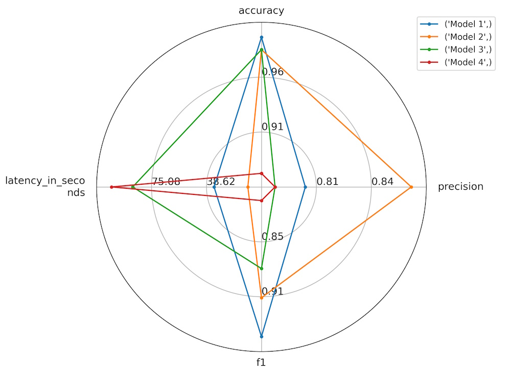

# HuggingFace Evaluate Explained

## Introduction

### Overview of the Hugging Face Evaluate Module
The Hugging Face Evaluate module is a versatile tool designed to simplify the evaluation of machine learning models and datasets. It supports various modalities including text, computer vision, and audio, making it a comprehensive solution for assessing model performance, comparing models, and analyzing datasets. By integrating seamlessly with the Hugging Face Hub, it provides easy access to a wide range of evaluation tools, complete with interactive widgets and detailed documentation.

### Key Features and Capabilities
The Evaluate module offers a rich set of features and capabilities designed to enhance the evaluation process in machine learning:

1. **Support for Multiple Evaluation Types**:
   - **Metrics**: These are used to evaluate a model’s performance by comparing its predictions against ground truth labels. Metrics are essential for understanding how well a model performs on specific tasks. Example: `accuracy = evaluate.load("accuracy")`.
   - **Comparisons**: These tools allow for the comparison of two models by evaluating their predictions against ground truth labels and calculating their agreement. This is useful for determining which model performs better on a given dataset. Example: `word_length = evaluate.load("word_length", module_type="measurement")`.
   - **Measurements**: These focus on the properties of datasets, providing insights into the data used for training models. This can include statistical analyses and other descriptive metrics. Example: `element_count = evaluate.load("lvwerra/element_count", module_type="measurement")`.

2. **Integration with Hugging Face Hub**:
   - Each evaluation module is available on the Hugging Face Hub, allowing users to access, use, and contribute to a growing repository of evaluation tools. The modules come with interactive widgets and documentation cards that describe their usage and limitations.

3. **Ease of Use**:
   - The module provides straightforward functions to load and use evaluation tools, such as `evaluate.load` and `evaluate.list_evaluation_modules`. These functions simplify the process of selecting and applying the right evaluation metrics and tools.

These features make the Hugging Face Evaluate module an essential tool for anyone looking to thoroughly assess their machine learning models and datasets, providing insights that help in model improvement and data understanding.


## Main Classes
These classes are part of the Hugging Face Evaluate module and are used to handle various aspects of evaluation for machine learning models and datasets. Below is a brief introduction to each class with a description table for quick reference.

| **Class** | **Description** |
|-----------|------------------|
| `EvaluationModuleInfo` | Base class to store information about an evaluation, such as name, version, and features. Used for `MetricInfo`, `ComparisonInfo`, and `MeasurementInfo`. |
| `EvaluationModule` | The base class and common API for metrics, comparisons, and measurements. Manages the evaluation process, including handling predictions and references. |
| `CombinedEvaluations` | Class that combines multiple evaluation modules (metrics, comparisons, or measurements) into a single object that can be used like a single evaluation module. |

## class EvaluationModuleInfo
The `EvaluationModuleInfo` class is designed to store information about an evaluation, including its name, version, and features. It serves as a base class for `MetricInfo`, `ComparisonInfo`, and `MeasurementInfo`.

### Overview of EvaluationModuleInfo

This class documents an evaluation module, including details such as its description, citation, features, and other metadata. The fields in this class provide comprehensive information about the evaluation module, which can be useful for understanding its purpose and usage.

| **Method** | **Description** |
|------------|-----------------|
| `__post_init__` | Ensures that all features are of type `Value` when using the 'numpy' format. |
| `write_to_directory` | Writes the `EvaluationModuleInfo` as a JSON file to the specified directory. |
| `from_directory` | Creates an `EvaluationModuleInfo` instance from a JSON file in the specified directory. |
| `from_dict` | Creates an `EvaluationModuleInfo` instance from a dictionary. |


### Examples of EvaluationModuleInfo

**1. Initializing with Basic Information**

This example demonstrates how to create an instance of `EvaluationModuleInfo` with basic information such as description, citation, and features.
```python
from dataclasses import asdict
from evaluate import Features, Value

# Initializing with basic information
evaluation_info = EvaluationModuleInfo(
    description="This metric evaluates the accuracy of a classification model.",
    citation="Pedregosa et al., 2011, Scikit-learn: Machine Learning in Python",
    features={'predictions': Value(dtype='int32'), 'references': Value(dtype='int32')}
)

# Display the instance as a dictionary
print(asdict(evaluation_info))
```

**2. Adding Optional Metadata**

This example shows how to add optional metadata such as homepage, license, codebase URLs, and reference URLs.
```python
# Adding optional metadata
evaluation_info = EvaluationModuleInfo(
    description="This metric evaluates the accuracy of a classification model.",
    citation="Pedregosa et al., 2011, Scikit-learn: Machine Learning in Python",
    features={'predictions': Value(dtype='int32'), 'references': Value(dtype='int32')},
    homepage="https://scikit-learn.org/",
    license="BSD 3-Clause License",
    codebase_urls=["https://github.com/scikit-learn/scikit-learn"],
    reference_urls=["https://scikit-learn.org/stable/modules/generated/sklearn.metrics.accuracy_score.html"]
)

# Display the instance as a dictionary
print(asdict(evaluation_info))
```

**3. Setting Streamable and Format**

This example illustrates how to set the `streamable` attribute and specify a format for the evaluation module.
```python
# Setting streamable and format attributes
evaluation_info = EvaluationModuleInfo(
    description="This metric evaluates the accuracy of a classification model.",
    citation="Pedregosa et al., 2011, Scikit-learn: Machine Learning in Python",
    features={'predictions': Value(dtype='int32'), 'references': Value(dtype='int32')},
    streamable=True,
    format="numpy"
)

# Display the instance as a dictionary
print(asdict(evaluation_info))
```

**4. Writing to and Reading from Directory**

This example demonstrates how to write the `EvaluationModuleInfo` to a directory and read it back.
```python
import os
import json

# Creating a temporary directory for the example
os.makedirs("temp_metric_info", exist_ok=True)

# Writing the evaluation info to the directory
evaluation_info.write_to_directory("temp_metric_info")

# Reading the evaluation info from the directory
loaded_info = EvaluationModuleInfo.from_directory("temp_metric_info")

# Display the loaded instance as a dictionary
print(asdict(loaded_info))

# Clean up
import shutil
shutil.rmtree("temp_metric_info")
```

**5. Using the from_dict Method**

This example shows how to create an `EvaluationModuleInfo` instance from a dictionary.
```python
# Dictionary with evaluation module info
metric_info_dict = {
    "description": "This metric evaluates the accuracy of a classification model.",
    "citation": "Pedregosa et al., 2011, Scikit-learn: Machine Learning in Python",
    "features": {'predictions': Value(dtype='int32'), 'references': Value(dtype='int32')},
    "homepage": "https://scikit-learn.org/",
    "license": "BSD 3-Clause License"
}

# Creating an instance from the dictionary
evaluation_info = EvaluationModuleInfo.from_dict(metric_info_dict)

# Display the instance as a dictionary
print(asdict(evaluation_info))
```

## class EvaluationModule
The `EvaluationModule` class is the base class and common API for metrics, comparisons, and measurements. It provides a comprehensive interface for managing and computing various types of evaluations.

### Overview of EvaluationModule

This class manages the evaluation process, including handling predictions, references, and computing results. It supports both single-process and distributed settings, offering flexibility for different evaluation scenarios.

| **Method** | **Description** |
|------------|-----------------|
| `__init__` | Initializes the evaluation module with various parameters like `config_name`, `keep_in_memory`, `cache_dir`, and more. |
| `__len__` | Returns the number of examples currently stored in the evaluation module's cache. |
| `__repr__` | Provides a string representation of the evaluation module. |
| `__del__` | Ensures locks and writers are properly released and cleaned up upon deletion. |
| `compute` | Computes the evaluation results using predictions and references. |
| `add_batch` | Adds a batch of predictions and references for evaluation. |
| `add` | Adds a single prediction and reference for evaluation. |
| `download_and_prepare` | Downloads and prepares data for the evaluation module. |
| `_build_data_dir` | Constructs the path of the evaluation module in the cache directory. |
| `_create_cache_file` | Creates a new cache file and acquires a lock on it. |
| `_get_all_cache_files` | Retrieves and locks all cache files in a distributed setup. |
| `_check_all_processes_locks` | Ensures all processes have their lock files in a distributed setup. |
| `_check_rendez_vous` | Checks the rendezvous point for process synchronization. |
| `_finalize` | Closes all writing processes and gathers data from all nodes if in a distributed setup. |
| `_infer_feature_from_batch` | Infers feature format from a batch of data. |
| `_infer_feature_from_example` | Infers feature format from a single example. |
| `_feature_names` | Retrieves the names of the features required for evaluation. |
| `_init_writer` | Initializes the writer for storing predictions and references. |
| `_info` | Constructs the `EvaluationModuleInfo` object with details about the evaluation module. |
| `_download_and_prepare` | Internal method to download and prepare resources for the evaluation module. |
| `_compute` | Defines the common API for computing the evaluation module results. |
| `_enforce_nested_string_type` | Checks if all nested values of type string are correctly typed and raises an error if not. |

### Examples of EvaluationModule

**1. Initializing and Using the `compute` Method**

This example demonstrates how to initialize the `EvaluationModule` and use the `compute` method to evaluate predictions and references.
```python
from evaluate import EvaluationModule, Value

eval_module = EvaluationModule(
    config_name="accuracy_eval",    # A unique name to identify this configuration
    keep_in_memory=True,            # Whether to keep all predictions and references in memory
    cache_dir="./cache_dir",        # Directory where temporary data will be stored
    num_process=1,                  # Number of processes for distributed evaluation
    process_id=0,                   # ID of the current process in a distributed setup
    seed=42                         # Random seed for reproducibility
)
)

# Define predictions and references
predictions = [1, 0, 1, 1]
references = [1, 0, 0, 1]

# Compute the accuracy
results = eval_module.compute(predictions=predictions, references=references)

# Print the results
print(results)  # Example output: {'accuracy': 0.75}
```

**2. Using the `add_batch` Method**

This example shows how to use the `add_batch` method to add a batch of predictions and references, followed by computing the evaluation.
```python
# Initialize the EvaluationModule with custom parameters
eval_module = EvaluationModule(
    config_name="batch_eval",   # A unique name to identify this configuration
    keep_in_memory=False,       # Whether to keep all predictions and references in memory
    cache_dir="./cache_dir",    # Directory where temporary data will be stored
    num_process=1,              # Number of processes for distributed evaluation
    process_id=0                # ID of the current process in a distributed setup
)

# Define batches of predictions and references
batch_predictions = [[1, 0], [1, 1]]
batch_references = [[1, 0], [0, 1]]

# Add the batch to the evaluation module
eval_module.add_batch(predictions=batch_predictions[0], references=batch_references[0])
eval_module.add_batch(predictions=batch_predictions[1], references=batch_references[1])

# Compute the results after adding batches
results = eval_module.compute()

# Print the results
print(results)  # Example output: {'accuracy': 0.75}
```

**3. Using the `add` Method**

This example illustrates how to use the `add` method to iteratively add individual predictions and references, followed by computing the evaluation.
```python
```python
eval_module = EvaluationModule(
    config_name="iterative_eval",   # A unique name to identify this configuration
    keep_in_memory=False,           # Whether to keep all predictions and references in memory
    cache_dir="./cache_dir",        # Directory where temporary data will be stored
    num_process=1,                  # Number of processes for distributed evaluation
    process_id=0                    # ID of the current process in a distributed setup
)
```

# Define individual predictions and references
individual_predictions = [1, 0, 1, 1]
individual_references = [1, 0, 0, 1]

# Iteratively add individual predictions and references
for pred, ref in zip(individual_predictions, individual_references):
    eval_module.add(prediction=pred, reference=ref)

# Compute the results after adding individual predictions and references
results = eval_module.compute()

# Print the results
print(results)  # Example output: {'accuracy': 0.75}
```

## class CombinedEvaluations
The `CombinedEvaluations` class allows users to combine multiple evaluation modules (metrics, comparisons, or measurements) into a single evaluation object. This combined object can be used just like a single evaluation module, making it easier to manage and compute results from multiple evaluations simultaneously.

### Overview of CombinedEvaluations

This class takes a list or dictionary of evaluation modules and combines them. If there are name conflicts among the scores, prefixes are used to distinguish them. This flexibility helps in managing complex evaluation scenarios where multiple metrics are needed.

| **Method** | **Description** |
|------------|-----------------|
| `combine` | Combines several metrics, comparisons, or measurements into a single `CombinedEvaluations` object. |
| `compute` | Computes the combined evaluation results from the provided predictions and references. |

### Examples of CombinedEvaluations

**1. Combining Multiple Evaluation Modules**

This example demonstrates how to use the `combine` method to combine multiple evaluation modules and then compute their results.
```python
from evaluate import combine, EvaluationModule

# Combine multiple evaluation modules (metrics)
# `evaluations` can be a list of module names or loaded `EvaluationModule` instances
# `force_prefix` ensures that all scores are prefixed with their module names
combined_metrics = combine(
    evaluations=["accuracy", "f1", "precision", "recall"],  # List of evaluation module names
    force_prefix=True  # Forces prefixing of all scores with module names
)

# Define predictions and references
predictions = [0, 1, 0, 1]
references = [1, 1, 0, 1]

# Compute the combined evaluation results
results = combined_metrics.compute(predictions=predictions, references=references)

# Print the combined results
print(results)  # Example output: {'accuracy': 0.75, 'f1': 0.80, 'precision': 1.0, 'recall': 0.75}
```

**2. Using `combine` with a Dictionary of Evaluation Modules**

This example shows how to use the `combine` method with a dictionary to assign custom names to the evaluation modules and then compute the results.
```python
from evaluate import combine, EvaluationModule

# Combine multiple evaluation modules with custom names using a dictionary
combined_metrics = combine(
    evaluations={
        "Acc": "accuracy",      # Custom name "Acc" for the accuracy metric
        "F1_Score": "f1",       # Custom name "F1_Score" for the f1 metric
        "Prec": "precision",    # Custom name "Prec" for the precision metric
        "Rec": "recall"         # Custom name "Rec" for the recall metric
    },
    force_prefix=False          # Does not force prefixing since custom names are provided
)

# Define predictions and references
predictions = [0, 1, 0, 1]
references = [1, 1, 0, 1]

# Compute the combined evaluation results
results = combined_metrics.compute(predictions=predictions, references=references)

# Print the combined results
print(results)  # Example output: {'Acc': 0.75, 'F1_Score': 0.80, 'Prec': 1.0, 'Rec': 0.75}
```

**3. Using `compute` Method with Additional Parameters**

This example illustrates how to use the `compute` method with additional parameters, such as specific labels for metrics that require them.
```python
from evaluate import combine, EvaluationModule

# Combine multiple evaluation modules
combined_metrics = combine(
    evaluations=["accuracy", "f1", "precision", "recall"],
    force_prefix=True
)

# Define predictions and references
predictions = [0, 1, 0, 1]
references = [1, 1, 0, 1]

# Compute the combined evaluation results with additional parameters
# `average` parameter is used for F1, precision, and recall metrics
results = combined_metrics.compute(
    predictions=predictions,    # Predictions
    references=references,      # References
    average="binary"            # Additional parameter specifying the average method for binary classification
)

# Print the combined results
print(results)  # Example output: {'accuracy': 0.75, 'f1_binary': 0.80, 'precision_binary': 1.0, 'recall_binary': 0.75}
```


## Main Functions
These functions are part of the Hugging Face Evaluate module and provide various utilities for managing and visualizing evaluation metrics for machine learning models and datasets. Below is a brief introduction to each function with a description table for quick reference.

| **Function** | **Description** |
|--------------|------------------|
| `list_evaluation_modules()` | Lists all available evaluation modules on the Hugging Face Hub, with options to filter by type and include community modules. |
| `load()` | Loads an `EvaluationModule` from a specified path or identifier, supporting various configurations for distributed evaluation and caching. |
| `evaluator()` | Factory method to build an `Evaluator` for a specific task, leveraging the `pipeline` functionality from `transformers` for simplified evaluation. |
| `radar_plot()` | Creates a complex radar chart to compare multiple models across various metrics, with options for customization and formatting. |

## list_evaluation_modules() function
The `list_evaluation_modules` function lists all available evaluation modules on the Hugging Face Hub. It can filter modules by type and include community-contributed modules, providing an optional detailed view of each module.

### Overview of list_evaluation_modules()

This function allows users to easily discover evaluation modules available on the Hugging Face Hub, including official and community contributions. It provides flexibility in filtering by module type and viewing detailed information.

| **Parameter** | **Description** |
|------------|-----------------|
| `module_type` | Type of evaluation modules to list. Must be one of `'metric'`, `'comparison'`, or `'measurement'`. If `None`, all types are listed. (Optional, default `None`) |
| `include_community` | Include community modules in the list. (Optional, default `True`) |
| `with_details` | Return the full details of the metrics instead of only the ID. (Optional, default `False`) |

### Example of list_evaluation_modules()

**1. Listing All Evaluation Modules**

This example demonstrates how to list all available evaluation modules on the Hugging Face Hub, including both official and community modules.
```python
from evaluate import list_evaluation_modules

# List all available evaluation modules
# `module_type` is set to None to include all types of modules
# `include_community` is True to include community-contributed modules
# `with_details` is False to only get the IDs of the modules
all_modules = list_evaluation_modules(
    module_type=None,           # Include all types of modules
    include_community=True,     # Include community modules
    with_details=False          # Return only the IDs of the modules
)

# Print the list of all module IDs
print(all_modules)
```

**2. Listing Only Metric Modules**

This example shows how to list only the metric modules available on the Hugging Face Hub.
```python
from evaluate import list_evaluation_modules

# List only metric modules
# `module_type` is set to 'metric' to filter for metric modules
# `include_community` is True to include community-contributed modules
# `with_details` is False to only get the IDs of the modules
metric_modules = list_evaluation_modules(
    module_type='metric',  # Filter for metric modules
    include_community=True,  # Include community modules
    with_details=False  # Return only the IDs of the modules
)

# Print the list of metric module IDs
print(metric_modules)
```

**3. Listing Metric Modules with Details**

This example demonstrates how to list metric modules and get detailed information about each module.
```python
from evaluate import list_evaluation_modules

# List metric modules with detailed information
# `module_type` is set to 'metric' to filter for metric modules
# `include_community` is True to include community-contributed modules
# `with_details` is True to get detailed information about each module
detailed_metric_modules = list_evaluation_modules(
    module_type='metric',       # Filter for metric modules
    include_community=True,     # Include community modules
    with_details=True           # Return detailed information about the modules
)

# Print the detailed list of metric modules
for module in detailed_metric_modules:
    print(module)
```

## load() function
The `load` function is used to load an `EvaluationModule` from a specified path or identifier. It can handle local paths or Hugging Face Hub identifiers and supports various configurations for distributed evaluation and caching.

### Overview of load()

This function provides a flexible interface for loading evaluation modules, with support for different configurations, caching options, and distributed evaluation setups.

| **Parameter** | **Description** |
|---------------|-----------------|
| `path` | Path to the evaluation processing script or module identifier on the Hugging Face Hub. |
| `config_name` | Optional configuration name for the metric (e.g., subset configurations). |
| `module_type` | Type of evaluation module (`'metric'`, `'comparison'`, or `'measurement'`). Defaults to `'metric'`. |
| `process_id` | ID of the process for distributed evaluation. Optional. |
| `num_process` | Total number of processes for distributed evaluation. Optional. |
| `cache_dir` | Path to store temporary predictions and references. Defaults to `~/.cache/huggingface/evaluate/`. Optional. |
| `experiment_id` | Specific experiment ID for shared file system in distributed setups. Optional. |
| `keep_in_memory` | Whether to store temporary results in memory. Defaults to `False`. Optional. |
| `download_config` | Specific download configuration parameters. Optional. |
| `download_mode` | Download/generate mode. Defaults to `REUSE_DATASET_IF_EXISTS`. Optional. |
| `revision` | Version of the module to load from the repository. Optional. |

### Examples of load()

**1. Loading a Metric from a Local Path**

This example demonstrates how to load a metric evaluation module from a local path with specific configurations.
```python
from evaluate import load

# Load the accuracy metric from a local path
accuracy_metric = load(
    path="./metrics/accuracy",  # Local path to the metric script
    module_type="metric",       # Type of evaluation module
    cache_dir="./cache_dir"     # Directory to store temporary data
)

# Print the loaded metric
print(accuracy_metric)
```

**2. Loading a Community Metric with Detailed Configurations**

This example shows how to load a community-contributed metric from the Hugging Face Hub with detailed configurations.
```python
from evaluate import load

# Load the BLEU metric from the Hugging Face Hub
bleu_metric = load(
    path="bleu",                    # Hugging Face Hub identifier for the BLEU metric
    config_name="default",          # Configuration name
    module_type="metric",           # Type of evaluation module
    process_id=0,                   # ID of the current process
    num_process=1,                  # Total number of processes
    cache_dir="./cache_dir",        # Directory to store temporary data
    experiment_id="exp_123",        # Specific experiment ID
    keep_in_memory=True,            # Store temporary results in memory
    download_mode="REUSE_DATASET_IF_EXISTS"   # Download/generate mode
)

# Print the loaded metric
print(bleu_metric)
```

**3. Loading a Measurement with Custom Download Configuration**

This example illustrates how to load a measurement evaluation module with custom download configurations.
```python
from evaluate import load, DownloadConfig

# Define custom download configuration
custom_download_config = DownloadConfig(
    cache_dir="./custom_cache",  # Custom cache directory
    force_download=False  # Do not force download if data already exists
)

# Load the element_count measurement from the Hugging Face Hub
element_count_measurement = load(
    path="lvwerra/element_count",   # Hugging Face Hub identifier for the element_count measurement
    module_type="measurement",      # Type of evaluation module
    cache_dir="./cache_dir",        # Directory to store temporary data
    download_config=custom_download_config  # Custom download configuration
)

# Print the loaded measurement
print(element_count_measurement)
```

**4. Loading a Comparison with a Specific Revision**

This example demonstrates how to load a comparison evaluation module from a specific revision on the Hugging Face Hub.
```python
from evaluate import load

# Load the McNemar comparison from a specific revision on the Hugging Face Hub
mcnemar_comparison = load(
    path="mcnemar",             # Hugging Face Hub identifier for the McNemar comparison
    module_type="comparison",   # Type of evaluation module
    cache_dir="./cache_dir",    # Directory to store temporary data
    revision="v1.0.0"           # Specific version to load
)

# Print the loaded comparison
print(mcnemar_comparison)
```

## evaluator() function
The `evaluator` function is a utility factory method designed to build an `Evaluator` suitable for a specific task. Evaluators simplify the evaluation process by leveraging the `pipeline` functionality from `transformers`, making it easy to evaluate multiple combinations of models, datasets, and metrics for a given task.

### Overview of evaluator()

This function returns an `Evaluator` tailored to the specified task. It supports various tasks such as image classification, question answering, text classification, and token classification. The returned `Evaluator` encapsulates the task and default metric name, streamlining the evaluation process.

| **Parameter** | **Description** |
|---------------|-----------------|
| `task` | The task defining which evaluator will be returned. Accepted tasks include `"image-classification"`, `"question-answering"`, `"text-classification"` (or `"sentiment-analysis"`), and `"token-classification"`. |

Examples of accepted tasks and their corresponding evaluators:
- `"image-classification"`: Returns an `ImageClassificationEvaluator`.
- `"question-answering"`: Returns a `QuestionAnsweringEvaluator`.
- `"text-classification"` or `"sentiment-analysis"`: Returns a `TextClassificationEvaluator`.
- `"token-classification"`: Returns a `TokenClassificationEvaluator`.

### Examples of evaluator()

**1. Image Classification Evaluator**

This example demonstrates how to use the `evaluator` function to create an `ImageClassificationEvaluator` and evaluate an image classification model.
```python
from evaluate import evaluator
from datasets import load_dataset

# Create an ImageClassificationEvaluator
task_evaluator = evaluator("image-classification")

# Load a sample dataset
data = load_dataset("beans", split="test[:40]")

# Compute the evaluation results
results = task_evaluator.compute(
    model_or_pipeline="nateraw/vit-base-beans",  # Pre-trained model for image classification
    data=data,                  # Dataset to evaluate
    label_column="labels",      # Column name in the dataset containing labels
    metric="accuracy",          # Metric to evaluate
    label_mapping={'angular_leaf_spot': 0, 'bean_rust': 1, 'healthy': 2},  # Mapping of label names to integers
    strategy="bootstrap"        # Evaluation strategy
)

# Print the evaluation results
print(results)
```

**2. Question Answering Evaluator**

This example shows how to use the `evaluator` function to create a `QuestionAnsweringEvaluator` and evaluate a question answering model.
```python
from evaluate import evaluator
from datasets import load_dataset

# Create a QuestionAnsweringEvaluator
task_evaluator = evaluator("question-answering")

# Load a sample dataset
data = load_dataset("squad_v2", split="validation[:40]")

# Compute the evaluation results
results = task_evaluator.compute(
    model_or_pipeline="deepset/roberta-base-squad2",  # Pre-trained model for question answering
    data=data,                      # Dataset to evaluate
    input_column="context",         # Column containing the context
    question_column="question",     # Column containing the questions
    answer_column="answers",        # Column containing the answers
    metric="f1",                    # Metric to evaluate
    strategy="bootstrap"            # Evaluation strategy
)

# Print the evaluation results
print(results)
```

**3. Text Generation Evaluator**

This example illustrates how to use the `evaluator` function to create a `TextGenerationEvaluator` and evaluate a text generation model.
```python
from evaluate import evaluator
from datasets import load_dataset

# Create a TextGenerationEvaluator
task_evaluator = evaluator("text-generation")

# Load a sample dataset
data = load_dataset("wikitext", "wikitext-2-raw-v1", split="test[:40]")

# Compute the evaluation results
results = task_evaluator.compute(
    model_or_pipeline="gpt2",   # Pre-trained model for text generation
    data=data,                  # Dataset to evaluate
    input_column="text",        # Column containing the input text
    metric="perplexity",        # Metric to evaluate
    strategy="bootstrap"        # Evaluation strategy
)

# Print the evaluation results
print(results)
```

**4. Automatic Speech Recognition Evaluator**

This example demonstrates how to use the `evaluator` function to create an `AutomaticSpeechRecognitionEvaluator` and evaluate a speech recognition model.
```python
from evaluate import evaluator
from datasets import load_dataset

# Create an AutomaticSpeechRecognitionEvaluator
task_evaluator = evaluator("automatic-speech-recognition")

# Load a sample dataset
data = load_dataset("common_voice", "en", split="test[:40]")

# Compute the evaluation results
results = task_evaluator.compute(
    model_or_pipeline="facebook/wav2vec2-base-960h",  # Pre-trained model for speech recognition
    data=data,                      # Dataset to evaluate
    input_column="audio",           # Column containing the audio input
    reference_column="sentence",    # Column containing the reference transcriptions
    metric="wer",                   # Metric to evaluate (Word Error Rate)
    strategy="bootstrap"            # Evaluation strategy
)

# Print the evaluation results
print(results)
```

## radar_plot() function
The `radar_plot` function creates a complex radar chart with different scales for each variable. This visualization is useful for comparing multiple models across various metrics.

### Overview of radar_plot()

This function allows for detailed customization of radar charts, including options to invert ranges for specific metrics, configure various formatting options, and plot data for multiple models.

| **Parameter** | **Description** |
|---------------|-----------------|
| `data` | List of dictionaries containing the results (metric-value pairs). Example: `[{"accuracy": 0.9, "precision": 0.8}, {"accuracy": 0.7, "precision": 0.6}]`. |
| `model_names` | List of model names. Example: `["model1", "model2"]`. |
| `invert_range` | List of metrics to invert (for metrics where a smaller value is better). Example: `["latency_in_seconds"]`. |
| `config` | Optional dictionary for formatting configurations, such as visibility of lines, font sizes, and marker shapes. |
| `fig` | Optional `matplotlib.figure.Figure` object to plot the radar chart on. |

### Examples of radar_plot()

**1. Basic Radar Plot for Model Comparison**

This example demonstrates how to create a radar plot to compare multiple models using various metrics such as accuracy, precision, F1 score, and latency.
```python
import evaluate
from evaluate.visualization import radar_plot
import matplotlib.pyplot as plt

# Data for the radar plot
# Each dictionary represents a model's performance across different metrics
data = [
   {"accuracy": 0.99, "precision": 0.8, "f1": 0.95, "latency_in_seconds": 33.6},
   {"accuracy": 0.98, "precision": 0.87, "f1": 0.91, "latency_in_seconds": 11.2},
   {"accuracy": 0.98, "precision": 0.78, "f1": 0.88, "latency_in_seconds": 87.6}, 
   {"accuracy": 0.88, "precision": 0.78, "f1": 0.81, "latency_in_seconds": 101.6}
]

# List of model names corresponding to the data
model_names = ["Model 1", "Model 2", "Model 3", "Model 4"]

# Create the radar plot
# `data` is the list of dictionaries containing metric-value pairs
# `model_names` is the list of model names
plot = radar_plot(
    data=data,  # List of dictionaries containing metric-value pairs
    model_names=model_names  # List of model names
)

# Display the plot
plt.show()  # Show the radar plot
```



**2. Radar Plot with Inverted Metric Range**

This example shows how to create a radar plot with an inverted metric range for latency, where a smaller value is better.
```python
from evaluate.visualization import radar_plot
import matplotlib.pyplot as plt

# Data for the radar plot with more than 5 rows
data = [
    {"accuracy": 0.9, "precision": 0.8, "latency_in_seconds": 33.6},
    {"accuracy": 0.7, "precision": 0.6, "latency_in_seconds": 11.2},
    {"accuracy": 0.8, "precision": 0.7, "latency_in_seconds": 25.4},
    {"accuracy": 0.85, "precision": 0.75, "latency_in_seconds": 20.1},
    {"accuracy": 0.78, "precision": 0.68, "latency_in_seconds": 15.9},
    {"accuracy": 0.88, "precision": 0.78, "latency_in_seconds": 30.2}
]

# Model names
model_names = ["model1", "model2", "model3", "model4", "model5", "model6"]

# Metrics to invert
invert_range = ["latency_in_seconds"]

# Create the radar plot
fig = radar_plot(
    data=data,                  # List of dictionaries containing metric-value pairs
    model_names=model_names,    # List of model names
    invert_range=invert_range   # List of metrics to invert
)

# Display the plot
plt.show()
```

**3. Radar Plot with Custom Formatting**

This example demonstrates how to customize the formatting of the radar plot, including changing marker size, legend location, and font sizes.
```python
from evaluate.visualization import radar_plot
import matplotlib.pyplot as plt

# Data for the radar plot with more than 5 rows
data = [
    {"accuracy": 0.9, "precision": 0.8, "f1": 0.85},
    {"accuracy": 0.7, "precision": 0.6, "f1": 0.65},
    {"accuracy": 0.8, "precision": 0.7, "f1": 0.75},
    {"accuracy": 0.85, "precision": 0.75, "f1": 0.80},
    {"accuracy": 0.78, "precision": 0.68, "f1": 0.70},
    {"accuracy": 0.88, "precision": 0.78, "f1": 0.83}
]

# Model names
model_names = ["model1", "model2", "model3", "model4", "model5", "model6"]

# Custom configuration for formatting
config = {
    "marker": "s",                              # Shape of the marker used in the radar plot
    "markersize": 5,                            # Size of the marker
    "legend_loc": "lower left",                 # Location of the legend
    "theta_tick_lbls": {"fontsize": 14},        # Font size of variable labels on the plot
    "rgrid_tick_lbls_args": {"fontsize": 10}    # Font size of tick labels on the scales
}

# Create the radar plot
fig = radar_plot(
    data=data,                  # List of dictionaries containing metric-value pairs
    model_names=model_names,    # List of model names
    config=config               # Custom formatting configuration
)

# Display the plot
plt.show()
```

**4. Radar Plot with Custom Figure**

This example shows how to create a radar plot using a custom Matplotlib figure for additional customization and control.
```python
from evaluate.visualization import radar_plot
import matplotlib.pyplot as plt

# Data for the radar plot with more than 5 rows
data = [
    {"accuracy": 0.9, "precision": 0.8, "f1": 0.85, "recall": 0.82},
    {"accuracy": 0.7, "precision": 0.6, "f1": 0.65, "recall": 0.62},
    {"accuracy": 0.8, "precision": 0.7, "f1": 0.75, "recall": 0.72},
    {"accuracy": 0.85, "precision": 0.75, "f1": 0.80, "recall": 0.78},
    {"accuracy": 0.78, "precision": 0.68, "f1": 0.70, "recall": 0.66},
    {"accuracy": 0.88, "precision": 0.78, "f1": 0.83, "recall": 0.80}
]

# Model names
model_names = ["model1", "model2", "model3", "model4", "model5", "model6"]

# Create a custom Matplotlib figure
fig = plt.figure(figsize=(8, 6))

# Create the radar plot on the custom figure
radar_plot(
    data=data,                  # List of dictionaries containing metric-value pairs
    model_names=model_names,    # List of model names
    fig=fig                     # Custom Matplotlib figure
)

# Display the plot
plt.show()
```


## Conclusion
In this article, we've explored the Hugging Face Evaluate module, a powerful tool for evaluating machine learning models and datasets. We covered its main classes, such as `EvaluationModuleInfo`, `EvaluationModule`, and `CombinedEvaluations`, which provide essential functionality for managing evaluation processes. Additionally, we looked at key functions like `list_evaluation_modules`, `load`, `evaluator`, and `radar_plot`, which offer flexible and customizable ways to list, load, evaluate, and visualize evaluation metrics.

By leveraging the Hugging Face Evaluate module, practitioners can streamline their evaluation workflows, making it easier to assess model performance, compare different models, and understand dataset properties. The integration with Hugging Face Hub and the ability to use community-contributed modules further enhance its utility, providing a comprehensive solution for machine learning evaluations.


## References
- [Hugging Face Evaluate Info Module](https://github.com/huggingface/evaluate/blob/v0.4.0/src/evaluate/info.py)
- [Hugging Face Evaluate Module](https://github.com/huggingface/evaluate/blob/v0.4.0/src/evaluate/module.py)
- [Hugging Face Evaluate Inspect Module](https://github.com/huggingface/evaluate/blob/v0.4.0/src/evaluate/inspect.py)
- [Hugging Face Evaluate Evaluator](https://github.com/huggingface/evaluate/blob/v0.4.0/src/evaluate/evaluator/__init__.py)
- [Hugging Face Evaluate Visualization](https://github.com/huggingface/evaluate/blob/v0.4.0/src/evaluate/visualization.py)

