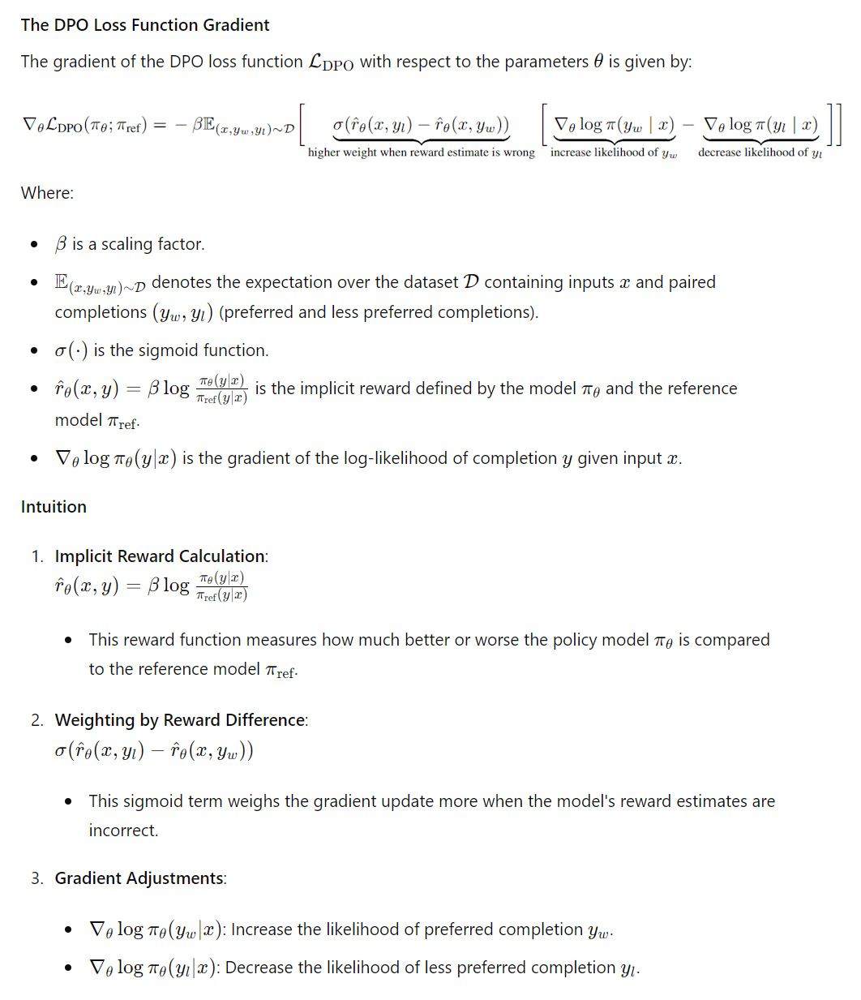
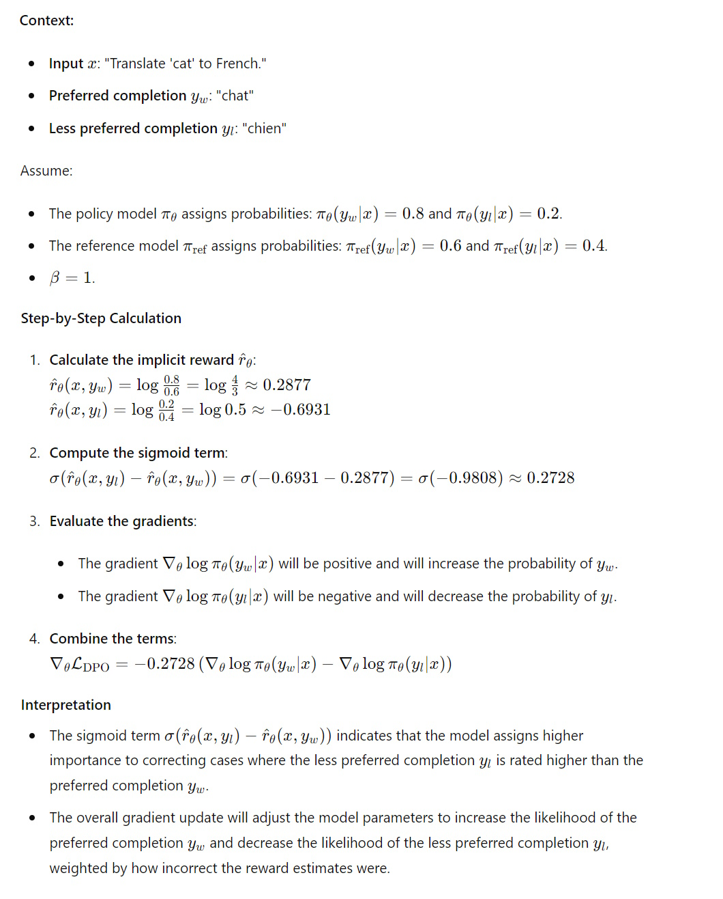
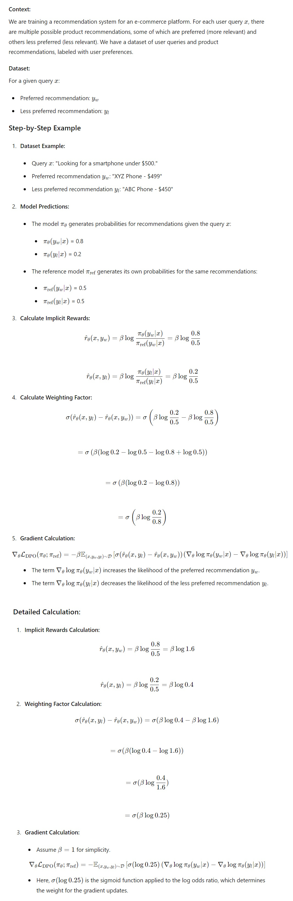
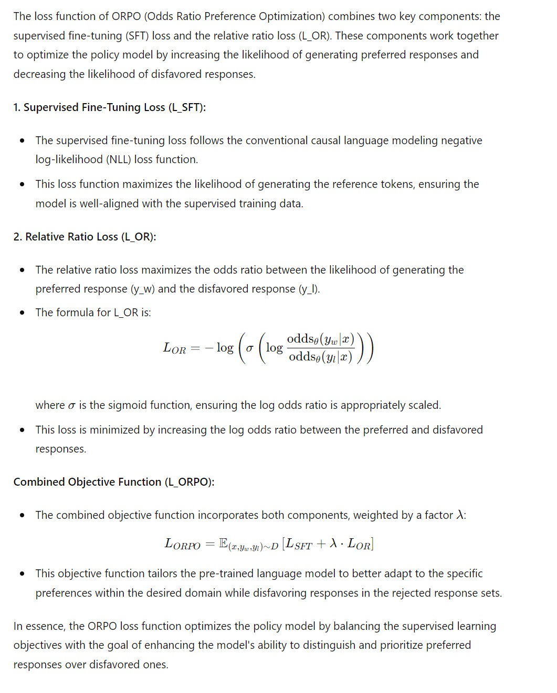
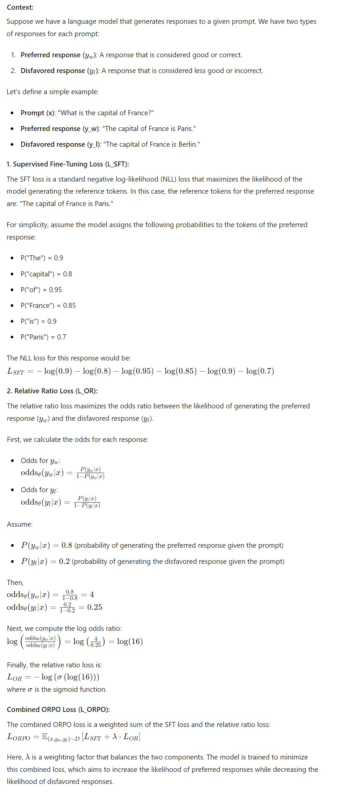

# Understanding DPO and ORPO

## Introduction
In the realm of fine-tuning language models, optimizing performance while maintaining alignment with human preferences is crucial. Direct Preference Optimization (DPO) and Odds Ratio Preference Optimization (ORPO) are two advanced techniques designed to achieve this goal. DPO leverages a reference model to guide the training process, ensuring that the model produces preferred completions while minimizing undesired outputs. ORPO, on the other hand, introduces a novel approach that does not require a reference model, focusing instead on maximizing the odds ratio between preferred and disfavored responses. This article explores the loss functions of DPO and ORPO, provides practical examples, and explains why DPO necessitates a reference model while ORPO does not.

### Key Differences of DPO and ORPO
Direct Preference Optimization (DPO) and Odds Ratio Preference Optimization (ORPO) present distinct methodologies for aligning language models with human preferences. DPO parameterizes the reward model to optimize the policy directly through a classification loss, specifically using a binary cross-entropy objective. This approach involves a reference model to implicitly compute rewards, often allowing for precomputation of log probabilities for chosen and rejected samples. DPO also employs a beta parameter to adjust the divergence from the initial policy, where a higher beta indicates less divergence.

On the other hand, ORPO eliminates the need for a separate reference model by incorporating an odds ratio-based penalty directly into the negative log-likelihood loss function during supervised fine-tuning (SFT). This method simplifies preference optimization by integrating it into the training process, using the odds ratio to weigh the relative loss ratio. ORPO’s beta parameter adjusts the weight of this relative loss ratio, streamlining the optimization of model preferences without the additional complexity of maintaining a reference model.

Here is a comparison table between DPO (Direct Preference Optimization) and ORPO (Odds Ratio Preference Optimization) in terms of training:

| **Aspect**                       | **DPO**                                                                 | **ORPO**                                                                       |
|----------------------------------|------------------------------------------------------------------------|--------------------------------------------------------------------------------|
| **Full Name**                    | Direct Preference Optimization                                         | Odds Ratio Preference Optimization                                             |
| **Key Innovation**               | Parameterizes reward model to optimize policy directly through a classification loss | Uses odds ratio to optimize model preferences directly during SFT, eliminating the need for a separate reference model |
| **Primary Goal**                 | Align language models with human preferences without RL                | Simplify preference optimization by integrating it directly into SFT            |
| **Training Method**              | Uses a simple binary cross-entropy objective for optimization          | Incorporates an odds ratio-based penalty into the negative log-likelihood loss function during SFT |
| **Loss Function**                | Binary Cross-Entropy Loss (classify of chosen vs. rejected)                  | Odds Ratio Loss (log-odds of chosen vs. rejected)                              |
| **Beta Parameter**               | Adjusts divergence from the initial policy (higher beta means less divergence) | Adjusts weight of the relative loss ratio in the SFT loss (lambda/alpha in ORPO) |
| **Log Probability Calculation**  | Computes log probabilities for chosen and rejected samples             | Computes log probabilities for chosen and rejected samples                     |
| **Handling of Reference Model**  | Uses a reference model for implicit reward computation, can precompute log probabilities | Eliminates the need for a reference model                                      |
| **Model Adaptation**             | Supports PEFT (Parameter-Efficient Fine-Tuning)                        | Supports PEFT                                                                  |

## Loss Function of DPO
The loss function of Direct Preference Optimization (DPO) is designed to enhance the likelihood of generating preferred completions while reducing the likelihood of disfavored ones. This is achieved by comparing the model's outputs to a reference model, which serves as a benchmark for preferred and disfavored responses. The DPO loss function effectively increases the probability of generating outputs that align with human preferences and decreases the probability of generating undesired outputs. This approach ensures that the fine-tuned model produces results that are more consistent with the desired outcomes, guided by the reference model's evaluations.

### Example 1

### Example 2

## Loss Function of ORPO
The loss function of Odds Ratio Preference Optimization (ORPO) combines supervised fine-tuning loss with a relative ratio loss to align the model's outputs with desired preferences. Unlike DPO, ORPO does not require a reference model. Instead, it directly maximizes the odds ratio between generating preferred responses over disfavored ones. This method ensures the model adapts to specific desired outcomes by minimizing the loss associated with disfavored responses and enhancing the generation of preferred responses. The ORPO loss function leverages the log odds ratio to refine the model's predictions, making it more effective in producing results aligned with human preferences.

### Example

## Reference Model in DPO
- why DPO needs reference model but ORPO does not
DPO relies on a reference model to provide a baseline for comparing the outputs of the fine-tuned model. The reference model helps in evaluating the preferred and disfavored responses, guiding the training process to enhance the likelihood of generating preferred completions while reducing the likelihood of undesired ones. This dependency on a reference model ensures that the training is aligned with human preferences as captured by the reference model.

On the other hand, ORPO does not require a reference model. Instead, it focuses on maximizing the odds ratio between the likelihood of generating preferred and disfavored responses. By using the log odds ratio wrapped in a log sigmoid function, ORPO effectively adjusts the model to favor preferred completions without the need for a separate reference model, streamlining the training process.

## Conclusion
DPO and ORPO represent significant advancements in the fine-tuning of language models, each with its unique approach to optimizing performance. DPO utilizes a reference model to guide the training process, ensuring alignment with human preferences through a structured comparison of outputs. ORPO simplifies the process by eliminating the need for a reference model, instead focusing on maximizing the odds ratio between preferred and disfavored responses. Understanding the nuances of these techniques and their respective loss functions can help practitioners select the most appropriate method for their specific fine-tuning tasks, ultimately enhancing the performance and alignment of language models with human preferences.

## References
- [Fine-tune LLaMA 2 with DPO](https://huggingface.co/blog/dpo-trl)
- [Fine-tune LLaMA 3 using Direct Preference Optimization](https://www.analyticsvidhya.com/blog/2024/05/fine-tune-llama-3-using-direct-preference-optimization/)
- [Fine-tune LLaMA 3 with ORPO](https://huggingface.co/blog/mlabonne/orpo-llama-3)
- [Finetuning LLaMA 3 with Odds Ratio Preference Optimization](https://www.analyticsvidhya.com/blog/2024/05/finetuning-llama-3-with-odds-ratio-preference-optimization/)

