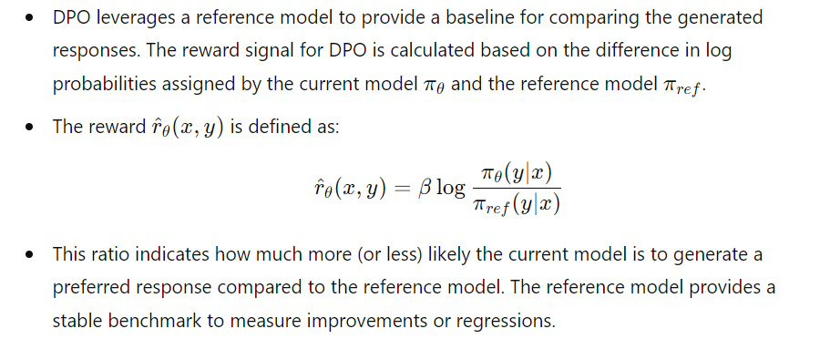
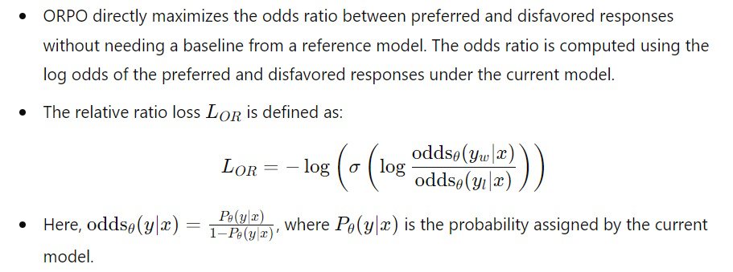

# Understanding DPO and ORPO

## Introduction
In the realm of fine-tuning language models, optimizing performance while maintaining alignment with human preferences is crucial. Direct Preference Optimization (DPO) and Odds Ratio Preference Optimization (ORPO) are two advanced techniques designed to achieve this goal. DPO leverages a reference model to guide the training process, ensuring that the model produces preferred completions while minimizing undesired outputs. ORPO, on the other hand, introduces a novel approach that does not require a reference model, focusing instead on maximizing the odds ratio between preferred and disfavored responses. This article explores the loss functions of DPO and ORPO, provides practical examples, and explains why DPO necessitates a reference model while ORPO does not.

### Key Differences between DPO and ORPO
Direct Preference Optimization (DPO) and Odds Ratio Preference Optimization (ORPO) present distinct methodologies for aligning language models with human preferences. DPO parameterizes the reward model to optimize the policy directly through a classification loss, specifically using a binary cross-entropy objective. This approach involves a reference model to implicitly compute rewards, often allowing for precomputation of log probabilities for chosen and rejected samples. DPO also employs a beta parameter to adjust the divergence from the initial policy, where a higher beta indicates less divergence.

On the other hand, ORPO eliminates the need for a separate reference model by incorporating an odds ratio-based penalty directly into the negative log-likelihood loss function during supervised fine-tuning (SFT). This method simplifies preference optimization by integrating it into the training process, using the odds ratio to weigh the relative loss ratio. ORPO’s beta parameter adjusts the weight of this relative loss ratio, streamlining the optimization of model preferences without the additional complexity of maintaining a reference model.

Here is a comparison table between DPO (Direct Preference Optimization) and ORPO (Odds Ratio Preference Optimization) in terms of training:

| **Aspect**                       | **DPO**                                                                 | **ORPO**                                                                       |
|----------------------------------|------------------------------------------------------------------------|--------------------------------------------------------------------------------|
| **Full Name**                    | Direct Preference Optimization                                         | Odds Ratio Preference Optimization                                             |
| **Key Innovation**               | Parameterizes reward model to optimize policy directly through a classification loss | Uses odds ratio to optimize model preferences directly during SFT, eliminating the need for a separate reference model |
| **Primary Goal**                 | Align language models with human preferences without RL                | Simplify preference optimization by integrating it directly into SFT            |
| **Training Method**              | Uses a simple binary cross-entropy objective for optimization          | Incorporates an odds ratio-based penalty into the negative log-likelihood loss function during SFT |
| **Loss Function**                | Binary Cross-Entropy Loss (classify of chosen vs. rejected)                  | Odds Ratio Loss (log-odds of chosen vs. rejected)                              |
| **Beta Parameter**               | Adjusts divergence from the initial policy (higher beta means less divergence) | Adjusts weight of the relative loss ratio in the SFT loss (lambda/alpha in ORPO) |
| **Log Probability Calculation**  | Computes log probabilities for chosen and rejected samples             | Computes log probabilities for chosen and rejected samples                     |
| **Handling of Reference Model**  | Uses a reference model for implicit reward computation, can precompute log probabilities | Eliminates the need for a reference model                                      |
| **Model Adaptation**             | Supports PEFT (Parameter-Efficient Fine-Tuning)                        | Supports PEFT                                                                  |

## Loss Function of DPO
The loss function of Direct Preference Optimization (DPO) is designed to enhance the likelihood of generating preferred completions while reducing the likelihood of disfavored ones. This is achieved by comparing the model's outputs to a reference model, which serves as a benchmark for preferred and disfavored responses. The DPO loss function effectively increases the probability of generating outputs that align with human preferences and decreases the probability of generating undesired outputs. This approach ensures that the fine-tuned model produces results that are more consistent with the desired outcomes, guided by the reference model's evaluations.

### Example 1

### Example 2

## Loss Function of ORPO
The loss function of Odds Ratio Preference Optimization (ORPO) combines supervised fine-tuning loss with a relative ratio loss to align the model's outputs with desired preferences. Unlike DPO, ORPO does not require a reference model. Instead, it directly maximizes the odds ratio between generating preferred responses over disfavored ones. This method ensures the model adapts to specific desired outcomes by minimizing the loss associated with disfavored responses and enhancing the generation of preferred responses. The ORPO loss function leverages the log odds ratio to refine the model's predictions, making it more effective in producing results aligned with human preferences.

### Example

## Reference Model in DPO
DPO (Direct Preference Optimization) requires a reference model, whereas ORPO (Odds Ratio Preference Optimization) does not. This distinction arises from their different methods of constructing and utilizing reward signals during training.

- **DPO** uses a reference model to generate a stable, comparative reward signal. This helps in measuring relative improvements and ensures training stability. The reference model defines the reward function based on the difference in log probabilities between chosen and rejected samples.
- **ORPO** bypasses the need for a reference model by directly optimizing the odds ratio of preferred to disfavored responses using the current model's predictions. This approach simplifies the training process by focusing on maximizing relative preferences directly through the model’s output.

### Why DPO requires a reference model:

1. **Reference-Based Reward Calculation**:

&nbsp;&nbsp;&nbsp;&nbsp;&nbsp;&nbsp;

2. **Relative Improvement**:
   - The reference model helps in capturing the relative improvement of the current model over a baseline. Without a reference, it would be challenging to discern if a model’s performance is genuinely improving or if it is just assigning higher probabilities indiscriminately.

3. **Stability in Training**:
   - The reference model introduces stability by mitigating the risk of the current model deviating too far from a known good state. This controlled deviation helps in maintaining a balance between learning new preferences and retaining previously learned information.

### Why ORPO does not require a reference model:

1. **Direct Odds Ratio Maximization**:

&nbsp;&nbsp;&nbsp;&nbsp;&nbsp;&nbsp;

2. **Self-Contained Training Signal**:
   - ORPO relies on the current model’s own predictions to generate the training signal. The relative comparison between preferred and disfavored responses is sufficient to guide the model’s learning process.
   - By focusing on the odds ratio, ORPO inherently emphasizes the relative preference without needing an external benchmark.

3. **Simplicity and Efficiency**:
   - Without the need to maintain and update a reference model, ORPO can be simpler to implement and computationally more efficient. The training process directly adapts based on the model’s outputs and the relative preferences derived from them.

## Integrating ORPO Directly into SFT
By integrating preference optimization directly into the SFT process, ORPO eliminates the need for a separate reference model, simplifying the overall training pipeline and making it more efficient and straightforward. Imagine we are training a language model to generate helpful responses to customer queries. We have a dataset where each query is paired with two responses: one preferred (chosen) and one less preferred (rejected).

### Traditional Approach (DPO)
1. **Training Setup**: In DPO, you need a reference model that provides a stable reward signal. The training process involves calculating the log probabilities of both chosen and rejected responses using the reference model.
2. **Reward Calculation**: The reward is computed based on the difference in log probabilities between the chosen and rejected responses.
3. **Optimization**: The model is then optimized using these computed rewards to improve its alignment with human preferences.

### Simplified Approach (ORPO)
1. **Training Setup**: In ORPO, there's no need for a reference model. The process involves using the current model's predictions to directly optimize the odds ratio of chosen versus rejected responses.
2. **Log Probability Calculation**: For each query-response pair, compute the log probabilities of both chosen and rejected responses using the current model.
3. **Odds Ratio Calculation**: Calculate the odds ratio, which involves comparing the log probabilities of chosen responses to those of rejected responses.
4. **Loss Integration**: Integrate this odds ratio directly into the SFT loss function. This means the model's training objective is modified to not only minimize the standard negative log-likelihood loss but also to maximize the odds ratio of preferred responses.

### Example in Action (ORPO + SFT)
Let's say we have the following query and responses:
- **Query**: "How can I reset my password?"
- **Chosen Response**: "You can reset your password by clicking on the 'Forgot Password' link on the login page."
- **Rejected Response**: "Just try to remember it, it's the best way."

**ORPO Training Steps**

1. **Compute Log Probabilities**:
   - Chosen Response: Log probability = -2.0
   - Rejected Response: Log probability = -4.0
2. **Calculate Odds Ratio**:
   - Log Odds Ratio = -2.0 (chosen) - (-4.0) (rejected) = 2.0
   - This positive value indicates a preference for the chosen response.
3. **Integrate into Loss Function**:
   - The loss function is adjusted to incorporate this log odds ratio, ensuring that the model is directly encouraged to generate responses with higher odds ratios for preferred responses.
4. **Model Update**:
   - The model parameters are updated in such a way that future predictions will ideally have higher log probabilities for preferred responses.

## Conclusion
DPO and ORPO represent significant advancements in the fine-tuning of language models, each with its unique approach to optimizing performance. DPO utilizes a reference model to guide the training process, ensuring alignment with human preferences through a structured comparison of outputs. ORPO simplifies the process by eliminating the need for a reference model, instead focusing on maximizing the odds ratio between preferred and disfavored responses. Understanding the nuances of these techniques and their respective loss functions can help practitioners select the most appropriate method for their specific fine-tuning tasks, ultimately enhancing the performance and alignment of language models with human preferences.

## References
- [Fine-tune LLaMA 2 with DPO](https://huggingface.co/blog/dpo-trl)
- [Fine-tune LLaMA 3 using Direct Preference Optimization](https://www.analyticsvidhya.com/blog/2024/05/fine-tune-llama-3-using-direct-preference-optimization/)
- [Fine-tune LLaMA 3 with ORPO](https://huggingface.co/blog/mlabonne/orpo-llama-3)
- [Finetuning LLaMA 3 with Odds Ratio Preference Optimization](https://www.analyticsvidhya.com/blog/2024/05/finetuning-llama-3-with-odds-ratio-preference-optimization/)

