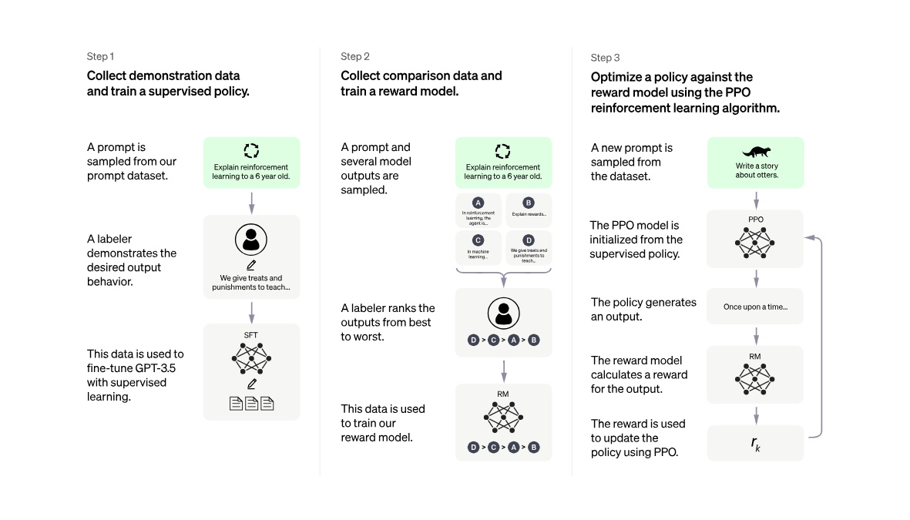

[ English ] [ [繁體中文](rlhf_ppo_overview_zhtw.md) ]

# RLHF with PPO Explained

## Introduction to PPO

### Training Language Models with RLHF
The process of training a language model using reinforcement learning with human feedback (RLHF) involves three key steps. 

**Step 1: Collect Demonstration Data and Train a Supervised Policy**:
1. **Prompt Sampling**: A prompt is selected from a dataset.
2. **Demonstration**: A labeler demonstrates the desired output behavior for the prompt.
3. **Supervised Fine-Tuning (SFT)**: This demonstrated data is used to fine-tune the GPT-3.5 model using supervised learning.

**Step 2: Collect Comparison Data and Train a Reward Model**:
1. **Output Sampling**: A prompt and several model outputs are sampled.
2. **Ranking Outputs**: A labeler ranks the outputs from best to worst.
3. **Training Reward Model (RM)**: The ranking data is used to train the reward model.

**Step 3: Optimize a Policy Against the Reward Model Using PPO**:
1. **Prompt Sampling**: A new prompt is selected from the dataset.
2. **Initialize PPO Model**: The PPO model is initialized from the supervised policy.
3. **Generate Output**: The policy model generates an output.
4. **Calculate Reward**: The reward model calculates a reward for the output.
5. **Policy Update**: The reward is used to update the policy using the PPO algorithm.

### Overview of Proximal Policy Optimization (PPO)
Proximal Policy Optimization (PPO) is an advanced reinforcement learning algorithm that strikes a balance between simplicity and efficiency. It is designed to improve upon traditional policy gradient methods by maintaining the benefits of trust region methods while being easier to implement and tune. PPO aims to stabilize the training process by limiting the policy updates, preventing large deviations that could lead to suboptimal policies or instability.

### Key Components in PPO Training
Proximal Policy Optimization involves several key models that work together to optimize the policy effectively:

**Policy Model (Trained LM)**:
- **Purpose**: Generates actions or decisions based on the current policy.
- **Effect**: Determines the actions to be taken by the agent in given states.
- **Features**: This is the primary model being optimized in PPO. It generates the probability distribution over possible actions given the current state.

**Reference Model (Frozen LM)**:
- **Purpose**: Serves as a benchmark to evaluate the improvements of the current policy.
- **Effect**: Helps calculate the Kullback-Leibler (KL) divergence, ensuring the new policy does not deviate excessively from the old policy.
- **Features**: Typically a frozen copy of the policy model, used to compare and constrain the updates to the trained policy model, maintaining stability and preventing drastic changes.

**Reward Model**:
- **Purpose**: Generates reward signals based on human feedback.
- **Effect**: Translates human preferences into quantifiable rewards, guiding the learning process.
- **Features**: Often pre-trained to generate immediate rewards based on the quality of actions or outputs produced by the policy model. This model ensures that the actions taken are aligned with desired outcomes.

**Value Function Model**:
- **Purpose**: Estimates the value of each state.
- **Effect**: Assists in evaluating the long-term return of actions, aiding in computing the advantage function.
- **Features**: Helps the policy model make better decisions by providing value estimates. This model is critical for reducing variance in policy gradient estimates, making training more stable and efficient.

## The PPO Training Process

### Input Data
The training process begins with input data, which in this context is textual data used to train the language model. This data forms the basis for the model's learning, allowing it to understand and generate human-like text.

### Language Models (LM)
There are two key language models involved in the PPO training process:
1. **Trained Language Model (Policy Model)**: This is the model being actively trained. It processes the input text data and generates new text along with the associated probabilities for each possible next word.
2. **Frozen Language Model (Reference Model)**: This model serves as a stable benchmark. It is a frozen version of the policy model and is used to calculate the Kullback-Leibler (KL) divergence to ensure that updates to the policy model do not deviate too drastically from previous versions.

### Reward Model
The reward model evaluates the text generated by the trained language model. It provides a reward signal based on how well the generated text aligns with human preferences or other predefined criteria. This model is crucial for guiding the training process towards producing desirable outputs.

### KL Divergence Loss
KL Divergence Loss measures the difference between the probability distributions output by the trained language model and the frozen reference model. This loss ensures that the updates to the trained model are not too extreme, promoting stability in the training process.

### Reward Calculation
The final reward for each generated text is calculated by combining the reward model's output with the KL divergence loss. The formula typically used is:
\[ \text{Final Reward} = R - \beta \times \text{KL} \]
Where:
- \( R \) is the reward model output.
- \( \beta \) is a coefficient that balances the reward and KL loss.

### RL Update (PPO)
The Proximal Policy Optimization (PPO) update module uses the final reward to update the weights of the trained language model. This update is constrained to ensure that changes are within a proximal range, preventing large, destabilizing updates. The update step is repeated multiple times to gradually improve the model's performance.

### Constraint Mechanism
A constraint mechanism is in place to ensure that the language model does not output nonsensical text that could potentially fool the reward model. This mechanism further stabilizes the training process and helps maintain the quality of the generated text.

### Iterative Optimization
The PPO training process is iterative. Each iteration involves generating text, evaluating it using the reward model, calculating the final reward, and updating the model's weights. This iterative approach allows the model to gradually improve and adapt, leading to better performance over time.

## The PPO Training Process By Example

To better understand the Proximal Policy Optimization (PPO) training process, let's walk through an example using a language model trained to complete sentences.

### Input Data
Consider the input sentence: "The cat sat on the ___."

### Language Models (LM)
1. **Trained Language Model (Policy Model)**:
    - This model processes the input sentence and generates predictions for the next word along with probabilities for each possible word.
    - For example, it might predict:
        - "mat" with a probability of 0.4
        - "chair" with a probability of 0.3
        - "floor" with a probability of 0.2
        - "roof" with a probability of 0.1

2. **Frozen Language Model (Reference Model)**:
    - This is a previously trained and frozen version of the policy model. It might predict:
        - "mat" with a probability of 0.5
        - "chair" with a probability of 0.25
        - "floor" with a probability of 0.15
        - "roof" with a probability of 0.1

### Reward Model
The reward model evaluates the predicted word based on how well it fits the context and aligns with human preferences. Let's assume it gives the following reward scores:
- "mat": 0.9 (highly relevant)
- "chair": 0.6 (relevant)
- "floor": 0.4 (less relevant)
- "roof": 0.1 (irrelevant)

### KL Divergence Loss
KL Divergence Loss measures the difference between the probability distributions of the trained model and the frozen model. It helps ensure the new predictions are not drastically different from the previous ones. For our example, suppose the KL divergence is calculated as 0.05.

### Reward Calculation
The final reward combines the reward model output and the KL divergence loss. Suppose we use a coefficient \( \beta = 0.1 \):
\[ \text{Final Reward} = R - \beta \times \text{KL} \]

For the word "mat":
\[ \text{Final Reward} = 0.9 - 0.1 \times 0.05 = 0.9 - 0.005 = 0.895 \]

For the word "chair":
\[ \text{Final Reward} = 0.6 - 0.1 \times 0.05 = 0.6 - 0.005 = 0.595 \]

### RL Update (PPO)
Using the final reward, the PPO update module adjusts the weights of the trained language model. This step ensures the policy model learns to favor more relevant words while maintaining stability.

### Constraint Mechanism
A constraint mechanism ensures that the language model's updates do not produce gibberish or overly deviate from the reference model. This mechanism helps maintain the quality and coherence of the generated text.

### Iterative Optimization
The process is iterative. For each iteration:
1. The policy model generates predictions for the input sentence.
2. The reward model evaluates the predictions.
3. KL divergence is calculated between the policy model and the reference model.
4. The final reward is computed.
5. The policy model's weights are updated.

By repeating these steps, the language model gradually improves, generating higher-quality and more contextually appropriate text over time. For instance, after several iterations, the model might consistently predict "mat" as the most appropriate word to complete the sentence "The cat sat on the ___," aligning closely with human preferences.

## RL Update in Detail

When training a language model (LLM) using reinforcement learning (RL), the process typically involves policy optimization. Here's an explanation of how the RL update works, using Proximal Policy Optimization (PPO) as an example.

**Overview of RL Update**

1. **Generating Output**: The LLM generates output text based on the current policy model.
2. **Receiving Reward**: The output text is fed into a reward model to obtain a corresponding reward score. The reward model is designed based on specific objectives, such as readability, relevance, or other metrics.
3. **Estimating Value Function**: The Critic Model (Value Function Model) estimates the expected value of the current state, which is typically part of the partially generated text sequence. This process often uses temporal-difference learning.
4. **Calculating Advantage**: The advantage function is a key component in PPO, used to assess the performance of the current policy. It measures the difference between the actual reward obtained and the value estimated by the Critic Model. The formula is:
   
   \[
   A(s, a) = R - V(s)
   \]

   where \( R \) is the actual reward obtained, and \( V(s) \) is the estimated value of state \( s \) by the Critic Model.
5. **Updating Policy Model**: The PPO method updates the parameters of the policy model to maximize the cumulative reward. PPO restricts the update magnitude to avoid drastic changes, thus improving training stability.

**RL Update Process in LLM Training**

Suppose we are training a language model to generate text that aligns better with human preferences. The workflow might look like this:
1. **Initialize Model**: Start with a pretrained LLM as the policy model.
2. **Generate Samples**: Generate a batch of text samples from the pretrained LLM.
3. **Evaluate Samples**: Use a human evaluation or an automated evaluation system as the reward model to score each text sample.
4. **Calculate Advantage**: Use the Critic Model to estimate the expected value of each text sample, then calculate the advantage function.
5. **PPO Update**: Update the LLM parameters using the PPO method based on the advantage function, enhancing the text quality according to the reward scores.
6. **Repeat Training**: Repeat the above steps until the model achieves satisfactory text quality and reward scores.

Here is a flowchart illustrating the process:

In this workflow, the policy model generates text, the reward model evaluates the generated text, the Critic Model helps calculate the advantage function, and the PPO method updates the policy model parameters to produce text that better aligns with the desired objectives.

### Role of the Value Function Model

The Value Function Model is not explicitly shown in the diagram because the focus is on the high-level flow of the PPO algorithm in training the language model. However, it is an integral part of the PPO algorithm, playing the following roles:

1. **Estimating State Value**: During the "RL Update (PPO)" step, the Value Function Model estimates the value of each state, which could be the partially generated text sequence.
2. **Calculating Advantage**: The Value Function Model helps compute the advantage function, a crucial component in the PPO algorithm for policy optimization.
3. **Guiding Policy Update**: By providing these estimates, the Value Function Model helps the PPO algorithm update the language model's policy more effectively.
4. **Reducing Variance**: The Value Function estimates help reduce the variance in policy gradient estimation, making the training process more stable.

If the Value Function Model were explicitly shown, it would likely be part of the "RL Update (PPO)" module, working alongside the policy model to implement the core functions of the PPO algorithm.

### Comparison Between Value Function Model and Reward Model

While both the Value Function Model and the Reward Model play crucial roles in the RL process, their inputs, outputs, and functions differ:

- **Value Function Model (Critic Model)**:
  - **Input**: The representation of the current state, which in language modeling could be the partially generated text sequence.
  - **Output**: An estimate of the long-term value of the given state, representing the discounted sum of future rewards.
  - **Function**: To estimate the long-term value of states, compute the advantage function, assist in policy updates, and reduce variance in policy gradient estimation.

- **Reward Model**:
  - **Input**: The complete generated text or action (e.g., a word or a sentence).
  - **Output**: An immediate reward score for the given input, reflecting the quality or alignment with desired objectives.
  - **Function**: To simulate human preferences, provide immediate feedback for each action or generated text, and guide the model towards producing better-aligned outputs.

### Key Differences:

1. **Time Scope**: The Value Function Model focuses on long-term value, while the Reward Model provides immediate feedback.
2. **Evaluation Target**: The Value Function Model evaluates states, whereas the Reward Model evaluates specific outputs or actions.
3. **Role in Learning**: The Value Function Model is an internal component of the PPO algorithm, whereas the Reward Model is often pretrained and provides external signals.

## Conclusion
In conclusion, training language models using reinforcement learning with human feedback (RLHF) involves a comprehensive process that leverages the Proximal Policy Optimization (PPO) algorithm to fine-tune models for better alignment with human preferences. The process starts with collecting demonstration data and using it to train a supervised policy, followed by gathering comparison data to train a reward model, and finally optimizing the policy using PPO. Each component—supervised fine-tuning, reward model training, and PPO updates—plays a critical role in ensuring the model generates high-quality, human-aligned outputs. Balancing performance and stability is paramount, as the PPO algorithm helps prevent drastic updates that could destabilize the training process, thus maintaining a fine balance between improvement and consistency.

## Reference
- [The N Implementation Details of RLHF with PPO](https://huggingface.co/blog/the_n_implementation_details_of_rlhf_with_ppo)
- [Proximal Policy Optimization](https://hackmd.io/@shaoeChen/Bywb8YLKS/https%3A%2F%2Fhackmd.io%2F%40shaoeChen%2FSyez2AmFr)
- [RLHF + Reward Model + PPO on LLMs](https://medium.com/@madhur.prashant7/rlhf-reward-model-ppo-on-llms-dfc92ec3885f)

