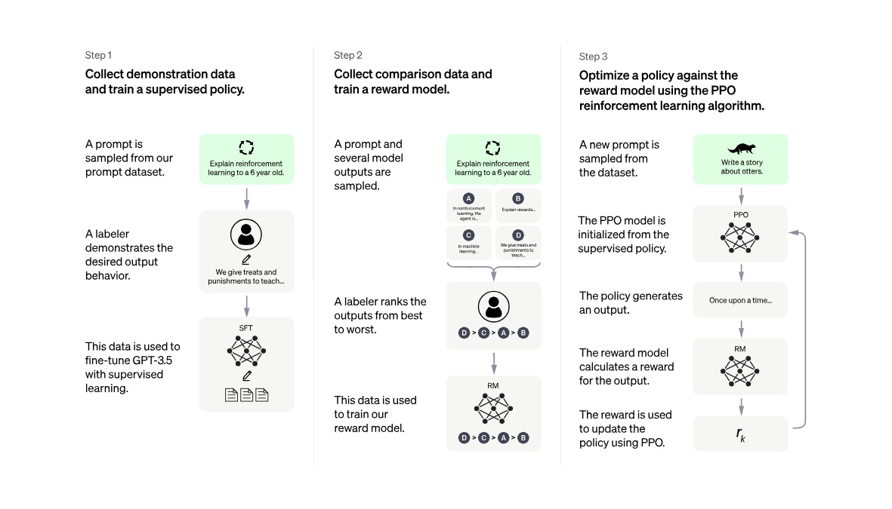
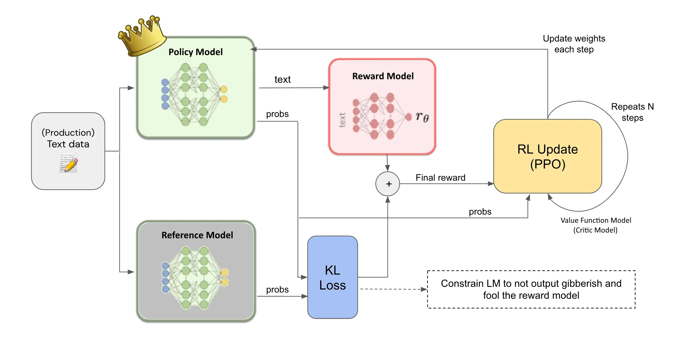
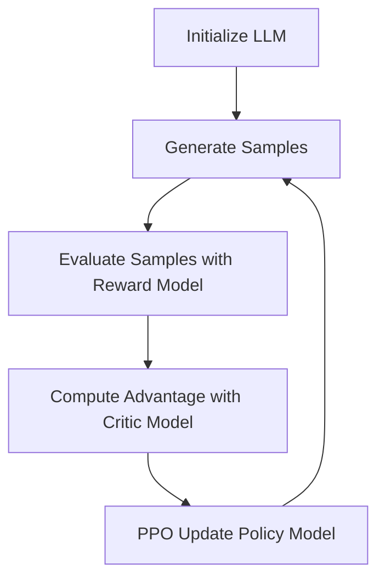

[ [English](rlhf_ppo_overview_enus.md) ] [ 繁體中文 ]

# 解釋 RLHF 與 PPO

## 介紹 PPO

### 使用 RLHF 訓練語言模型
使用強化學習與人類反饋（RLHF）訓練語言模型的過程包含三個主要步驟。

**步驟 1：收集示範數據並訓練監督策略**：
1. **提示抽樣**：從數據集中選擇一個提示。
2. **示範**：標註者演示提示的期望輸出行為。
3. **監督微調（SFT）**：使用這些示範數據對 GPT-3.5 模型進行監督學習微調。

**步驟 2：收集比較數據並訓練獎勵模型**：
1. **輸出抽樣**：選擇一個提示並抽樣多個模型輸出。
2. **排序輸出**：標註者將這些輸出從最佳到最差進行排序。
3. **訓練獎勵模型（RM）**：使用排序數據來訓練獎勵模型。

**步驟 3：使用 PPO 強化學習算法優化策略**：
1. **提示抽樣**：從數據集中選擇一個新的提示。
2. **初始化 PPO 模型**：PPO 模型從監督策略中初始化。
3. **生成輸出**：策略模型生成一個輸出。
4. **計算獎勵**：獎勵模型為輸出計算獎勵。
5. **策略更新**：使用獎勵來更新策略，使用 PPO 算法。

### 近端策略優化（PPO）概述
近端策略優化（PPO）是一種先進的強化學習算法，兼具簡單性與高效性。它旨在改進傳統的策略梯度方法，保持信任區域方法的優點，同時更易於實施和調整。PPO 通過限制策略更新來穩定訓練過程，防止導致次優策略或不穩定的巨大偏差。

### PPO 訓練中的關鍵組件
近端策略優化涉及幾個關鍵模型，它們共同有效地優化策略：

**策略模型（訓練中的語言模型）**：
- **目的**：根據當前策略生成行動或決策。
- **效果**：決定代理在給定狀態下應採取的行動。
- **特點**：這是 PPO 中主要優化的模型。它根據當前狀態生成可能行動的概率分佈。

**參考模型（凍結的語言模型）**：
- **目的**：作為評估當前策略改進的基準。
- **效果**：幫助計算 KL 散度，確保新策略不會過度偏離舊策略。
- **特點**：通常是策略模型的凍結副本，用於比較並約束對訓練策略模型的更新，保持穩定性，防止劇烈變化。

**獎勵模型**：
- **目的**：根據人類反饋生成獎勵信號。
- **效果**：將人類偏好轉化為可量化的獎勵，指導學習過程。
- **特點**：通常預訓練來根據策略模型生成的行動或輸出的質量給出即時獎勵。此模型確保所採取的行動符合期望結果。

**價值函數模型**：
- **目的**：估計每個狀態的價值。
- **效果**：幫助評估行動的長期回報，輔助計算優勢函數。
- **特點**：幫助策略模型做出更好的決策，通過提供價值估計。這個模型對減少策略梯度估計的方差至關重要，使訓練更穩定高效。

## PPO 訓練過程

### 輸入數據
訓練過程始於輸入數據，在這裡是用於訓練語言模型的文本數據。這些數據構成了模型學習的基礎，使其能夠理解並生成類似人類的文本。

### 語言模型（LM）
PPO 訓練過程中涉及兩個關鍵語言模型：
1. **訓練中的語言模型（策略模型）**：這是正在積極訓練的模型。它處理輸入文本數據並生成新文本，以及每個可能下一詞的相關概率。
2. **凍結的語言模型（參考模型）**：此模型作為穩定的基準。它是策略模型的凍結版本，用於計算 KL 散度，以確保對策略模型的更新不會偏離過多。

### 獎勵模型
獎勵模型評估訓練語言模型生成的文本。它根據生成文本與人類偏好或其他預定標準的對齊程度提供獎勵信號。此模型對指導訓練過程向產生期望輸出至關重要。

### KL 散度損失
KL 散度損失測量訓練語言模型和凍結參考模型輸出概率分佈的差異。這種損失確保對訓練模型的更新不會過於極端，促進訓練過程的穩定性。

### 獎勵計算
每個生成文本的最終獎勵通過結合獎勵模型的輸出和 KL 散度損失來計算。通常使用的公式為：
\[ \text{Final Reward} = R - \beta \times \text{KL} \]
其中：
- \( R \) 是獎勵模型的輸出。
- \( \beta \) 是平衡獎勵和 KL 損失的係數。

### 強化學習更新（PPO）
近端策略優化（PPO）更新模塊使用最終獎勵來更新訓練語言模型的權重。這種更新受到約束，以確保變化在一個近端範圍內，防止巨大、不穩定的更新。更新步驟重複多次，以逐步改進模型的性能。

### 約束機制
存在一個約束機制，確保語言模型不會輸出可能欺騙獎勵模型的無意義文本。此機制進一步穩定訓練過程，幫助保持生成文本的質量。

### 迭代優化
PPO 訓練過程是迭代的。每次迭代包括生成文本、使用獎勵模型評估、計算最終獎勵、更新模型權重。這種迭代方法允許模型逐步改進和適應，隨著時間的推移提高性能。

## 透過範例解釋 PPO 訓練過程

為了更好地理解近端策略優化（PPO）訓練過程，我們來通過一個使用語言模型完成句子的範例來說明。

### 輸入數據
考慮以下輸入句子："The cat sat on the ___."

### 語言模型（LM）
1. **訓練中的語言模型（策略模型）**：
    - 該模型處理輸入句子並生成對下一個詞的預測以及每個可能詞的概率。
    - 例如，它可能預測：
        - "mat" 的概率為 0.4
        - "chair" 的概率為 0.3
        - "floor" 的概率為 0.2
        - "roof" 的概率為 0.1

2. **凍結的語言模型（參考模型）**：
    - 這是一個之前訓練並凍結的策略模型版本。它可能預測：
        - "mat" 的概率為 0.5
        - "chair" 的概率為 0.25
        - "floor" 的概率為 0.15
        - "roof" 的概率為 0.1

### 獎勵模型
獎勵模型評估預測的詞根據其與上下文的適合度以及與人類偏好的對齊程度。假設它給出的獎勵分數如下：
- "mat": 0.9（高度相關）
- "chair": 0.6（相關）
- "floor": 0.4（較少相關）
- "roof": 0.1（不相關）

### KL 散度損失
KL 散度損失測量訓練模型與凍結模型的概率分佈之間的差異。它有助於確保新預測不會與之前的預測有顯著不同。在我們的範例中，假設 KL 散度計算為 0.05。

### 獎勵計算
最終獎勵結合了獎勵模型的輸出和 KL 散度損失。假設我們使用一個係數 \( \beta = 0.1 \)：
\[ \text{Final Reward} = R - \beta \times \text{KL} \]

對於詞 "mat"：
\[ \text{Final Reward} = 0.9 - 0.1 \times 0.05 = 0.9 - 0.005 = 0.895 \]

對於詞 "chair"：
\[ \text{Final Reward} = 0.6 - 0.1 \times 0.05 = 0.6 - 0.005 = 0.595 \]

### 強化學習更新（PPO）
使用最終獎勵，PPO 更新模塊調整訓練語言模型的權重。此步驟確保策略模型學會偏好更相關的詞，同時保持穩定性。

### 約束機制
約束機制確保語言模型的更新不會產生無意義的文本或過度偏離參考模型。這一機制有助於保持生成文本的質量和一致性。

### 迭代優化
這個過程是迭代的。每次迭代包含以下步驟：
1. 策略模型為輸入句子生成預測。
2. 獎勵模型評估預測。
3. 計算策略模型與參考模型之間的 KL 散度。
4. 計算最終獎勵。
5. 更新策略模型的權重。

通過重複這些步驟，語言模型逐漸改進，隨著時間的推移生成更高質量和更符合上下文的文本。例如，經過多次迭代後，模型可能會一致地預測 "mat" 作為完成句子 "The cat sat on the ___" 的最適當詞，與人類偏好高度對齊。

## 詳述 RL 更新

使用強化學習（RL）訓練語言模型（LLM）通常涉及策略優化。以下是 RL 更新工作原理的解釋，以近端策略優化（PPO）為例。

**RL 更新概述**

1. **生成輸出**：LLM 根據當前策略模型生成輸出文本。
2. **獲得獎勵**：輸出文本被傳入獎勵模型，以獲得相應的獎勵分數。獎勵模型根據特定目標設計，如可讀性、相關性或其他指標。
3. **估計價值函數**：評論模型（價值函數模型）估計當前狀態的預期價值，這通常是部分生成的文本序列的一部分。這個過程通常使用時間差分學習。
4. **計算優勢**：優勢函數是 PPO 中的一個關鍵組件，用於評估當前策略的性能。它衡量實際獲得的獎勵與評論模型估計的價值之間的差異。公式為：
   
   \[
   A(s, a) = R - V(s)
   \]

   其中 \( R \) 是實際獲得的獎勵，\( V(s) \) 是評論模型對狀態 \( s \) 的估計值。
5. **更新策略模型**：PPO 方法更新策略模型的參數，以最大化累積獎勵。PPO 限制更新幅度，以避免劇烈變化，從而提高訓練穩定性。

**LLM 訓練中的 RL 更新過程**

假設我們正在訓練一個語言模型，使其生成的文本更符合人類偏好。工作流程可能如下：
1. **初始化模型**：從預訓練的 LLM 開始作為策略模型。
2. **生成樣本**：從預訓練的 LLM 中生成一批文本樣本。
3. **評估樣本**：使用人類評價或自動評價系統作為獎勵模型，對每個文本樣本進行評分。
4. **計算優勢**：使用評論模型估計每個文本樣本的預期價值，然後計算優勢函數。
5. **PPO 更新**：基於優勢函數，使用 PPO 方法更新 LLM 的參數，根據獎勵分數提高文本質量。
6. **重複訓練**：重複上述步驟，直到模型達到滿意的文本質量和獎勵分數。

以下是這個過程的流程圖：

在這個工作流程中，策略模型生成文本，獎勵模型評估生成的文本，評論模型幫助計算優勢函數，並且 PPO 方法更新策略模型的參數，使生成的文本更符合期望目標。

### 價值函數模型的角色

價值函數模型在圖中沒有明確顯示，因為重點在於 PPO 算法訓練語言模型的高層次流程。然而，它是 PPO 算法的一個不可或缺的部分，扮演以下角色：

1. **估計狀態價值**：在 "RL 更新（PPO）" 步驟中，價值函數模型估計每個狀態的價值，這可能是部分生成的文本序列。
2. **計算優勢**：價值函數模型幫助計算優勢函數，這是 PPO 算法中策略優化的關鍵組件。
3. **指導策略更新**：通過提供這些估計，價值函數模型幫助 PPO 算法更有效地更新語言模型的策略。
4. **減少方差**：價值函數的估計有助於減少策略梯度估計的方差，使訓練過程更加穩定。

如果要在圖中明確表示價值函數模型，它可能會作為 "RL 更新（PPO）" 模塊的一部分，與策略模型一起工作，實現 PPO 算法的核心功能。

### 價值函數模型與獎勵模型的比較

雖然價值函數模型和獎勵模型在 RL 過程中都扮演重要角色，但它們的輸入、輸出和功能是不同的：

- **價值函數模型（評論

模型）**：
  - **輸入**：當前狀態的表示，在語言模型中可能是部分生成的文本序列。
  - **輸出**：給定狀態的長期價值估計，表示未來獎勵的折現總和。
  - **功能**：估計狀態的長期價值，計算優勢函數，輔助策略更新，減少策略梯度估計的方差。

- **獎勵模型**：
  - **輸入**：完整的生成文本或行動（例如，一個詞或一句話）。
  - **輸出**：給定輸入的即時獎勵分數，反映質量或與期望目標的對齊程度。
  - **功能**：模擬人類偏好，為每個行動或生成文本提供即時反饋，引導模型向更符合目標的方向優化。

### 主要區別：

1. **時間範圍**：價值函數模型關注長期價值，而獎勵模型提供即時反饋。
2. **評估對象**：價值函數模型評估狀態，獎勵模型評估具體的輸出或行動。
3. **在學習過程中的角色**：價值函數模型是 PPO 算法內部的組件，而獎勵模型通常是預先訓練好的，提供外部信號。

## 結論
總之，使用強化學習與人類反饋（RLHF）訓練語言模型涉及一個綜合過程，利用近端策略優化（PPO）算法來微調模型，使其更符合人類偏好。這個過程從收集示範數據並使用它訓練監督策略開始，然後收集比較數據來訓練獎勵模型，最後使用 PPO 優化策略。每個組件——監督微調、獎勵模型訓練和 PPO 更新——都在確保模型生成高質量、人類對齊的輸出中扮演著關鍵角色。平衡性能和穩定性至關重要，因為 PPO 算法有助於防止可能使訓練過程不穩定的劇烈更新，從而在改進和一致性之間保持良好的平衡。

## 參考資料
- [The N Implementation Details of RLHF with PPO](https://huggingface.co/blog/the_n_implementation_details_of_rlhf_with_ppo)
- [Proximal Policy Optimization](https://hackmd.io/@shaoeChen/Bywb8YLKS/https%3A%2F%2Fhackmd.io%2F%40shaoeChen%2FSyez2AmFr)
- [RLHF + Reward Model + PPO on LLMs](https://medium.com/@madhur.prashant7/rlhf-reward-model-ppo-on-llms-dfc92ec3885f)

