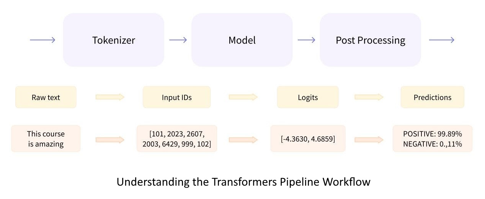

# An Introduction to Transformers Pipelines

## Overview of Transformers Pipelines

### What are Transformers Pipelines?
The pipelines are a great and easy way to use models for inference. These pipelines are objects that abstract most of the complex code from the library, offering a simple API dedicated to several tasks, including Named Entity Recognition, Masked Language Modeling, Sentiment Analysis, Feature Extraction, and Question Answering. 

### Key Features and Capabilities
There are two categories of pipeline abstractions to be aware of:
- The `pipeline()` which is the most powerful object encapsulating all other pipelines.
- Task-specific pipelines are available for audio, computer vision, natural language processing, and multimodal tasks.

### Understanding the Transformers Pipeline Workflow


The above image illustrates the main feature of the NLP pipeline in the Hugging Face Transformers module, specifically for a text classification task. The process is divided into three main stages:
1. **Tokenizer**:
    - **Function**: Converts raw text into input IDs that the model can process.
    - **Example**: The text "This course is amazing" is tokenized into the sequence `[101, 2023, 2607, 2003, 6429, 999, 102]`.
2. **Model**:
    - **Function**: Processes the input IDs and generates raw predictions called logits.
    - **Example**: The model processes the input IDs and outputs logits of `[-4.3630, 4.6859]`.
3. **Post Processing**:
    - **Function**: Converts logits into human-readable predictions with probabilities.
    - **Example**: For the given logits, the final prediction is `POSITIVE` with a probability of `99.89%` and `NEGATIVE` with a probability of `0.11%`.

This end-to-end workflow demonstrates how raw text input is transformed into meaningful predictions using the Hugging Face Transformers pipeline. By abstracting the complexity of the underlying models, the pipeline provides a simple and efficient way to leverage state-of-the-art machine learning models for various NLP tasks.


## Introduction to Transformers Pipelines API

### Overview of Transformers Pipeline Classes
The table provides a comprehensive overview of the various pipeline classes available in the `transformers` library, categorized by their respective domains: Audio, Computer Vision, Natural Language Processing, and Multimodal. Each pipeline class is designed to perform specific tasks, ranging from classifying audio files, recognizing speech, and generating audio from text, to detecting objects in images, classifying images and videos, and estimating depth in images. In the domain of natural language processing, the pipeline classes manage tasks such as conversational response generation, masked word prediction, question answering, text summarization, text and token classification, text generation, and translation. The multimodal pipelines address tasks that involve both text and visual data, such as answering questions based on document content, extracting features from input data, generating text descriptions from images, and creating masks for specific areas in images. Each pipeline class abstracts complex model interactions, providing a simple and efficient API for leveraging state-of-the-art models for various AI tasks.

| Domain                       | Pipeline Class                               | Description                                                                            |
|------------------------------|----------------------------------------------|----------------------------------------------------------------------------------------|
| **Audio**                    | AudioClassificationPipeline                  | Classifies audio files into predefined categories.                                     |
|                              | AutomaticSpeechRecognitionPipeline           | Converts speech in audio files to text.                                                |
|                              | TextToAudioPipeline                          | Generates audio from text input.                                                       |
|                              | ZeroShotAudioClassificationPipeline          | Classifies audio into categories without needing task-specific training data.          |
| **Computer Vision**          | DepthEstimationPipeline                      | Estimates the depth information from images.                                           |
|                              | ImageClassificationPipeline                  | Classifies images into predefined categories.                                          |
|                              | ImageSegmentationPipeline                    | Segments objects within an image.                                                      |
|                              | ImageToImagePipeline                         | Transforms input images to output images (e.g., super-resolution, style transfer).     |
|                              | ObjectDetectionPipeline                      | Detects objects within an image and provides bounding boxes and labels.                |
|                              | VideoClassificationPipeline                  | Classifies video content into predefined categories.                                   |
|                              | ZeroShotImageClassificationPipeline          | Classifies images into categories without needing task-specific training data.         |
|                              | ZeroShotObjectDetectionPipeline              | Detects objects in images without needing task-specific training data.                 |
| **Natural Language Processing** | ConversationalPipeline                      | Manages and generates responses for conversational data.                               |
|                              | FillMaskPipeline                             | Predicts masked words in a given sentence.                                             |
|                              | QuestionAnsweringPipeline                    | Answers questions based on provided context.                                           |
|                              | SummarizationPipeline                        | Summarizes long text into shorter versions.                                            |
|                              | TableQuestionAnsweringPipeline               | Answers questions based on data in tables.                                             |
|                              | TextClassificationPipeline                   | Classifies text into predefined categories.                                            |
|                              | TextGenerationPipeline                       | Generates text based on a given prompt.                                                |
|                              | Text2TextGenerationPipeline                  | Transforms input text into output text (e.g., translation, summarization).             |
|                              | TokenClassificationPipeline                  | Classifies tokens within a text (e.g., named entity recognition).                      |
|                              | TranslationPipeline                          | Translates text from one language to another.                                          |
|                              | ZeroShotClassificationPipeline               | Classifies text into categories without needing task-specific training data.           |
| **Multimodal**               | DocumentQuestionAnsweringPipeline            | Answers questions based on the content of documents.                                   |
|                              | FeatureExtractionPipeline                    | Extracts features from input data for further processing.                              |
|                              | ImageFeatureExtractionPipeline               | Extracts features from images for further processing.                                  |
|                              | ImageToTextPipeline                          | Generates text descriptions from images.                                               |
|                              | MaskGenerationPipeline                       | Generates masks for specific areas in an image.                                        |
|                              | VisualQuestionAnsweringPipeline              | Answers questions based on the content of images.                                      |

### How the Transformers Pipelines API Works
The pipeline abstraction is a wrapper around all the other available pipelines. It is instantiated as any other pipeline but can provide additional quality of life.

### Setting Up Your Environment
To set up your environment and use a pipeline for a specific task, you can follow these examples:
- Simple call on one item:
    ```python
    from transformers import pipeline
    pipe = pipeline("text-classification")
    print(pipe("This restaurant is awesome"))
    # [{'label': 'POSITIVE', 'score': 0.9998743534088135}]
    ```

- Using a specific model from the hub:
    ```python
    pipe = pipeline(model="FacebookAI/roberta-large-mnli")
    print(pipe("This restaurant is awesome"))
    # [{'label': 'NEUTRAL', 'score': 0.7313136458396912}]
    ```

- Calling a pipeline on many items:
    ```python
    pipe = pipeline("text-classification")
    print(pipe(["This restaurant is awesome", "This restaurant is awful"]))
    # [{'label': 'POSITIVE', 'score': 0.9998743534088135},
    #  {'label': 'NEGATIVE', 'score': 0.9996669292449951}]
    ```

- Iterating over full datasets:
    ```python
    import datasets
    from transformers import pipeline
    from transformers.pipelines.pt_utils import KeyDataset
    from tqdm.auto import tqdm

    pipe = pipeline("automatic-speech-recognition", model="facebook/wav2vec2-base-960h", device=0)
    dataset = datasets.load_dataset("superb", name="asr", split="test")

    for out in tqdm(pipe(KeyDataset(dataset, "file"))):
        print(out)
    # {"text": "NUMBER TEN FRESH NELLY IS WAITING ON YOU GOOD NIGHT HUSBAND"}
    # {"text": ....}
    # ....
    ```

- Using a generator for ease of use:
    ```python
    from transformers import pipeline

    pipe = pipeline("text-classification")

    def data():
        while True:
            yield "This is a test"

    for out in pipe(data()):
        print(out)
    # {"text": "NUMBER TEN FRESH NELLY IS WAITING ON YOU GOOD NIGHT HUSBAND"}
    # {"text": ....}
    # ....
    ```


## Task-Specific Examples

### Using Various Pipelines with Custom Parameters

This example demonstrates how to initialize and use various types of pipelines provided by the `transformers` library, each with custom parameters. It covers:
- Initializing a text classification pipeline with a specific model and tokenizer, using the CPU.
- Setting up a named entity recognition (NER) pipeline with PyTorch.
- Configuring a question answering pipeline with TensorFlow.
- Using a text generation pipeline with a custom batch size.
- Creating a summarization pipeline that utilizes GPU and automatic precision.
- Setting up a translation pipeline with binary output.
- Initializing a feature extraction pipeline with a custom model card.
- Configuring an image classification pipeline with an image processor and using the CPU.

Additionally, the example includes calling a question answering pipeline with a specified question and context and printing the result. This showcases the flexibility and customization available when using the `transformers.Pipeline` class for various NLP tasks.

```python
from transformers import pipeline, AutoModelForSequenceClassification, AutoTokenizer

# Load a pre-trained model and tokenizer
# Initialize a custom text classification pipeline
# ---------------------------------------------------------------
model = AutoModelForSequenceClassification.from_pretrained("distilbert-base-uncased-finetuned-sst-2-english")
tokenizer = AutoTokenizer.from_pretrained("distilbert-base-uncased-finetuned-sst-2-english")
custom_classifier = pipeline(
    task="text-classification",
    model=model,
    tokenizer=tokenizer,
    device=-1  # Use CPU
)

# Initialize the named entity recognition pipeline with PyTorch
# ---------------------------------------------------------------
ner = pipeline(
    task="ner",
    model="dbmdz/bert-large-cased-finetuned-conll03-english",
    tokenizer="dbmdz/bert-large-cased-finetuned-conll03-english",
    framework="pt"  # Use PyTorch
)

# Initialize the question answering pipeline with TensorFlow
# ---------------------------------------------------------------
qa = pipeline(
    task="question-answering",
    model="distilbert-base-cased-distilled-squad",
    tokenizer="distilbert-base-cased-distilled-squad",
    framework="tf"  # Use TensorFlow
)

# Initialize the text generation pipeline
# ---------------------------------------------------------------
generator = pipeline(
    task="text-generation",
    model="gpt2",
    tokenizer="gpt2",
    batch_size=2  # Custom batch size
)

# Initialize the summarization pipeline
# ---------------------------------------------------------------
summarizer = pipeline(
    task="summarization",
    model="facebook/bart-large-cnn",
    tokenizer="facebook/bart-large-cnn",
    device=0,  # Use GPU (CUDA device id 0)
    torch_dtype="auto"  # Use automatic precision
)

# Initialize the translation pipeline
# ---------------------------------------------------------------
translator = pipeline(
    task="translation_en_to_fr",
    model="t5-small",
    tokenizer="t5-small",
    binary_output=True  # Enable binary output
)

# Initialize the feature extraction pipeline
# ---------------------------------------------------------------
feature_extractor = pipeline(
    task="feature-extraction",
    model="distilbert-base-uncased-finetuned-sst-2-english",
    tokenizer="distilbert-base-uncased-finetuned-sst-2-english",
    modelcard=model_card  # Use custom model card
)

# Initialize the image classification pipeline
# ---------------------------------------------------------------
image_classifier = pipeline(
    task="image-classification",
    model=model,
    image_processor=image_processor,
    device=-1  # Use CPU
)

# Define a question and context
# Call the pipeline with the question and context
question = "What is the capital of France?"
context = "France is a country in Europe. The capital of France is Paris."
result = qa(question=question, context=context)

print(result)
```

### Conversational Pipeline Usage

This example demonstrates how to use the `transformers` library's conversational pipeline to manage and generate responses in a conversation. It covers:
- Initializing the conversational pipeline.
- Creating a conversation with an initial user input.
- Adding messages from both the assistant and the user.
- Generating responses from the pipeline based on the conversation history.
- Dynamically adding user input and generating additional responses.
- Iterating over the conversation to display the messages.

The example highlights the flexibility and ease of managing conversations and generating relevant responses using the `transformers.Conversation` class and the `conversational` pipeline.

```python
from transformers import Conversation

# Initialize the conversational pipeline
conversational_pipeline = pipeline("conversational")

# Initialize a conversation
conversation = Conversation("Going to the movies tonight - any suggestions?")

# Add assistant message
# Add user message
# -----------------------------------------------------------
conversation.add_message({"role": "assistant", "content": "The Big Lebowski."})
conversation.add_message({"role": "user", "content": "Is it good?"})

# Generate a response from the pipeline
# -----------------------------------------------------------
result = conversational_pipeline([conversation])

# Generate a response from the pipeline
# -----------------------------------------------------------
result = conversational_pipeline([conversation])

# Add user message
# Generate another response
# -----------------------------------------------------------
conversation.add_user_input("Is it good?")
result = conversational_pipeline([conversation])

# Display the conversation
for message in conversation.iter_texts():
    print(f"{message['role']}: {message['content']}")
```

### Handling Multiple Conversations with Conversational Pipeline

This example demonstrates how to use the `transformers` library's conversational pipeline to manage and generate responses for multiple conversations simultaneously. It covers:

- Initializing the conversational pipeline.
- Creating multiple conversations with different initial user inputs.
- Generating responses from the pipeline for both conversations.
- Iterating over each conversation to display the messages.

The example highlights the ability to handle multiple conversations in parallel and generate relevant responses using the `transformers.Conversation` class and the `conversational` pipeline.

```python
from transformers import pipeline, Conversation

# Initialize the conversational pipeline
conversational_pipeline = pipeline("conversational")

# Create multiple conversations
# Generate responses from the pipeline
# -----------------------------------------------------------
conversation1 = Conversation("Going to the movies tonight - any suggestions?")
conversation2 = Conversation("What's the weather like today?")
result = conversational_pipeline([conversation1, conversation2])

# Print the updated conversations
for i, conv in enumerate([conversation1, conversation2], 1):
    print(f"Conversation {i}:")
    for message in conv.iter_texts():
        print(f"  {message['role']}: {message['content']}")
    print()
```

### Using Object Detection Pipeline with Various Image Inputs

This example demonstrates how to use the `transformers` library's object detection pipeline to process images from different sources. It covers:
- Initializing the object detection pipeline with a specific model.
- Processing a single image from a URL.
- Processing a list of images from URLs.
- Processing a single local image.
- Processing a list of local images.
- Processing a single image loaded with PIL.
- Processing a list of images loaded with PIL.

The example highlights the versatility of the `transformers` object detection pipeline in handling different image input formats and generating object detection results accordingly.

```python
from transformers import pipeline

# Initialize the object detection pipeline
detector = pipeline(model="facebook/detr-resnet-50")

# Single image URL
# Call the pipeline with the image URL
# -----------------------------------------------------------
image_url = "https://example.com/image.jpg"
result = detector(image_url)

# List of image URLs
# Call the pipeline with the list of image URLs
# -----------------------------------------------------------
image_urls = [
    "https://example.com/image1.jpg",
    "https://example.com/image2.jpg",
    "https://example.com/image3.jpg"
]
result = detector(image_urls)

# Single local image path
# Call the pipeline with the local image path
# -----------------------------------------------------------
image_path = "/path/to/local/image.jpg"
result = detector(image_path)

# List of local image paths
# Call the pipeline with the list of local image paths
# -----------------------------------------------------------
image_paths = [
    "/path/to/local/image1.jpg",
    "/path/to/local/image2.jpg",
    "/path/to/local/image3.jpg"
]
result = detector(image_paths)

# Load a single image with PIL
# Call the pipeline with the PIL image
# -----------------------------------------------------------
image = Image.open("/path/to/local/image.jpg")
result = detector(image)

# Load images with PIL
# Call the pipeline with the list of PIL images
# -----------------------------------------------------------
images = [
    Image.open("/path/to/local/image1.jpg"),
    Image.open("/path/to/local/image2.jpg"),
    Image.open("/path/to/local/image3.jpg")
]
result = detector(images)

print(result)
```

### Using Question Answering Pipeline with Various Configurations

This example demonstrates how to use the `transformers` library's question answering pipeline with various configurations and parameters. It covers:
- Initializing the question answering pipeline.
- Processing a single question and context.
- Handling multiple questions with a single context.
- Handling multiple questions and multiple contexts.
- Using the `topk` parameter to get multiple answers for a single question.
- Managing long contexts with the `doc_stride` parameter.
- Handling impossible answers with the `handle_impossible_answer` parameter.

The example highlights the flexibility of the `transformers` question answering pipeline in handling different input formats and configurations to generate relevant answers.

```python
from transformers import pipeline

# Initialize the question answering pipeline
qa_pipeline = pipeline("question-answering")

# Define a question and context
# Call the pipeline with the question and context
# ------------------------------------------------------------------------
question = "What is the capital of France?"
context = "France is a country in Europe. The capital of France is Paris."
result = qa_pipeline(question=question, context=context)

# Define multiple questions and a single context
# Call the pipeline with the questions and context
# ------------------------------------------------------------------------
questions = [
    "What is the capital of France?",
    "Where is France located?"
]
context = "France is a country in Europe. The capital of France is Paris."
results = [qa_pipeline(question=question, context=context) for question in questions]

# Define multiple questions and contexts
# Call the pipeline with the questions and contexts
# ------------------------------------------------------------------------
questions = [
    "What is the capital of France?",
    "Where is France located?"
]
contexts = [
    "France is a country in Europe. The capital of France is Paris.",
    "France is situated in the western part of Europe."
]
results = [qa_pipeline(question=question, context=context) for question, context in zip(questions, contexts)]

# Define a question and context
# Call the pipeline with the question, context, and topk parameter
# ------------------------------------------------------------------------
question = "What is the capital of France?"
context = "France is a country in Europe. The capital of France is Paris. Paris is known for its art, fashion, and culture."
result = qa_pipeline(question=question, context=context, topk=3)

# Define a question and a long context
# Call the pipeline with the question, context, and doc_stride parameter
# ------------------------------------------------------------------------
question = "What is the capital of France?"
context = ("France is a country in Europe. " * 50) + "The capital of France is Paris."
result = qa_pipeline(question=question, context=context, doc_stride=128)

# Define a question and context
# Call the pipeline with the question, context, 
# and handle_impossible_answer parameter
# ------------------------------------------------------------------------
question = "What is the capital of Germany?"
context = "France is a country in Europe. The capital of France is Paris."
result = qa_pipeline(
	question=question, context=context, handle_impossible_answer=True
)

# Print the results
if results:
    for res in results:
        print(res)
else:
    print(result)
```

### Using Text Generation Pipeline with Various Configurations

This example demonstrates how to use the `transformers` library's text generation pipeline with various configurations and parameters. It covers:
- Initializing the text generation pipeline.
- Generating text from a single prompt.
- Generating text from multiple prompts.
- Using a chat-style input for generating text.
- Handling long prompts with the `handle_long_generation` parameter.
- Controlling the output with the `return_full_text` parameter.
- Using additional generation parameters such as `max_length` and `num_return_sequences`.
- Returning generated token IDs with the `return_tensors` parameter.
- Using a prefix with the prompt.

The example highlights the flexibility and customization options available in the `transformers` text generation pipeline to generate relevant and coherent text outputs based on different input formats and configurations.

```python
from transformers import pipeline

# Initialize the text generation pipeline
text_generator = pipeline("text-generation")

# Define a single prompt
# Call the pipeline with the prompt
# -----------------------------------------------------------
prompt = "Once upon a time, in a land far away,"
result = text_generator(prompt)

# Define multiple prompts
# Call the pipeline with the prompts
# -----------------------------------------------------------
prompts = [
    "Once upon a time, in a land far away,",
    "In a galaxy far, far away,"
]
results = text_generator(prompts)

# Define a chat-style input
# Call the pipeline with the chat input
# -----------------------------------------------------------
chat = [
    {"role": "user", "content": "Hello, who are you?"},
    {"role": "assistant", "content": "I am an AI assistant. How can I help you today?"}
]
result = text_generator(chat)

# Define a prompt that is too long
# Call the pipeline with the prompt 
# and handle_long_generation parameter
# -----------------------------------------------------------
prompt = "This is a very long prompt " * 50
result = text_generator(prompt, handle_long_generation="hole")

# Define a prompt
# Call the pipeline with return_full_text set to False
# -----------------------------------------------------------
prompt = "The future of AI is"
result = text_generator(prompt, return_full_text=False)

# Define a prompt
# Call the pipeline with additional generation parameters
# -----------------------------------------------------------
prompt = "Once upon a time, in a land far away,"
result = text_generator(prompt, max_length=50, num_return_sequences=3)

# Define a prompt
# Call the pipeline with return_tensors set to True
# -----------------------------------------------------------
prompt = "The quick brown fox"
result = text_generator(prompt, return_tensors=True)

# Define a prompt and prefix
# Call the pipeline with the prefix
# -----------------------------------------------------------
prompt = "decided to"
prefix = "The quick brown fox"
result = text_generator(prompt, prefix=prefix)

print(result)
```

### Using Document Question Answering Pipeline with Various Configurations

This example demonstrates how to use the `transformers` library's document question answering pipeline with various configurations and parameters. It covers:
- Initializing the document question answering pipeline.
- Processing a single local image with a question.
- Processing an image from a URL with a question.
- Using a PIL image with a question.
- Including word boxes in the input to avoid redundant OCR processing.
- Handling multiple questions for a single image.
- Batch processing multiple images and questions.
- Customizing OCR settings with language and tesseract configurations.

The example highlights the flexibility of the `transformers` document question answering pipeline in handling different image input formats and configurations to extract relevant answers from documents.

```python
from transformers import pipeline

# Initialize the document question answering pipeline
doc_qa_pipeline = pipeline("document-question-answering")

# Define an image (local path) and a question
# Call the pipeline with the image and question
# ---------------------------------------------------------------
image_path = "/path/to/document/image.jpg"
question = "What is the total amount due?"
result = doc_qa_pipeline(image=image_path, question=question)

# Define an image (URL) and a question
# Call the pipeline with the image URL and question
# ---------------------------------------------------------------
image_url = "https://example.com/document/image.jpg"
question = "What is the date of the document?"
result = doc_qa_pipeline(image=image_url, question=question)

# Load an image with PIL
# Call the pipeline with the PIL image and question
# ---------------------------------------------------------------
image = Image.open("/path/to/document/image.jpg")
question = "What is the invoice number?"
result = doc_qa_pipeline(image=image, question=question)

# Define an image, question, and word boxes
# Call the pipeline with the image, question, and word boxes
# ---------------------------------------------------------------
image_path = "/path/to/document/image.jpg"
question = "What is the total amount due?"
word_boxes = [("Total", (0.1, 0.1, 0.2, 0.2)), ("amount", (0.3, 0.1, 0.4, 0.2)), ("due", (0.5, 0.1, 0.6, 0.2))]
result = doc_qa_pipeline(image=image_path, question=question, word_boxes=word_boxes)

# Define an image and multiple questions
# Call the pipeline with the image and questions
# ---------------------------------------------------------------
image_path = "/path/to/document/image.jpg"
questions = ["What is the total amount due?", "What is the date of the document?"]
results = [doc_qa_pipeline(image=image_path, question=question) for question in questions]

# Define multiple images and questions
# Call the pipeline with the batch data
# ---------------------------------------------------------------
data = [
    {"image": "/path/to/document/image1.jpg", "question": "What is the total amount due?"},
    {"image": "/path/to/document/image2.jpg", "question": "What is the date of the document?"}
]
results = doc_qa_pipeline(data)

# Define an image, question, and OCR settings
# Call the pipeline with the image, question, and OCR settings
# ---------------------------------------------------------------
image_path = "/path/to/document/image.jpg"
question = "What is the total amount due?"
lang = "eng"
tesseract_config = "--oem 1"
result = doc_qa_pipeline(image=image_path, question=question, lang=lang, tesseract_config=tesseract_config)

print(result)
```

### Using Visual Question Answering Pipeline with Various Configurations

This example demonstrates how to use the `transformers` library's visual question answering (VQA) pipeline with various configurations and parameters. It covers:

- Initializing the visual question answering pipeline.
- Processing a single local image with a question.
- Processing an image from a URL with a question.
- Using a PIL image with a question.
- Handling multiple questions for a single image.
- Handling multiple images with a single question.
- Batch processing multiple images and questions.
- Using the `top_k` parameter to get multiple top answers.
- Setting a timeout for fetching images from the web.

The example highlights the flexibility of the `transformers` visual question answering pipeline in handling different image input formats and configurations to provide relevant answers to visual questions.

```python
from transformers import pipeline

# Initialize the visual question answering pipeline
vqa_pipeline = pipeline("visual-question-answering")

# Define an image (local path) and a question
# Call the pipeline with the image and question
# ---------------------------------------------------------------
image_path = "/path/to/image.jpg"
question = "What is the color of the car?"
result = vqa_pipeline(image=image_path, question=question)

# Define an image (URL) and a question
# Call the pipeline with the image URL and question
# ---------------------------------------------------------------
image_url = "https://example.com/image.jpg"
question = "What is the person doing?"
result = vqa_pipeline(image=image_url, question=question)

# Load an image with PIL
# Call the pipeline with the PIL image and question
# ---------------------------------------------------------------
image = Image.open("/path/to/image.jpg")
question = "How many people are in the image?"
result = vqa_pipeline(image=image, question=question)

# Define a single image and multiple questions
# Call the pipeline with the image and questions
# ---------------------------------------------------------------
image_path = "/path/to/image.jpg"
questions = ["What is the color of the car?", "What is the model of the car?"]
results = [vqa_pipeline(image=image_path, question=question) for question in questions]

# Define multiple images and a single question
# Call the pipeline with the images and question
# ---------------------------------------------------------------
images = ["/path/to/image1.jpg", "/path/to/image2.jpg"]
question = "What is the color of the car?"
results = [vqa_pipeline(image=image, question=question) for image in images]

# Define multiple images and questions
# Call the pipeline with the batch data
# ---------------------------------------------------------------
data = [
    {"image": "/path/to/image1.jpg", "question": "What is the color of the car?"},
    {"image": "/path/to/image2.jpg", "question": "How many people are in the image?"}
]
results = vqa_pipeline(data)

# Define an image and a question
# Call the pipeline with the top_k parameter
# ---------------------------------------------------------------
image_path = "/path/to/image.jpg"
question = "What is the color of the car?"
result = vqa_pipeline(image=image_path, question=question, top_k=3)

# Define an image (URL) and a question
# Call the pipeline with the timeout parameter
# ---------------------------------------------------------------
image_url = "https://example.com/image.jpg"
question = "What is the person doing?"
result = vqa_pipeline(image=image_url, question=question, timeout=5.0)

# Print the results
if results:
    for res in results:
        print(res)
else:
    print(result)
```


## Conclusion
### Summarizing the Power of Transformers Pipelines
Transformers pipelines simplify the process of using state-of-the-art machine learning models for various tasks, providing a high-level API that abstracts away the complexity of the underlying models. These pipelines are a great and easy way to use models for inference. They are objects that encapsulate most of the complex code from the library, offering a simple API dedicated to several tasks, including Named Entity Recognition, Masked Language Modeling, Sentiment Analysis, Feature Extraction, and Question Answering. See the task summary for examples of use.

There are two categories of pipeline abstractions to be aware of:
- **The `pipeline()` Abstraction:** This is the most powerful object encapsulating all other pipelines. It provides a flexible interface for a wide range of tasks.
- **Task-Specific Pipelines:** These are available for specific domains such as audio, computer vision, natural language processing, and multimodal tasks, offering tailored functionalities for each.

### Best Practices for Using Pipelines
- **Use Task-Specific Pipelines:** For best performance and ease of use, opt for pipelines designed specifically for your task.
- **Leverage the `pipeline()` Abstraction:** Utilize the general `pipeline()` function for flexibility and additional quality-of-life features, allowing you to switch between tasks and models easily.


## References
- [HuggingFace Transformers Pipelines](https://huggingface.co/docs/transformers/main_classes/pipelines)
- [An Introduction to HuggingFace Transformers Pipelines through animations and data-flows](https://www.youtube.com/watch?v=dduGEXv31jI)
- [All NLP tasks using Transformers Pipeline](https://www.analyticsvidhya.com/blog/2021/12/all-nlp-tasks-using-transformers-package/)
- [Mastering NLP with Hugging Face Transformers: Unveiling the Power of Pipelines](https://medium.com/@roshikanayanadhara/mastering-nlp-with-hugging-face-transformers-unveiling-the-power-of-pipelines-fb332aa8fb36)

