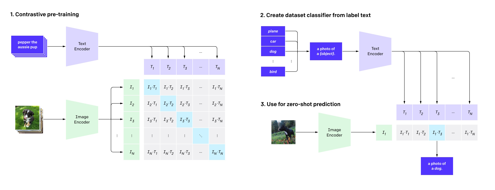

# CLIP Vision Techniques with HuggingFace
The CLIP (Contrastive Language–Image Pre-training) model by OpenAI has revolutionized the way we integrate visual and textual information. The HuggingFace `transformers` library provides easy-to-use interfaces for working with CLIP models. In this article, we'll explore how to use `CLIPVisionModel`, `CLIPImageProcessor`, and `CLIPVisionConfig` for various tasks.


## CLIP Overview
The CLIP model, proposed in "Learning Transferable Visual Models From Natural Language Supervision" by Alec Radford and colleagues, is a neural network trained on a variety of (image, text) pairs. CLIP (Contrastive Language-Image Pre-Training) can predict the most relevant text snippet given an image using natural language instructions, without direct task-specific optimization, similar to the zero-shot capabilities of GPT-2 and GPT-3.



### Abstract from the Paper
State-of-the-art computer vision systems are typically trained to predict a fixed set of predetermined object categories, limiting their generality and usability. Learning from raw text about images provides a broader source of supervision. CLIP demonstrates that predicting which caption matches which image is an efficient and scalable way to learn state-of-the-art image representations from scratch using a dataset of 400 million (image, text) pairs collected from the internet. After pre-training, CLIP can reference learned visual concepts or describe new ones, enabling zero-shot transfer to downstream tasks. CLIP's performance was benchmarked on over 30 different computer vision datasets, covering tasks such as OCR, action recognition in videos, geo-localization, and various types of fine-grained object classification. It often matches or exceeds the performance of fully supervised models without additional dataset-specific training. For example, CLIP matches the accuracy of the original ResNet-50 on ImageNet zero-shot, without using any of the 1.28 million training examples. The code and pre-trained model weights are publicly available.

### Additional Points
- The `transformers` CLIP vision module is particularly useful for a variety of image processing tasks.
- It is worth learning how to use the `transformers` CLIP model to leverage its powerful capabilities in multimodal applications.


## Introduction of CLIP model in the HuggingFace

The table below provides a comprehensive overview of key components and functions related to the CLIP model in the HuggingFace `transformers` library. It includes `CLIPTextConfig` and `CLIPVisionConfig`, which allow customization of model parameters for the text and vision components, respectively. `CLIPTokenizer` is responsible for converting text into numerical tokens, while `CLIPVisionModel` processes and extracts features from images. The `CLIPProcessor` combines functionalities of both image and text processors to ensure inputs are correctly formatted for the model, and the `CLIPImageProcessor` handles image preprocessing tasks such as resizing, normalization, and transformation into tensor format.

| Component               | Description                                                                         |
|-------------------------|-------------------------------------------------------------------------------------|
| `CLIPTextConfig`        | Configuration class for the text component of the CLIP model, allowing customization of model parameters like vocabulary size, hidden size, number of attention heads, and number of layers. |
| `CLIPVisionConfig`      | Configuration class for the `CLIPVisionModel`, allowing customization of model parameters like hidden size, number of attention heads, and number of hidden layers.                   |
| `CLIPTokenizer`         | Tokenizer class for the CLIP model, responsible for converting text into numerical tokens that the model can understand.                                                             |
| `CLIPVisionModel`       | This is the vision encoder part of the CLIP model, responsible for processing and extracting features from images.                                                                   |
| `CLIPProcessor`         | A general processor for the CLIP model that combines functionalities of both the image and text processors, ensuring that the inputs are in the correct format for the model.        |
| `CLIPImageProcessor`    | This utility helps preprocess images before feeding them into the model. It handles tasks like resizing, normalization, and transformation of images into tensor format.              |


## Practical Uses of CLIP Model Functions

| Example                              | Purpose               | Description          |
|--------------------------------------|-----------------------|----------------------|
| 1. Basic Image Feature Extraction    | Extract features from an image using the CLIP vision model and image processor.                      | Demonstrates loading a pre-trained CLIP vision model and processor, preprocessing an image, and extracting features. |
| 2. Processing Text Inputs            | Preprocess text data for a CLIP model using `CLIPTokenizer` to generate text features.               | Shows how to tokenize text inputs, use a CLIP text model to extract features, and handle special tokens and vocabulary. |
| 3. Custom Model Configuration        | Customize the configuration of CLIP models for both vision and text components.                      | Explains how to define and load a CLIP model with custom configurations for both vision and text models.             |
| 4. Batch Processing Multiple Images  | Process multiple images in a batch for feature extraction.                                           | Illustrates loading and preprocessing multiple images in a batch and extracting their features using a CLIP model.      |
| 5. Using a Custom Processor          | Define and use a custom image preprocessing pipeline.                                                | Demonstrates creating a custom image processor with specific transformations and using it to preprocess and extract features from images. |

The table below provides a comprehensive overview of various examples demonstrating the functionalities of the CLIP model using the HuggingFace transformers library. It includes examples on extracting image features using the CLIP vision model, preprocessing text inputs with CLIPTokenizer to generate text features, customizing model configurations for both vision and text components, batch processing of multiple images for feature extraction, and defining and using a custom image preprocessing pipeline. Each example offers practical insights into leveraging CLIP's capabilities for different tasks.

### 1. Basic Image Feature Extraction
This example demonstrates how to use the `CLIPVisionModel` and `CLIPImageProcessor` from the HuggingFace `transformers` library to extract features from an image. Here's a brief explanation:

1. **Import Libraries**: The necessary libraries (`transformers`, `PIL`, `requests`, and `torch`) are imported.
2. **Load Pre-trained Models**: The pre-trained CLIP vision model and image processor are loaded using the `from_pretrained` method.
3. **Load Image**: An image is downloaded from a specified URL and opened using the `PIL` library.
4. **Preprocess Image**: The image is preprocessed into the required format using `CLIPImageProcessor`.
5. **Extract Features**: The preprocessed image is fed into the CLIP vision model to extract image features. This is done in a no-gradient mode (`torch.no_grad()`) to save memory and computation.
6. **Print Features**: The extracted image features are printed out.

```python
from transformers import CLIPVisionModel, CLIPImageProcessor
from PIL import Image
import requests
import torch

# Load the pre-trained CLIP vision model and image processor
model_path = "openai/clip-vit-large-patch14"
model_path = "openai/clip-vit-base-patch32"
model_path = "openai/clip-vit-base-patch16"
model = CLIPVisionModel.from_pretrained(model_path)
processor = CLIPImageProcessor.from_pretrained("openai/clip-vit-base-patch32")

# Load an image from the web
url = "https://example.com/path/to/your/image.jpg"
image = Image.open(requests.get(url, stream=True).raw)

# Preprocess the image
inputs = processor(images=image, return_tensors="pt")

# Extract image features
with torch.no_grad():
    outputs = model(**inputs)
    image_features = outputs.pooler_output

# Print the image features
print(image_features)
```

### 2. Processing Text Inputs
This example demonstrates how to use the `CLIPTokenizer` and `CLIPTextModel` from the HuggingFace `transformers` library to preprocess text and extract features. Here's a brief explanation:

1. **Import Libraries**: The necessary libraries (`transformers` and `torch`) are imported.
2. **Load Pre-trained Models**: The pre-trained CLIP tokenizer and text model are loaded using the `from_pretrained` method. Additionally, the `CLIPTextConfig` configuration is loaded to configure the text model.
3. **Define Text Input**: A text input ("A beautiful day at the beach with clear blue skies.") is defined.
4. **Tokenize Text Input**: The text input is tokenized into numerical tokens using the `CLIPTokenizer`, with the output returned as PyTorch tensors (`return_tensors="pt"`).
5. **Extract Text Features**: The tokenized text input is fed into the CLIP text model to extract text features. This is done in a no-gradient mode (`torch.no_grad()`) to save memory and computation.
6. **Print Features**: The extracted text features are printed out.

```python
from transformers import CLIPTokenizer, CLIPTextModel, CLIPTextConfig
import torch

# Load the pre-trained CLIP tokenizer and text model
model_path = "openai/clip-vit-large-patch14"
model_path = "openai/clip-vit-base-patch32"
model_path = "openai/clip-vit-base-patch16"
tokenizer = CLIPTokenizer.from_pretrained(model_path)
text_config = CLIPTextConfig.from_pretrained(model_path)
text_model = CLIPTextModel.from_pretrained(model_path, config=text_config)

# Define a text input
text = "A beautiful day at the beach with clear blue skies."

# Tokenize the text input
inputs = tokenizer(text, return_tensors="pt")

# Extract text features
with torch.no_grad():
    outputs = text_model(**inputs)
    text_features = outputs.pooler_output

# Print the text features
print(text_features)
```

`CLIPTokenizer` is essential for preprocessing text data before feeding it into a CLIP model. It converts raw text into numerical tokens, ensuring the text is properly encoded to align with image features in multimodal tasks like image-captioning and visual question answering. Additionally, it prepares text inputs for generating meaningful embeddings from a CLIP model, making it a crucial step in the text processing pipeline.

Using `CLIPTokenizer` ensures consistency with the pre-trained CLIP models by matching the tokenization process to the model's architecture, preserving performance and integrity. It also manages special tokens and the model's specific vocabulary, which is vital for accurate results. Moreover, `CLIPTokenizer` is optimized for efficiency, enabling fast and reliable tokenization of large text batches, which is beneficial in production environments and when handling large datasets. In this example, we'll demonstrate how to use `CLIPTokenizer` to preprocess text inputs and then use the tokenized text with a CLIP model to get text features.


### 3. Custom Model Configuration
Sometimes, you might want to customize the configuration of your CLIP model. Here's how to do it using `CLIPVisionConfig`. This example demonstrates how to customize the configurations of a CLIP model's vision and text components and use the model to extract features from an image. Here's a brief explanation:

1. **Import Libraries**: The necessary libraries (`transformers`, `PIL`, `requests`, and `torch`) are imported.
2. **Define Custom Vision Configuration**: A custom configuration for the vision component of the CLIP model is defined using `CLIPVisionConfig`. This includes parameters such as `hidden_size`, `num_attention_heads`, `num_hidden_layers`, `image_size`, and `patch_size`.
3. **Define Custom Text Configuration**: A custom configuration for the text component of the CLIP model is defined using `CLIPTextConfig`. This includes parameters such as `vocab_size`, `hidden_size`, `num_attention_heads`, `num_hidden_layers`, and `intermediate_size`.
4. **Load CLIP Model with Custom Configurations**: The CLIP model is loaded using the custom vision and text configurations with `CLIPModel.from_vision_text_configs`.
5. **Load Pre-trained Image Processor**: The pre-trained `CLIPImageProcessor` is loaded using the `from_pretrained` method.
6. **Load and Preprocess an Image**: An image is downloaded from a specified URL and opened using the `PIL` library. The image is then preprocessed using `CLIPImageProcessor` to convert it into the required tensor format.
7. **Extract Image Features**: The preprocessed image is fed into the CLIP model to extract image features. This is done in a no-gradient mode (`torch.no_grad()`) to save memory and computation.
8. **Print Features**: The extracted image features are printed out.

```python
from transformers import CLIPVisionModel, CLIPImageProcessor, CLIPTextConfig, CLIPVisionConfig, CLIPConfig, CLIPModel
from PIL import Image
import requests
import torch

# Define custom vision configuration
vision_config = CLIPVisionConfig(
    hidden_size=768,            # Dimensionality of the hidden layers and the pooler layer
    num_attention_heads=12,     # Number of attention heads in each attention layer
    num_hidden_layers=12,       # Number of hidden layers in the transformer encoder
    image_size=224,             # Size of the input images (height and width)
    patch_size=32,              # Size of the patches to which the image is divided
)

# Define custom text configuration
text_config = CLIPTextConfig(
    vocab_size=49408,           # Size of the vocabulary (number of unique tokens)
    hidden_size=512,            # Dimensionality of the hidden layers and the pooler layer
    num_attention_heads=8,      # Number of attention heads in each attention layer
    num_hidden_layers=12,       # Number of hidden layers in the transformer encoder
    intermediate_size=2048      # Dimensionality of the "intermediate" (i.e., feed-forward) layer
)

# Create the combined CLIP configuration
config = CLIPConfig.from_text_vision_configs(text_config, vision_config)

# Load the CLIP model with the combined configuration
model = CLIPModel(config)

# Load the pre-trained image processor
model_path = "openai/clip-vit-large-patch14"
model_path = "openai/clip-vit-base-patch32"
model_path = "openai/clip-vit-base-patch16"
processor = CLIPImageProcessor.from_pretrained(model_path)

# Load and preprocess an image
url = "https://example.com/path/to/your/image.jpg"
image = Image.open(requests.get(url, stream=True).raw)
inputs = processor(images=image, return_tensors="pt")

# Extract image features
with torch.no_grad():           # Disable gradient calculation for efficiency
    image_features = model.get_image_features(**inputs)  # Get image features from the model

# Print the image features
print(image_features)
```

### 4. Batch Processing Multiple Images
Processing multiple images in a batch can be useful for many applications. This example demonstrates how to batch process multiple images to extract their features using the CLIP vision model. Here's a brief explanation:

1. **Import Libraries**: The necessary libraries (`transformers`, `PIL`, `requests`, and `torch`) are imported.
2. **Load Pre-trained Models**: The pre-trained CLIP vision model and image processor are loaded using the `from_pretrained` method.
3. **Define Image URLs**: A list of URLs pointing to the images that will be processed.
4. **Load Images**: The images are downloaded from the specified URLs and opened using the `PIL` library.
5. **Preprocess Images**: The images are preprocessed into the required format using `CLIPImageProcessor`, with the output returned as PyTorch tensors (`return_tensors="pt"`).
6. **Extract Image Features**: The preprocessed images are fed into the CLIP vision model to extract their features. This is done in a no-gradient mode (`torch.no_grad()`) to save memory and computation.
7. **Print Features**: The extracted image features are printed out.

```python
from transformers import CLIPVisionModel, CLIPImageProcessor
from PIL import Image
import requests
import torch

# Load the pre-trained CLIP vision model and image processor
model_path = "openai/clip-vit-large-patch14"
model_path = "openai/clip-vit-base-patch32"
model_path = "openai/clip-vit-base-patch16"
model = CLIPVisionModel.from_pretrained(model_path)
processor = CLIPImageProcessor.from_pretrained(model_path)

# List of image URLs
image_urls = [
    "https://example.com/path/to/your/image1.jpg",
    "https://example.com/path/to/your/image2.jpg"
]

# Load images
images = [Image.open(requests.get(url, stream=True).raw) for url in image_urls]

# Preprocess the images
inputs = processor(images=images, return_tensors="pt")

# Extract image features
with torch.no_grad():
    outputs = model(**inputs)
    pooled_output = outputs.pooler_output # pooled (EOS token) states

# Print the (EOS token) states
print(pooled_output)
```

### 5. Using a Custom Processor
In some cases, you may want to define your own image preprocessing pipeline. This example demonstrates how to define a custom image processor using `torchvision.transforms`, and then use this processor with a pre-trained CLIP vision model to extract image features. Here's a brief explanation:

1. **Import Libraries**: The necessary libraries (`transformers`, `PIL`, `torch`, and `torchvision.transforms`) are imported.
2. **Define Custom Image Processor**: A custom processor class `CustomImageProcessor` is defined, inheriting from `CLIPImageProcessor`. It uses `torchvision.transforms` to apply a series of transformations to images:
   - `T.Resize(224)`: Resizes the image to 224x224 pixels.
   - `T.CenterCrop(224)`: Crops the image at the center to a size of 224x224 pixels.
   - `T.ToTensor()`: Converts the image to a PyTorch tensor.
   - `T.Normalize(mean=[0.485, 0.456, 0.406], std=[0.229, 0.224, 0.225])`: Normalizes the image tensor with specified mean and standard deviation values.
   
   The `__call__` method processes a list of images and returns them as a tensor dictionary.
3. **Load Pre-trained Model**: The pre-trained CLIP vision model is loaded using the `from_pretrained` method.
4. **Initialize Custom Processor**: An instance of the `CustomImageProcessor` class is created.
5. **Load and Preprocess an Image**: An image is downloaded from a specified URL and opened using the `PIL` library. The image is then preprocessed using the custom processor.
6. **Extract Image Features**: The preprocessed image is fed into the CLIP vision model to extract image features. This is done in a no-gradient mode (`torch.no_grad()`) to save memory and computation.
7. **Print Features**: The extracted image features are printed out.

```python
import torchvision.transforms as T
from transformers import CLIPImageProcessor

# Define a custom processor using torchvision transforms
class CustomImageProcessor(CLIPImageProcessor):
    def __init__(self):
        # Call the initializer of the parent class
        super().__init__()
        
        # Define a series of image transformations using torchvision
        self.transforms = T.Compose([
            T.Resize(224),  # Resize the image to 224x224 pixels
            T.CenterCrop(224),  # Crop the center of the image to 224x224 pixels
            T.ToTensor(),  # Convert the image to a PyTorch tensor
            T.Normalize(mean=[0.485, 0.456, 0.406], std=[0.229, 0.224, 0.225]),  # Normalize the tensor with mean and std deviation
        ])

    def __call__(self, images, return_tensors="pt"):
        # Ensure that the input is a list of images
        if not isinstance(images, list):
            images = [images]
        
        # Apply the transformations to each image in the list
        processed_images = [self.transforms(image) for image in images]
        
        # If return_tensors is set to "pt", return the processed images as a stacked tensor
        if return_tensors == "pt":
            return {"pixel_values": torch.stack(processed_images)}

# Example usage of the custom image processor
from transformers import CLIPVisionModel
from PIL import Image
import requests
import torch

# Load the pre-trained CLIP vision model
model_path = "openai/clip-vit-large-patch14"
model_path = "openai/clip-vit-base-patch32"
model_path = "openai/clip-vit-base-patch16"
model = CLIPVisionModel.from_pretrained(model_path)
processor = CustomImageProcessor()

# Load and preprocess an image
url = "https://example.com/path/to/your/image.jpg"
image = Image.open(requests.get(url, stream=True).raw)
inputs = processor(images=image)

# Extract image features
with torch.no_grad():  # Disable gradient calculation for efficiency
    outputs = model(**inputs)  # Get image features from the model
    image_features = outputs.pooler_output

# Print the image features
print(image_features)
```

## Conclusion
In this article, we explored the various functionalities of the CLIP model using the HuggingFace `transformers` library. We covered essential components such as `CLIPTextConfig`, `CLIPVisionConfig`, `CLIPTokenizer`, `CLIPVisionModel`, `CLIPProcessor`, and `CLIPImageProcessor`, demonstrating their use through practical examples. 

By understanding and utilizing these components, you can leverage the full power of CLIP models for various tasks, including image feature extraction, text processing, and custom model configurations. The practical examples provided in this article offer a solid foundation for integrating CLIP models into your projects, enabling efficient and effective multimodal processing.


## Reference
For more information on using CLIP-related functions, please refer to the following resources:

- [CLIP: Connecting text and images](https://openai.com/index/clip/)
- [HuggingFace Transformers: CLIP Documentation](https://huggingface.co/docs/transformers/en/model_doc/clip)
- [CLIP Text Config Documentation](https://huggingface.co/docs/transformers/en/model_doc/clip#transformers.CLIPTextConfig)
- [CLIP Vision Config Documentation](https://huggingface.co/docs/transformers/en/model_doc/clip#transformers.CLIPVisionConfig)
- [CLIP Tokenizer Documentation](https://huggingface.co/docs/transformers/en/model_doc/clip#transformers.CLIPTokenizer)
- [CLIP Vision Model Documentation](https://huggingface.co/docs/transformers/en/model_doc/clip#transformers.CLIPVisionModel)
- [CLIP Processor Documentation](https://huggingface.co/docs/transformers/en/model_doc/clip#transformers.CLIPProcessor)
- [CLIP Image Processor Documentation](https://huggingface.co/docs/transformers/en/model_doc/clip#transformers.CLIPImageProcessor)

