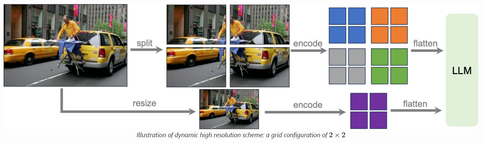
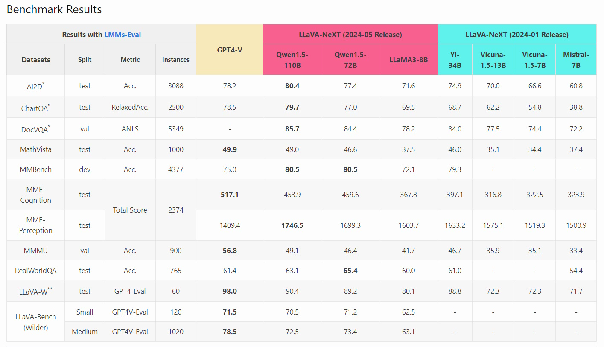

# LLaVA-NeXT in Action: Real-World Examples and Use Cases

## Overview of LLaVA-NeXT
LLaVA-NeXT is an advanced multimodal model designed to enhance the capabilities of image and text processing tasks. Developed as an improvement over its predecessor, LLaVA-1.5, LLaVA-NeXT focuses on enhanced reasoning, Optical Character Recognition (OCR), and world knowledge. This model was created by Haotian Liu, Chunyuan Li, Yuheng Li, Bo Li, Yuanhan Zhang, Sheng Shen, and Yong Jae Lee, and it incorporates several key enhancements that make it a powerful tool for various applications.



### Key Features and Improvements
1. **Higher Resolution Input:**
   - LLaVA-NeXT supports input image resolutions up to four times greater than LLaVA-1.5, capturing more visual details.
   - It supports three aspect ratios: up to 672x672, 336x1344, and 1344x336 resolution.
2. **Enhanced Visual Instruction Tuning:**
   - The model is trained on an improved visual instruction tuning dataset, which enhances its visual reasoning and OCR capabilities.
   - This improvement allows LLaVA-NeXT to understand and process complex visual information more accurately.
3. **Improved Visual Conversation Capabilities:**
   - LLaVA-NeXT is better equipped for visual conversation tasks, handling a wider range of scenarios and applications.
   - The model can interpret and generate more contextually relevant responses in visual dialogues.
4. **Better World Knowledge and Logical Reasoning:**
   - The model demonstrates enhanced logical reasoning and a deeper understanding of world knowledge.
   - This improvement makes LLaVA-NeXT more effective in tasks that require context-aware responses and detailed knowledge.
5. **Efficient Deployment and Inference:**
   - LLaVA-NeXT utilizes SGLang for efficient deployment and inference, maintaining a minimalist design and data efficiency.
   - Despite its advanced capabilities, the model is designed to be resource-efficient, using less than 1 million visual instruction tuning samples.
6. **Minimalist Design and Data Efficiency:**
   - The model reuses the pretrained connector from LLaVA-1.5, ensuring continuity and efficiency in its design.
   - The largest variant, 34B, can be trained in approximately one day using 32 A100 GPUs, showcasing its efficient training process.

<br/>

### Applications
LLaVA-NeXT is well-suited for a variety of real-world applications, including:
- **Image Captioning:** Automatically generating descriptive captions for images.
- **Visual Question Answering:** Answering questions based on the content of images.
- **Image Classification:** Identifying and classifying objects within images.
- **Custom Configurations:** Adapting the model configuration for specific tasks and requirements.
- **Fast Text Generation:** Utilizing advanced attention mechanisms like Flash-Attention 2 to speed up text generation.

By integrating higher resolution inputs, improved visual instruction tuning, and efficient deployment methods, LLaVA-NeXT sets a new standard for multimodal models. Its ability to handle complex visual and textual data makes it a valuable asset in the field of AI and machine learning.


## Introduction to HuggingFace's LLaVA-NeXT API
HuggingFace's LLaVA-NeXT API provides a powerful and flexible framework for leveraging the advanced capabilities of the LLaVA-NeXT model. This API includes several key components that facilitate the configuration, processing, and generation tasks involving multimodal data (images and text).

This table provides a quick overview of each class and its primary function within the LLaVA-NeXT API.
| Class Name                      | Description                                                                                                 |
|---------------------------------|-------------------------------------------------------------------------------------------------------------|
| `LlavaNextConfig`               | Stores the configuration for the LLaVA-NeXT model, including settings for vision and text backbones.         |
| `LlavaNextImageProcessor`       | Handles image preprocessing tasks such as resizing, cropping, rescaling, normalizing, and padding images.     |
| `LlavaNextProcessor`            | Combines `LlavaNextImageProcessor` and `LlamaTokenizerFast` for processing both images and text inputs.       |
| `LlavaNextForConditionalGeneration` | Defines the LLaVA-NeXT model integrating vision and language models, suitable for tasks like image captioning and visual question answering. |


## Example by Use Case
We provide 5 practical examples to help you learn the LLaVA-NeXT API, each demonstrating different capabilities of the model. By studying these examples, you will gain a comprehensive understanding of how to leverage the LLaVA-NeXT model for a variety of multimodal tasks, enhancing both your technical skills and the efficiency of your AI applications.

| Example                        | Description                                                                                     |
|--------------------------------|-------------------------------------------------------------------------------------------------|
| **Image Captioning**           | Generate a textual description of an image, accurately describing its content and context.      |
| **Visual Question Answering**  | Answer questions about an image by analyzing its content and providing relevant responses.      |
| **Image Classification**       | Identify and classify objects within an image, assigning them to predefined categories.         |
| **Customizing the Model Configuration** | Customize the LLaVA-NeXT model configuration to optimize performance for specific tasks by adjusting parameters like image size and vocabulary size. |
| **Using Flash-Attention 2 to Speed-Up Generation** | Enhance the speed of text generation by enabling Flash-Attention 2, allowing the model to handle larger sequences more efficiently. |


### 1. Image Captioning
This use case involves generating a textual description of an image. The LLaVA-NeXT model processes the image and produces a caption that accurately describes the content and context of the image.

```python
# Import necessary libraries
from transformers import LlavaNextProcessor, LlavaNextForConditionalGeneration
import torch
from PIL import Image
import requests

# selectable models
model_path = "llava-hf/llava-v1.6-34b-hf"
model_path = "llava-hf/llava-v1.6-vicuna-13b-hf"
model_path = "llava-hf/llava-v1.6-mistral-7b-hf"
model_path = "llava-hf/llava-v1.6-vicuna-7b-hf"

# Initialize processor and model
processor = LlavaNextProcessor.from_pretrained(model_path)
model = LlavaNextForConditionalGeneration.from_pretrained(model_path, torch_dtype=torch.float16, low_cpu_mem_usage=True)
model.to("cuda:0")

# Load image
url = "https://path/to/images/llava_v1_5_radar.jpg"
image = Image.open(requests.get(url, stream=True).raw)

# Define the prompt
prompt = "[INST] <image>\nWhat is shown in this image? [/INST]"

# Process the input
inputs = processor(prompt, image, return_tensors="pt").to("cuda:0")

# Generate the output
output = model.generate(**inputs, max_new_tokens=100)

# Decode and print the result
print(processor.decode(output[0], skip_special_tokens=True))
```

### 2. Visual Question Answering
In this scenario, the model is used to answer questions about an image. Given an image and a question related to its content, the model analyzes the image and provides a relevant answer.

```python
# Import necessary libraries
from transformers import LlavaNextProcessor, LlavaNextForConditionalGeneration
import torch
from PIL import Image
import requests

# selectable models
model_path = "llava-hf/llava-v1.6-34b-hf"
model_path = "llava-hf/llava-v1.6-vicuna-13b-hf"
model_path = "llava-hf/llava-v1.6-mistral-7b-hf"
model_path = "llava-hf/llava-v1.6-vicuna-7b-hf"

# Initialize processor and model
processor = LlavaNextProcessor.from_pretrained(model_path)
model = LlavaNextForConditionalGeneration.from_pretrained(model_path, torch_dtype=torch.float16, low_cpu_mem_usage=True)
model.to("cuda:0")

# Load image
url = "https://www.ilankelman.org/stopsigns/australia.jpg"
image = Image.open(requests.get(url, stream=True).raw)

# Define the prompt
prompt = "[INST] <image>\nWhat does the sign say? [/INST]"

# Process the input
inputs = processor(prompt, image, return_tensors="pt").to("cuda:0")

# Generate the output
output = model.generate(**inputs, max_new_tokens=100)

# Decode and print the result
print(processor.decode(output[0], skip_special_tokens=True))

```

### 3. Image Classification
This use case focuses on identifying and classifying objects within an image. The LLaVA-NeXT model is tasked with recognizing the object and assigning it to a predefined category.

```python
# Import necessary libraries
from transformers import LlavaNextProcessor, LlavaNextForConditionalGeneration
import torch
from PIL import Image
import requests

# selectable models
model_path = "llava-hf/llava-v1.6-34b-hf"
model_path = "llava-hf/llava-v1.6-vicuna-13b-hf"
model_path = "llava-hf/llava-v1.6-mistral-7b-hf"
model_path = "llava-hf/llava-v1.6-vicuna-7b-hf"

# Initialize processor and model
processor = LlavaNextProcessor.from_pretrained(model_path)
model = LlavaNextForConditionalGeneration.from_pretrained(model_path, torch_dtype=torch.float16, low_cpu_mem_usage=True)
model.to("cuda:0")

# Load image
url = "https://path/to/PNG_transparency_demonstration_1.png"
image = Image.open(requests.get(url, stream=True).raw)

# Define the prompt
prompt = "[INST] <image>\nClassify the object in the image. [/INST]"

# Process the input
inputs = processor(prompt, image, return_tensors="pt").to("cuda:0")

# Generate the output
output = model.generate(**inputs, max_new_tokens=100)

# Decode and print the result
print(processor.decode(output[0], skip_special_tokens=True))
```

### 4. Customizing the Model Configuration
Here, the goal is to customize the configuration of the LLaVA-NeXT model to better suit specific tasks. This involves adjusting parameters like image size, vocabulary size, activation functions, and more to optimize the model's performance for particular applications.

```python
from transformers import LlavaNextConfig, LlavaNextForConditionalGeneration
from transformers import CLIPVisionConfig, LlamaConfig

# Define custom configurations for vision and text backbones
vision_config = CLIPVisionConfig(image_size=512)  	# Customize the image size for the vision backbone
text_config = LlamaConfig(vocab_size=50257)  		# Customize the vocabulary size for the text backbone

# Initialize the configuration with custom parameters
custom_config = LlavaNextConfig(
    vision_config=vision_config,
    text_config=text_config,
    ignore_index=-1,  									# Custom ignore index for the loss function
    image_token_index=31000,  							# Custom image token index
    projector_hidden_act='relu',  						# Using 'relu' activation function for the multimodal projector
    vision_feature_select_strategy='full',  			# Using full vision features for selection
    vision_feature_layer=-1,  							# Select the last layer for vision features
    image_grid_pinpoints=[[512, 512], [1024, 1024]], 	# Custom resolutions for high-resolution images
    tie_word_embeddings=True  							# Tie the input and output word embeddings
)

# Initialize the LLaVA-NeXT model with the custom configuration
model = LlavaNextForConditionalGeneration(config=custom_config)

# Print out the configuration to verify
print(model.config)
```

### 5. Using Flash-Attention 2 to Speed-Up Generation
This use case demonstrates how to enhance the speed of text generation by enabling Flash-Attention 2. This optimization allows the model to handle larger sequences more efficiently, resulting in faster text generation and improved performance.

```python
from transformers import LlavaNextForConditionalGeneration
from transformers import LlavaNextProcessor
from PIL import Image
import requests
import torch

# Use Case: Speeding up text generation using Flash-Attention 2.
# It integrates a vision backbone and a language model and supports efficient configurations like Flash-Attention 2.

# selectable models
model_path = "llava-hf/llava-v1.6-34b-hf"
model_path = "llava-hf/llava-v1.6-vicuna-13b-hf"
model_path = "llava-hf/llava-v1.6-mistral-7b-hf"
model_path = "llava-hf/llava-v1.6-vicuna-7b-hf"

# Initialize processor
processor = LlavaNextProcessor.from_pretrained(model_path)

# Initialize the LLaVA-NeXT model with Flash-Attention 2 for faster generation
model = LlavaNextForConditionalGeneration.from_pretrained(
    model_path, 
    torch_dtype=torch.float16,  # Use float16 precision to save memory and increase speed
    low_cpu_mem_usage=True,  	# Optimize memory usage on the CPU
    use_flash_attention_2=True  # Enable Flash-Attention 2 for faster attention mechanisms
).to(0)  						# Move the model to the first GPU (if available)

# Example prompt for generating text
prompt = "[INST] <image>\nWhat is shown in this image? [/INST]"

# Load an example image
url = "https://path/to/images/llava_v1_5_radar.jpg"
image = Image.open(requests.get(url, stream=True).raw)

# Process the input (text and image)
inputs = processor(prompt, image, return_tensors="pt").to("cuda:0")

# Generate the output using the model with Flash-Attention 2
output = model.generate(**inputs, max_new_tokens=100)

# Decode and print the result
print(processor.decode(output[0], skip_special_tokens=True))
```

## Conclusion
LLaVA-NeXT represents a significant advancement in the realm of multimodal AI models, combining state-of-the-art visual and textual processing capabilities to address a wide range of real-world applications. Through the practical examples provided, we have demonstrated how to effectively utilize the LLaVA-NeXT API for tasks such as image captioning, visual question answering, and image classification. Additionally, we explored customizing the model configuration to meet specific needs and optimizing performance with Flash-Attention 2 for faster text generation.

These examples highlight the versatility and power of LLaVA-NeXT, showcasing its ability to handle complex multimodal tasks with efficiency and accuracy. By understanding and applying these use cases, users can harness the full potential of LLaVA-NeXT to develop innovative AI solutions that are both robust and efficient.

As you delve deeper into the capabilities of LLaVA-NeXT, you will find numerous opportunities to enhance your applications, whether in research, industry, or personal projects. The comprehensive yet user-friendly nature of the HuggingFace API makes it accessible for both beginners and experienced practitioners, paving the way for further advancements in the field of multimodal AI.


## References
- [LLaVA-NeXT Blog Post (2024-01-30)](https://llava-vl.github.io/blog/2024-01-30-llava-next/)
- [LLaVA-NeXT: A Strong Zero-shot Video Understanding Model](https://llava-vl.github.io/blog/2024-04-30-llava-next-video/)
- [LLaVA-NeXT: Stronger LLMs Supercharge Multimodal Capabilities in the Wild](https://llava-vl.github.io/blog/2024-05-10-llava-next-stronger-llms/)
- [HuggingFace Transformers Documentation for LLaVA-NeXT](https://huggingface.co/docs/transformers/model_doc/llava_next)
- [LLaVA GitHub Repository](https://github.com/haotian-liu/LLaVA/tree/main)
