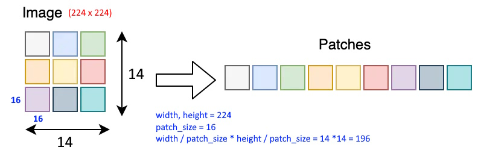

# Deep Dive into Vision Transformer (ViT)

## 1. Architecture of Vision Transformer

### Overview of Transformer Architecture
The Vision Transformer (ViT) applies the transformer model, originally designed for natural language processing tasks, to computer vision. The core idea is to divide an image into fixed-size patches, embed these patches into vectors, and then process these embeddings using a transformer encoder. This architecture leverages the self-attention mechanism, which allows the model to focus on different parts of the image, capturing long-range dependencies and complex patterns.


### Patch Embeddings
In the Vision Transformer, an image is first divided into a grid of non-overlapping patches. Each patch is flattened into a vector, and these vectors are linearly projected to a desired dimension. This projection step is equivalent to embedding the patches into a high-dimensional space, where each patch's position and features are encoded as vectors. This process transforms a 2D image into a sequence of 1D patch embeddings, akin to how words are embedded in NLP tasks.



### Positional Encodings
Since the transformer model does not inherently understand the order or position of the input patches, positional encodings are added to the patch embeddings. These encodings provide information about the position of each patch within the image. The positional encodings are typically learnable parameters that are added to the patch embeddings, ensuring that the model can distinguish between patches based on their spatial location.


### Transformer Encoder Layers
The transformer encoder layers form the heart of the Vision Transformer. Each encoder layer consists of a multi-head self-attention mechanism and a feed-forward neural network, both followed by layer normalization and residual connections. The self-attention mechanism allows the model to weigh the importance of each patch in relation to every other patch, capturing complex dependencies across the entire image. The feed-forward network further processes these dependencies, refining the patch representations.


### Classification Head
After processing the patch embeddings through the transformer encoder layers, the output is fed into a classification head. The classification head typically consists of a fully connected layer that maps the final output embeddings to the desired number of classes. In the case of the Vision Transformer, a special classification token is appended to the sequence of patch embeddings at the beginning, which interacts with all other patches through the transformer layers. The final representation of this classification token is used for predicting the class of the input image.

This architecture leverages the strengths of transformers in capturing long-range dependencies and complex interactions, making it highly effective for various vision tasks. The modularity and scalability of the Vision Transformer also make it a versatile choice for future advancements in computer vision.

## 2. Main Classes of Vision Transformer
The table provides a concise overview of the key classes in the Vision Transformer model, detailing their roles and functionalities. The `DropPath` class enhances model regularization by randomly dropping paths during training, while the `Attention` class implements multi-head self-attention to capture long-range dependencies in the input data. The `LayerScale` class introduces a learnable scaling parameter to stabilize training, and the `Block` class defines a transformer block combining self-attention and multi-layer perceptron (MLP) components. The `Mlp` class outlines the structure of a multi-layer perceptron used within transformer blocks. Finally, the `VisionTransformer` class integrates all these components to form the Vision Transformer model, managing the full pipeline from input preprocessing to final classification.

Sure, here's a detailed table explaining each class:

| **Class**             | **Description**                                                      |
|-----------------------|----------------------------------------------------------------------|
| **`DropPath` Class**  | Regularizes the model by randomly dropping entire paths during training. This technique, known as Stochastic Depth, helps in preventing overfitting and improves model generalization. It is applied per sample, scaling the output by the keep probability to maintain the overall scaling. |
| **`Attention` Class** | Implements the multi-head self-attention mechanism used in transformers. This class projects the input tensor into queries, keys, and values, computes scaled dot-product attention, and applies dropout and a final linear projection. This mechanism allows the model to focus on different parts of the input image, capturing long-range dependencies. |
| **`LayerScale` Class**| Applies a learnable scaling parameter to the input tensor. It optionally performs this scaling in place. Layer scaling can help stabilize training and improve model performance by providing a mechanism to control the magnitude of features in the network. |
| **`Block` Class**     | Defines a transformer block, which consists of a multi-head self-attention (MSA) layer followed by a multi-layer perceptron (MLP). Each component is surrounded by layer normalization and residual connections. This block is the core unit of the transformer encoder, enabling the model to learn complex patterns and dependencies in the input data. |
| **`Mlp` Class**       | Defines a multi-layer perceptron (MLP), which typically includes two fully connected layers with a non-linear activation function (such as GELU) in between. Dropout and optional normalization are also applied. The MLP processes the outputs of the self-attention layers, contributing to the model's capacity to learn and represent complex features. |
| **`VisionTransformer` Class** | Implements the Vision Transformer model, which includes patch embedding, positional encoding, a stack of transformer encoder blocks, and a classification head. This class orchestrates the entire forward pass, from dividing the input image into patches to producing the final classification output. It encapsulates the architecture and operations required to apply transformers to vision tasks. |

### class DropPath
This class implements stochastic depth, a regularization technique that drops entire residual branches during training. 

- **Initialization (`__init__`):** 
  - `drop_prob`: The probability of dropping a path.
  - `scale_by_keep`: If `True`, the output is scaled by the keep probability to maintain the overall scaling.

- **Forward Method (`forward`):** 
  - Applies the `drop_path` function, which probabilistically drops paths during training. 

```python
class DropPath(nn.Module):
    """
    Drop paths (Stochastic Depth) per sample when applied in the main path of residual blocks.

    This module randomly drops entire paths during training to regularize the model. The dropping is done per sample.

    Args:
        drop_prob: The probability of dropping a path.
        scale_by_keep: If True, scale the output by the keep probability to maintain the overall scaling.
    """
    def __init__(self, drop_prob: float = 0., scale_by_keep: bool = True):
        super(DropPath, self).__init__()
        self.drop_prob = drop_prob
        self.scale_by_keep = scale_by_keep

    def forward(self, x):
        """
        Forward pass through the DropPath module.

        Args:
            x: Input tensor of shape (B, *).

        Returns:
            Tensor of shape (B, *) with dropped paths.
        """
        return drop_path(x, self.drop_prob, self.training, self.scale_by_keep)  # Shape: (B, *)

    def extra_repr(self):
        """
        Extra representation for the DropPath module to show in the print statement.
        """
        return f'drop_prob={round(self.drop_prob,3):0.3f}'
```

### class Attention
This class implements multi-head self-attention (MHSA) used in Vision Transformers.

- **Initialization (`__init__`):** 
  - Initializes various parameters like `dim`, `num_heads`, `qkv_bias`, `qk_norm`, `attn_drop`, and `proj_drop`.
  - Creates layers for QKV projections, normalization, dropout, and final projection.

- **Forward Method (`forward`):** 
  - Takes input tensor `x` of shape `(B, N, C)`.
  - Projects `x` into queries, keys, and values (QKV).
  - Applies attention mechanism and normalization if `qk_norm` is enabled.
  - Computes scaled dot-product attention if `fused_attn` is enabled.
  - Reshapes and projects the output.

```python
class Attention(nn.Module):
    """
    Multi-Head Self-Attention (MHSA) module for Vision Transformer.

    This module applies self-attention to the input tensor. It consists of QKV (Query, Key, Value) projections,
    normalization layers, attention dropout, and a final projection with dropout.

    Args:
        dim: The input and output dimension of the attention layer.
        num_heads: The number of attention heads.
        qkv_bias: If True, add bias to the QKV projections.
        qk_norm: If True, apply normalization to Q and K.
        attn_drop: Dropout rate for the attention layers.
        proj_drop: Dropout rate for the projection layers.
        norm_layer: The normalization layer to use.
    """
    fused_attn: Final[bool]

    def __init__(
            self,
            dim: int,
            num_heads: int = 8,
            qkv_bias: bool = False,
            qk_norm: bool = False,
            attn_drop: float = 0.,
            proj_drop: float = 0.,
            norm_layer: nn.Module = nn.LayerNorm,
    ) -> None:
        super().__init__()
        assert dim % num_heads == 0, 'dim should be divisible by num_heads'
        self.num_heads = num_heads
        self.head_dim = dim // num_heads
        self.scale = self.head_dim ** -0.5  # Scaling factor for QK
        self.fused_attn = use_fused_attn()  # Determine if fused attention is used

        self.qkv = nn.Linear(dim, dim * 3, bias=qkv_bias)  # Linear layer for QKV projection, Shape: (B, N, dim * 3)
        self.q_norm = norm_layer(self.head_dim) if qk_norm else nn.Identity()  # Q normalization layer
        self.k_norm = norm_layer(self.head_dim) if qk_norm else nn.Identity()  # K normalization layer
        self.attn_drop = nn.Dropout(attn_drop)  # Dropout layer for attention
        self.proj = nn.Linear(dim, dim)  # Linear layer for output projection, Shape: (B, N, dim)
        self.proj_drop = nn.Dropout(proj_drop)  # Dropout layer for output projection

    def forward(self, x: torch.Tensor) -> torch.Tensor:
        """
        Forward pass through the attention layer.

        Args:
            x: Input tensor of shape (B, N, C), where B is the batch size, N is the sequence length, and C is the feature dimension.

        Returns:
            Output tensor of shape (B, N, C).
        """
        B, N, C = x.shape  # Input shape
        qkv = self.qkv(x).reshape(B, N, 3, self.num_heads, self.head_dim).permute(2, 0, 3, 1, 4)  # Shape: (3, B, num_heads, N, head_dim)
        q, k, v = qkv.unbind(0)  # Shape of q, k, v: (B, num_heads, N, head_dim)
        q, k = self.q_norm(q), self.k_norm(k)  # Apply normalization to Q and K if enabled

        if self.fused_attn:
            x = F.scaled_dot_product_attention(
                q, k, v,
                dropout_p=self.attn_drop.p if self.training else 0.,
            )  # Shape: (B, num_heads, N, head_dim)
        else:
            q = q * self.scale  # Scale Q
            attn = q @ k.transpose(-2, -1)  # Compute attention scores, Shape: (B, num_heads, N, N)
            attn = attn.softmax(dim=-1)  # Apply softmax to get attention weights
            attn = self.attn_drop(attn)  # Apply dropout to attention weights
            x = attn @ v  # Compute attention output, Shape: (B, num_heads, N, head_dim)

        x = x.transpose(1, 2).reshape(B, N, C)  # Reshape to (B, N, C)
        x = self.proj(x)  # Apply output projection, Shape: (B, N, C)
        x = self.proj_drop(x)  # Apply dropout to output
        return x  # Output shape: (B, N, C)
```

### class LayerScale
This class scales the input tensor by a learnable parameter, useful for stabilizing training in Vision Transformers.

- **Initialization (`__init__`):** 
  - Initializes `gamma`, the learnable scaling parameter.
  - `inplace`: If `True`, modifies the input tensor in place.

- **Forward Method (`forward`):** 
  - Scales the input tensor `x` by `gamma`.

```python
class LayerScale(nn.Module):
    """
    LayerScale module for Vision Transformer.

    This module scales the input tensor by a learnable parameter. It can be applied in place or return a new tensor.

    Args:
        dim: The dimension of the input tensor.
        init_values: Initial values for the scaling parameter.
        inplace: If True, modifies the input tensor in place. Otherwise, returns a new tensor.
    """
    def __init__(
            self,
            dim: int,
            init_values: float = 1e-5,
            inplace: bool = False,
    ) -> None:
        super().__init__()
        self.inplace = inplace
        # Initialize the scaling parameter gamma with the specified initial values
        self.gamma = nn.Parameter(init_values * torch.ones(dim))  # Shape: (dim,)

    def forward(self, x: torch.Tensor) -> torch.Tensor:
        """
        Forward pass through the LayerScale module.

        Args:
            x: Input tensor of shape (B, num_patches, dim).

        Returns:
            Scaled tensor of shape (B, num_patches, dim).
        """
        # Scale the input tensor by gamma, either in place or returning a new tensor
        return x.mul_(self.gamma) if self.inplace else x * self.gamma  # Shape: (B, num_patches, dim)
```

### class Block
This class defines a transformer block, consisting of a multi-head self-attention (MSA) layer and a multi-layer perceptron (MLP) layer.

- **Initialization (`__init__`):** 
  - Initializes layers for normalization, attention, MLP, layer scaling, and stochastic depth.

- **Forward Method (`forward`):** 
  - Applies MSA with residual connection.
  - Applies MLP with residual connection.

```python
class Block(nn.Module):
    """
    Transformer Block for Vision Transformer.

    This block consists of a multi-head self-attention (MSA) layer and a multi-layer perceptron (MLP) layer.
    It also includes normalization layers, residual connections, and optional layer scaling and stochastic depth.

    Args:
        dim: The input and output dimension of the transformer block.
        num_heads: The number of attention heads.
        mlp_ratio: The ratio of the hidden dimension of the MLP to the input dimension.
        qkv_bias: If True, add bias to the QKV projections.
        qk_norm: If True, apply normalization to Q and K.
        proj_drop: Dropout rate for the projection layers.
        attn_drop: Dropout rate for the attention layers.
        init_values: Initial values for layer scaling.
        drop_path: Dropout rate for the stochastic depth.
        act_layer: The activation layer to use in the MLP.
        norm_layer: The normalization layer to use.
        mlp_layer: The MLP layer to use.
    """
    def __init__(
            self,
            dim: int,
            num_heads: int,
            mlp_ratio: float = 4.,
            qkv_bias: bool = False,
            qk_norm: bool = False,
            proj_drop: float = 0.,
            attn_drop: float = 0.,
            init_values: Optional[float] = None,
            drop_path: float = 0.,
            act_layer: nn.Module = nn.GELU,
            norm_layer: nn.Module = nn.LayerNorm,
            mlp_layer: nn.Module = Mlp,
    ) -> None:
        super().__init__()
        self.norm1 = norm_layer(dim)  # Shape: (B, num_patches, dim)
        self.attn = Attention(
            dim,
            num_heads=num_heads,
            qkv_bias=qkv_bias,
            qk_norm=qk_norm,
            attn_drop=attn_drop,
            proj_drop=proj_drop,
            norm_layer=norm_layer,
        )  # Shape: (B, num_patches, dim)
        self.ls1 = LayerScale(dim, init_values=init_values) if init_values else nn.Identity()
        self.drop_path1 = DropPath(drop_path) if drop_path > 0. else nn.Identity()

        self.norm2 = norm_layer(dim)  # Shape: (B, num_patches, dim)
        self.mlp = mlp_layer(
            in_features=dim,
            hidden_features=int(dim * mlp_ratio),  # Shape: (B, num_patches, dim * mlp_ratio)
            act_layer=act_layer,
            drop=proj_drop,
        )  # Shape: (B, num_patches, dim)
        self.ls2 = LayerScale(dim, init_values=init_values) if init_values else nn.Identity()
        self.drop_path2 = DropPath(drop_path) if drop_path > 0. else nn.Identity()

    def forward(self, x: torch.Tensor) -> torch.Tensor:
        """
        Forward pass through the transformer block.

        Args:
            x: Input tensor of shape (B, num_patches, dim).

        Returns:
            Output tensor of shape (B, num_patches, dim).
        """
        # Apply MSA with residual connection
        x = x + self.drop_path1(self.ls1(self.attn(self.norm1(x))))  # Shape: (B, num_patches, dim)
        # Apply MLP with residual connection
        x = x + self.drop_path2(self.ls2(self.mlp(self.norm2(x))))  # Shape: (B, num_patches, dim)
        return x
```

### class Mlp
This class defines a multi-layer perceptron used in Vision Transformers and related networks.

- **Initialization (`__init__`):** 
  - Initializes layers for linear projections, activation, dropout, and normalization.

- **Forward Method (`forward`):** 
  - Applies the layers in sequence: linear projection, activation, dropout, normalization, and another linear projection.

```python
class Mlp(nn.Module):
    """ MLP (Multi-Layer Perceptron) as used in Vision Transformer, MLP-Mixer and related networks
    """
    def __init__(
            self,
            in_features,
            hidden_features=None,
            out_features=None,
            act_layer=nn.GELU,
            norm_layer=None,
            bias=True,
            drop=0.,
            use_conv=False,
    ):
        """
        Args:
            in_features: Size of each input sample.
            hidden_features: Size of the hidden layer. Defaults to in_features if not provided.
            out_features: Size of each output sample. Defaults to in_features if not provided.
            act_layer: Activation layer to use. Default is GELU.
            norm_layer: Normalization layer to use. Default is None.
            bias: If set to True, adds a learnable bias to the output. Can be a boolean or a tuple of booleans.
            drop: Dropout probability. Can be a float or a tuple of floats.
            use_conv: If set to True, uses Conv2d for the linear layer.
        """
        super().__init__()
        out_features = out_features or in_features
        hidden_features = hidden_features or in_features
        bias = to_2tuple(bias)
        drop_probs = to_2tuple(drop)
        linear_layer = partial(nn.Conv2d, kernel_size=1) if use_conv else nn.Linear

        self.fc1 = linear_layer(in_features, hidden_features, bias=bias[0])  # Shape: (B, hidden_features)
        self.act = act_layer()  # Activation layer
        self.drop1 = nn.Dropout(drop_probs[0])  # Dropout layer
        self.norm = norm_layer(hidden_features) if norm_layer is not None else nn.Identity()  # Normalization layer
        self.fc2 = linear_layer(hidden_features, out_features, bias=bias[1])  # Shape: (B, out_features)
        self.drop2 = nn.Dropout(drop_probs[1])  # Dropout layer

    def forward(self, x):
        """
        Forward pass through the MLP.

        Args:
            x: Input tensor of shape (B, in_features).

        Returns:
            Output tensor of shape (B, out_features).
        """
        x = self.fc1(x)  # Shape: (B, hidden_features)
        x = self.act(x)  # Shape: (B, hidden_features)
        x = self.drop1(x)  # Shape: (B, hidden_features)
        x = self.norm(x)  # Shape: (B, hidden_features)
        x = self.fc2(x)  # Shape: (B, out_features)
        x = self.drop2(x)  # Shape: (B, out_features)
        return x
```

### class VisionTransformer
This class defines the Vision Transformer model.

- **Initialization (`__init__`):** 
  - Initializes various parameters and layers, including patch embedding, class tokens, position embeddings, transformer blocks, normalization layers, and classifier head.

- **`forward_intermediates` Method:** 
  - Computes intermediate features for visualization or further processing.

- **`forward_features` Method:** 
  - Computes features by applying patch embedding, position embedding, and transformer blocks.

- **`forward_head` Method:** 
  - Applies the classifier head to the features.

- **`forward` Method:** 
  - Combines `forward_features` and `forward_head` to compute the final output.

```python
class VisionTransformer(nn.Module):
    """ Vision Transformer

    A PyTorch implementation of : `An Image is Worth 16x16 Words: Transformers for Image Recognition at Scale`
        - https://arxiv.org/abs/2010.11929
    """
    dynamic_img_size: Final[bool]

    def __init__(
            self,
            img_size: Union[int, Tuple[int, int]] = 224,
            patch_size: Union[int, Tuple[int, int]] = 16,
            in_chans: int = 3,
            num_classes: int = 1000,
            global_pool: Literal['', 'avg', 'token', 'map'] = 'token',
            embed_dim: int = 768,
            depth: int = 12,
            num_heads: int = 12,
            mlp_ratio: float = 4.,
            qkv_bias: bool = True,
            qk_norm: bool = False,
            init_values: Optional[float] = None,
            class_token: bool = True,
            pos_embed: str = 'learn',
            no_embed_class: bool = False,
            reg_tokens: int = 0,
            pre_norm: bool = False,
            fc_norm: Optional[bool] = None,
            dynamic_img_size: bool = False,
            dynamic_img_pad: bool = False,
            drop_rate: float = 0.,
            pos_drop_rate: float = 0.,
            patch_drop_rate: float = 0.,
            proj_drop_rate: float = 0.,
            attn_drop_rate: float = 0.,
            drop_path_rate: float = 0.,
            weight_init: Literal['skip', 'jax', 'jax_nlhb', 'moco', ''] = '',
            fix_init: bool = False,
            embed_layer: Callable = PatchEmbed,
            norm_layer: Optional[LayerType] = None,
            act_layer: Optional[LayerType] = None,
            block_fn: Type[nn.Module] = Block,
            mlp_layer: Type[nn.Module] = Mlp,
    ) -> None:
        """
        Args:
            img_size: Input image size.
            patch_size: Patch size.
            in_chans: Number of image input channels.
            num_classes: Number of classes for classification head.
            global_pool: Type of global pooling for the final sequence (default: 'token').
            embed_dim: Transformer embedding dimension.
            depth: Depth of transformer (number of layers).
            num_heads: Number of attention heads.
            mlp_ratio: Ratio of MLP hidden dim to embedding dim.
            qkv_bias: Enable bias for qkv projections if True.
            qk_norm: Apply normalization to Q and K if True.
            init_values: Layer-scale init values (layer-scale enabled if not None).
            class_token: Use class token.
            pos_embed: Type of position embedding. Options are '', 'none', 'learn'.
            no_embed_class: Don't include position embeddings for class (or reg) tokens.
            reg_tokens: Number of register tokens.
            fc_norm: Apply norm layer to final sequence before head if True.
            drop_rate: Dropout rate for the head.
            pos_drop_rate: Dropout rate for the position embedding.
            patch_drop_rate: Dropout rate for the patches.
            proj_drop_rate: Dropout rate for the projections.
            attn_drop_rate: Dropout rate for the attention.
            drop_path_rate: Stochastic depth rate.
            weight_init: Weight initialization scheme.
            fix_init: Apply weight initialization fix (scaling with layer index).
            embed_layer: Patch embedding layer.
            norm_layer: Normalization layer.
            act_layer: MLP activation layer.
            block_fn: Transformer block layer.
        """
        super().__init__()
        assert global_pool in ('', 'avg', 'token', 'map')
        assert class_token or global_pool != 'token'
        assert pos_embed in ('', 'none', 'learn')
        use_fc_norm = global_pool == 'avg' if fc_norm is None else fc_norm
        norm_layer = get_norm_layer(norm_layer) or partial(nn.LayerNorm, eps=1e-6)
        act_layer = get_act_layer(act_layer) or nn.GELU

        self.num_classes = num_classes
        self.global_pool = global_pool
        self.num_features = self.head_hidden_size = self.embed_dim = embed_dim  # for consistency with other models
        self.num_prefix_tokens = 1 if class_token else 0
        self.num_prefix_tokens += reg_tokens
        self.num_reg_tokens = reg_tokens
        self.has_class_token = class_token
        self.no_embed_class = no_embed_class  # don't embed prefix positions (includes reg)
        self.dynamic_img_size = dynamic_img_size
        self.grad_checkpointing = False

        embed_args = {}
        if dynamic_img_size:
            # Flatten deferred until after pos embed
            embed_args.update(dict(strict_img_size=False, output_fmt='NHWC'))
        self.patch_embed = embed_layer(
            img_size=img_size,
            patch_size=patch_size,
            in_chans=in_chans,
            embed_dim=embed_dim,
            bias=not pre_norm,  # Disable bias if pre-norm is used (e.g. CLIP)
            dynamic_img_pad=dynamic_img_pad,
            **embed_args,
        )
        num_patches = self.patch_embed.num_patches  # Shape: (B, num_patches, embed_dim)
        reduction = self.patch_embed.feat_ratio() if hasattr(self.patch_embed, 'feat_ratio') else patch_size

        # Class token and positional embeddings
        self.cls_token = nn.Parameter(torch.zeros(1, 1, embed_dim)) if class_token else None            # Shape: (1, 1, embed_dim)
        self.reg_token = nn.Parameter(torch.zeros(1, reg_tokens, embed_dim)) if reg_tokens else None    # Shape: (1, reg_tokens, embed_dim)
        embed_len = num_patches if no_embed_class else num_patches + self.num_prefix_tokens
        if not pos_embed or pos_embed == 'none':
            self.pos_embed = None
        else:
            self.pos_embed = nn.Parameter(torch.randn(1, embed_len, embed_dim) * .02)  # Shape: (1, embed_len, embed_dim)
        self.pos_drop = nn.Dropout(p=pos_drop_rate)
        if patch_drop_rate > 0:
            self.patch_drop = PatchDropout(
                patch_drop_rate,
                num_prefix_tokens=self.num_prefix_tokens,
            )
        else:
            self.patch_drop = nn.Identity()
        self.norm_pre = norm_layer(embed_dim) if pre_norm else nn.Identity()

        # Stochastic depth decay rule
        dpr = [x.item() for x in torch.linspace(0, drop_path_rate, depth)]
        self.blocks = nn.Sequential(*[
            block_fn(
                dim=embed_dim,
                num_heads=num_heads,
                mlp_ratio=mlp_ratio,
                qkv_bias=qkv_bias,
                qk_norm=qk_norm,
                init_values=init_values,
                proj_drop=proj_drop_rate,
                attn_drop=attn_drop_rate,
                drop_path=dpr[i],
                norm_layer=norm_layer,
                act_layer=act_layer,
                mlp_layer=mlp_layer,
            )
            for i in range(depth)]) # Shape of each block: (B, num_patches + num_prefix_tokens, embed_dim)
        self.feature_info = [
            dict(module=f'blocks.{i}', num_chs=embed_dim, reduction=reduction) for i in range(depth)]
        self.norm = norm_layer(embed_dim) if not use_fc_norm else nn.Identity()

        # Classifier Head
        if global_pool == 'map':
            self.attn_pool = AttentionPoolLatent(
                self.embed_dim,
                num_heads=num_heads,
                mlp_ratio=mlp_ratio,
                norm_layer=norm_layer,
            )
        else:
            self.attn_pool = None
        self.fc_norm = norm_layer(embed_dim) if use_fc_norm else nn.Identity()
        self.head_drop = nn.Dropout(drop_rate)
        self.head = nn.Linear(self.embed_dim, num_classes) if num_classes > 0 else nn.Identity()

        if weight_init != 'skip':
            self.init_weights(weight_init)
        if fix_init:
            self.fix_init_weight()
    def fix_init_weight(self):
        """
        Fix initialization weight by scaling with layer index.

        This function rescales the initialization weight of the attention projection and the MLP fully connected layer
        in each layer of the transformer model. The rescaling is done by dividing the weight by the square root of
        2 times the layer index.

        Args:
            self: The instance of the transformer model.

        Returns:
            None
        """
        def rescale(param, _layer_id):
            param.div_(math.sqrt(2.0 * _layer_id))

        for layer_id, layer in enumerate(self.blocks):
            rescale(layer.attn.proj.weight.data, layer_id + 1)
            rescale(layer.mlp.fc2.weight.data, layer_id + 1)

    def init_weights(self, mode: str = '') -> None:
        """
        Initializes the weights of the model.

        Args:
            mode (str): The mode for weight initialization. Defaults to an empty string.

        Returns:
            None
        """
        # Initialize weights
        assert mode in ('jax', 'jax_nlhb', 'moco', '')
        head_bias = -math.log(self.num_classes) if 'nlhb' in mode else 0.
        if self.pos_embed is not None:
            trunc_normal_(self.pos_embed, std=.02)
        if self.cls_token is not None:
            nn.init.normal_(self.cls_token, std=1e-6)
        named_apply(get_init_weights_vit(mode, head_bias), self)

    def _init_weights(self, m: nn.Module) -> None:
        # Compatibility function for downstream users
        # ViT weight initialization, original timm impl (for reproducibility)
        init_weights_vit_timm(m)

    @torch.jit.ignore()
    def load_pretrained(self, checkpoint_path: str, prefix: str = '') -> None:
        # Load weights from .npz checkpoints for official Google Brain Flax implementation.
        _load_weights(self, checkpoint_path, prefix)

    @torch.jit.ignore
    def no_weight_decay(self) -> Set:
        # Specify parameters that should not use weight decay
        return {'pos_embed', 'cls_token', 'dist_token'}

    @torch.jit.ignore
    def group_matcher(self, coarse: bool = False) -> Dict:
        """
        Matches groups based on a given condition.

        Args:
            coarse (bool): If True, performs a coarse-grained matching. Defaults to False.

        Returns:
            Dict: A dictionary containing the matched groups.

        """
        # Group matcher for optimizer
        return dict(
            stem=r'^cls_token|pos_embed|patch_embed',  # Stem and embed
            blocks=[(r'^blocks\.(\d+)', None), (r'^norm', (99999,))]
        )

    @torch.jit.ignore
    def set_grad_checkpointing(self, enable: bool = True) -> None:
        """
        Enable or disable gradient checkpointing for the model.

        Args:
            enable (bool, optional): Whether to enable gradient checkpointing. Defaults to True.
        """
        # Enable gradient checkpointing
        self.grad_checkpointing = enable
        if hasattr(self.patch_embed, 'set_grad_checkpointing'):
            self.patch_embed.set_grad_checkpointing(enable)

    @torch.jit.ignore
    def get_classifier(self) -> nn.Module:
        # Return classifier head
        return self.head

    def reset_classifier(self, num_classes: int, global_pool=None) -> None:
        """
        Resets the classifier of the model.

        Args:
            num_classes (int): The number of output classes for the classifier.
            global_pool (Optional): The global pooling method to be used. Defaults to None.

        Returns:
            None
        """
        # Reset classifier head
        self.num_classes = num_classes
        if global_pool is not None:
            assert global_pool in ('', 'avg', 'token', 'map')
            if global_pool == 'map' and self.attn_pool is None:
                assert False, "Cannot currently add attention pooling in reset_classifier()."
            elif global_pool != 'map ' and self.attn_pool is not None:
                self.attn_pool = None  # Remove attention pooling
            self.global_pool = global_pool
        self.head = nn.Linear(self.embed_dim, num_classes) if num_classes > 0 else nn.Identity()

    def _pos_embed(self, x: torch.Tensor) -> torch.Tensor:
        """
        Adds positional embeddings to the input tensor.

        Args:
            x (torch.Tensor): The input tensor.

        Returns:
            torch.Tensor: The input tensor with positional embeddings added.
        """
        # Add position embeddings to input tensor
        # Input shape: (B, C, H, W) if self.dynamic_img_size else (B, num_patches, embed_dim)
        
        if self.pos_embed is None:
            # If no position embeddings, flatten the spatial dimensions and return
            return x.view(x.shape[0], -1, x.shape[-1])  # Shape: (B, num_patches, embed_dim)

        if self.dynamic_img_size:
            # If dynamic image size is enabled, get the shape of x
            B, H, W, C = x.shape  # Shape: (B, H, W, C)
            # Resample position embeddings to match the input image size
            pos_embed = resample_abs_pos_embed(
                self.pos_embed,
                (H, W),
                num_prefix_tokens=0 if self.no_embed_class else self.num_prefix_tokens,
            )
            x = x.view(B, -1, C)  # Shape: (B, H*W, C)
        else:
            pos_embed = self.pos_embed  # Shape: (1, num_patches + num_prefix_tokens, embed_dim)

        to_cat = []
        if self.cls_token is not None:
            to_cat.append(self.cls_token.expand(x.shape[0], -1, -1))  # Shape: (B, 1, embed_dim)
        if self.reg_token is not None:
            to_cat.append(self.reg_token.expand(x.shape[0], -1, -1))  # Shape: (B, num_reg_tokens, embed_dim)

        if self.no_embed_class:
            # If no position embeddings for class tokens, add position embeddings and then concatenate
            x = x + pos_embed  # Shape: (B, num_patches, embed_dim)
            if to_cat:
                x = torch.cat(to_cat + [x], dim=1)  # Shape: (B, num_prefix_tokens + num_patches, embed_dim)
        else:
            # Concatenate class tokens and then add position embeddings
            if to_cat:
                x = torch.cat(to_cat + [x], dim=1)  # Shape: (B, num_prefix_tokens + num_patches, embed_dim)
            x = x + pos_embed  # Shape: (B, num_prefix_tokens + num_patches, embed_dim)

        return self.pos_drop(x)  # Shape: (B, num_prefix_tokens + num_patches, embed_dim)

    def forward_intermediates(
            self,
            x: torch.Tensor,
            indices: Optional[Union[int, List[int], Tuple[int]]] = None,
            return_prefix_tokens: bool = False,
            norm: bool = False,
            stop_early: bool = False,
            output_fmt: str = 'NCHW',
            intermediates_only: bool = False,
    ) -> Union[List[torch.Tensor], Tuple[torch.Tensor, List[torch.Tensor]]]:
        """ Forward features that returns intermediates.

        Args:
            x: Input image tensor
            indices: Take last n blocks if int, all if None, select matching indices if sequence
            return_prefix_tokens: Return both prefix and spatial intermediate tokens
            norm: Apply norm layer to all intermediates
            stop_early: Stop iterating over blocks when last desired intermediate hit
            output_fmt: Shape of intermediate feature outputs
            intermediates_only: Only return intermediate features
        Returns:
            Intermediates and optionally final features
        """
        assert output_fmt in ('NCHW', 'NLC'), 'Output format must be one of NCHW or NLC.'
        reshape = output_fmt == 'NCHW'
        intermediates = []
        take_indices, max_index = feature_take_indices(len(self.blocks), indices)

        # Forward pass
        B, _, height, width = x.shape   # Input shape: (B, C, H, W)
        x = self.patch_embed(x)         # Shape: (B, num_patches, embed_dim)
        x = self._pos_embed(x)          # Shape: (B, num_patches + num_prefix_tokens, embed_dim)
        x = self.patch_drop(x)          # Shape: (B, num_patches + num_prefix_tokens, embed_dim)
        x = self.norm_pre(x)            # Shape: (B, num_patches + num_prefix_tokens, embed_dim)

        if torch.jit.is_scripting() or not stop_early:  # Can't slice blocks in torchscript
            blocks = self.blocks
        else:
            blocks = self.blocks[:max_index + 1]
        for i, blk in enumerate(blocks):
            x = blk(x)  # Shape: (B, num_patches + num_prefix_tokens, embed_dim)
            if i in take_indices:
                # Normalize intermediates with final norm layer if enabled
                intermediates.append(self.norm(x) if norm else x)  # Shape: (B, num_patches + num_prefix_tokens, embed_dim)

        # Process intermediates
        if self.num_prefix_tokens:
            # Split prefix (e.g., class, distill) and spatial feature tokens
            prefix_tokens = [y[:, 0:self.num_prefix_tokens] for y in intermediates]     # Shape: (B, num_prefix_tokens, embed_dim)
            intermediates = [y[:, self.num_prefix_tokens:] for y in intermediates]      # Shape: (B, num_patches, embed_dim)
        if reshape:
            # Reshape to BCHW output format
            H, W = self.patch_embed.dynamic_feat_size((height, width))
            intermediates = [y.reshape(B, H, W, -1).permute(0, 3, 1, 2).contiguous() for y in intermediates]  # Shape: (B, embed_dim, H, W)
        if not torch.jit.is_scripting() and return_prefix_tokens:
            # Return prefix not supported in torchscript due to poor type handling
            intermediates = list(zip(intermediates, prefix_tokens))  # Shape: List of tuples [(spatial_tokens, prefix_tokens), ...]

        if intermediates_only:
            return intermediates

        x = self.norm(x)  # Shape: (B, num_patches + num_prefix_tokens, embed_dim)

        return x, intermediates  # Shapes: (B, num_patches + num_prefix_tokens, embed_dim), List of (B, num_patches, embed_dim)

    def prune_intermediate_layers(
            self,
            indices: Union[int, List[int], Tuple[int]] = 1,
            prune_norm: bool = False,
            prune_head: bool = True,
    ):
        """ Prune layers not required for specified intermediates. """
        take_indices, max_index = feature_take_indices(len(self.blocks), indices)
        self.blocks = self.blocks[:max_index + 1]  # Truncate blocks
        if prune_norm:
            self.norm = nn.Identity()  # No normalization
        if prune_head:
            self.fc_norm = nn.Identity()  # No normalization in head
            self.reset_classifier(0, '')  # Reset classifier head
        return take_indices

    def get_intermediate_layers(
            self,
            x: torch.Tensor,
            n: Union[int, List[int], Tuple[int]] = 1,
            reshape: bool = False,
            return_prefix_tokens: bool = False,
            norm: bool = False,
    ) -> List[torch.Tensor]:
        """ Intermediate layer accessor inspired by DINO / DINOv2 interface.
            
            NOTE: 
            This API is for backwards compatibility, favour using forward_intermediates() directly.
        """
        return self.forward_intermediates(
            x, n,
            return_prefix_tokens=return_prefix_tokens,
            norm=norm,
            output_fmt='NCHW' if reshape else 'NLC',
            intermediates_only=True,
        )

    def forward_features(self, x: torch.Tensor) -> torch.Tensor:
        """
        Applies the forward pass of the model on the input tensor `x` and returns the output tensor.

        Args:
            x (torch.Tensor): The input tensor to the model.

        Returns:
            torch.Tensor: The output tensor after applying the forward pass.
        """
        # Forward features
        B, C, H, W = x.shape  # Input shape: (B, C, H, W)
        x = self.patch_embed(x)  # Shape: (B, num_patches, embed_dim)
        x = self._pos_embed(x)  # Shape: (B, num_patches + num_prefix_tokens, embed_dim)
        x = self.patch_drop(x)  # Shape: (B, num_patches + num_prefix_tokens, embed_dim)
        x = self.norm_pre(x)  # Shape: (B, num_patches + num_prefix_tokens, embed_dim)
        if self.grad_checkpointing and not torch.jit.is_scripting():
            x = checkpoint_seq(self.blocks, x)  # Shape: (B, num_patches + num_prefix_tokens, embed_dim)
        else:
            x = self.blocks(x)  # Shape: (B, num_patches + num_prefix_tokens, embed_dim)
        x = self.norm(x)  # Shape: (B, num_patches + num_prefix_tokens, embed_dim)
        return x

    def forward_head(self, x: torch.Tensor, pre_logits: bool = False) -> torch.Tensor:
        """
        Forward pass through the head of the Vision Transformer model.

        Args:
            x (torch.Tensor): The input tensor.
            pre_logits (bool, optional): Whether to return the output before the final logits layer. 
                                            Defaults to False.

        Returns:
            torch.Tensor: The output tensor after passing through the head of the model.
        """
        # Forward head
        if self.attn_pool is not None:
            x = self.attn_pool(x)  # Shape: (B, embed_dim)
        elif self.global_pool == 'avg':
            x = x[:, self.num_prefix_tokens:].mean(dim=1)  # Shape: (B, embed_dim)
        elif self.global_pool:
            x = x[:, 0]  # Class token, Shape: (B, embed_dim)
        x = self.fc_norm(x)  # Shape: (B, embed_dim)
        x = self.head_drop(x)  # Shape: (B, embed_dim)
        return x if pre_logits else self.head(x)  # Shape: (B, num_classes)

    def forward(self, x: torch.Tensor) -> torch.Tensor:
        # Forward pass
        x = self.forward_features(x)  # Shape: (B, num_patches + num_prefix_tokens, embed_dim)
        x = self.forward_head(x)  # Shape: (B, num_classes)
        return x
```

#### Calling Sequence of Constructor

This tree view provides a clear understanding of the sequence of calls and operations performed in the `VisionTransformer.__init__` method.

1. **Validation and Argument Assignment**: Validates and assigns the arguments to the instance variables.
2. **Embed Layer Initialization**: Initializes the patch embedding layer using the provided `embed_layer` class.
3. **Class Token and Positional Embeddings**: Initializes class tokens and positional embeddings if specified.
4. **Patch Dropout**: Initializes patch dropout if specified.
5. **Normalization Layer**: Sets up the normalization layer.
6. **Stochastic Depth Decay**: Initializes the blocks of the transformer with stochastic depth decay.
7. **Feature Info**: Sets up feature information for each block.
8. **Final Normalization**: Sets up the final normalization layer.
9. **Classifier Head Initialization**: Initializes the classifier head and attention pooling if specified.
10. **Initialize Weights**: Initializes the weights using the specified method.

```
VisionTransformer.__init__
│
├── Validate and Assign Arguments
│   ├── global_pool
│   ├── class_token
│   ├── pos_embed
│   └── Initialize final parameters
│       ├── self.num_classes
│       ├── self.global_pool
│       ├── self.num_features
│       ├── self.head_hidden_size
│       ├── self.embed_dim
│       ├── self.num_prefix_tokens
│       ├── self.num_reg_tokens
│       ├── self.has_class_token
│       ├── self.no_embed_class
│       ├── self.dynamic_img_size
│       └── self.grad_checkpointing
│
├── Embed Layer Initialization
│   ├── Initialize `embed_args`
│   ├── self.patch_embed = embed_layer(...)
│   │   └── PatchEmbed.__init__
│   └── num_patches = self.patch_embed.num_patches
│
├── Class Token and Positional Embeddings
│   ├── self.cls_token = nn.Parameter(...)
│   ├── self.reg_token = nn.Parameter(...)
│   ├── embed_len = ...
│   ├── self.pos_embed = nn.Parameter(...)
│   └── self.pos_drop = nn.Dropout(...)
│
├── Patch Dropout
│   ├── if patch_drop_rate > 0:
│   │   └── self.patch_drop = PatchDropout(...)
│   └── else:
│       └── self.patch_drop = nn.Identity()
│
├── Normalization Layer
│   ├── norm_layer = get_norm_layer(norm_layer) or partial(nn.LayerNorm, eps=1e-6)
│   └── self.norm_pre = norm_layer(embed_dim) if pre_norm else nn.Identity()
│
├── Stochastic Depth Decay
│   ├── dpr = [x.item() for x in torch.linspace(0, drop_path_rate, depth)]
│   └── self.blocks = nn.Sequential(...)
│       └── block_fn(...)
│           ├── Block.__init__
│           └── Initialize each block with provided arguments
│
├── Feature Info
│   └── self.feature_info = [..]
│       └── dict(...)
│
├── Final Normalization
│   └── self.norm = norm_layer(embed_dim) if not use_fc_norm else nn.Identity()
│
├── Classifier Head Initialization
│   ├── if global_pool == 'map':
│   │   └── self.attn_pool = AttentionPoolLatent(...)
│   ├── else:
│   │   └── self.attn_pool = None
│   ├── self.fc_norm = norm_layer(embed_dim) if use_fc_norm else nn.Identity()
│   ├── self.head_drop = nn.Dropout(drop_rate)
│   └── self.head = nn.Linear(self.embed_dim, num_classes) if num_classes > 0 else nn.Identity()
│
└── Initialize Weights
    ├── if weight_init != 'skip':
    │   └── self.init_weights(weight_init)
    │       ├── trunc_normal_(self.pos_embed, std=.02)
    │       ├── nn.init.normal_(self.cls_token, std=1e-6)
    │       └── named_apply(get_init_weights_vit(mode, head_bias), self)
    └── if fix_init:
        └── self.fix_init_weight()
            ├── rescale(layer.attn.proj.weight.data, layer_id + 1)
            └── rescale(layer.mlp.fc2.weight.data, layer_id + 1)
```

#### Calling Sequence of Forward Pass

This tree view provides a detailed sequence of the calls and operations performed in the `VisionTransformer.forward()` method.

1. **VisionTransformer.forward_features(x)**: This method processes the input `x` through the patch embedding, position embedding, normalization, and transformer blocks, resulting in the output `x` with embedded features.
   - **PatchEmbed.forward(x)**: Embeds the input image into patches and flattens them.
   - **VisionTransformer._pos_embed(x)**: Adds position embeddings to the input tensor.
   - **PatchDropout or nn.Identity**: Applies patch dropout if specified.
   - **Normalization or nn.Identity**: Applies normalization before the transformer blocks.
   - **checkpoint_seq(self.blocks, x)**: Applies gradient checkpointing if enabled.
   - **self.blocks(x)**: Sequentially processes the input through transformer blocks.
   - **self.norm(x)**: Applies final normalization to the output features.
2. **VisionTransformer.forward_head(x)**: This method processes the features `x` through the classifier head, which includes attention pooling, global pooling, final normalization, dropout, and the final linear layer.
   - **self.attn_pool(x)**: Applies attention pooling if specified.
   - **Average pooling**: Applies average pooling if specified.
   - **Class token**: Uses the class token for classification if specified.
   - **self.fc_norm(x)**: Applies final normalization to the pooled features.
   - **self.head_drop(x)**: Applies dropout to the normalized features.
   - **self.head(x)**: Passes the features through the final linear layer to produce the class scores.
3. **Return x**: Returns the final output `x` with class scores.

```
VisionTransformer.forward(x)
│
├── VisionTransformer.forward_features(x)
│   │
│   ├── Input shape: (B, C, H, W)
│   ├── x = self.patch_embed(x)
│   │   └── PatchEmbed.forward(x)
│   │       ├── Flatten and embed patches
│   │       └── Output shape: (B, num_patches, embed_dim)
│   │
│   ├── x = self._pos_embed(x)
│   │   └── VisionTransformer._pos_embed(x)
│   │       ├── Add position embeddings to input tensor
│   │       └── Output shape: (B, num_patches + num_prefix_tokens, embed_dim)
│   │
│   ├── x = self.patch_drop(x)
│   │   └── PatchDropout or nn.Identity
│   │       └── Output shape: (B, num_patches + num_prefix_tokens, embed_dim)
│   │
│   ├── x = self.norm_pre(x)
│   │   └── Normalization or nn.Identity
│   │       └── Output shape: (B, num_patches + num_prefix_tokens, embed_dim)
│   │
│   ├── if self.grad_checkpointing and not torch.jit.is_scripting():
│   │   └── x = checkpoint_seq(self.blocks, x)
│   │       ├── Checkpoint each block
│   │       └── Output shape: (B, num_patches + num_prefix_tokens, embed_dim)
│   │
│   ├── else:
│   │   └── x = self.blocks(x)
│   │       ├── Sequentially pass through transformer blocks
│   │       └── Output shape: (B, num_patches + num_prefix_tokens, embed_dim)
│   │
│   └── x = self.norm(x)
│       └── Final normalization
│       └── Output shape: (B, num_patches + num_prefix_tokens, embed_dim)
│
├── x = VisionTransformer.forward_head(x)
│   │
│   ├── if self.attn_pool is not None:
│   │   └── x = self.attn_pool(x)
│   │       └── Attention pooling
│   │       └── Output shape: (B, embed_dim)
│   │
│   ├── elif self.global_pool == 'avg':
│   │   └── x = x[:, self.num_prefix_tokens:].mean(dim=1)
│   │       └── Average pooling
│   │       └── Output shape: (B, embed_dim)
│   │
│   ├── elif self.global_pool:
│   │   └── x = x[:, 0]
│   │       └── Class token
│   │       └── Output shape: (B, embed_dim)
│   │
│   ├── x = self.fc_norm(x)
│   │   └── Final normalization
│   │       └── Output shape: (B, embed_dim)
│   │
│   ├── x = self.head_drop(x)
│   │   └── Dropout
│   │       └── Output shape: (B, embed_dim)
│   │
│   └── x = self.head(x)
│       └── Final linear layer
│       └── Output shape: (B, num_classes)
│
└── Return x
    └── Output shape: (B, num_classes)
```


## 3. How Vision Transformer Works

### Input Preprocessing

**Input preprocessing** involves loading the image, resizing it to the required input size, and normalizing the pixel values. This process is typically handled in the data loading pipeline using libraries like `torchvision`.

```python
# Load a sample image and preprocess it
img_url = 'https://example.com/path/to/your/image.jpg'
img = Image.open(requests.get(img_url, stream=True).raw).convert('RGB')
transform = transforms.Compose([
    transforms.Resize((224, 224)),  # Resize to the expected input size
    transforms.ToTensor(),          # Convert to tensor
    transforms.Normalize(mean=[0.485, 0.456, 0.406], std=[0.229, 0.224, 0.225])  # Normalize
])
img = transform(img).unsqueeze(0).to(device)  # Add batch dimension and move to device
```

### Patch Extraction

**Patch Extraction** is performed in the `PatchEmbed` layer of the VisionTransformer. This layer divides the image into patches and flattens them.

```python
self.patch_embed = embed_layer(
    img_size=img_size,          # The size of the input image (height, width).
    patch_size=patch_size,      # The size of each patch (height, width) extracted from the image.
    in_chans=in_chans,          # Number of input channels (e.g., 3 for RGB images).
    embed_dim=embed_dim,        # The dimension of the embedding space for each patch.
    bias=not pre_norm,          # Whether to use bias in the patch embedding layer. Bias is disabled if pre-norm is used.
    dynamic_img_pad=dynamic_img_pad,  # Whether to apply dynamic padding to the image before extracting patches.
    **embed_args,               # Additional arguments for the embedding layer.
)

# In the forward pass
x = self.patch_embed(x)  # Shape: (B, num_patches, embed_dim)
```

### Embedding and Encoding

**Embedding and Encoding** involve adding positional embeddings and class tokens to the extracted patches, followed by applying dropout.

```python
# Add position embeddings to input tensor
x = self._pos_embed(x)  # Shape: (B, num_patches + num_prefix_tokens, embed_dim)
self.pos_drop = nn.Dropout(p=pos_drop_rate)
x = self.pos_drop(x)  # Shape: (B, num_patches + num_prefix_tokens, embed_dim)
```

### Transformer Layers

**Transformer Layers** process the encoded patches. This is implemented as a sequence of `Block` layers within the `blocks` module.

```python
self.blocks = nn.Sequential(*[
    block_fn(
        dim=embed_dim,              # The embedding dimension of the input and output.
        num_heads=num_heads,        # The number of attention heads in the multi-head self-attention mechanism.
        mlp_ratio=mlp_ratio,        # The ratio of the hidden dimension of the MLP to the input dimension.
        qkv_bias=qkv_bias,          # If True, enables bias for QKV (query, key, value) projections.
        qk_norm=qk_norm,            # If True, applies normalization to the query and key projections.
        init_values=init_values,    # Initial values for layer scaling (optional).
        proj_drop=proj_drop_rate,   # Dropout rate for the projection layers.
        attn_drop=attn_drop_rate,   # Dropout rate for the attention layers.
        drop_path=dpr[i],           # Dropout rate for stochastic depth (drop path).
        norm_layer=norm_layer,      # The normalization layer to use (e.g., LayerNorm).
        act_layer=act_layer,        # The activation layer to use (e.g., GELU).
        mlp_layer=mlp_layer,        # The MLP (multi-layer perceptron) layer to use.
    )
    for i in range(depth)           # Number of transformer blocks in the model (depth of the transformer).
])

# In the forward pass
x = self.blocks(x)  # Shape: (B, num_patches + num_prefix_tokens, embed_dim)
```

The image provides a detailed breakdown of the Vision Transformer (ViT) architecture, focusing on the processing flow within a single transformer encoder layer. Here's a brief explanation of each component depicted:

<br/>

This table outlines each component involved in the Vision Transformer encoder layer, describing its function and the corresponding shape transformations at each step.

| **Component**                 | **Description**            | **Shape**              |
|-------------------------------|----------------------------|------------------------|
| **Combined Embeddings**       | 197 tokens with 768 dimensions each, including patch and class tokens.                                             | (197 x 768)            |
| **Layer Norm**                | Normalizes the combined embeddings to stabilize training.                                                           | (197 x 768)            |
| **Multi-Head Attention**      | Transformer layer core with several sub-components:                                                                |                        |
| - **QKV Linear Projection**   | Projects embeddings into query (Q), key (K), and value (V) matrices. Output dimension is 2304 (768 * 3).            | (197 x 2304)           |
| - **QKV Reshaping**           | Reshapes QKV matrix to separate Q, K, and V. Produces three matrices each with dimension (12 x 197 x 64).          | (197 x 3 x 12 x 64)    |
| - **Attention Calculation**   | Computes attention scores via dot product of Q and K^T, applies softmax to get weights, multiplies by V.            | Q: (12, 197, 64)<br>K^T: (12, 64, 197)<br>V: (12, 197, 64) |
| - **Output Linear Projection**| Reshapes attention output back to (197 x 768) and passes through a linear layer for final attention output.         | (197 x 768)            |
| **Add & Norm**                | Adds attention output to original input and applies Layer Normalization.                                            | (197 x 768)            |
| **MLP (Multi-Layer Perceptron)** | Two linear layers with GELU activation in between:                                                              |                        |
| - **First Linear Layer**      | Expands dimensions from 768 to 3072.                                                                                | (197 x 3072)           |
| - **Second Linear Layer**     | Reduces dimensions back to 768.                                                                                     | (197 x 768)            |
| **Add & Norm**                | Adds MLP output to original input and applies Layer Normalization.                                                  | (197 x 768)            |
| **Output**                    | Maintains same dimensions as input, 197 tokens each with 768 dimensions, for the next transformer layer or head.    | (197 x 768)            |


### Output and Classification

**Output and Classification** are handled by the `forward_head` function, which processes the output from the transformer layers and applies the final classification head.

```python
def forward_head(self, x: torch.Tensor, pre_logits: bool = False) -> torch.Tensor:
    # Forward head

    if self.attn_pool is not None:
        x = self.attn_pool(x)  # If attention pooling is used, apply it. Shape: (B, embed_dim)
    elif self.global_pool == 'avg':
        x = x[:, self.num_prefix_tokens:].mean(dim=1)  # If global average pooling is used, average the spatial tokens. Shape: (B, embed_dim)
    elif self.global_pool:
        x = x[:, 0]  # If a specific global pooling method is used (e.g., class token), select the first token. Shape: (B, embed_dim)
    
    x = self.fc_norm(x)     # Apply normalization to the final sequence. Shape: (B, embed_dim)
    x = self.head_drop(x)   # Apply dropout to the final sequence. Shape: (B, embed_dim)
    
    # Return the output logits or the pre-logits representation based on the pre_logits flag.
    return x if pre_logits else self.head(x)  # Shape: (B, num_classes) if pre_logits is False, else (B, embed_dim)
```

### Create Vision Transformer

**Create Vision Transformer** involves defining a main function to initialize and use the Vision Transformer model for image classification. The steps include setting up the device (CPU or GPU), initializing the VisionTransformer model with the desired configuration, and loading a sample image. The image is preprocessed by resizing, converting to a tensor, and normalizing it. The model is then put in evaluation mode to perform a forward pass without gradient calculations. Finally, the predicted class is obtained from the model's output and printed. This section demonstrates the practical implementation of Vision Transformer for image classification tasks.

```python
def main():
    # Define the device (CPU or GPU)
    device = torch.device("cuda" if torch.cuda.is_available() else "cpu")

    # Initialize the VisionTransformer model
    model = VisionTransformer(
        img_size=224,                   # The size of the input image (height, width).
        patch_size=16,                  # The size of each patch (height, width) extracted from the image.
        in_chans=3,                     # Number of input channels (e.g., 3 for RGB images).
        num_classes=1000,               # Number of output classes for classification.
        embed_dim=768,                  # The dimension of the embedding space for each patch.
        depth=12,                       # Number of transformer blocks in the model (depth of the transformer).
        num_heads=12,                   # The number of attention heads in the multi-head self-attention mechanism.
        mlp_ratio=4.,                   # The ratio of the hidden dimension of the MLP to the input dimension.
        qkv_bias=True,                  # If True, enables bias for QKV (query, key, value) projections.
        qk_norm=False,                  # If True, applies normalization to the query and key projections.
        init_values=None,               # Initial values for layer scaling (optional).
        class_token=True,               # Whether to include a class token in the input sequence.
        pos_embed='learn',              # Type of positional embedding to use ('learn' or 'fixed').
        no_embed_class=False,           # If True, does not include class token in the positional embedding.
        reg_tokens=0,                   # Number of regular tokens to add to the input sequence.
        pre_norm=False,                 # Whether to use pre-normalization in the transformer blocks.
        fc_norm=None,                   # The normalization layer to use for the final sequence.
        dynamic_img_size=False,         # Whether to dynamically adjust the image size during training.
        dynamic_img_pad=False,          # Whether to apply dynamic padding to the image before extracting patches.
        drop_rate=0.,                   # Dropout rate for the entire model.
        pos_drop_rate=0.,               # Dropout rate for the positional embeddings.
        patch_drop_rate=0.,             # Dropout rate for the patch embeddings.
        proj_drop_rate=0.,              # Dropout rate for the projection layers.
        attn_drop_rate=0.,              # Dropout rate for the attention layers.
        drop_path_rate=0.,              # Dropout rate for stochastic depth (drop path).
        weight_init='',                 # Type of weight initialization to use.
        fix_init=False,                 # Whether to fix the weight initialization.
        embed_layer=PatchEmbed,         # The embedding layer to use for patch extraction.
        norm_layer=nn.LayerNorm,        # The normalization layer to use (e.g., LayerNorm).
        act_layer=nn.GELU,              # The activation layer to use (e.g., GELU).
        block_fn=Block,                 # The transformer block to use.
        mlp_layer=Mlp,                  # The MLP (multi-layer perceptron) layer to use.
    ).to(device)

    # Load a sample image and preprocess it
    img_url = 'https://example.com/path/to/your/image.jpg'
    img = Image.open(requests.get(img_url, stream=True).raw).convert('RGB')
    transform = transforms.Compose([
        transforms.Resize((224, 224)),  # Resize to the expected input size
        transforms.ToTensor(),          # Convert to tensor
        transforms.Normalize(mean=[0.485, 0.456, 0.406], std=[0.229, 0.224, 0.225])  # Normalize
    ])
    img = transform(img).unsqueeze(0).to(device)  # Add batch dimension and move to device

    # Put the model in evaluation mode
    model.eval()

    # Forward pass through the model
    with torch.no_grad():       # No gradient calculation for inference
        outputs = model(img)    # Shape: (1, num_classes)

    # Get the predicted class
    _, predicted = outputs.max(1)  # Get the index of the highest score
    print(f'Predicted class: {predicted.item()}')

if __name__ == "__main__":
    main()
```


## 4. Conclusion
### Summary of Key Points
In this article, we delved into the intricacies of the Vision Transformer (ViT) architecture and its components. We started with an overview of the transformer architecture, emphasizing its revolutionary impact on natural language processing and its promising adaptation for computer vision tasks. Key elements such as patch embeddings, positional encodings, and transformer encoder layers were explored to understand how ViT processes image data. We also covered the primary classes and methods that constitute the ViT model, elucidating their roles in implementing the architecture. Finally, we walked through the process of initializing and using the Vision Transformer model for image classification, providing a practical example to illustrate its application.

### Final Thoughts and Insights
The Vision Transformer represents a significant shift in how we approach image recognition tasks, moving away from traditional convolutional neural networks (CNNs) to a more flexible and scalable transformer-based architecture. Its ability to handle large datasets and leverage pre-trained models from natural language processing makes it a powerful tool for various computer vision applications. As the field progresses, we can anticipate further enhancements in the efficiency and accuracy of Vision Transformers, making them even more integral to state-of-the-art image processing solutions. Adopting and understanding ViT is essential for anyone involved in deep learning and computer vision, as it paves the way for more innovative and effective approaches to these challenges.


## 5. References
- [Hugging Face: ViT Base Patch16 224 in21k](https://huggingface.co/google/vit-base-patch16-224-in21k)
- [Understanding Vision Transformers](https://khvmaths.medium.com/vision-transformer-understanding-the-underlying-concept-83d699d71180)
- [Vision Transformers (ViT) Blog Post](https://dkamatblog.home.blog/2021/08/05/vision-transformers-vit/)
- [Hugging Face PyTorch Image Models](https://github.com/huggingface/pytorch-image-models)
- [Timm Vision Transformer Code](https://github.com/huggingface/pytorch-image-models/blob/main/timm/models/vision_transformer.py)
- [Google Research Vision Transformer](https://github.com/google-research/vision_transformer)

