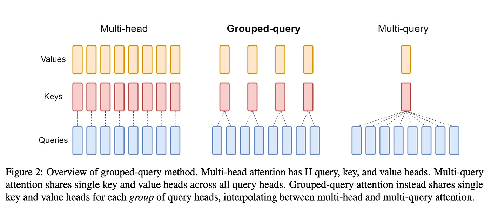

# Understanding Transformer Attentions

## 1. Introduction
In the rapidly evolving field of natural language processing (NLP), attention mechanisms have emerged as a cornerstone for enabling large language models (LLMs) to understand and generate human-like text. These mechanisms allow models to selectively focus on different parts of the input sequence, capturing relevant contextual information that significantly enhances performance. As LLMs continue to grow in size and complexity, the computational cost associated with traditional attention mechanisms has become a critical challenge. This article explores Grouped Query Attention (GQA), an innovative approach designed to address these inefficiencies without sacrificing model accuracy.

### Overview of Attention Mechanisms
Attention mechanisms are fundamental components of modern LLMs, enabling them to weigh the importance of different input tokens when making predictions or generating text. Let's explore three key types of attention mechanisms: Multi-Head Attention (MHA), Multi-Query Attention (MQA), and Grouped Query Attention (GQA).

Technical breakdown of MHA, MQA and GQA:
<br/>

**Multi-Head Attention (MHA):** 
MHA allows models to attend to different parts of the input sequence simultaneously through multiple "heads." Each head operates independently, capturing various aspects of the input. This parallel processing leads to a richer and more nuanced understanding of the input data. However, MHA's complexity results in high computational and memory costs, making it less efficient for very large models.

**Multi-Query Attention (MQA):**
MQA simplifies the attention mechanism by using a single set of key and value pairs for all queries. This reduction in redundancy leads to faster computations and lower memory usage compared to MHA. However, the trade-off is a potential loss in the granularity of attention, as MQA might not capture as many details from the input sequence.

**Grouped Query Attention (GQA):**
GQA offers a middle ground between MHA and MQA. It divides the query heads into distinct groups, with each group sharing a single set of key and value heads. This approach reduces the number of independent computations while still maintaining a higher level of detail than MQA. GQA achieves a balance between computational efficiency and attention granularity, making it an attractive option for large-scale language models.

Here is a table comparing HMA, MQA and GQA:
| Aspect                       | Multi-Head Attention (MHA)                                             | Multi-Query Attention (MQA)                                                 | Grouped-Query Attention (GQA)                                                  |
|------------------------------|------------------------------------------------------------------------|-----------------------------------------------------------------------------|--------------------------------------------------------------------------------|
| **Mechanism**                | Uses multiple heads for queries, keys, and values.                     | Uses a single set of keys and values for all queries.                       | Groups multiple query heads and uses shared keys and values within each group. |
| **Computational Complexity** | High, due to multiple heads each with their own key-value projections. | Low, due to a single key-value pair shared across all queries.              | Medium, balances between the complexity of MHA and simplicity of MQA.          |
| **Inference Speed**          | Slower, as each head performs independent calculations.                | Faster, as fewer calculations are needed with a single key-value pair.      | Faster than MHA but potentially slower than MQA, depending on group size.      |
| **Memory Usage**             | High, due to separate storage for each head's key-value pairs.         | Low, due to shared key-value pairs.                                         | Medium, due to shared keys and values within groups.                           |
| **Detail and Precision**     | High, as each head can focus on different aspects of the input.        | Lower, may miss details due to a single shared information source.          | Balanced, retains more detail than MQA by focusing on groups of queries.       |
| **Application**              | Useful for tasks requiring detailed and varied attention mechanisms.   | Suitable for faster, less detailed attention needs.                        | Useful for tasks needing a balance between speed and detailed attention.       |
| **Optimal Use Cases**        | Tasks where detailed context is crucial (e.g., translation, summarization). | Tasks where speed is more critical than detailed understanding.            | Tasks where a trade-off between speed and detail is needed (e.g., long sequences). |


### Understanding Grouped Query Attention (GQA)
Grouped Query Attention (GQA) is designed to optimize the attention mechanism by grouping query heads and sharing key and value heads within these groups. This innovative approach addresses the inefficiencies of traditional attention mechanisms, particularly in scenarios involving long sequences and large models.

**Benefits of GQA:**
1. **Efficiency Gains:** By reducing the number of independent key-value pairs, GQA decreases memory usage and speeds up computations. This is particularly beneficial for large models deployed in resource-constrained environments.
2. **Balanced Performance:** GQA maintains a higher level of detail than MQA by focusing on smaller groups of queries, ensuring that the model captures relevant dependencies within the input sequence.
3. **Scalability:** GQA scales well with the model size and input sequence length, making it suitable for applications involving extensive textual data.

To better understand GQA, consider the analogy of a party with different groups of people engaged in conversations. In MHA, you would listen to each person individually, gaining detailed insights but taking a long time. In MQA, you would try to catch snippets from everyone at once, missing important details. GQA, on the other hand, involves listening to smaller groups of people, allowing you to quickly grasp the main points while retaining more information than MQA.


## 2. Implementation of GQA in Transformers
The following table provides a brief overview of each class and function, explaining their main purposes and functionalities. Next, we will introduce each of these important classes and functions one by one to help you understand the implementation details of GQA.

| Class/Function                | Description                                                                |
|-------------------------------|------------------------------------------------------------------------|
| `scaled_dot_product_gqa`      | Computes scaled dot product attention with support for grouped queries, including optional dropout and masking.           |
| `MultiheadGQA`                | Implements multi-head grouped query attention (GQA), projecting input queries, keys, and values, then applying attention. |
| `GQATransformerEncoderLayer`  | Transformer encoder layer with grouped query attention and feedforward network, including layer normalization and dropout.|
| `GQATransformerDecoderLayer`  | Transformer decoder layer with self-attention, encoder-decoder attention, and feedforward network, including normalization and dropout.|
| `GQATransformer`              | Transformer model with grouped query attention, containing both encoder and decoder layers, designed for sequence-to-sequence tasks.|
| `GQATransformerLM`            | Language model using the GQA Transformer, including token and positional embeddings, and output projection layer.         |

### scaled_dot_product_gqa() function
The scaled_dot_product_gqa function implements the scaled dot product attention mechanism with support for grouped queries. This function allows a model to focus on different parts of the input sequence by computing similarity scores between the query and key tensors and then using these scores to weight the value tensor. It also supports optional dropout, causal masking to prevent attending to future tokens, and the ability to return attention weights. The function is optimized for efficiency by rearranging tensor dimensions and using grouped queries, which reduces computational complexity while maintaining high performance.

```python
def scaled_dot_product_gqa(
    query: Tensor,
    key: Tensor,
    value: Tensor,
    dropout: float = 0.0,
    scale: Optional[float] = None,
    mask: Optional[Tensor] = None,
    is_causal: Optional[bool] = None,
    need_weights: bool = False,
    average_attn_weights: bool = False,
    force_grouped: bool = False,
) -> Tuple[Tensor, Optional[Tensor]]:
    """
    Scaled dot product attention with support for grouped queries.

    This function performs the scaled dot product attention mechanism, which allows
    a model to focus on different parts of the input sequence. It also supports
    grouped query attention, where the query heads are grouped, and each group shares
    a single set of key and value heads.

    Args:
        query (Tensor): Query tensor of shape (b, n, h, d), where:
            b: batch size
            n: sequence length
            h: number of heads
            d: dimension of query/key/value
        key (Tensor): Key tensor of shape (b, s, h, d), where:
            s: sequence length
        value (Tensor): Value tensor of shape (b, s, h, d)
        dropout (float): Dropout probability (default: 0.0)
        scale (float, optional): Scale factor for query (default: d_query ** 0.5)
        mask (Tensor, optional): Mask tensor of shape (b, n, s) or (b, s). If ndim == 2,
            the mask is applied to all 'n' rows of the attention matrix (default: None)
        is_causal (bool, optional): If True, apply causal masking (default: None)
        need_weights (bool): If True, return attention weights (default: False)
        average_attn_weights (bool): If True, average the attention weights (default: False)
        force_grouped (bool): If True, apply grouped-query attention even if the number of
            heads is equal for query, key, and value (default: False)

    Returns:
        Tuple[Tensor, Optional[Tensor]]:
            - Attention output tensor of shape (b, n, h, d)
            - (Optional) Attention weights tensor of shape (b, h, n, s), if need_weights is True
    """
    if (mask is not None) and (is_causal is not None):
        raise ValueError("Only one of 'mask' and 'is_causal' should be provided, but got both.")
    elif not query.ndim == key.ndim == value.ndim == 4:
        raise ValueError(
            f"Expected query, key, and value to be 4-dimensional, but got shapes "
            f"{query.shape}, {key.shape}, and {value.shape}."
        )

    # Move sequence length dimension to axis 2: (b * h *) => (b h * *).
    # This makes the attention operations below much faster.
    query = rearrange(query, "b n h d -> b h n d")
    key = rearrange(key, "b s h d -> b h s d")
    value = rearrange(value, "b s h d -> b h s d")

    # Get the dimensions of the reshaped tensors
    bq, hq, nq, dq = query.shape  # (batch_size, num_heads, seq_len, dim)
    bk, hk, nk, dk = key.shape    # (batch_size, num_heads, seq_len, dim)
    bv, hv, nv, dv = value.shape  # (batch_size, num_heads, seq_len, dim)
    
    # Ensure the batch size and embedding dimensions match for all tensors
    if not (bq == bk == bv and dq == dk == dv):
        raise ValueError(
            "Expected query, key, and value to have the same batch size (dim=0) and "
            f"embedding dimension (dim=3), but got query: {query.shape}, "
            f"key: {key.shape}, and value: {value.shape}."
        )
    elif (hk != hv) or (nk != nv):
        raise ValueError(
            "Expected key and value to have the same size in dimensions 1 and 2, but "
            f"got key: {key.shape} and value: {value.shape}."
        )
    elif hq % hk != 0:
        raise ValueError(
            "Expected query heads to be a multiple of key/value heads, but got "
            f"query: {query.shape} and key/value: {key.shape}."
        )

    # If scale is not provided, set it to the square root of the last dimension of the query
    if scale is None:
        scale = query.size(-1) ** 0.5
    query = query / scale

    # Calculate the number of head groups
    num_head_groups = hq // hk

    # Reshape query tensor to group heads
    #   h represents the total number of heads
    #   g represents the number of head groups
    #   n is the sequence length
    #   d is the dimension of each head.
    # The pattern "b (h g) n d -> b g h n d", which means it reshapes the tensor from having dimensions (b, h, n, d) to (b, g, h, n, d). 
    query = rearrange(query, "b (h g) n d -> b g h n d", g=num_head_groups)
    
    # Compute similarity scores between query and key
    # 'einsum' function is performing a batch matrix multiplication operation between the query and key tensors to compute similarity scores.
    #   Query Tensor : Shape (b, g, h, n, d)
    #   Key Tensor   : Shape (b, h, s, d)
    #   Dot Product  : For each combination of b, g, h, n, and s, compute the sum of products over the d dimension.
    #   Output Tensor: The result is a tensor of shape (b, g, h, n, s), representing the similarity scores.
    # Both 'query' and 'key' tensors are multiplied element-wise for matching dimensions b, h, and d.
    # The sum of products over the d dimension is computed for each combination of b, g, h, n, and s.
    # The resulting tensor has shape (b, g, h, n, s), representing similarity scores between each query position and key position for each head in each group.
    similarity = einsum(query, key, "b g h n d, b h s d -> b g h n s")  # (batch_size, num_groups, num_heads_per_group, query_seq_len, key_seq_len)

    # If causal masking is enabled, create a mask to prevent attending to future tokens
    if is_causal:
        mask = torch.ones((bq, nq, nk), device=query.device, dtype=torch.bool).tril_()

    if mask is not None:
        # Expand mask to match the shape of the attention matrix
        if mask.ndim == 2:
            # [batch_size, seq_len] => [batch_size, 1, 1, 1, seq_len].
            mask = rearrange(mask, "b s -> b () () () s")
        elif mask.ndim == 3:
            # [batch_size, input_seq_len, output_seq_len] => [batch_size, 1, 1, input_seq_len, output_seq_len].
            mask = rearrange(mask, "b n s -> b () () n s")
        # Mask similarity values by setting them to negative infinity
        similarity.masked_fill_(~mask, torch.finfo(similarity.dtype).min)

    # Apply softmax to compute attention weights
    attention = F.softmax(similarity, dim=-1)  # (batch_size, num_groups, num_heads_per_group, query_seq_len, key_seq_len)
    if dropout > 0.0:
        attention = F.dropout(attention, p=dropout)

    # Apply attention weights to the value tensor
    #   Attention Tensor: Shape (b, g, h, n, s)
    #   Value Tensor: Shape (b, h, s, d)
    #   Weighted Sum: For each combination of b, g, h, and n, compute the sum of products over the s dimension, weighted by the attention scores.
    #   Output Tensor: The result is a tensor of shape (b, g, h, n, d), representing the attended values.    
    # 'attention' and 'value' tensors are multiplied element-wise for matching dimensions b, h, s.
    # The sum of products over the s dimension is computed for each combination of b, g, h, and n.
    # The resulting tensor has shape (b, g, h, n, d), representing the attended values for each query position, for each head in each group.
    out = einsum(attention, value, "b g h n s, b h s d -> b g h n d")  # (batch_size, num_groups, num_heads_per_group, query_seq_len, dim)
    
    # Rearrange the output tensor to combine head groups
    out = rearrange(out, "b g h n d -> b n (h g) d")  # (batch_size, query_seq_len, num_heads, dim)

    attn_weights: Optional[Tensor] = None
    if need_weights:
        # Move the sequence dimensions back to positions 1, 2. Move the head dimension to position 3
        attn_weights = rearrange(attention, "b g h n s -> b n s (h g)")  # (batch_size, query_seq_len, key_seq_len, dim)
        if average_attn_weights:
            # The mean(dim=1) function calculates the average of the tensor along the 1st dimension. 
            # This operation reduces the size of the tensor along the specified dimension by replacing each slice of the tensor along that 
            # dimension with its mean value.
            attn_weights = attn_weights.mean(dim=1)

    return out, attn_weights
```

### class MultiheadGQA
MultiheadGQA (Multi-head Grouped Query Attention) is a specialized attention mechanism that extends the traditional multi-head attention (MHA) by introducing the concept of grouped queries. In MultiheadGQA, the number of query heads is greater than the number of key and value heads, allowing multiple query heads to share the same key and value heads. This approach, inspired by the "GQA: Training Generalized Multi-Query Transformer Models from Multi-Head Checkpoints" paper, provides a balance between computational efficiency and attention performance. It significantly reduces the computational load compared to standard MHA, making it especially beneficial for decoder layers in transformer models, while maintaining high accuracy by focusing on different aspects of the input through grouped queries.

```python
class MultiheadGQA(nn.Module):
    """
    Multi-head grouped query attention (GQA) layer.

    This class implements multi-head grouped query attention, a variant of multi-head
    attention (MHA) that uses fewer write heads (key/value) than query heads. GQA can be
    viewed as a generalization of multi-query attention (MQA), which uses a single write head.
    GQA and MQA provide significant speedups over standard MHA in decoder layers, with minimal
    loss in accuracy. In the paper, GQA is shown to be more accurate than MQA, while still
    having a significant speedup over MHA.

    Args:
        embed_dim (int): Dimension of the input embeddings.
        query_heads (int): Number of query heads.
        kv_heads (int): Number of key and value heads.
        dropout (float): Dropout probability (default: 0.0).
        bias (bool): Whether to include bias terms in the projection layers (default: True).
        layer_norm (bool): Whether to include layer normalization (default: True).
        layer_norm_eps (float): Epsilon value for layer normalization (default: 1e-5).
        gamma_init (float): Initial scaling factor for parameter initialization (default: 1.0).
        device (Optional[Union[torch.device, str]]): Device to place the tensors on (default: None).
        dtype (Optional[torch.dtype]): Data type of the tensors (default: None).
    """

    def __init__(
        self,
        embed_dim: int,
        query_heads: int,
        kv_heads: int,
        dropout: float = 0.0,
        bias: bool = True,
        layer_norm: bool = True,
        layer_norm_eps: float = 1e-5,
        gamma_init: float = 1.0,
        device: Optional[Union[torch.device, str]] = None,
        dtype: Optional[torch.dtype] = None,
    ):
        super().__init__()
        self.query_heads = query_heads
        self.kv_heads = kv_heads
        self.dropout = dropout
        self.layer_norm = layer_norm
        self.gamma_init = gamma_init

        if self.query_heads % self.kv_heads != 0:
            raise ValueError(
                f"query_heads ({query_heads}) must be divisible by "
                f"kv_heads ({kv_heads})"
            )
        elif (embed_dim % self.query_heads != 0) or (embed_dim % self.kv_heads != 0):
            raise ValueError(
                f"embed_dim ({embed_dim}) must be divisible by "
                f"query_heads ({query_heads}) and kv_heads ({kv_heads})"
            )

        head_dim = embed_dim // query_heads
        if not head_dim % 8 == 0:
            raise ValueError(
                f"head_dim (embed_dim / num_heads = {head_dim}) must be divisible by 8"
            )
        if not head_dim <= 128:
            raise ValueError(
                f"head_dim (embed_dim / num_heads = {head_dim}) must be <= 128"
            )

        # Query projection layer is the same as in vanilla MHA.
        self.q_proj = nn.Linear(
            embed_dim, embed_dim, bias=bias, device=device, dtype=dtype
        )

        # The kv_embed_dim variable is calculated as the integer division of embed_dim by query_heads, multiplied by kv_heads. 
        # This is likely determining the dimensionality of the key and value vectors for each attention head. 
        # The embed_dim variable represents the total dimensionality of the input embeddings:
        #   query_heads is the number of attention heads for the query vectors
        #   kv_heads is the number of attention heads for the key and value vectors
        # Key/value projection layers have a smaller output dimension, so that we have fewer key/value attention heads after reshaping.
        kv_embed_dim = embed_dim // query_heads * kv_heads
        self.k_proj = nn.Linear(
            embed_dim, kv_embed_dim, bias=bias, device=device, dtype=dtype
        )
        self.v_proj = nn.Linear(
            embed_dim, kv_embed_dim, bias=bias, device=device, dtype=dtype
        )
        
        self.norm: Optional[nn.LayerNorm] = None
        if layer_norm:
            self.norm = nn.LayerNorm(
                embed_dim, eps=layer_norm_eps, device=device, dtype=dtype
            )
        
        # Grouped attention output will have the same embedding dimension as the key/value Tensors. 
        # So the output projection layer needs to accept the same dimension (kv_embed_dim).
        self.out_proj = nn.Linear(
            embed_dim, embed_dim, bias=bias, device=device, dtype=dtype
        )

        self._reset_parameters()

    def _reset_parameters(self):
        """
        Initialize the parameters using Xavier initialization.
        """
        nn.init.xavier_normal_(self.q_proj.weight)
        if self.q_proj.bias is not None:
            nn.init.constant_(self.q_proj.bias, 0)
        nn.init.xavier_normal_(self.k_proj.weight)
        if self.k_proj.bias is not None:
            nn.init.constant_(self.k_proj.bias, 0)

        # NOTE: We follow the initialization strategy from MAGNETO. See:
        # https://arxiv.org/pdf/2210.06423.pdf, Fig. 2
        # Gain (self.gamma_init) should be provided as a keyword argument when
        # initializing the larger Transformer model, since it requires knowledge
        # of the number of encoder/decoder layers in the model.

        nn.init.xavier_normal_(self.v_proj.weight, gain=self.gamma_init)
        if self.v_proj.bias is not None:
            nn.init.constant_(self.v_proj.bias, 0)
        nn.init.xavier_normal_(self.out_proj.weight, gain=self.gamma_init)
        if self.out_proj.bias is not None:
            nn.init.constant_(self.out_proj.bias, 0)

    def forward(
        self,
        query: Tensor,
        key: Tensor,
        value: Tensor,
        need_weights: bool = False,
        # attn_mask: Optional[Tensor] = None,
        is_causal: bool = False,
        average_attn_weights: bool = False,
    ) -> Tuple[Tensor, Optional[Tensor]]:
        """
        Perform the forward pass of the multi-head grouped query attention layer.

        Args:
            query (Tensor): Query tensor of shape (b, n, d), where:
                b: batch size
                n: sequence length
                d: embedding dimension
            key (Tensor): Key tensor of shape (b, s, d)
            value (Tensor): Value tensor of shape (b, s, d)
            need_weights (bool): If True, return attention weights (default: False)
            is_causal (bool): If True, apply causal masking (default: False)
            average_attn_weights (bool): If True, average the attention weights (default: False)

        Returns:
            Tuple[Tensor, Optional[Tensor]]:
                - Output tensor of shape (b, n, d)
                - (Optional) Attention weights tensor of shape (b, n, s, h)
        """
        # Notation:
        #   b - batch size
        #   n - sequence length
        #   h - number of heads
        #   d - embedding dimension
        #
        # Input shape: (b, n, d)

        # Project the query, key, and value tensors.
        q: Tensor = self.q_proj(query)  # Shape: (b, n, d)
        k: Tensor = self.k_proj(key)    # Shape: (b, s, d)
        v: Tensor = self.v_proj(value)  # Shape: (b, s, d)

        # Unfold 'd' dimension into 'h' separate attention heads.
        q = rearrange(q, "b n (h d) -> b n h d", h=self.query_heads)  # Shape: (b, n, h, d)
        k = rearrange(k, "b n (h d) -> b n h d", h=self.kv_heads)     # Shape: (b, s, h, d)
        v = rearrange(v, "b n (h d) -> b n h d", h=self.kv_heads)     # Shape: (b, s, h, d)

        # Apply scaled dot product attention with grouped queries.
        # dimension of x: Shape (b, n, h, d)
        x, attn = scaled_dot_product_gqa(
            query=q,
            key=k,
            value=v,
            is_causal=is_causal,
            need_weights=need_weights,
            average_attn_weights=average_attn_weights,
            force_grouped=False,
        )

        # Fold 'h' attention heads back into 'd'.
        x = rearrange(x, "b n h d -> b n (h d)")  # Shape: (b, n, d)

        # NOTE: This is different from 'nn.MultiheadAttention'! We follow the MAGNETO
        # architecture (https://arxiv.org/pdf/2210.06423.pdf), which applies an extra
        # layer norm before the linear output projection. The cross-attention layer in
        # the MAGNETO decoder does not include this layer norm, so users have the
        # option to disable it (layer_norm=False).
        if self.layer_norm:
            assert self.norm is not None
            x = self.norm(x)
        
        # Linear projection on attention outputs.
        x = self.out_proj(x)

        return x, attn
```

### class GQATransformerEncoderLayer
The GQATransformerEncoderLayer is a PyTorch module that implements a single layer of the Transformer encoder with Grouped Query Attention (GQA). This layer combines self-attention mechanisms and feedforward neural networks to process input sequences efficiently. It utilizes multiple heads for attention, grouping the query heads to optimize computational resources while maintaining performance. The layer also incorporates layer normalization and dropout for regularization and improved training stability. It is designed to enhance the model's ability to capture complex patterns and dependencies in the data, making it suitable for various sequence-to-sequence tasks.

```python
class GQATransformerEncoderLayer(nn.Module):
    """
    Transformer Encoder Layer with Grouped Query Attention (GQA).

    This class implements a single layer of the Transformer encoder with Grouped Query Attention,
    following the architecture introduced in the "GQA: Training Generalized Multi-Query Transformer
    Models from Multi-Head Checkpoints" paper.

    Args:
        d_model: Dimension of the input embeddings.
        nhead: Number of query heads.
        kv_heads: Number of key and value heads.
        dim_feedforward: Dimension of the feedforward network.
        dropout: Dropout probability.
        activation: Activation function to use in the feedforward network.
        layer_norm_eps: Epsilon value for layer normalization.
        gamma_init: Initial scaling factor for parameter initialization.
        device: Device to place the tensors on.
        dtype: Data type of the tensors.
    """

    def __init__(
        self,
        d_model: int,
        nhead: int,
        kv_heads: int,
        dim_feedforward: int = 2048,
        dropout: float = 0.1,
        activation: Union[str, Callable[[Tensor], Tensor]] = F.relu,
        layer_norm_eps: float = 1e-5,
        gamma_init: float = 1.0,
        device: Optional[Union[torch.device, str]] = None,
        dtype: Optional[torch.dtype] = None,
    ) -> None:
        super().__init__()
        # Legacy string support for activation function.
        if isinstance(activation, str):
            activation = _get_activation_fn(activation)

        self.activation = activation
        self.gamma_init = gamma_init
        self.dropout = nn.Dropout(dropout)
        
        # Self-attention block (GQA)
        self.norm1 = nn.LayerNorm(
            d_model, eps=layer_norm_eps, device=device, dtype=dtype
        )
        self.self_attn = MultiheadGQA(
            embed_dim=d_model,
            query_heads=nhead,
            kv_heads=kv_heads,
            dropout=dropout,
            layer_norm=True,
            layer_norm_eps=layer_norm_eps,
            gamma_init=gamma_init,
            device=device,
            dtype=dtype,
        )
        
        # Feedforward block
        self.norm2 = nn.LayerNorm(
            d_model, eps=layer_norm_eps, device=device, dtype=dtype
        )
        self.linear1 = nn.Linear(d_model, dim_feedforward, device=device, dtype=dtype)
        self.norm3 = nn.LayerNorm(
            dim_feedforward, eps=layer_norm_eps, device=device, dtype=dtype
        )
        self.linear2 = nn.Linear(dim_feedforward, d_model, device=device, dtype=dtype)

        self._reset_parameters()

    def _reset_parameters(self):
        """
        Initialize the parameters using Xavier initialization.
        """
        nn.init.xavier_normal_(self.linear1.weight, gain=self.gamma_init)
        nn.init.constant_(self.linear1.bias, 0)
        nn.init.xavier_normal_(self.linear2.weight, gain=self.gamma_init)
        nn.init.constant_(self.linear2.bias, 0)

    def _self_attention_block(self, x: Tensor, is_causal: bool = False) -> Tensor:
        """
        Apply the self-attention block.

        Args:
            x: Input tensor of shape (batch_size, seq_len, d_model)
            is_causal: Whether to apply causal masking.

        Returns:
            Output tensor of shape (batch_size, seq_len, d_model)
        """
        # Apply layer normalization
        x = self.norm1(x)
        # Apply multi-head grouped query attention
        x, _ = self.self_attn(x, x, x, is_causal=is_causal)
        # Apply dropout
        x = self.dropout(x)
        return x

    def _feedforward_block(self, x: Tensor) -> Tensor:
        """
        Apply the feedforward block.

        Args:
            x: Input tensor of shape (batch_size, seq_len, d_model)

        Returns:
            Output tensor of shape (batch_size, seq_len, d_model)
        """
        # Apply layer normalization
        x = self.norm2(x)
        # Apply the first linear transformation
        x = self.activation(self.linear1(x))
        # Apply dropout
        x = self.dropout(x)
        # Apply layer normalization
        x = self.norm3(x)
        # Apply the second linear transformation
        x = self.linear2(x)
        # Apply dropout
        x = self.dropout(x)
        return x

    def forward(self, src: Tensor, is_causal: bool = False) -> Tensor:
        """
        Perform the forward pass of the encoder layer.

        Args:
            src: Input tensor of shape (batch_size, seq_len, d_model)
            is_causal: Whether to apply causal masking.

        Returns:
            Output tensor of shape (batch_size, seq_len, d_model)
        """
        x = src
        # Apply self-attention block (using residual connection)
        x = x + self._self_attention_block(x, is_causal=is_causal)
        # Apply feedforward block (using residual connection)
        x = x + self._feedforward_block(x)
        return x
```

### class GQATransformerDecoderLayer
The GQATransformerDecoderLayer class is a component of a Transformer model designed to process sequential data, utilizing Grouped Query Attention (GQA) for enhanced efficiency. This decoder layer combines self-attention, encoder-decoder attention, and a feedforward neural network, each with layer normalization and dropout for regularization. The self-attention mechanism allows the model to focus on different parts of the target sequence, while the encoder-decoder attention integrates information from the encoder's output. This structure supports parallel processing and captures intricate dependencies within the input data, making it suitable for tasks like machine translation and text generation.

```python
class GQATransformerDecoderLayer(nn.Module):
    """
    Transformer Decoder Layer with Grouped Query Attention (GQA).

    This class implements a single layer of the Transformer decoder with Grouped Query Attention,
    following the architecture introduced in the "GQA: Training Generalized Multi-Query Transformer
    Models from Multi-Head Checkpoints" paper.

    Args:
        d_model: Dimension of the input embeddings.
        nhead: Number of query heads.
        kv_heads: Number of key and value heads.
        dim_feedforward: Dimension of the feedforward network.
        dropout: Dropout probability.
        activation: Activation function to use in the feedforward network.
        layer_norm_eps: Epsilon value for layer normalization.
        gamma_init: Initial scaling factor for parameter initialization.
        device: Device to place the tensors on.
        dtype: Data type of the tensors.
    """

    def __init__(
        self,
        d_model: int,
        nhead: int,
        kv_heads: int,
        dim_feedforward: int = 2048,
        dropout: float = 0.1,
        activation: Union[str, Callable[[Tensor], Tensor]] = F.relu,
        layer_norm_eps: float = 1e-5,
        gamma_init: float = 1.0,
        device: Optional[Union[torch.device, str]] = None,
        dtype: Optional[torch.dtype] = None,
    ) -> None:
        super().__init__()
        # Legacy string support for activation function.
        if isinstance(activation, str):
            activation = _get_activation_fn(activation)

        self.activation = activation
        self.gamma_init = gamma_init
        self.dropout = nn.Dropout(dropout)
        
        # Self-attention block
        self.norm1 = nn.LayerNorm(
            d_model, eps=layer_norm_eps, device=device, dtype=dtype
        )
        self.self_attn = MultiheadGQA(
            embed_dim=d_model,
            query_heads=nhead,
            kv_heads=kv_heads,
            dropout=dropout,
            layer_norm=False,
            gamma_init=gamma_init,
            device=device,
            dtype=dtype,
        )
        
        # Multi-head attention block
        self.norm2 = nn.LayerNorm(
            d_model, eps=layer_norm_eps, device=device, dtype=dtype
        )
        self.multihead_attn = MultiheadGQA(
            embed_dim=d_model,
            query_heads=nhead,
            kv_heads=kv_heads,
            dropout=dropout,
            layer_norm_eps=layer_norm_eps,
            gamma_init=gamma_init,
            device=device,
            dtype=dtype,
        )
        
        # Feedforward block
        self.norm3 = nn.LayerNorm(
            d_model, eps=layer_norm_eps, device=device, dtype=dtype
        )
        self.linear1 = nn.Linear(d_model, dim_feedforward, device=device, dtype=dtype)
        self.norm4 = nn.LayerNorm(
            dim_feedforward, eps=layer_norm_eps, device=device, dtype=dtype
        )
        self.linear2 = nn.Linear(dim_feedforward, d_model, device=device, dtype=dtype)

        self._reset_parameters()

    def _reset_parameters(self):
        """
        Initialize the parameters using Xavier initialization.
        """
        nn.init.xavier_normal_(self.linear1.weight, gain=self.gamma_init)
        nn.init.constant_(self.linear1.bias, 0)
        nn.init.xavier_normal_(self.linear2.weight, gain=self.gamma_init)
        nn.init.constant_(self.linear2.bias, 0)

    def _self_attention_block(self, x: Tensor, is_causal: bool = False) -> Tensor:
        """
        Apply the self-attention block.

        Args:
            x: Input tensor of shape (batch_size, seq_len, d_model)
            is_causal: Whether to apply causal masking.

        Returns:
            Output tensor of shape (batch_size, seq_len, d_model)
        """
        # Apply layer normalization
        x = self.norm1(x)
        # Apply multi-head grouped query attention
        x, _ = self.self_attn(x, x, x, is_causal=is_causal)
        # Apply dropout
        x = self.dropout(x)
        return x

    def _multihead_attention_block(
        self, x: Tensor, memory: Tensor, is_causal: bool = False
    ) -> Tensor:
        """
        Apply the multi-head attention block.

        Args:
            x: Input tensor of shape (batch_size, seq_len, d_model)
            memory: Memory tensor from the encoder of shape (batch_size, seq_len, d_model)
            is_causal: Whether to apply causal masking.

        Returns:
            Output tensor of shape (batch_size, seq_len, d_model)
        """
        # Apply layer normalization
        x = self.norm2(x)
        # Apply multi-head grouped query attention using the memory from the encoder
        x, _ = self.multihead_attn(x, memory, memory, is_causal=is_causal)
        # Apply dropout
        x = self.dropout(x)
        return x

    def _feedforward_block(self, x: Tensor) -> Tensor:
        """
        Apply the feedforward block.

        Args:
            x: Input tensor of shape (batch_size, seq_len, d_model)

        Returns:
            Output tensor of shape (batch_size, seq_len, d_model)
        """
        # Apply layer normalization
        x = self.norm3(x)
        # Apply the first linear transformation
        x = self.activation(self.linear1(x))
        # Apply dropout
        x = self.dropout(x)
        # Apply layer normalization
        x = self.norm4(x)
        # Apply the second linear transformation
        x = self.linear2(x)
        # Apply dropout
        x = self.dropout(x)
        return x

    def forward(
        self,
        tgt: Tensor,
        memory: Tensor,
        tgt_is_causal: bool = False,
        memory_is_causal: bool = False,
    ) -> Tensor:
        """
        Perform the forward pass of the decoder layer.

        Args:
            tgt: Target tensor of shape (batch_size, seq_len, d_model)
            memory: Memory tensor from the encoder of shape (batch_size, seq_len, d_model)
            tgt_is_causal: Whether to apply causal masking to the target tensor.
            memory_is_causal: Whether to apply causal masking to the memory tensor.

        Returns:
            Output tensor of shape (batch_size, seq_len, d_model)
        """
        x = tgt
        # Apply self-attention block (using a residual connection)
        x = x + self._self_attention_block(x, is_causal=tgt_is_causal)
        # Apply multi-head attention block using the encoder's memory (using a residual connection)
        x = x + self._multihead_attention_block(x, memory, is_causal=memory_is_causal)
        # Apply feedforward block (using a residual connection)
        x = x + self._feedforward_block(x)
        return x
```

### class GQATransformer
The GQATransformer is a specialized Transformer model that incorporates Grouped Query Attention (GQA) to enhance computational efficiency while maintaining high accuracy. Inspired by the "GQA: Training Generalized Multi-Query Transformer Models from Multi-Head Checkpoints" paper, this model integrates both encoder and decoder layers utilizing GQA. The encoder consists of multiple GQATransformerEncoderLayer instances, and the decoder comprises multiple GQATransformerDecoderLayer instances. By grouping multiple query heads to share key and value heads, GQA significantly reduces the computational load compared to traditional multi-head attention (MHA), making the GQATransformer particularly advantageous for sequence-to-sequence tasks, including language modeling and translation.

MAGNETO: A Foundation Transformer:
<br/>

```python
class GQATransformer(nn.Module):
    """
    Transformer model with Grouped Query Attention (GQA).

    This class implements a Transformer model with Grouped Query Attention, following the
    architecture introduced in the "GQA: Training Generalized Multi-Query Transformer Models
    from Multi-Head Checkpoints" paper. It consists of both encoder and decoder layers with GQA.

    Args:
        d_model: Dimension of the input embeddings.
        nhead: Number of query heads.
        kv_heads: Number of key and value heads.
        num_encoder_layers: Number of encoder layers.
        num_decoder_layers: Number of decoder layers.
        dim_feedforward: Dimension of the feedforward network.
        dropout: Dropout probability.
        activation: Activation function to use in the feedforward network.
        layer_norm_eps: Epsilon value for layer normalization.
        device: Device to place the tensors on.
        dtype: Data type of the tensors.
    """
    def __init__(
        self,
        d_model: int = 512,
        nhead: int = 8,
        kv_heads: int = 4,
        num_encoder_layers: int = 6,
        num_decoder_layers: int = 6,
        dim_feedforward: int = 2048,
        dropout: float = 0.1,
        activation: Union[str, Callable[[Tensor], Tensor]] = F.relu,
        layer_norm_eps: float = 1e-5,
        device: Optional[torch.device] = None,
        dtype: Optional[torch.dtype] = None,
    ):
        super().__init__()
        # The 'gamma_init' parameters are different for the encoder and decoder, and depend on the number of encoder/decoder layers.  
        # See MAGNETO paper: https://arxiv.org/pdf/2210.06423.pdf (Figure 2)
        encoder_gamma_init = (
            log(3 * num_decoder_layers) * log(2 * num_encoder_layers) / 3
        ) ** 0.5
        decoder_gamma_init = log(3 * num_decoder_layers) ** 0.5

        # Initialize the encoder with the specified number of layers
        #   encoder_layer: it is an instance of the GQATransformerEncoderLayer class, which is a custom class that implements a 
        #                  Transformer encoder layer with Grouped Query Attention (GQA).
        #   num_layers   : Specifies how many of these layers to stack to form the complete encoder.
        #   nhead        : The number of query heads in the GQA mechanism.
        #   kv_heads     : The number of key and value heads in the GQA mechanism.
        #   gamma_init   : An initial scaling factor for parameter initialization.
        # The GQATransformerEncoderLayer class includes a self-attention block and a feedforward block, which are the two main 
        # components of a Transformer encoder layer. The self-attention block uses the MultiheadGQA class to implement the 
        # GQA mechanism, and the feedforward block uses two linear transformations with an activation function in between.
        self.encoder = nn.TransformerEncoder(
            encoder_layer=GQATransformerEncoderLayer(
                d_model=d_model,
                nhead=nhead,
                kv_heads=kv_heads,
                dim_feedforward=dim_feedforward,
                dropout=dropout,
                activation=activation,
                layer_norm_eps=layer_norm_eps,
                gamma_init=encoder_gamma_init,
                device=device,
                dtype=dtype,
            ),
            num_layers=num_encoder_layers,
            mask_check=False,
            enable_nested_tensor=False,
        )

        # Initialize the decoder with the specified number of layers
        #   decoder_layer: it is an instance of the GQATransformerDecoderLayer class, which is a custom class that implements a 
        #                  Transformer decoder layer with Grouped Query Attention (GQA).
        #   num_layers   : Specifies how many of these layers to stack to form the complete decoder.
        #   nhead        : The number of query heads in the GQA mechanism.
        #   kv_heads     : The number of key and value heads in the GQA mechanism. 
        #   gamma_init   : An initial scaling factor for parameter initialization.
        # The GQATransformerDecoderLayer class includes a self-attention block, a cross-attention block, and a feedforward block, 
        # which are the three main components of a Transformer decoder layer. The self-attention block uses the MultiheadGQA class 
        # to implement the GQA mechanism, the cross-attention block uses the standard MultiheadAttention class from PyTorch, 
        # and the feedforward block uses two linear transformations with an activation function in between.
        self.decoder = nn.TransformerDecoder(
            decoder_layer=GQATransformerDecoderLayer(
                d_model=d_model,
                nhead=nhead,
                kv_heads=kv_heads,
                dim_feedforward=dim_feedforward,
                dropout=dropout,
                activation=activation,
                layer_norm_eps=layer_norm_eps,
                gamma_init=decoder_gamma_init,
                device=device,
                dtype=dtype,
            ),
            num_layers=num_decoder_layers,
        )

    def forward(self, x: Tensor, is_causal: bool = True) -> Tensor:
        """
        Perform the forward pass of the Transformer model.

        Args:
            x: Input tensor of shape (batch_size, seq_len, d_model)
            is_causal: Whether to apply causal masking.

        Returns:
            Output tensor of shape (batch_size, seq_len, d_model)
        """
        # Input shape: (batch_size, seq_len, d_model)
        tgt = x

        # This part is implementing the forward pass of the encoder part of a Transformer model. 
        # It takes an input tensor, passes it through each layer of the encoder in a sequential manner, 
        # applies a normalization layer if it is used, and returns the final output tensor.
        for layer in self.encoder.layers:
            x = layer(x, is_causal=is_causal)
        if self.encoder.norm is not None:
            x = self.encoder.norm(x)

        # In the GQATransformerDecoderLayer.forward method, 'tgt' is used in the self-attention block, 
        # and both 'tgt' and 'mem' are used in the multi-head attention block. 
        #   'tgt': This is the target tensor, which is the input to the decoder. 
        #   'mem': This is the memory tensor, which is the output from the encoder.
        # This allows the decoder to consider both the current output sequence (through 'tgt') and the entire 
        # input sequence (through 'mem') when generating the next token.
        mem = x
        for layer in self.decoder.layers:
            tgt = layer(tgt, mem, memory_is_causal=is_causal, tgt_is_causal=is_causal)
        if self.decoder.norm is not None:
            tgt = self.decoder.norm(tgt)

        return tgt
```

### class GQATransformerLM
The GQATransformerLM is a language model that leverages the Grouped Query Attention (GQA) Transformer architecture to enhance computational efficiency and maintain high performance. This model integrates token embeddings, positional embeddings using XPOS, and the GQA Transformer, which consists of multiple encoder and decoder layers. The GQATransformerLM also includes a final linear layer for output projection to map the transformer outputs to the vocabulary size. This architecture is designed for tasks like language modeling, where it can effectively process sequences of tokens, making it suitable for applications such as text generation and translation.

```python
class GQATransformerLM(nn.Module):
    """
    Language Model with Grouped Query Attention (GQA) Transformer.

    This class implements a language model using the GQA Transformer architecture. It includes
    token embeddings, positional embeddings, the GQA Transformer, and a final linear layer
    for output projection.

    Args:
        num_tokens: Number of tokens in the vocabulary.
        d_model: Dimension of the token embeddings.
        nhead: Number of query heads.
        kv_heads: Number of key and value heads.
        num_encoder_layers: Number of encoder layers.
        num_decoder_layers: Number of decoder layers.
        dim_feedforward: Dimension of the feedforward network.
        dropout: Dropout probability.
        activation: Activation function to use in the feedforward network.
        layer_norm_eps: Epsilon value for layer normalization.
        device: Device to place the tensors on.
        dtype: Data type of the tensors.
    """

    def __init__(
        self,
        num_tokens: int,  # (required) usually obtained from the tokenizer
        d_model: int = 512,
        nhead: int = 8,
        kv_heads: int = 4,
        num_encoder_layers: int = 6,
        num_decoder_layers: int = 6,
        dim_feedforward: int = 2048,
        dropout: float = 0.1,
        activation: Union[str, Callable[[Tensor], Tensor]] = F.relu,
        layer_norm_eps: float = 1e-5,
        device: Optional[torch.device] = None,
        dtype: Optional[torch.dtype] = None,
    ):
        super().__init__()
        # Embedding layer for tokens
        self.token_embedding = nn.Embedding(
            num_tokens, d_model, device=device, dtype=dtype
        )
        
        # Positional encoding using XPOS
        self.pos_embedding = XPOS(d_model).to(device=device, dtype=dtype)
        
        # GQA Transformer with the specified number of encoder and decoder layers
        self.transformer = GQATransformer(
            d_model=d_model,
            nhead=nhead,
            kv_heads=kv_heads,
            num_encoder_layers=num_encoder_layers,
            num_decoder_layers=num_decoder_layers,
            dim_feedforward=dim_feedforward,
            dropout=dropout,
            activation=activation,
            layer_norm_eps=layer_norm_eps,
            device=device,
            dtype=dtype,
        )
        
        # Layer normalization before the final output projection
        self.norm = nn.LayerNorm(
            d_model, eps=layer_norm_eps, device=device, dtype=dtype
        )
        
        # Output projection layer to map the transformer outputs to the vocabulary size
        self.out = nn.Linear(d_model, num_tokens, device=device, dtype=dtype)

    def _reset_parameters(self):
        """
        Initialize the parameters using Kaiming normal initialization.
        """
        nn.init.kaiming_normal_(self.out.weight)
        nn.init.constant_(self.out.bias, 0)

    def forward(self, x: Tensor, is_causal: bool = True) -> Tensor:
        """
        Perform the forward pass of the language model.

        Args:
            x: Input tensor of shape (batch_size, seq_len)
            is_causal: Whether to apply causal masking.

        Returns:
            Output tensor of shape (batch_size, seq_len, num_tokens)
        """
        # Input shape: (batch_size, seq_len)
        
        # Token embeddings
        x = self.token_embedding(x)  # Shape: (batch_size, seq_len, d_model)
        
        # Add positional embeddings (using residual connection)
        x = x + self.pos_embedding(x)  # Shape: (batch_size, seq_len, d_model)
        
        # Pass through the GQA Transformer
        x = self.transformer(x, is_causal=is_causal)  # Shape: (batch_size, seq_len, d_model)
        
        # Apply layer normalization
        x = self.norm(x)  # Shape: (batch_size, seq_len, d_model)
        
        # Project to the vocabulary size
        x = self.out(x)  # Shape: (batch_size, seq_len, num_tokens)

        return x
```


## 3. Conclusion
Grouped Query Attention (GQA) represents a significant advancement in the design of attention mechanisms for large language models. By balancing computational efficiency with detailed attention, GQA addresses the limitations of traditional mechanisms like MHA and MQA. As NLP continues to evolve, innovations like GQA will play a crucial role in enhancing the performance and scalability of language models, enabling more sophisticated and efficient processing of textual data.

The table summarizing which versions of the LLaMA model use GQA or MHA:
| Model   | Params | Context Length | GQA  | MHA  |
|---------|--------|----------------|------|------|
| LLaMA 1 | 7B     | 2k             |     |     |
| LLaMA 1 | 13B    | 2k             |     |     |
| LLaMA 1 | 33B    | 2k             |     |     |
| LLaMA 1 | 65B    | 2k             |     |     |
| LLaMA 2 | 7B     | 4k             |     |     |
| LLaMA 2 | 13B    | 4k             |     |     |
| LLaMA 2 | 34B    | 4k             |     |     |
| LLaMA 2 | 70B    | 4k             |     |     |
| LLaMA 3 | 8B     | 8k             |     |     |
| LLaMA 3 | 70B    | 8k             |     |     |

Grouped Query Attention (GQA) provides several benefits to larger models, particularly in terms of efficiency and scalability. Here are the key reasons why GQA is beneficial to larger models:
1. Reduced Computational Complexity
2. Improved Memory Efficiency
3. Faster Inference
4. Scalability to Larger Context Lengths
5. Maintaining Model Performance

GQA offers a more resource-efficient alternative to MHA, making it particularly advantageous for larger models where computational and memory efficiency are paramount. This allows for the development of more powerful models that can handle larger datasets and longer sequences without compromising on performance or efficiency.


## 4. References
Here are the key references used in this article:
- [GQA: Training Generalized Multi-Query Transformer Models from Multi-Head Checkpoints](https://arxiv.org/pdf/2305.13245)
- [Grouped Query Attention PyTorch Implementation](https://github.com/fkodom/grouped-query-attention-pytorch)

These resources provide detailed insights into the concepts, methodologies, and implementations discussed in this article. For further reading and a deeper understanding, please refer to the provided links.
