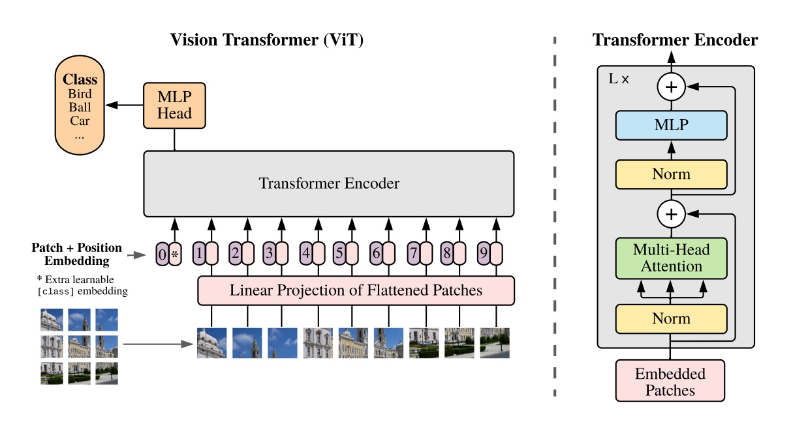

Sure! Here's the table of contents converted to markdown format:
# Getting Started with Vision Transformers: A HuggingFace ViT Tutorial

## Overview of Vision Transformers (ViT)
Vision Transformers (ViT) represent a significant shift in the field of computer vision by applying the transformer architecture, originally designed for natural language processing, to image analysis tasks. Introduced by Dosovitskiy et al. in their 2020 paper "An Image is Worth 16x16 Words: Transformers for Image Recognition at Scale," ViTs leverage the powerful attention mechanism to model the relationships between different parts of an image.



### Key Concepts
1. **Patch Embedding**:
   - Instead of processing the entire image at once, ViT divides the image into smaller patches (e.g., 16x16 pixels).
   - Each patch is flattened into a vector and linearly embedded into a higher-dimensional space to form patch embeddings.
2. **Positional Encoding**:
   - Since transformers do not inherently understand the spatial structure of images, positional encodings are added to patch embeddings to retain spatial information.
   - These encodings help the model differentiate between patches based on their position in the image.
3. **Transformer Encoder**:
   - The core of ViT is a standard transformer encoder, consisting of multiple layers of self-attention and feed-forward neural networks.
   - Self-attention mechanisms allow the model to focus on different parts of the image, capturing long-range dependencies and contextual information.
4. **Classification Token**:
   - A special classification token ([CLS]) is appended to the sequence of patch embeddings.
   - The final hidden state corresponding to this token is used for image classification tasks.

### Advantages of Vision Transformers
- **Scalability**: ViTs can be scaled to larger datasets and models, often outperforming traditional convolutional neural networks (CNNs) on large-scale datasets.
- **Flexibility**: The transformer architecture is highly flexible, enabling the integration of additional modalities (e.g., text, audio) and tasks.
- **Attention Mechanisms**: Self-attention allows ViTs to capture global context and long-range dependencies more effectively than CNNs.

### Applications of Vision Transformers
- **Image Classification**: ViTs have demonstrated state-of-the-art performance on various image classification benchmarks.
- **Object Detection and Segmentation**: ViTs are increasingly used in object detection and segmentation tasks, often in combination with CNNs.
- **Generative Modeling**: ViTs are employed in generative tasks, such as image generation and completion, leveraging their strong representation learning capabilities.

## Introduction to HuggingFace's ViT API
HuggingFace's Transformers library provides a robust API for working with Vision Transformers (ViT), making it easier for developers and researchers to leverage state-of-the-art models for various computer vision tasks. Below, we introduce the key components of the HuggingFace ViT API.

| **Class**                    | **Description**                                                                                   | **Key Features**                                                                                             |
|------------------------------|---------------------------------------------------------------------------------------------------|-------------------------------------------------------------------------------------------------------------|
| **ViTConfig**                | Defines the model architecture and various hyperparameters.                                       | - Customize model architecture.<br>- Define hyperparameters like hidden size, number of layers, and attention heads.<br>- Easy integration with other HuggingFace models. |
| **ViTFeatureExtractor**      | Responsible for preprocessing images before they are fed into a ViT model.                        | - Preprocess images by resizing and normalizing.<br>- Convert images to the required tensor format.<br>- Consistent preprocessing for various ViT models. |
| **ViTImageProcessor**        | A newer class that handles image preprocessing, similar to `ViTFeatureExtractor`.                 | - Preprocess images with advanced capabilities.<br>- Consistency with other image processing tasks.<br>- Integration with the latest updates and features from HuggingFace. |
| **ViTModel**                 | The base ViT model that provides raw hidden states as outputs.                                    | - Extract raw hidden states from images.<br>- Foundation for building specialized ViT models.<br>- Flexibility for custom tasks and feature extraction. |
| **ViTForMaskedImageModeling**| Designed for tasks where parts of the image are masked and the model learns to reconstruct them.  | - Handle masked image modeling tasks.<br>- Reconstruct missing parts of images.<br>- Useful for image inpainting and occlusion applications. |
| **ViTForImageClassification**| Specifically designed for image classification tasks.                                             | - Perform image classification tasks.<br>- Predict image classes from predefined categories.<br>- State-of-the-art performance on classification benchmarks. |


## Example by use case
This article provides five practical examples of using the HuggingFace ViT module:
1. **Image Classification**: Demonstrates how to use `ViTForImageClassification` to classify images into predefined categories.
2. **Masked Image Modeling**: Shows how to use `ViTForMaskedImageModeling` for tasks where parts of the image are masked, and the model learns to reconstruct them.
3. **Feature Extraction**: Illustrates how to use `ViTModel` to extract features from images.
4. **Custom Configuration**: Explains how to create a custom Vision Transformer configuration using `ViTConfig`.
5. **Image Preprocessing**: Demonstrates the use of `ViTFeatureExtractor` to preprocess images before feeding them into a Vision Transformer model.


### 1. Image Classification
This example demonstrates how to use the ViTForImageClassification model from HuggingFace's Transformers library to classify an image into predefined categories. It includes steps to load a sample image, preprocess it, and then use a pre-trained Vision Transformer model to predict the class label of the image.

```python
from transformers import AutoImageProcessor, ViTForImageClassification
import torch
from datasets import load_dataset

# Load a sample image from the "cats-image" dataset
dataset = load_dataset("huggingface/cats-image")
image = dataset["test"]["image"][0]

# ViT models
model_path = "google/vit-large-patch32-384"
model_path = "google/vit-large-patch16-224"
model_path = "google/vit-base-patch32-224-in21k"
model_path = "google/vit-base-patch16-224-in21k"

# AutoImageProcessor: Preprocess images for ViT models (resize, normalize, etc.).
image_processor = AutoImageProcessor.from_pretrained(model_path)
# ViTForImageClassification: Vision Transformer model for image classification tasks.
model = ViTForImageClassification.from_pretrained(model_path)

# Preprocess the image to get pixel values and return as a tensor
inputs = image_processor(image, return_tensors="pt")

# Disable gradient calculation for inference
with torch.no_grad():
    # Pass the preprocessed image through the model to get logits
    logits = model(**inputs).logits

# Get the predicted label index
predicted_label = logits.argmax(-1).item()
# Print the predicted label based on the model's configuration
print(model.config.id2label[predicted_label])
```

### 2. Masked Image Modeling
This example shows how to use the ViTForMaskedImageModeling model for tasks where parts of the image are masked, and the model learns to reconstruct them. The example involves loading an image, creating a random mask, and then using the Vision Transformer model to predict the masked parts of the image.

```python
from transformers import AutoImageProcessor, ViTForMaskedImageModeling
import torch
from PIL import Image
import requests

# Load an image from a URL
url = "http://images.cocodataset.org/val2017/000000039769.jpg"
image = Image.open(requests.get(url, stream=True).raw)

# ViT models
model_path = "google/vit-large-patch32-384"
model_path = "google/vit-large-patch16-224"
model_path = "google/vit-base-patch32-224-in21k"
model_path = "google/vit-base-patch16-224-in21k"

# AutoImageProcessor: Preprocess images for ViT models (resize, normalize, etc.).
image_processor = AutoImageProcessor.from_pretrained(model_path)
# ViTForMaskedImageModeling: Vision Transformer model for masked image modeling tasks.
model = ViTForMaskedImageModeling.from_pretrained(model_path)

# Calculate the number of patches
num_patches = (model.config.image_size // model.config.patch_size) ** 2
# Preprocess the image to get pixel values
pixel_values = image_processor(images=image, return_tensors="pt").pixel_values

# Create a random boolean mask for patches
bool_masked_pos = torch.randint(low=0, high=2, size=(1, num_patches)).bool()

# Pass the pixel values and mask through the model to get outputs
outputs = model(pixel_values, bool_masked_pos=bool_masked_pos)
# Get the loss and reconstructed pixel values from the outputs
loss, reconstructed_pixel_values = outputs.loss, outputs.reconstruction
# Print the shape of the reconstructed pixel values
print(list(reconstructed_pixel_values.shape))
```

### 3. Feature Extraction
This example illustrates how to use the ViTModel to extract features from images. It involves loading a sample image, preprocessing it, and then using a pre-trained Vision Transformer model to obtain the hidden states (features) from the image. This can be useful for downstream tasks such as image retrieval or clustering.

```python
from transformers import AutoImageProcessor, ViTModel
import torch
from datasets import load_dataset

# Load a sample image from the "cats-image" dataset
dataset = load_dataset("huggingface/cats-image")
image = dataset["test"]["image"][0]

# ViT models
model_path = "google/vit-large-patch32-384"
model_path = "google/vit-large-patch16-224"
model_path = "google/vit-base-patch32-224-in21k"
model_path = "google/vit-base-patch16-224-in21k"

# AutoImageProcessor: Preprocess images for ViT models (resize, normalize, etc.).
image_processor = AutoImageProcessor.from_pretrained(model_path)
# ViTModel: The bare Vision Transformer model that outputs hidden states.
model = ViTModel.from_pretrained(model_path)

# Preprocess the image to get pixel values and return as a tensor
inputs = image_processor(image, return_tensors="pt")

# Disable gradient calculation for inference
with torch.no_grad():
    # Pass the preprocessed image through the model to get hidden states
    outputs = model(**inputs)

# Get the last hidden states from the model outputs
last_hidden_states = outputs.last_hidden_state
# Print the shape of the hidden states
print(list(last_hidden_states.shape))
```

### 4. Custom Configuration
This example demonstrates how to create a custom Vision Transformer configuration using the ViTConfig class. It involves specifying custom settings for model parameters like the hidden size, number of attention heads, number of hidden layers, image size, and patch size. The custom configuration is then used to initialize a Vision Transformer model.

```python
from transformers import ViTConfig, ViTModel

# ViTConfig: Configuration class for Vision Transformer models.
# Initialize with custom settings
custom_configuration = ViTConfig(
    hidden_size=768,        # Dimension of the encoder layers and the pooler layer.
    num_attention_heads=12, # Number of attention heads for each attention layer in the Transformer encoder.
    num_hidden_layers=12,   # Number of hidden layers in the Transformer encoder.
    image_size=224,         # Size of each image.
    patch_size=16           # Size of each patch.
)

# ViTModel: The bare Vision Transformer model.
# Initialize the model with the custom configuration
custom_model = ViTModel(custom_configuration)

# Accessing the model configuration
configuration = custom_model.config
print(configuration)
```

### 5. Image Preprocessing
This example shows how to use the ViTFeatureExtractor class to preprocess an image before feeding it into a Vision Transformer model. The feature extractor handles tasks such as resizing, normalizing, and converting the image into the appropriate tensor format required by the model. This preprocessing step is crucial for ensuring the image is correctly formatted for model inference.

```python
from transformers import ViTFeatureExtractor, ViTForImageClassification
from PIL import Image
import torch

# ViT models
model_path = "google/vit-large-patch32-384"
model_path = "google/vit-large-patch16-224"
model_path = "google/vit-base-patch32-224-in21k"
model_path = "google/vit-base-patch16-224-in21k"

# Initialize the feature extractor and model
feature_extractor = ViTFeatureExtractor.from_pretrained(model_path)
model = ViTForImageClassification.from_pretrained(model_path)

# Load an image from disk
image = Image.open("path_to_image.jpg")

# Preprocess the image to get pixel values
inputs = feature_extractor(images=image, return_tensors="pt")

# Extract pixel values from the inputs
pixel_values = inputs["pixel_values"]

# Disable gradient calculation for inference
with torch.no_grad():
    # Pass the preprocessed image through the model to get logits
    outputs = model(pixel_values)

# Get the logits from the model outputs
logits = outputs.logits

# Get the predicted label index
predicted_label = logits.argmax(-1).item()

# Print the predicted label based on the model's configuration
print(model.config.id2label[predicted_label])
```


## Conclusion
The HuggingFace ViT API offers a comprehensive and flexible set of tools for leveraging Vision Transformers in various computer vision tasks. Key capabilities include:

- **Configurable Models**: With `ViTConfig`, users can define custom model architectures and hyperparameters tailored to their specific needs.
- **Image Preprocessing**: Classes like `ViTFeatureExtractor` and `ViTImageProcessor` ensure that images are preprocessed correctly, including resizing, normalization, and tensor conversion.
- **Versatile Model Usage**: The API supports different ViT models, including `ViTModel` for feature extraction, `ViTForMaskedImageModeling` for reconstructing masked image parts, and `ViTForImageClassification` for classifying images.
- **State-of-the-Art Performance**: The HuggingFace ViT models deliver state-of-the-art performance across a range of tasks, from image classification to complex image reconstruction.


## Reference
- [Vision Transformer (ViT) Documentation](https://huggingface.co/docs/transformers/model_doc/vit): Comprehensive documentation on the Vision Transformer models available in the HuggingFace Transformers library.
- [PyTorch Image Models (HuggingFace)](https://github.com/huggingface/pytorch-image-models): Repository containing PyTorch implementations of various image models, including Vision Transformers.
- [An Image is Worth 16x16 Words: Transformers for Image Recognition at Scale](https://arxiv.org/abs/2010.11929): The seminal paper by Dosovitskiy et al. that introduced Vision Transformers, explaining the model architecture, training methods, and benchmark results.

