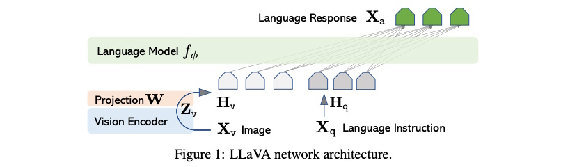
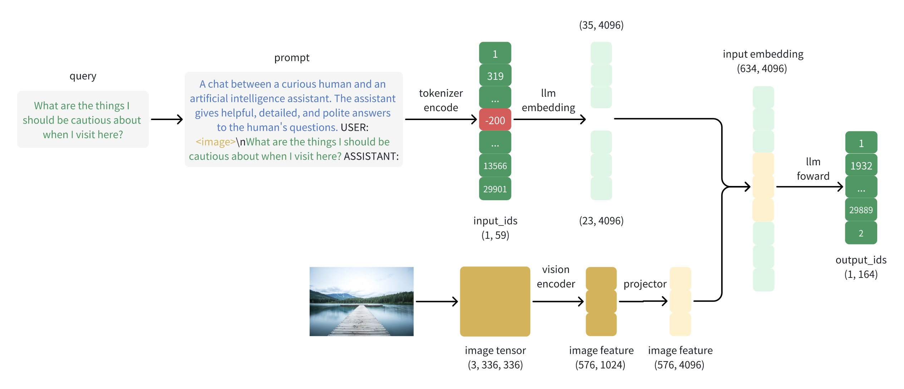

# Unveiling Llava: A Deep Dive into Multi-Modal Language Models

## 1. Introduction
### Overview of Llava
Llava is an advanced language model that integrates both language and vision capabilities to handle multimodal inputs. Built upon the foundations of powerful language models like GPT and Llama, Llava extends their functionality by incorporating visual information. This integration allows Llava to process and understand inputs that include both text and images, making it a versatile tool for a wide range of applications, from generating descriptive text based on images to answering questions about visual content.



### How Llava Works Conceptually
The Llava model operates by seamlessly integrating natural language processing (NLP) and computer vision techniques to handle multimodal inputs, including both text and images. Here's a step-by-step breakdown of how Llava works conceptually:

#### Query and Prompt
- **Query**: The process begins with a query, such as "What are the things I should be cautious about when I visit here?"
- **Prompt Construction**: The query is incorporated into a structured prompt, which provides context for the AI assistant to generate a relevant response. The prompt might look like this:

#### Tokenizer and Encoding
- **Tokenization**: The text prompt is tokenized into a sequence of token IDs. A special token `-200` is used as a placeholder for the image within this sequence.
- **Input IDs**: The tokenized input IDs are represented as a tensor with a specific shape, indicating the number of tokens and their IDs.

#### LLM Embedding
- **Text Embedding**: The input IDs are converted into embeddings through a language model embedding layer. These embeddings represent the text in a high-dimensional space suitable for processing by the model.

#### Image Processing
- **Image Tensor**: The provided image is converted into an image tensor, which is a numerical representation of the image's pixel values.
- **Vision Encoding**: The image tensor is passed through a vision encoder, such as a CLIP model, which extracts high-level features from the image. These features capture important visual information in a compact form.
- **Projection**: The extracted image features are then processed through a projector to match the dimensionality of the text embeddings. This step ensures that both text and image features can be integrated seamlessly.

#### Integration of Text and Image Features
- **Combining Embeddings**: The text embeddings and projected image features are combined to form a unified representation. This multimodal embedding allows the model to consider both textual and visual information simultaneously.

#### Forward Pass and Output Generation
- **Model Forward Pass**: The combined embeddings are fed into the transformer layers of the language model. These layers process the embeddings to generate contextually relevant outputs.
- **Output IDs**: The model generates a sequence of output token IDs, which can be decoded back into human-readable text. This output sequence provides a response to the original query, considering both the text and the visual context provided by the image.

#### Example Workflow
1. **Input**: "What are the things I should be cautious about when I visit here?" along with an image.
2. **Tokenization**: The text is tokenized, and a placeholder token represents the image.
3. **Embedding**: The text is converted into embeddings, and the image is encoded into features.
4. **Integration**: Text embeddings and image features are combined.
5. **Processing**: The combined embeddings are processed through the model's layers.
6. **Output**: The model generates a coherent response, integrating both textual and visual information.

### Importance of Multi-Modal Models
The development of multimodal models like Llava is a significant advancement in the field of artificial intelligence for several reasons:
1. **Enhanced Understanding**: Multimodal models can understand and interpret complex information that involves both text and visual elements. This makes them more effective in tasks that require contextual awareness and nuanced understanding, such as describing an image or answering questions about a scene.
2. **Versatility in Applications**: By integrating vision and language capabilities, multimodal models can be applied in a variety of domains, including healthcare (analyzing medical images and reports), education (providing visual explanations and descriptions), and entertainment (creating interactive content).
3. **Improved User Interaction**: These models can offer more natural and intuitive interactions with users. For example, a multimodal AI assistant can understand and respond to queries that involve both spoken language and visual cues, providing more accurate and contextually relevant responses.


## 2. General Settings of Llava-v1.6
These tables categorize and explain each setting in the configuration, providing a clear understanding of how the Llava-v1.6-vicuna-7b model is set up and what each parameter controls. Understanding these settings is crucial for learning how Llava works.

For more details, you can refer to the source: [Llava-v1.6-vicuna-7b Configuration](https://huggingface.co/liuhaotian/llava-v1.6-vicuna-7b/raw/main/config.json).

### General Settings

| **Setting**               | **Value**                          | **Description**                                              |
|---------------------------|------------------------------------|--------------------------------------------------------------|
| `_name_or_path`           | `./checkpoints/vicuna-7b-v1-5`     | Path to the model checkpoints.                               |
| `architectures`           | `["LlavaLlamaForCausalLM"]`        | Specifies the model architecture.                            |
| `model_type`              | `llava`                            | Indicates the type of the model.                             |
| `transformers_version`    | `4.36.2`                           | Version of the Transformers library used.                    |

### Token Settings

| **Setting**               | **Value**                          | **Description**                                              |
|---------------------------|------------------------------------|--------------------------------------------------------------|
| `bos_token_id`            | `1`                                | ID of the beginning-of-sequence token.                       |
| `eos_token_id`            | `2`                                | ID of the end-of-sequence token.                             |
| `pad_token_id`            | `0`                                | ID of the padding token.                                     |
| `tokenizer_model_max_length` | `4096`                         | Maximum length of input sequences for the tokenizer.         |
| `tokenizer_padding_side`  | `right`                            | Side to apply padding (right side).                          |

### Model Architecture Settings

| **Setting**               | **Value**                          | **Description**                                              |
|---------------------------|------------------------------------|--------------------------------------------------------------|
| `hidden_act`              | `silu`                             | Activation function used in the hidden layers.               |
| `hidden_size`             | `4096`                             | Dimensionality of the hidden layers.                         |
| `intermediate_size`       | `11008`                            | Size of the intermediate feed-forward layers.                |
| `max_position_embeddings` | `4096`                             | Maximum number of position embeddings.                       |
| `num_attention_heads`     | `32`                               | Number of attention heads in each attention layer.           |
| `num_hidden_layers`       | `32`                               | Number of hidden layers in the transformer.                  |
| `num_key_value_heads`     | `32`                               | Number of key-value heads in the multi-head attention mechanism. |
| `initializer_range`       | `0.02`                             | Standard deviation of the truncated normal initializer.      |
| `rms_norm_eps`            | `0.00001`                          | Epsilon value used in RMS normalization layers.              |

### Vision Model Settings

| **Setting**               | **Value**                          | **Description**                                              |
|---------------------------|------------------------------------|--------------------------------------------------------------|
| `mm_vision_tower`         | `openai/clip-vit-large-patch14-336`| Vision model used, specifically a variant of the CLIP model. |
| `image_aspect_ratio`      | `anyres`                           | Indicates that images of any resolution can be processed.    |
| `image_crop_resolution`   | `224`                              | Resolution to which images are cropped.                      |
| `image_split_resolution`  | `224`                              | Resolution to which images are split for processing.         |
| `image_grid_pinpoints`    | `[[336, 672], [672, 336], [672, 672], [1008, 336], [336, 1008]]` | Specific resolutions for multiscale processing. |

### Multi-Modal Settings

| **Setting**               | **Value**                          | **Description**                                              |
|---------------------------|------------------------------------|--------------------------------------------------------------|
| `mm_hidden_size`          | `1024`                             | Hidden size for the multi-modal projector.                   |
| `mm_patch_merge_type`     | `spatial_unpad`                    | Type of patch merging to use, in this case, spatial unpadding. |
| `mm_projector_type`       | `mlp2x_gelu`                       | Type of projector, a multi-layer perceptron with GELU activation. |
| `mm_vision_select_feature`| `patch`                            | Type of feature to select from the vision model outputs.     |
| `mm_vision_select_layer`  | `-2`                               | Layer from which to select features in the vision model.     |
| `mm_vision_tower_lr`      | `0.000002`                         | Learning rate for the vision tower.                          |

### Optimization Settings

| **Setting**               | **Value**                          | **Description**                                              |
|---------------------------|------------------------------------|--------------------------------------------------------------|
| `pretraining_tp`          | `1`                                | Pre-training tensor parallelism factor.                      |
| `tie_word_embeddings`     | `false`                            | Whether to tie input and output embeddings.                  |
| `torch_dtype`             | `bfloat16`                         | Data type used for tensors in PyTorch.                       |

### Miscellaneous Settings

| **Setting**               | **Value**                          | **Description**                                              |
|---------------------------|------------------------------------|--------------------------------------------------------------|
| `attention_bias`          | `false`                            | Indicates whether to use attention bias.                     |
| `attention_dropout`       | `0`                                | Dropout rate for the attention layers.                       |
| `freeze_mm_mlp_adapter`   | `false`                            | Indicates whether to freeze the multi-modal MLP adapter during training. |
| `freeze_mm_vision_resampler` | `false`                        | Indicates whether to freeze the vision resampler during training. |
| `mm_projector_lr`         | `null`                             | Learning rate for the multi-modal projector (not specified).  |
| `mm_resampler_type`       | `null`                             | Type of resampler for the multi-modal projector (not specified). |
| `mm_use_im_patch_token`   | `false`                            | Whether to use image patch tokens.                           |
| `mm_use_im_start_end`     | `false`                            | Whether to use image start and end tokens.                   |
| `rope_scaling`            | `null`                             | Scaling factor for rotary positional embeddings.             |
| `rope_theta`              | `10000`                            | Base for rotary positional embeddings.                       |
| `tune_mm_mlp_adapter`     | `false`                            | Whether to tune the multi-modal MLP adapter.                 |
| `tune_mm_vision_resampler`| `false`                            | Whether to tune the vision resampler.                        |
| `unfreeze_mm_vision_tower`| `true`                             | Whether to unfreeze the vision tower during training.        |
| `use_cache`               | `true`                             | Whether to use caching in the transformer.                   |
| `use_mm_proj`             | `true`                             | Whether to use the multi-modal projector.                    |
| `vocab_size`              | `32000`                            | Size of the vocabulary.                                      |


## 3. Implementation Details
In this article, we will explore the key classes and functions involved in the implementation of Llava, a multi-modal language model. The following table provides an overview of these components and their descriptions, which will be introduced and discussed in detail throughout the article:

| **Class/Function**          | **Description**                                                              |
|-----------------------------|------------------------------------------------------------------------------|
| `CLIPVisionTower`           | Handles the vision processing component of the CLIP model, including feature selection and forward pass for extracting image features.          |
| `CLIPVisionTowerS2`         | Extends `CLIPVisionTower` to handle multiscale image inputs, adjusting the vision tower model for different scales.                              |
| `build_vision_tower`        | Builds the appropriate vision tower (standard or multiscale) based on the provided configuration.                                                |
| `build_vision_projector`    | Builds a vision projector based on the provided configuration, supporting linear, MLP with GELU, and identity projectors.                        |
| `LlavaConfig`               | Extends `LlamaConfig` for the Llava model type, setting the model type to "llava_llama".                                                         |
| `LlavaMetaModel`            | Base class for models that incorporate vision and language components, including initialization and configuration of vision modules.             |
| `LlavaLlamaModel`           | Integrates `LlavaMetaModel` and `LlamaModel` to create a multi-modal model.                                                                      |
| `LlavaMetaForCausalLM`      | Abstract base class for causal language models with vision capabilities, including methods for preparing inputs and labels for a multi-modal model. |
| `LlavaLlamaForCausalLM`     | Causal language model with vision capabilities, combining `LlamaForCausalLM` and `LlavaMetaForCausalLM`, including forward pass and generation methods. |

### class CLIPVisionTower
The `CLIPVisionTower` class in `clip_encoder.py` is a PyTorch module that wraps a pretrained vision model from the CLIP (Contrastive Language–Image Pretraining) framework. It's used to extract features from images.

**Breakdown of its main components:**
- **`__init__`**: 
  - This is the constructor. It initializes the class with the name of the vision model to use, some configuration arguments, and a flag indicating whether to delay loading the model. 
  - If the model should not be delayed or needs to be unfrozen, it's loaded immediately. Otherwise, only the configuration is loaded.

- **`load_model`**: 
  - This method loads the pretrained vision model and image processor if they haven't been loaded yet. 
  - The model's gradients are turned off because it's used for feature extraction, not training.

- **`feature_select`**: 
  - This method selects which features to extract from the output of the vision model. 
  - The selection is based on the `select_layer` and `select_feature` attributes. 
  - If `select_feature` is 'patch', it selects all features except the first one. If it's 'cls_patch', it selects all features. Any other value raises an error.

- **`forward`**: 
  - This method runs the vision model on a batch of images and extracts the selected features. 
  - The images can be a list or a tensor. The output is a tensor of features.

- **`dummy_feature`**: 
  - This method returns a dummy feature tensor filled with zeros. 
  - It's useful for testing or when real features aren't available.

- **Properties**: These provide easy access to commonly used attributes of the vision model or its configuration.
  - **`dtype`**
  - **`device`**
  - **`config`**
  - **`hidden_size`**
  - **`num_patches_per_side`**
  - **`num_patches`**

```python

class CLIPVisionTower(nn.Module):
    """
    CLIPVisionTower handles the vision processing component of the CLIP model.
    
    Args:
        vision_tower (str): The name or path to the vision tower model.
        args: Additional arguments for model configuration.
        delay_load (bool): Whether to delay the loading of the model.

    Attributes:
        is_loaded (bool): Indicates if the model is loaded.
        vision_tower_name (str): The name of the vision tower model.
        select_layer (int): The layer from which to select features.
        select_feature (str): The type of feature to select ('patch' or 'cls_patch').
    """
    def __init__(self, vision_tower, args, delay_load=False):
        super().__init__()

        self.is_loaded = False
        self.vision_tower_name = vision_tower
        
        # The code is accessing the mm_vision_select_layer attribute or key of args and assigning its value 
        # to the select_layer attribute of the class instance.
        self.select_layer = args.mm_vision_select_layer
        
        # If mm_vision_select_feature does not exist in args, it will return 'patch' as the default value.
        self.select_feature = getattr(args, 'mm_vision_select_feature', 'patch')

        if not delay_load:
            # The load_model() method loads the vision model and its associated image processor.
            self.load_model()
        elif getattr(args, 'unfreeze_mm_vision_tower', False):
            # The load_model() method loads the vision model and its associated image processor.
            self.load_model()
        else:
            # Otherwise, it only loads the configuration of the vision model using the from_pretrained method
            # of the CLIPVisionConfig class.
            self.cfg_only = CLIPVisionConfig.from_pretrained(self.vision_tower_name)

    def load_model(self, device_map=None):
        """
        Loads the vision tower model and its associated image processor.

        Args:
            device_map: Device map for distributed loading (optional).
        """
        if self.is_loaded:
            print('{} is already loaded, `load_model` called again, skipping.'.format(self.vision_tower_name))
            return

        # initializes an image processor using the CLIPImageProcessor.from_pretrained method. 
        # This method loads a pretrained model specified by self.vision_tower_name.
        self.image_processor = CLIPImageProcessor.from_pretrained(self.vision_tower_name)
        
        # initializes a vision model, again using a pretrained model specified by self.vision_tower_name. 
        # The device_map argument is used to specify the device (or devices) on which the model should be loaded.
        self.vision_tower = CLIPVisionModel.from_pretrained(self.vision_tower_name, device_map=device_map)
        
        # sets the requires_grad_ attribute of the vision model to False. 
        # This means that the parameters of the vision model will not be updated during training.
        self.vision_tower.requires_grad_(False)

        self.is_loaded = True

    def feature_select(self, image_forward_outs):
        """
        Selects features from the vision model outputs based on configuration.

        Args:
            image_forward_outs: Outputs from the vision model forward pass.

        Returns:
            Tensor: Selected image features.
        """
        image_features = image_forward_outs.hidden_states[self.select_layer]
        if self.select_feature == 'patch':
            # The code excludes the class token from the image features. 
            # The class token is typically the first element in the sequence of hidden states, 
            # so image_features[:, 1:] slices the tensor to exclude the first element along the second dimension (the sequence dimension).
            image_features = image_features[:, 1:]
        elif self.select_feature == 'cls_patch':
            # The code includes the class token in the image features. In this case, image_features is left unchanged.
            image_features = image_features
        else:
            raise ValueError(f'Unexpected select feature: {self.select_feature}')
        return image_features

    @torch.no_grad()
    def forward(self, images):
        """
        Forward pass to extract image features.

        Args:
            images (Tensor or list of Tensors): Input images.

        Returns:
            Tensor or list of Tensors: Extracted image features.
        """
        # whether the input images is a list or a single tensor.
        if type(images) is list:
            image_features = []
            for image in images:
                # For each image, it performs a forward pass through the vision_tower model, 
                # which is presumably a pre-trained vision model that extracts features from images. 
                # The image is moved to the specified device and data type before being passed to the model. 
                # The unsqueeze(0) operation is used to add an extra dimension to the image tensor, 
                # as the model likely expects a batch of images, not a single image. 
                # The output_hidden_states=True argument indicates that the model should return all hidden states, 
                # not just the final output. The features are then selected from the model's output using 
                # the feature_select method and appended to the image_features list.
                image_forward_out = self.vision_tower(image.to(device=self.device, dtype=self.dtype).unsqueeze(0), output_hidden_states=True)
                image_feature = self.feature_select(image_forward_out).to(image.dtype)
                image_features.append(image_feature)
        else:
            # It performs a forward pass through the vision_tower model with this batch of images, 
            # selects the features from the model's output using the feature_select method, and assigns the result to image_features.
            image_forward_outs = self.vision_tower(images.to(device=self.device, dtype=self.dtype), output_hidden_states=True)
            image_features = self.feature_select(image_forward_outs).to(images.dtype)

        return image_features

    @property
    def dummy_feature(self):
        """
        Returns a dummy feature tensor for the vision tower.

        Returns:
            Tensor: Dummy feature tensor.
        """
        return torch.zeros(1, self.hidden_size, device=self.device, dtype=self.dtype)

    @property
    def dtype(self):
        """
        Returns the data type of the vision tower.

        Returns:
            torch.dtype: Data type of the vision tower.
        """
        return self.vision_tower.dtype

    @property
    def device(self):
        """
        Returns the device of the vision tower.

        Returns:
            torch.device: Device of the vision tower.
        """
        return self.vision_tower.device

    @property
    def config(self):
        """
        Returns the configuration of the vision tower.

        Returns:
            Config: Configuration of the vision tower.
        """
        if self.is_loaded:
            return self.vision_tower.config
        else:
            return self.cfg_only

    @property
    def hidden_size(self):
        """
        Returns the hidden size of the vision tower.

        Returns:
            int: Hidden size of the vision tower.
        """
        return self.config.hidden_size

    @property
    def num_patches_per_side(self):
        """
        Returns the number of patches per side of the image.

        Returns:
            int: Number of patches per side.
        """
        return self.config.image_size // self.config.patch_size

    @property
    def num_patches(self):
        """
        Returns the total number of patches in the image.

        Returns:
            int: Total number of patches.
        """
        return (self.config.image_size // self.config.patch_size) ** 2
```

### class CLIPVisionTowerS2
The `CLIPVisionTowerS2` class extends the `CLIPVisionTower` to handle multiscale image inputs. It adjusts the vision tower model for different scales, enhancing its ability to process images of various sizes effectively.

**Breakdown of its main components:**
- **`__init__`**:
  - This is the constructor. It initializes the class with the name or path of the vision tower model, additional arguments for model configuration, and a flag indicating whether to delay loading the model.
  - It sets up the scales for multiscale processing, determines the split size and maximum image size for scaling, and tries to import the `s2wrapper` package for multiscale processing.

- **`load_model`**:
  - This method loads the vision tower model and its associated image processor if they haven't been loaded yet.
  - It updates the image processor's resize and crop size to the largest image size in the `s2_scales`.

- **`forward_feature`**:
  - This method performs a forward pass to extract image features from the vision tower.
  - It runs the vision model on the input images and extracts the selected features.

- **`forward`**:
  - This method performs a forward pass to extract image features using multiscale processing.
  - It processes the input images through the vision model at different scales and returns the extracted features.

- **Properties**:
  - **`hidden_size`**:
    - Returns the hidden size of the vision tower, adjusted for multiscale processing.
    - This is calculated as the product of the hidden size from the configuration and the number of scales.

Here is a table highlighting the major differences between `CLIPVisionTower` and `CLIPVisionTowerS2`:

| **Feature**                    | **CLIPVisionTower**                                                    | **CLIPVisionTowerS2**                                                           |
|--------------------------------|------------------------------------------------------------------------|---------------------------------------------------------------------------------|
| **Primary Purpose**            | To handle vision processing for single-scale image inputs.             | To handle vision processing for multiscale image inputs.                        |
| **Image Processing**           | Processes images at a single resolution or scale.                      | Processes images at multiple resolutions or scales.                             |
| **Feature Extraction**         | Extracts features from images using a pre-trained vision model.        | Extracts features from images at different scales using a pre-trained vision model. |
| **Use Case**                   | Suitable for applications where images are processed at a fixed size.  | Suitable for applications requiring robust feature extraction across varying image sizes and resolutions. |
| **Model Loading**                  | Loads the vision model and its associated image processor.                                         | Inherits model loading and additionally adjusts the image processor's resize/crop size for multiscale.       |
| **Forward Method**                 | - Processes single-scale images.                                                                   | - Processes multiscale images using `multiscale_forward`.                                                    |
|                                    | - Extracts image features by running the vision model on a batch of images.                        | - Uses `self.forward_feature` method to handle multiscale processing for each image.                         |
|                                    | - Directly runs the vision model on input images and extracts features.                            | - Calls `multiscale_forward` method with `self.forward_feature`, `images`, `s2_scales`, and `s2_split_size`. |

<br/>

```python
class CLIPVisionTowerS2(CLIPVisionTower):
    """
    CLIPVisionTowerS2 extends CLIPVisionTower to handle multiscale image inputs.
    
    Args:
        vision_tower (str): The name or path to the vision tower model.
        args: Additional arguments for model configuration.
        delay_load (bool): Whether to delay the loading of the model.
    
    Attributes:
        s2_scales (list): List of scales for multiscale processing.
        s2_split_size (int): Split size for processing.
        s2_image_size (int): Maximum image size for scaling.
    """
    def __init__(self, vision_tower, args, delay_load=False):
        # calls the initialization method of the superclass, passing in the arguments vision_tower, args, and delay_load.
        super().__init__(vision_tower, args, delay_load)

        # If s2_scales does not exist in args, it will return a default value of '336,672,1008' 
        # The value of s2_scales is then transformed into a list of integers. 
        # The split method is used to split the string into a list of substrings using the comma (,) as a delimiter. 
        # The map function is then used to apply the int function to each substring, converting them into integers. 
        # Collects each item of an iterable (like a list) and returns a list of the results.
        # The list of integers is then sorted in ascending order using the sort method.
        self.s2_scales = getattr(args, 's2_scales', '336,672,1008')
        self.s2_scales = list(map(int, self.s2_scales.split(',')))
        self.s2_scales.sort()
        
        # Finally, the first and last elements of the sorted list are assigned to the
        # attributes s2_split_size and s2_image_size, respectively. 
        self.s2_split_size = self.s2_scales[0]
        self.s2_image_size = self.s2_scales[-1]

        # In the try block, the script attempts to import the forward function from the s2wrapper package
        # and assigns it to the multiscale_forward attribute of the current object (self).
        # The s2wrapper package is not a standard Python library, so it needs to be installed separately.
        # If the s2wrapper package is not found, Python raises an ImportError.
        # This is where the except block comes into play.
        try:
            from s2wrapper import forward as multiscale_forward
        except ImportError:
            raise ImportError('Package s2wrapper not found! Please install by running: \npip install git+https://github.com/bfshi/scaling_on_scales.git')
        
        # The purpose of this multiscale processing is to ensure that the model captures features from the images at different 
        # resolutions, which can be important for recognizing objects and patterns that may appear differently at various scales.
        # This approach helps the model to be more robust and capable of handling images of varying sizes and resolutions.
        self.multiscale_forward = multiscale_forward

        # resizing or cropping an image to the largest image size in s2_scale
        if not delay_load or getattr(args, 'unfreeze_mm_vision_tower', False):
            self.image_processor.size['shortest_edge'] = self.s2_image_size
            self.image_processor.crop_size['height'] = self.image_processor.crop_size['width'] = self.s2_image_size

    def load_model(self, device_map=None):
        """
        Loads the vision tower model and its associated image processor.

        Args:
            device_map: Device map for distributed loading (optional).
        """
        if self.is_loaded:
            print('{} is already loaded, `load_model` called again, skipping.'.format(self.vision_tower_name))
            return
        
        # initializes an image processor using the CLIPImageProcessor.from_pretrained method. 
        # This method loads a pretrained model specified by self.vision_tower_name.
        self.image_processor = CLIPImageProcessor.from_pretrained(self.vision_tower_name)
        
        # initializes a vision model, again using a pretrained model specified by self.vision_tower_name. 
        # The device_map argument is used to specify the device (or devices) on which the model should be loaded.
        self.vision_tower = CLIPVisionModel.from_pretrained(self.vision_tower_name, device_map=device_map)
        
        # sets the requires_grad_ attribute of the vision model to False. 
        # This means that the parameters of the vision model will not be updated during training.
        self.vision_tower.requires_grad_(False)

        # resizing or cropping an image to the largest image size in s2_scale
        self.image_processor.size['shortest_edge'] = self.s2_image_size
        self.image_processor.crop_size['height'] = self.image_processor.crop_size['width'] = self.s2_image_size

        self.is_loaded = True

    @torch.no_grad()
    def forward_feature(self, images):
        """
        Forward pass to extract image features from the vision tower.

        Args:
            images (Tensor): Input images.

        Returns:
            Tensor: Extracted image features.
        """
        # The images are first moved to the specified device (like a GPU or CPU) and converted to the specified data type.
        # The output_hidden_states=True argument indicates that the model should return its hidden states,
        # which are intermediate outputs of the model's layers.
        image_forward_outs = self.vision_tower(images.to(device=self.device, dtype=self.dtype), output_hidden_states=True)
        
        # selects features from the vision model's output based on the configuration.
        # The selected features are then converted to the same data type as the input images using.
        image_features = self.feature_select(image_forward_outs).to(images.dtype)
        return image_features

    @torch.no_grad()
    def forward(self, images):
        """
        Forward pass to extract image features using multiscale processing.

        Args:
            images (Tensor or list of Tensors): Input images.

        Returns:
            Tensor or list of Tensors: Extracted image features.
        """
        # NOTE:
        # The purpose of this multiscale processing is to ensure that the model captures features from the images at different 
        # resolutions, which can be important for recognizing objects and patterns that may appear differently at various scales.
        # This approach helps the model to be more robust and capable of handling images of varying sizes and resolutions.
        
        # whether the input images is a list or a single tensor.
        if type(images) is list:
            # In this block, an empty list image_features is initialized. 
            image_features = []
            for image in images:
                # The multiscale_forward method is called with self.forward_feature, image.unsqueeze(0), self.s2_scales, 
                # and self.s2_split_size as arguments. The unsqueeze(0) function is typically used in PyTorch to
                # add an extra dimension to the tensor, which is often required when passing it to a model. 
                # The result of this method call, image_feature, is then appended to the image_features list.
                image_feature = self.multiscale_forward(self.forward_feature, image.unsqueeze(0), img_sizes=self.s2_scales, max_split_size=self.s2_split_size)
                image_features.append(image_feature)
        else:
            # This results in a richer and more comprehensive feature set that takes into account the details present at different resolutions.
            image_features = self.multiscale_forward(self.forward_feature, images, img_sizes=self.s2_scales, max_split_size=self.s2_split_size)

        return image_features

    @property
    def hidden_size(self):
        """
        Returns the hidden size of the vision tower, adjusted for multiscale processing.

        Returns:
            int: Hidden size of the vision tower.
        """
        return self.config.hidden_size * len(self.s2_scales)
```

### build_vision_tower() function
The build_vision_tower function constructs an appropriate vision tower based on the provided configuration. It takes a configuration object (vision_tower_cfg) and additional arguments (**kwargs). The function determines the type of vision tower (either standard or multiscale) to build by checking the mm_vision_tower or vision_tower attribute in the configuration and the existence of an absolute path. If the vision tower is found and specified to use multiscale processing (s2), it returns an instance of CLIPVisionTowerS2; otherwise, it returns an instance of CLIPVisionTower. If the vision tower is unknown, a ValueError is raised. 

The purpose of using build_vision_tower is to dynamically construct the vision processing component of the model based on configuration settings, ensuring flexibility and adaptability to different vision models and processing requirements.

```python
def build_vision_tower(vision_tower_cfg, **kwargs):
    """
    Builds the appropriate vision tower (standard or multiscale) based on configuration.

    Args:
        vision_tower_cfg: Configuration object for the vision tower.
        **kwargs: Additional arguments.

    Returns:
        CLIPVisionTower or CLIPVisionTowerS2: The constructed vision tower object.
    """
    vision_tower = getattr(vision_tower_cfg, 'mm_vision_tower', getattr(vision_tower_cfg, 'vision_tower', None))
    is_absolute_path_exists = os.path.exists(vision_tower)
    use_s2 = getattr(vision_tower_cfg, 's2', False)
    
    if is_absolute_path_exists or vision_tower.startswith("openai") or vision_tower.startswith("laion") or "ShareGPT4V" in vision_tower:
        # The use_s2 variable is set to the value of the s2 attribute in vision_tower_cfg, defaulting to False if it doesn't exist.
        # Depending on these conditions, the function either returns an instance of CLIPVisionTowerS2 or CLIPVisionTower, 
        # or raises a ValueError if the vision_tower is unknown.
        if use_s2:
            return CLIPVisionTowerS2(vision_tower, args=vision_tower_cfg, **kwargs)
        else:
            return CLIPVisionTower(vision_tower, args=vision_tower_cfg, **kwargs)

    raise ValueError(f'Unknown vision tower: {vision_tower}')
```

### build_vision_projector() function
The build_vision_projector function creates a vision projector module based on the given configuration. It accepts a configuration object (config), an optional delay_load flag, and additional arguments (**kwargs). The function identifies the projector type from the configuration (mm_projector_type), defaulting to 'linear'. Depending on the projector type, it constructs either a single linear layer for a linear projector, a sequence of linear layers with GELU activation for an MLP projector (matching the depth specified), or an identity projector that performs no operation. If the projector type is unknown, a ValueError is raised. 

The purpose of using build_vision_projector is to create the module responsible for projecting vision features into the appropriate format for further processing and integration with other model components, based on specific configuration settings.

```python
def build_vision_projector(config, delay_load=False, **kwargs):
    """
    Builds a vision projector based on the configuration.

    Args:
        config: Configuration object with the projector type and other parameters.
        delay_load (bool): Whether to delay the loading of the projector.
        **kwargs: Additional arguments.

    Returns:
        nn.Module: The vision projector module.
    """
    projector_type = getattr(config, 'mm_projector_type', 'linear')

    if projector_type == 'linear':
        # Linear projector: a single linear layer
        return nn.Linear(config.mm_hidden_size, config.hidden_size)

    mlp_gelu_match = re.match(r'^mlp(\d+)x_gelu$', projector_type)
    if mlp_gelu_match:
        mlp_depth = int(mlp_gelu_match.group(1))
        modules = [nn.Linear(config.mm_hidden_size, config.hidden_size)]
        
        # MLP projector: a sequence of linear layers with GELU activation in between
        for _ in range(1, mlp_depth):
            modules.append(nn.GELU())
            modules.append(nn.Linear(config.hidden_size, config.hidden_size))
        return nn.Sequential(*modules)

    if projector_type == 'identity':
        # Identity projector: a no-op transformation
        return IdentityMap()

    raise ValueError(f'Unknown projector type: {projector_type}')
```

### class LlavaConfig
The LlavaConfig class extends the LlamaConfig class to specifically configure the Llava model type. It inherits all the configuration settings and properties of LlamaConfig while adding a unique identifier to denote its model type as "llava_llama". This class is used to set up and customize the Llava model, which integrates both vision and language processing capabilities. 

By extending LlamaConfig, LlavaConfig ensures that all necessary configurations for the Llama model are included, while also allowing for additional configurations specific to the Llava model.

Main components of `LlamaConfig` class:
- **Attributes**:
  - **`vocab_size`**: Specifies the size of the vocabulary used by the model.
  - **`hidden_size`**: Determines the dimensionality of the hidden layers in the transformer.
  - **`num_hidden_layers`**: Sets the number of hidden layers in the transformer model.
  - **`num_attention_heads`**: Defines the number of attention heads for each attention layer in the transformer.
  - **`intermediate_size`**: Specifies the size of the "intermediate" (i.e., feed-forward) layer in the transformer.
  - **`hidden_act`**: The activation function to use (e.g., "relu" or "gelu").
  - **`max_position_embeddings`**: The maximum length of input sequences that the model can process.
  - **`layer_norm_eps`**: The epsilon parameter used in layer normalization layers to avoid division by zero.
  - **`initializer_range`**: The standard deviation of the truncated normal initializer for initializing weight matrices.
  - **`bos_token_id`**: The ID of the beginning-of-sequence token.
  - **`eos_token_id`**: The ID of the end-of-sequence token.

- **Methods**:
  - **`from_pretrained`**: A class method to load a pre-trained model configuration from a specified path or model name. This method ensures that the model configuration is set up with parameters from a pre-trained model, facilitating transfer learning.
  - **`to_dict`**: Converts the configuration instance to a Python dictionary. This method is useful for saving or inspecting the configuration settings.
  - **`update`**: Updates the configuration with new values. This method allows for dynamic changes to the configuration settings, which can be useful during experimentation and fine-tuning.

The `LlamaConfig` class is critical for initializing and managing the LLaMA model's settings, ensuring that all necessary parameters are defined and appropriately configured. This class provides the flexibility to customize the model's architecture and behavior, making it an essential part of the model-building process in the Hugging Face Transformers library.

```python
class LlavaConfig(LlamaConfig):
    """
    LlavaConfig extends LlamaConfig for the Llava model type.
    """
    model_type = "llava_llama"
```

### class LlavaMetaModel
The `LlavaMetaModel` class is a foundational base class designed for models that integrate both vision and language components. It initializes and manages the vision tower model and the multi-modal projector, facilitating the combination of visual and textual features.

**Breakdown of its main components:**
- **`__init__`**:
  - This is the constructor. It initializes the class with a configuration object (`config`).
  - If the configuration includes a vision tower, it builds the vision tower model and the vision projector model.
  - It also sets up an `image_newline` parameter if the configuration specifies unpadding for image features.

- **`get_vision_tower`**:
  - This method retrieves the vision tower model.
  - It ensures that the correct instance of the vision tower is returned, even if the vision tower is a list.

- **`initialize_vision_modules`**:
  - Initializes the vision modules based on the provided arguments (`model_args`) and an optional Fully Sharded Data Parallel (FSDP) configuration.
  - It sets up the vision tower, vision projector, and other necessary configurations.
  - If the vision tower is not already loaded, it builds and initializes it.
  - It also ensures that the multi-modal projector's parameters are set to be trainable and loads pre-trained weights if specified.

- **Attributes**:
  - **`vision_tower`**: The vision tower model built based on the configuration.
  - **`mm_projector`**: The multi-modal projector for combining vision and language features.
  - **`image_newline`**: A parameter for unpadding image features, relevant if the model configuration includes unpadding requirements.

The `LlavaMetaModel` class plays a crucial role in integrating vision and language components, providing methods to initialize, retrieve, and configure the vision tower and multi-modal projector, thus enabling seamless multi-modal processing.

```python

class LlavaMetaModel:
    """
    LlavaMetaModel is a base class for models that incorporate vision and language components.
    
    Args:
        config: Configuration object for the model.

    Attributes:
        vision_tower: Vision tower model built based on the configuration.
        mm_projector: Multi-modal projector for combining vision and language features.
        image_newline: Parameter for unpadding image features.
    """
    def __init__(self, config):
        super(LlavaMetaModel, self).__init__(config)

        if hasattr(config, "mm_vision_tower"):
            # Build the vision tower model
            self.vision_tower = build_vision_tower(config, delay_load=True)
            # Build the vision projector model
            self.mm_projector = build_vision_projector(config)

            # if the mm_patch_merge_type attribute of the config object contains the string 'unpad', 
            # a new parameter named image_newline is created.
            if 'unpad' in getattr(config, 'mm_patch_merge_type', ''):
                # The image_newline parameter is initialized with an empty tensor of size equal to the hidden_size attribute
                # of the config object. The dtype attribute of self is used to determine the data type of the tensor.
                self.image_newline = nn.Parameter(torch.empty(config.hidden_size, dtype=self.dtype))

    def get_vision_tower(self):
        """
        Retrieves the vision tower model.

        Returns:
            The vision tower model.
        """
        # It's attempting to access an attribute named 'vision_tower' from the current object (denoted by 'self').
        vision_tower = getattr(self, 'vision_tower', None)
        if type(vision_tower) is list:
            vision_tower = vision_tower[0]
        return vision_tower

    def initialize_vision_modules(self, model_args, fsdp=None):
        """
        Initializes the vision modules based on the provided arguments.

        Args:
            model_args: Arguments for model configuration.
            fsdp: Fully Sharded Data Parallel configuration (optional).
        """
        vision_tower = model_args.vision_tower
        mm_vision_select_layer = model_args.mm_vision_select_layer
        mm_vision_select_feature = model_args.mm_vision_select_feature
        pretrain_mm_mlp_adapter = model_args.pretrain_mm_mlp_adapter
        mm_patch_merge_type = model_args.mm_patch_merge_type

        self.config.mm_vision_tower = vision_tower

        # Fully Sharded Data Parallel (FSDP) is a model parallelism technique used in deep learning to reduce 
        # the memory footprint of models during training. It works by sharding (splitting) the model parameters
        # and optimizer state across multiple GPUs, so that each GPU only holds a portion of the total model
        # at any given time. This allows for training larger models that would not fit into a single GPU's memory.

        if self.get_vision_tower() is None:
            vision_tower = build_vision_tower(model_args)

            if fsdp is not None and len(fsdp) > 0:
                self.vision_tower = [vision_tower]
            else:
                self.vision_tower = vision_tower
        else:
            if fsdp is not None and len(fsdp) > 0:
                vision_tower = self.vision_tower[0]
            else:
                vision_tower = self.vision_tower
            vision_tower.load_model()

        # Take a looks at following setting:
        # https://huggingface.co/liuhaotian/llava-v1.6-vicuna-7b/blob/main/config.json
        self.config.use_mm_proj = True
        self.config.mm_projector_type = getattr(model_args, 'mm_projector_type', 'linear')
        self.config.mm_hidden_size = vision_tower.hidden_size
        self.config.mm_vision_select_layer = mm_vision_select_layer
        self.config.mm_vision_select_feature = mm_vision_select_feature
        self.config.mm_patch_merge_type = mm_patch_merge_type

        # Check if the multi-modal projector is not already initialized
        # Ensures that the multi-modal projector is correctly initialized and configured
        if getattr(self, 'mm_projector', None) is None:
            # Build the multi-modal projector using the configuration
            self.mm_projector = build_vision_projector(self.config)

            # If the 'mm_patch_merge_type' includes 'unpad', initialize 'image_newline'
            if 'unpad' in mm_patch_merge_type:
                # Calculate the standard deviation for embedding initialization
                embed_std = 1 / torch.sqrt(torch.tensor(self.config.hidden_size, dtype=self.dtype))
                # Initialize 'image_newline' with random values and set the standard deviation
                self.image_newline = nn.Parameter(
                    torch.randn(self.config.hidden_size, dtype=self.dtype) * embed_std
                )
        else:
            # Ensure all parameters of the multi-modal projector are trainable
            for p in self.mm_projector.parameters():
                p.requires_grad = True

        # If pre-trained multi-modal MLP adapter weights are provided
        if pretrain_mm_mlp_adapter is not None:
            # Load the pre-trained weights from the specified path
            mm_projector_weights = torch.load(pretrain_mm_mlp_adapter, map_location='cpu')

            # Helper function to filter and retrieve weights for the multi-modal projector
            def get_w(weights, keyword):
                return {k.split(keyword + '.')[1]: v for k, v in weights.items() if keyword in k}

            # Load the pre-trained weights into the multi-modal projector
            self.mm_projector.load_state_dict(get_w(mm_projector_weights, 'mm_projector'))
```

### class LlavaLlamaModel
The LlavaLlamaModel class integrates the functionalities of LlavaMetaModel and LlamaModel to create a multi-modal model that combines vision and language processing capabilities. It is initialized with a configuration object (config) of type LlamaConfig and utilizes the LlavaConfig class for its configuration settings. By inheriting from both LlavaMetaModel and LlamaModel, LlavaLlamaModel leverages the advanced language modeling features of the Llama model and enhances it with the multi-modal capabilities provided by the LlavaMetaModel.

This integration allows the model to process and generate outputs based on both textual and visual inputs, making it suitable for a wide range of applications that require understanding and generating multi-modal data.

```python
class LlavaLlamaModel(LlavaMetaModel, LlamaModel):
    """
    LlavaLlamaModel integrates LlavaMetaModel and LlamaModel to create a multi-modal model.

    Args:
        config (LlamaConfig): Configuration for the model.
    """
    config_class = LlavaConfig

    def __init__(self, config: LlamaConfig):
        super(LlavaLlamaModel, self).__init__(config)
```

### class LlavaMetaForCausalLM
`LlavaMetaForCausalLM` is an abstract base class designed for causal language models that also incorporate vision capabilities. It provides methods for processing and combining textual and visual data, making it suitable for multi-modal tasks.

**Breakdown of its main components:**
- **`get_model`**:
  - Abstract method that must be implemented by subclasses to return the model instance.
- **`get_vision_tower`**:
  - Retrieves the vision tower from the model.
- **`encode_images`**:
  - Encodes images using the vision tower and the multi-modal projector.
- **`prepare_inputs_labels_for_multimodal`**:
  - Prepares inputs and labels for a multi-modal model by processing and encoding images, preparing text inputs, combining text and image features, and finalizing the batch.
- **`_process_images`**:
  - Processes and encodes images. It handles both list and tensor input formats, concatenates images, and splits them into individual features.
- **`_reshape_image_features`**:
  - Reshapes image features based on configuration, either flattening or merging spatial patches.
- **`_spatial_patch_merge`**:
  - Merges spatial patches of image features, handling various image sizes and configurations.
- **`_unpad_image_features`**:
  - Unpads image features to handle padding added during preprocessing.
- **`_prepare_text_inputs`**:
  - Prepares text inputs by handling attention masks, position IDs, and labels, ensuring proper alignment and masking.
- **`_combine_text_image_features`**:
  - Combines text and image features into a single batch, handling cases with and without image tokens.
- **`_embed_tokens`**:
  - Embeds input tokens and optionally combines them with image features.
- **`_split_image_tokens`**:
  - Splits image tokens from text tokens, preparing them for combination with image features.
- **`_insert_image_features`**:
  - Inserts image features into text embeddings at the appropriate positions.
- **`_finalize_batch`**:
  - Pads sequences to the maximum length and combines them into a single batch, ensuring proper alignment and masking.
- **`initialize_vision_tokenizer`**:
  - Initializes the tokenizer with vision tokens if needed, handling new tokens and embedding resizing.

LLaVA Model Flow Chart:
<br/>

```python
class LlavaMetaForCausalLM(ABC):
    """
    LlavaMetaForCausalLM is an abstract base class for causal language models with vision capabilities.
    """

    @abstractmethod
    def get_model(self):
        """
        Abstract method to get the model instance. Must be implemented by subclasses.
        """
        pass

    def get_vision_tower(self):
        """
        Retrieves the vision tower from the model.

        Returns:
            The vision tower model.
        """
        return self.get_model().get_vision_tower()

    def encode_images(self, images):
        """
        Encodes images using the vision tower and the multi-modal projector.

        Args:
            images (Tensor): Input images.

        Returns:
            Tensor: Encoded image features.
        """
        # The get_vision_tower() method is then called on the model instance returned by get_model(). 
        # This method is expected to return the vision tower, which is a component of the model that processes image data. 
        # The images are passed to the vision tower by calling it like a function with images as the 
        # argument 'get_vision_tower()(images)'. The processed image features are stored in the image_features variable.
        image_features = self.get_model().get_vision_tower()(images)
        
        # The mm_projector method is called on the model instance, with the processed image features as the argument.
        # The mm_projector (multi-modal projector) is another component of the model that transforms the features into
        # a common embedding space. The transformed features are again stored in the image_features variable.
        image_features = self.get_model().mm_projector(image_features)
        return image_features

    def prepare_inputs_labels_for_multimodal(
        self, input_ids, position_ids, attention_mask, past_key_values, labels,
        images, image_sizes=None
    ):
        """
        Prepares inputs and labels for a multi-modal model.

        Args:
            input_ids (Tensor): Input IDs.
            position_ids (Tensor): Position IDs.
            attention_mask (Tensor): Attention mask.
            past_key_values (list): Past key values for caching.
            labels (Tensor): Labels for the inputs.
            images (Tensor): Input images.
            image_sizes (list): Sizes of the input images.

        Returns:
            tuple: Prepared inputs, position IDs, attention mask, past key values, input embeddings, and labels.
        """
        # Retrieve vision tower model
        vision_tower = self.get_vision_tower()
        if vision_tower is None or images is None or input_ids.shape[1] == 1:
            return input_ids, position_ids, attention_mask, past_key_values, None, labels

        # Process and encode images
        image_features = self._process_images(images, image_sizes)

        # Prepare text inputs
        input_ids, attention_mask, position_ids, labels = self._prepare_text_inputs(
            input_ids, position_ids, attention_mask, labels
        )

        # Combine text and image features
        new_input_embeds, new_labels = self._combine_text_image_features(
            input_ids, labels, image_features
        )

        # Finalize and return the batch
        return self._finalize_batch(new_input_embeds, past_key_values, new_labels, attention_mask, position_ids)

    def _process_images(self, images, image_sizes):
        """
        Processes and encodes images.

        Args:
            images (Tensor or list of Tensors): Input images.
            image_sizes (list): Sizes of the input images.

        Returns:
            list of Tensors: Encoded image features.
        """
        if isinstance(images, list) or images.ndim == 5:
            if isinstance(images, list):
                images = [x.unsqueeze(0) if x.ndim == 3 else x for x in images]
            
            # Concatenates all the images in the list into a single tensor along the zeroth dimension.
            # The list comprehension [image for image in images] generates a list of all images, which is then passed to torch.cat().
            concat_images = torch.cat([image for image in images], dim=0)
            
            # It processes the images through a vision tower and a multi-modal projector, and returns the resulting features. 
            image_features = self.encode_images(concat_images)
            
            # The sizes of the original images are calculated using a list comprehension [image.shape[0] for image in images]. 
            # The shape attribute of a tensor returns the dimensions of the tensor, and shape[0] gives the size of the zeroth dimension.
            split_sizes = [image.shape[0] for image in images]
            
            # Split the image_features tensor into a sequence of tensors. 
            # The split_sizes list is passed as the second argument to specify the sizes of the output tensors, 
            # and dim=0 specifies that the splitting should be done along the zeroth dimension.
            image_features = torch.split(image_features, split_sizes, dim=0)
            
            return self._reshape_image_features(image_features, image_sizes)
        else:
            return self.encode_images(images)

    def _reshape_image_features(self, image_features, image_sizes):
        """
        Reshapes image features based on configuration.

        Args:
            image_features (list of Tensors): Encoded image features.
            image_sizes (list): Sizes of the input images.

        Returns:
            list of Tensors: Reshaped image features.
        """
        mm_patch_merge_type = getattr(self.config, 'mm_patch_merge_type', 'flat')
        image_aspect_ratio = getattr(self.config, 'image_aspect_ratio', 'square')

        if mm_patch_merge_type == 'flat':
            # The flatten() method is called on each tensor x in the image_features list. 
            # It will flatten the dimensions from 0 to 1 (inclusive) into a single dimension.
            # The list comprehension [x.flatten(0, 1) for x in image_features] generates a new list 
            # where each element is a flattened version of the corresponding tensor in image_features.
            return [x.flatten(0, 1) for x in image_features]
        elif mm_patch_merge_type.startswith('spatial'):
            # Merges spatial patches of image features.
            return self._spatial_patch_merge(image_features, image_sizes, mm_patch_merge_type, image_aspect_ratio)
        else:
            raise ValueError(f"Unexpected mm_patch_merge_type: {self.config.mm_patch_merge_type}")

    def _spatial_patch_merge(self, image_features, image_sizes, mm_patch_merge_type, image_aspect_ratio):
        """
        Merges spatial patches of image features.

        Args:
            image_features (list of Tensors): Encoded image features.
            image_sizes (list): Sizes of the input images.
            mm_patch_merge_type (str): Merge type for patches.
            image_aspect_ratio (str): Aspect ratio of images.

        Returns:
            list of Tensors: Merged image features.
        """
        new_image_features = []
        for image_idx, image_feature in enumerate(image_features):
            # Checks if the first dimension of the image_feature tensor is greater than 1.
            if image_feature.shape[0] > 1:
                # Retrieves the height and width from the vision tower model
                base_image_feature, image_feature = image_feature[0], image_feature[1:]
                height = width = self.get_vision_tower().num_patches_per_side
                assert height * width == base_image_feature.shape[0]

                if image_aspect_ratio == 'anyres':
                    # The get_anyres_image_grid_shape() function takes these three arguments and returns the 
                    # shape of the image patch grid. If the grid_pinpoints argument is a list, it uses it directly. 
                    # Otherwise, it interprets the string as a list of possible resolutions using the ast.literal_eval function. 
                    # It then selects the best resolution for the given image size from these possible resolutions and divides
                    # the width and height of this resolution by the patch size to get the number of patches in width and height.
                    num_patch_width, num_patch_height = get_anyres_image_grid_shape(
                        image_sizes[image_idx], self.config.image_grid_pinpoints, self.get_vision_tower().config.image_size
                    )
                    
                    # Finally, the image_feature variable is reshaped using the view method to match the calculated grid shape.
                    image_feature = image_feature.view(num_patch_height, num_patch_width, height, width, -1)
                else:
                    raise NotImplementedError

                if 'unpad' in mm_patch_merge_type:
                    # It is used to remove padding from the image features.
                    image_feature = self._unpad_image_features(image_feature, image_sizes[image_idx])
                else:
                    # The image_feature tensor is permuted and then flattened. 
                    # The permute method rearranges the dimensions of the tensor, and the flatten method reduces its dimensions.
                    # The contiguous method is called to ensure that the tensor is stored in a contiguous block of memory.
                    image_feature = image_feature.permute(0, 2, 1, 3, 4).contiguous().flatten(0, 3)
                
                # The dim=0 parameter specifies that the tensors should be concatenated along the first dimension (0-indexed).
                # The result of this operation is a new tensor that combines the data from base_image_feature and image_feature 
                # along the first dimension. 
                image_feature = torch.cat((base_image_feature, image_feature), dim=0)
            else:
                image_feature = image_feature[0]
                if 'unpad' in mm_patch_merge_type:
                    # The torch.cat function is used to concatenate the image_feature tensor with another tensor, 
                    # self.model.image_newline[None].to(image_feature.device). 
                    # The self.model.image_newline[None] part is creating a new dimension in the image_newline tensor, 
                    # and the .to(image_feature.device) part is ensuring that the new tensor is on the same device as image_feature.
                    # The tensors are concatenated along the first dimension (dim=0).
                    image_feature = torch.cat((image_feature, self.model.image_newline[None].to(image_feature.device)), dim=0)
            
            new_image_features.append(image_feature)
        
        return new_image_features
    
    def _unpad_image_features(self, image_feature, original_size):
        """
        Unpads image features.

        Args:
            image_feature (Tensor): Image feature tensor.
            original_size (tuple): Original size of the image.

        Returns:
            Tensor: Unpadded image feature tensor.
        """
        # Permute the dimensions of the image_feature tensor to change its shape from
        # (num_patches_height, num_patches_width, height, width, channels) to 
        # (channels, num_patches_height, height, num_patches_width, width)
        image_feature = image_feature.permute(4, 0, 2, 1, 3).contiguous()
        
        # Flatten the first two dimensions and then the next two dimensions.
        # The shape changes from (channels, num_patches_height, height, num_patches_width, width)
        # to (channels, num_patches_height * height, num_patches_width * width).
        image_feature = image_feature.flatten(1, 2).flatten(2, 3)
        
        # Unpad the image features using the original size to remove any padding added during preprocessing.
        image_feature = unpad_image(image_feature, original_size)
        
        # Concatenate the image features with a new line parameter to handle padding issues.
        # This new line parameter helps to distinguish the end of the image data.
        image_feature = torch.cat(
            (
                image_feature,
                self.model.image_newline[:, None, None].expand(*image_feature.shape[:-1], 1).to(image_feature.device)
            ),
            dim=-1
        )
        
        # Flatten the dimensions again and transpose to get the final shape.
        # The shape changes to (num_patches_height * height * num_patches_width * width, channels)
        return image_feature.flatten(1, 2).transpose(0, 1)

    def _prepare_text_inputs(self, input_ids, position_ids, attention_mask, labels):
        """
        Prepares text inputs by handling attention masks, position IDs, and labels.

        Args:
            input_ids (Tensor): Input IDs.
            position_ids (Tensor): Position IDs.
            attention_mask (Tensor): Attention mask.
            labels (Tensor): Labels for the inputs.

        Returns:
            tuple: Processed input IDs, attention mask, position IDs, and labels.
        """
        # If attention_mask is None, create a mask of ones with the same shape as input_ids.
        if attention_mask is None:
            attention_mask = torch.ones_like(input_ids, dtype=torch.bool)
        else:
            attention_mask = attention_mask.bool()

        # If position_ids is None, create a range tensor for positions.
        if position_ids is None:
            position_ids = torch.arange(0, input_ids.shape[1], dtype=torch.long, device=input_ids.device)

        # If labels are None, create a tensor of IGNORE_INDEX with the same shape as input_ids.
        if labels is None:
            labels = torch.full_like(input_ids, IGNORE_INDEX)

        # Filter input_ids and labels using the attention mask.
        input_ids = [cur_input_ids[cur_attention_mask] for cur_input_ids, cur_attention_mask in zip(input_ids, attention_mask)]
        labels = [cur_labels[cur_attention_mask] for cur_labels, cur_attention_mask in zip(labels, attention_mask)]

        return input_ids, attention_mask, position_ids, labels

    def _combine_text_image_features(self, input_ids, labels, image_features):
        """
        Combines text and image features into a single batch.

        Args:
            input_ids (list of Tensors): Input IDs.
            labels (list of Tensors): Labels for the inputs.
            image_features (list of Tensors): Encoded image features.

        Returns:
            tuple: Combined input embeddings and labels.
        """
        new_input_embeds = []
        new_labels = []
        cur_image_idx = 0
        for batch_idx, cur_input_ids in enumerate(input_ids):
            # Count the number of image tokens in the current input IDs.
            num_images = (cur_input_ids == IMAGE_TOKEN_INDEX).sum()
            if num_images == 0:
                # If there are no image tokens, embed the text tokens.
                cur_input_embeds = self._embed_tokens(cur_input_ids, image_features[cur_image_idx])
                new_input_embeds.append(cur_input_embeds)
                new_labels.append(labels[batch_idx])
                cur_image_idx += 1
                continue

            # Split the input IDs and labels at the image token indices.
            image_token_indices = [-1] + torch.where(cur_input_ids == IMAGE_TOKEN_INDEX)[0].tolist() + [cur_input_ids.shape[0]]
            cur_input_ids_noim, cur_labels_noim, split_sizes = self._split_image_tokens(cur_input_ids, labels[batch_idx], image_token_indices)
            cur_input_embeds_no_im = self._embed_tokens(torch.cat(cur_input_ids_noim))

            # Insert image features into the text embeddings.
            cur_new_input_embeds, cur_new_labels = self._insert_image_features(
                cur_input_embeds_no_im, cur_labels_noim, image_features, cur_image_idx, num_images
            )
            # concatenating a list of tensors into a single tensor and ensuring that the resulting tensor 
            # is on the correct device for further computations.
            cur_new_input_embeds = torch.cat(cur_new_input_embeds).to(self.device)
            cur_new_labels = torch.cat(cur_new_labels)

            new_input_embeds.append(cur_new_input_embeds)
            new_labels.append(cur_new_labels)
        return new_input_embeds, new_labels

    def _embed_tokens(self, input_ids, image_features=None):
        """
        Embeds input tokens and optionally combines them with image features.

        Args:
            input_ids (Tensor): Input IDs.
            image_features (Tensor, optional): Image features.

        Returns:
            Tensor: Embedded tokens.
        """
        input_embeds = self.get_model().embed_tokens(input_ids)
        if image_features is not None:
            # Concatenate the text embeddings and image features if image features are provided.
            input_embeds = torch.cat([input_embeds, image_features[0:0]], dim=0)
        return input_embeds

    def _split_image_tokens(self, cur_input_ids, cur_labels, image_token_indices):
        """
        Splits image tokens from text tokens.

        Args:
            cur_input_ids (Tensor): Current input IDs.
            cur_labels (Tensor): Current labels.
            image_token_indices (list): Indices of image tokens.

        Returns:
            tuple: Split input IDs, labels, and split sizes.
        """
        cur_input_ids_noim = []
        cur_labels_noim = []
        for i in range(len(image_token_indices) - 1):
            # Extract segments of text tokens and labels between image tokens.
            cur_input_ids_noim.append(cur_input_ids[image_token_indices[i]+1:image_token_indices[i+1]])
            cur_labels_noim.append(cur_labels[image_token_indices[i]+1:image_token_indices[i+1]])
        split_sizes = [x.shape[0] for x in cur_labels_noim]
        return cur_input_ids_noim, cur_labels_noim, split_sizes

    def _insert_image_features(self, cur_input_embeds_no_im, cur_labels_noim, image_features, cur_image_idx, num_images):
        """
        Inserts image features into text embeddings.

        Args:
            cur_input_embeds_no_im (Tensor): Text embeddings without image tokens.
            cur_labels_noim (Tensor): Labels without image tokens.
            image_features (Tensor): Encoded image features.
            cur_image_idx (int): Current image index.
            num_images (int): Number of images.

        Returns:
            tuple: Updated input embeddings and labels.
        """
        cur_new_input_embeds = []
        cur_new_labels = []
        for i in range(num_images + 1):
            cur_new_input_embeds.append(cur_input_embeds_no_im[i])
            cur_new_labels.append(cur_labels_noim[i])
            if i < num_images:
                # Insert image features at the appropriate positions.
                cur_image_features = image_features[cur_image_idx]
                cur_image_idx += 1
                cur_new_input_embeds.append(cur_image_features)
                cur_new_labels.append(torch.full((cur_image_features.shape[0],), IGNORE_INDEX, device=cur_labels_noim[i].device, dtype=cur_labels_noim[i].dtype))
        return cur_new_input_embeds, cur_new_labels

    def _finalize_batch(self, new_input_embeds, past_key_values, new_labels, attention_mask, position_ids):
        """
        Pads sequences to the maximum length and combines them into a single batch.

        Args:
            new_input_embeds (list of Tensors): New input embeddings.
            new_labels (list of Tensors): New labels.
            attention_mask (Tensor): Attention mask.
            position_ids (Tensor): Position IDs.

        Returns:
            tuple: Finalized batch of inputs, position IDs, attention mask, past key values, input embeddings, and labels.
        """
        labels = new_labels
        
        # Get the maximum length for the tokenizer model
        tokenizer_model_max_length = getattr(self.config, 'tokenizer_model_max_length', None)
        
        # Truncate input embeddings and labels to the maximum length if it is set
        if tokenizer_model_max_length is not None:
            new_input_embeds = [x[:tokenizer_model_max_length] for x in new_input_embeds]
            new_labels = [x[:tokenizer_model_max_length] for x in new_labels]

        # Determine the maximum sequence length in the batch
        max_len = max(x.shape[0] for x in new_input_embeds)
        batch_size = len(new_input_embeds)

        # Initialize padded tensors for input embeddings, labels, attention mask, and position IDs
        new_input_embeds_padded = []
        new_labels_padded = torch.full((batch_size, max_len), IGNORE_INDEX, dtype=new_labels[0].dtype, device=new_labels[0].device)
        attention_mask = torch.zeros((batch_size, max_len), dtype=attention_mask.dtype, device=attention_mask.device)
        position_ids = torch.zeros((batch_size, max_len), dtype=position_ids.dtype, device=position_ids.device)

        # Iterate over each sequence in the batch
        for i, (cur_new_embed, cur_new_labels) in enumerate(zip(new_input_embeds, new_labels)):
            cur_len = cur_new_embed.shape[0]
            if getattr(self.config, 'tokenizer_padding_side', 'right') == "left":
                # If padding side is 'left', pad on the left
                new_input_embeds_padded.append(torch.cat((
                    torch.zeros((max_len - cur_len, cur_new_embed.shape[1]), dtype=cur_new_embed.dtype, device=cur_new_embed.device),
                    cur_new_embed
                ), dim=0))
                if cur_len > 0:
                    new_labels_padded[i, -cur_len:] = cur_new_labels
                    attention_mask[i, -cur_len:] = True
                    position_ids[i, -cur_len:] = torch.arange(0, cur_len, dtype=position_ids.dtype, device=position_ids.device)
            else:
                # If padding side is 'right', pad on the right
                new_input_embeds_padded.append(torch.cat((
                    cur_new_embed,
                    torch.zeros((max_len - cur_len, cur_new_embed.shape[1]), dtype=cur_new_embed.dtype, device=cur_new_embed.device)
                ), dim=0))
                if cur_len > 0:
                    new_labels_padded[i, :cur_len] = cur_new_labels
                    attention_mask[i, :cur_len] = True
                    position_ids[i, :cur_len] = torch.arange(0, cur_len, dtype=position_ids.dtype, device=position_ids.device)

        # Stack the padded input embeddings into a single tensor
        new_input_embeds = torch.stack(new_input_embeds_padded, dim=0)

        # Set new_labels to None if labels are None
        if labels is None:
            new_labels = None
        else:
            new_labels = new_labels_padded

        # Convert attention_mask to the appropriate data type
        if attention_mask is None:
            attention_mask = None
        else:
            attention_mask = attention_mask.to(dtype=attention_mask.dtype)

        # Ensure position_ids are not None
        if position_ids is None:
            position_ids = None

        return None, position_ids, attention_mask, past_key_values, new_input_embeds, new_labels

    def initialize_vision_tokenizer(self, model_args, tokenizer):
        """
        Initializes the tokenizer with vision tokens if needed.

        Args:
            model_args: Arguments for model configuration.
            tokenizer: The tokenizer to be initialized.
        """
        # Check if the model should use image patch tokens
        if model_args.mm_use_im_patch_token:
            # Add image patch token to the tokenizer and resize the token embeddings
            tokenizer.add_tokens([DEFAULT_IMAGE_PATCH_TOKEN], special_tokens=True)
            self.resize_token_embeddings(len(tokenizer))

        # Check if the model should use image start and end tokens
        if model_args.mm_use_im_start_end:
            # Add start and end tokens to the tokenizer and resize the token embeddings
            num_new_tokens = tokenizer.add_tokens([DEFAULT_IM_START_TOKEN, DEFAULT_IM_END_TOKEN], special_tokens=True)
            self.resize_token_embeddings(len(tokenizer))

            # If new tokens were added, initialize their embeddings
            if num_new_tokens > 0:
                input_embeddings = self.get_input_embeddings().weight.data
                output_embeddings = self.get_output_embeddings().weight.data

                # Compute the average embeddings for input and output embeddings
                input_embeddings_avg = input_embeddings[:-num_new_tokens].mean(dim=0, keepdim=True)
                output_embeddings_avg = output_embeddings[:-num_new_tokens].mean(dim=0, keepdim=True)

                # Assign the average embeddings to the new tokens
                input_embeddings[-num_new_tokens:] = input_embeddings_avg
                output_embeddings[-num_new_tokens:] = output_embeddings_avg

            # Enable or disable training for the input and output embedding parameters
            if model_args.tune_mm_mlp_adapter:
                for p in self.get_input_embeddings().parameters():
                    p.requires_grad = True
                for p in self.get_output_embeddings().parameters():
                    p.requires_grad = False

            # Load pretrained weights for the multi-modal projector if provided
            if model_args.pretrain_mm_mlp_adapter:
                mm_projector_weights = torch.load(model_args.pretrain_mm_mlp_adapter, map_location='cpu')
                embed_tokens_weight = mm_projector_weights['model.embed_tokens.weight']
                assert num_new_tokens == 2  # Ensure exactly two new tokens were added

                # Assign the pretrained weights to the new tokens
                if input_embeddings.shape == embed_tokens_weight.shape:
                    input_embeddings[-num_new_tokens:] = embed_tokens_weight[-num_new_tokens:]
                elif embed_tokens_weight.shape[0] == num_new_tokens:
                    input_embeddings[-num_new_tokens:] = embed_tokens_weight
                else:
                    raise ValueError(f"Unexpected embed_tokens_weight shape. Pretrained: {embed_tokens_weight.shape}. Current: {input_embeddings.shape}. Number of new tokens: {num_new_tokens}.")
        # Check if the model should use image patch tokens without start/end tokens
        elif model_args.mm_use_im_patch_token:
            if model_args.tune_mm_mlp_adapter:
                # Disable training for the input and output embedding parameters
                for p in self.get_input_embeddings().parameters():
                    p.requires_grad = False
                for p in self.get_output_embeddings().parameters():
                    p.requires_grad = False
```

### class LlavaLlamaForCausalLM
The LlavaLlamaForCausalLM is a sophisticated causal language model that integrates vision capabilities, enabling it to handle multimodal inputs, including text and images. Built upon the LlamaForCausalLM architecture, it incorporates the LlavaLlamaModel to process visual information alongside textual data. This model is designed for tasks that require understanding and generating text with contextual visual elements, making it versatile for applications in natural language processing and computer vision. With capabilities for preparing multimodal inputs, generating text, and leveraging pretrained weights, LlavaLlamaForCausalLM is a powerful tool for advanced AI applications.

```python

class LlavaLlamaForCausalLM(LlamaForCausalLM, LlavaMetaForCausalLM):
    """
    LlavaLlamaForCausalLM is a causal language model with vision capabilities.

    Args:
        config (LlamaConfig): Configuration for the model.
    """
    config_class = LlavaConfig

    def __init__(self, config):
        # Initialize the parent class (LlamaForCausalLM) with the provided configuration
        super(LlamaForCausalLM, self).__init__(config)
        
        # Initialize the model with the given configuration
        self.model = LlavaLlamaModel(config)
        
        # Store the pretraining and vocabulary size from the configuration
        self.pretraining_tp = config.pretraining_tp
        self.vocab_size = config.vocab_size
        
        # Define the linear layer for the language model head
        self.lm_head = nn.Linear(config.hidden_size, config.vocab_size, bias=False)

        # Initialize weights and apply final processing
        self.post_init()

    def get_model(self):
        """
        Returns the LlavaLlamaModel instance.

        Returns:
            LlavaLlamaModel: The model instance.
        """
        return self.model

    def forward(
        self,
        input_ids: torch.LongTensor = None,
        attention_mask: Optional[torch.Tensor] = None,
        position_ids: Optional[torch.LongTensor] = None,
        past_key_values: Optional[List[torch.FloatTensor]] = None,
        inputs_embeds: Optional[torch.FloatTensor] = None,
        labels: Optional[torch.LongTensor] = None,
        use_cache: Optional[bool] = None,
        output_attentions: Optional[bool] = None,
        output_hidden_states: Optional[bool] = None,
        images: Optional[torch.FloatTensor] = None,
        image_sizes: Optional[List[List[int]]] = None,
        return_dict: Optional[bool] = None,
    ) -> Union[Tuple, CausalLMOutputWithPast]:
        """
        Forward pass for the model.

        Args:
            input_ids (torch.LongTensor): Input IDs.
            attention_mask (Optional[torch.Tensor]): Attention mask.
            position_ids (Optional[torch.LongTensor]): Position IDs.
            past_key_values (Optional[List[torch.FloatTensor]]): Past key values for caching.
            inputs_embeds (Optional[torch.FloatTensor]): Input embeddings.
            labels (Optional[torch.LongTensor]): Labels for the inputs.
            use_cache (Optional[bool]): Whether to use cache.
            output_attentions (Optional[bool]): Whether to output attentions.
            output_hidden_states (Optional[bool]): Whether to output hidden states.
            images (Optional[torch.FloatTensor]): Input images.
            image_sizes (Optional[List[List[int]]]): Sizes of the input images.
            return_dict (Optional[bool]): Whether to return a dictionary.

        Returns:
            Union[Tuple, CausalLMOutputWithPast]: Model output.
        """
        # If input embeddings are not provided, prepare inputs and labels for the multimodal model
        if inputs_embeds is None:
            (
                input_ids,
                position_ids,
                attention_mask,
                past_key_values,
                inputs_embeds,
                labels
            ) = self.prepare_inputs_labels_for_multimodal(
                input_ids,
                position_ids,
                attention_mask,
                past_key_values,
                labels,
                images,
                image_sizes
            )

        # Call the forward method of the parent class (LlamaForCausalLM)
        # Pass in the processed inputs and other parameters to obtain the model output
        return super().forward(
            input_ids=input_ids,
            attention_mask=attention_mask,
            position_ids=position_ids,
            past_key_values=past_key_values,
            inputs_embeds=inputs_embeds,
            labels=labels,
            use_cache=use_cache,
            output_attentions=output_attentions,
            output_hidden_states=output_hidden_states,
            return_dict=return_dict
        )

    @torch.no_grad()
    def generate(
        self,
        inputs: Optional[torch.Tensor] = None,
        images: Optional[torch.Tensor] = None,
        image_sizes: Optional[torch.Tensor] = None,
        **kwargs,
    ) -> Union[GenerateOutput, torch.LongTensor]:
        """
        Generates text given the inputs and images.

        Args:
            inputs (Optional[torch.Tensor]): Input tensor.
            images (Optional[torch.Tensor]): Input images.
            image_sizes (Optional[torch.Tensor]): Sizes of the input images.
            **kwargs: Additional arguments.

        Returns:
            Union[GenerateOutput, torch.LongTensor]: Generated output.
        """
        # Retrieve optional arguments for position IDs and attention mask
        position_ids = kwargs.pop("position_ids", None)
        attention_mask = kwargs.pop("attention_mask", None)

        # Ensure inputs_embeds is not provided in kwargs as it is not supported
        if "inputs_embeds" in kwargs:
            raise NotImplementedError("`inputs_embeds` is not supported")

        # If images are provided, prepare the inputs and labels for the multimodal model
        if images is not None:
            (
                inputs,
                position_ids,
                attention_mask,
                _,
                inputs_embeds,
                _
            ) = self.prepare_inputs_labels_for_multimodal(
                inputs,
                position_ids,
                attention_mask,
                None,
                None,
                images,
                image_sizes=image_sizes
            )
        else:
            # If images are not provided, embed the input tokens
            inputs_embeds = self.get_model().embed_tokens(inputs)

        # Call the generate method of the parent class (LlamaForCausalLM)
        # Pass in the processed inputs and other parameters to obtain the generated output
        return super().generate(
            position_ids=position_ids,
            attention_mask=attention_mask,
            inputs_embeds=inputs_embeds,
            **kwargs
        )

    def prepare_inputs_for_generation(self, input_ids, past_key_values=None,
                                      inputs_embeds=None, **kwargs):
        """
        Prepares inputs for text generation.

        Args:
            input_ids (torch.LongTensor): Input IDs.
            past_key_values (Optional[List[torch.FloatTensor]]): Past key values for caching.
            inputs_embeds (Optional[torch.FloatTensor]): Input embeddings.
            **kwargs: Additional arguments.

        Returns:
            dict: Prepared inputs for generation.
        """
        # Extract images and image_sizes from kwargs if provided
        images = kwargs.pop("images", None)
        image_sizes = kwargs.pop("image_sizes", None)

        # Call the parent class's prepare_inputs_for_generation method
        # This prepares the base inputs required for generation
        inputs = super().prepare_inputs_for_generation(
            input_ids, past_key_values=past_key_values, inputs_embeds=inputs_embeds, **kwargs
        )

        # If images are provided, add them to the inputs dictionary
        if images is not None:
            inputs['images'] = images

        # If image_sizes are provided, add them to the inputs dictionary
        if image_sizes is not None:
            inputs['image_sizes'] = image_sizes

        # Return the prepared inputs dictionary for generation
        return inputs
```

## 4. Calling Sequence
### Overview of LlavaLlamaForCausalLM Initialization
This sequence is a hierarchical representation of the method calls involved in initializing the `LlavaLlamaForCausalLM` class and its associated components. It breaks down the sequence of calls and the construction of the model's architecture, detailing the interaction between different classes and methods:

```
LlavaLlamaForCausalLM
└── __init__(config)
    ├── LlavaLlamaModel.__init__(config)
    ├── self.post_init()
    └── LlavaMetaModel.__init__(config)
        ├── build_vision_tower(config, delay_load=True)
        │   ├── CLIPVisionTower.__init__(vision_tower, args, delay_load)
        │   └── CLIPVisionTowerS2.__init__(vision_tower, args, delay_load)
        └── build_vision_projector(config)
            ├── nn.Linear(config.mm_hidden_size, config.hidden_size)
            ├── nn.Sequential(*modules)
            └── IdentityMap()
```
**Understanding this sequence is crucial for several reasons:**
1. **Comprehension of Architecture**: It provides insight into how the multimodal capabilities of the model are structured and integrated, which is essential for understanding the overall architecture.
2. **Customization and Extension**: Knowledge of the initialization sequence allows researchers and developers to customize or extend the model for specific applications or research purposes.
3. **Debugging and Optimization**: Familiarity with the construction process aids in identifying potential issues during model training or inference and optimizing the model's performance.


### Overview of Vision Encoding and Projection
This sequence represents the detailed method calls and internal processes that occur when generating text with the LlavaLlamaForCausalLM model. It highlights the interactions between different components of the model, particularly those involved in vision processing through CLIPVisionTower and CLIPVisionTowerS2, and how these visual features are integrated into the text generation pipeline.

The LlavaLlamaForCausalLM.generate() and LlavaLlamaForCausalLM.forward() methods follow the same process.

```
LlavaLlamaForCausalLM
└── generate(inputs, images, image_sizes, **kwargs)
    ├── prepare_inputs_labels_for_multimodal(inputs, position_ids, attention_mask, None, None, images, image_sizes)
    │   ├── get_vision_tower()
    │   ├── encode_images(images)
    │   │   ├── get_vision_tower()
    │   │   ├── CLIPVisionTower.forward(images)
    │   │   │   ├── CLIPVisionModel.forward(images)
    │   │   │   ├── CLIPVisionTower.feature_select(image_forward_outs)
    │   │   │   ├── CLIPVisionTower.load_model()
    │   │   ├── CLIPVisionTowerS2.forward(images)
    │   │   │   └── CLIPVisionTowerS2.forward_feature(images)
    │   │   │       ├── CLIPVisionModel.forward(images)
    │   │   │       ├── CLIPVisionTowerS2.feature_select(image_forward_outs)
    │   │   │       └── CLIPVisionTowerS2.load_model()
    │   │   │           └── CLIPVisionModel.from_pretrained()
    │   │   └── LlavaMetaModel.mm_projector.forward(image_features)
    │   ├── unpad_image(tensor, original_size)
    │   ├── get_anyres_image_grid_shape(image_size, grid_pinpoints, patch_size)
    │   └── select_best_resolution(original_size, possible_resolutions)
    └── super().generate(position_ids, attention_mask, inputs_embeds, **kwargs)
```

**Understanding this sequence is important for several reasons:**
1. **Multimodal Integration**: It demonstrates how visual information is encoded and incorporated into the text generation process, providing insight into the multimodal capabilities of the model.
2. **Component Interaction**: It helps in understanding the interplay between various components of the model, such as the vision towers and the language model.
3. **Optimization and Debugging**: Knowledge of this sequence aids in identifying potential bottlenecks, optimizing performance, and debugging issues that may arise during the generation process.
4. **Customization**: It provides a foundation for customizing and extending the model for specific applications or research tasks that require multimodal data.
5. **Practical Implementation**: It gives a practical understanding of how to implement and utilize the model effectively in real-world scenarios.


## 5. Conclusion
### Mastering the Llama is Important
Mastering the Llama model is crucial for anyone interested in advancing their knowledge and skills in natural language processing (NLP). The Llama model, with its robust language understanding and generation capabilities, serves as a foundational building block for more complex AI applications. By gaining proficiency in Llama, you can better understand the underlying mechanisms of modern language models, including tokenization, embedding, and transformer architectures. This knowledge is essential for developing, fine-tuning, and applying these models to various real-world tasks.

### Llava is a Great Starting Point for Learning Multimodal Models
Llava offers a comprehensive introduction to multimodal models, which integrate both language and vision capabilities. As an extension of the Llama model, Llava incorporates visual data processing, making it an excellent starting point for those new to multimodal AI. By studying Llava, you can learn how to handle and combine different types of data, understand the challenges of integrating visual and textual information, and explore the practical applications of multimodal models. This knowledge is invaluable in a world where AI systems increasingly need to process complex, multimodal information.

### Summary of Key Points
- **Understanding Llava**: Llava combines the robust language processing capabilities of Llama with advanced vision processing to handle multimodal inputs. This integration allows for a more comprehensive understanding and generation of responses based on both text and images.
- **Conceptual Workflow**: Llava processes text and images through separate embedding layers, integrates these embeddings, and uses transformer layers to generate contextually relevant text outputs. This workflow highlights the importance of seamless integration between NLP and computer vision.
- **Importance of Multimodal Models**: Multimodal models like Llava enhance the AI's ability to interpret and generate complex information involving both textual and visual elements. They are versatile, applicable in various domains, and improve user interaction by providing more natural and context-aware responses.
- **Learning Path**: Mastering Llama is a fundamental step towards understanding advanced NLP techniques, while Llava serves as an entry point into the world of multimodal AI. Together, they provide a comprehensive learning path for developing sophisticated AI applications.

By mastering the Llama model and exploring the capabilities of Llava, you can equip yourself with the skills necessary to develop advanced, multimodal AI systems. These models not only represent the cutting edge of AI research but also offer practical solutions to a wide range of real-world challenges.


## 6. References
For more information on Llava-related algorithms and implementations, please refer to the following resources:

- **Improved Baselines with Visual Instruction Tuning**  
  [arXiv:2310.03744](https://arxiv.org/abs/2310.03744)

- **Visual Instruction Tuning (NeurIPS 2023, Oral)**  
  [arXiv:2304.08485](https://arxiv.org/abs/2304.08485)

- **LLaVA: Large Language and Vision Assistant**  
  [GitHub Repository](https://github.com/haotian-liu/LLaVA)
